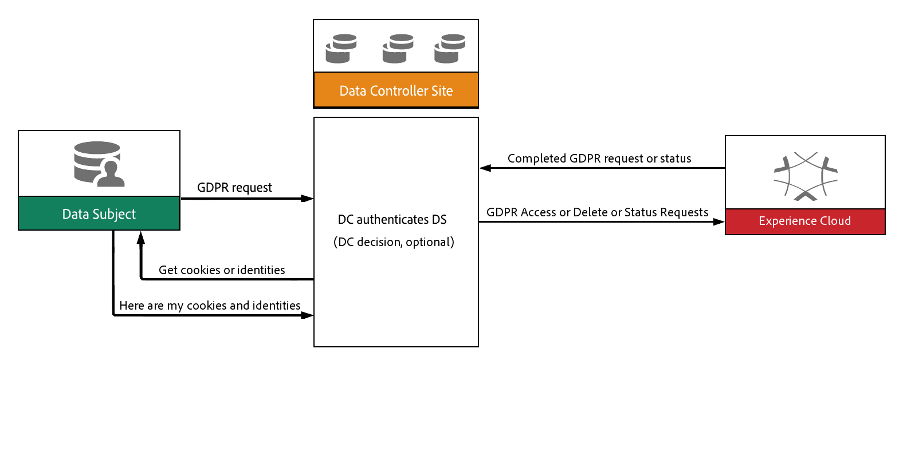

# Accessing and Deleting Personal Data by a Data Subject

## Introduction

The General Data Protection Regulation (GDPR) framework from Adobe provides a robust API that enables Adobe customers to manage (access and delete) their personal data used by the Adobe Experience Cloud (AEC). In addition to an API for accessing and deleting data, AEC includes internal facilities that govern all data flowing in and out of AEC, and facilities to store, and audit and log information.

Every Adobe solution does presently or will offer services that enable a [Data Subject](../gdpr-terminology.html#DataSubject) with access to all [personal data](../gdpr-terminology.html#PII) in human-readable form upon request. Each Adobe solution works with the Adobe GDPR API to maintain an audit trail of each request and associated compliance adherence.

## Onboarding Your API Client

Any AEC API, such as Adobe's GDPR API, that accesses a service or content on behalf of an end user, authenticates using the OAuth and JSON Web Token (JWT) standards.

An AEC API client integration must be registered through the [Adobe I/O Console](https://console.adobe.io/). The I/O Console is where you can generate an API Key, an important requirement to obtaining client credentials.

If your integration needs to access content or an API on behalf of an end user, that user must be authenticated as well. Your integration will need to pass an OAuth token granted by the Adobe [Identity Management System (IMS)](../gdpr-terminology.html#IMS).

For service-to-service integrations, you will also need a JSON Web Token (JWT) that encapsulates your client credentials and authenticates the identity of your integration. You exchange the JWT for the OAuth token that authorizes access. See [Adobe I/O Authentication Overview](http://www.adobe.io/apis/cloudplatform/console/authentication/gettingstarted.html) for detailed instructions.

For more information about onboarding your integration (API client), see [GDPR ID Onboarding](gdpr-id-onboarding.md).

## GDPR API

The Adobe GDPR API revolves around consuming and producing event messages, audit logging, and information gathering. The API interacts with IMS for service token retrieval, as well as managing message encryption and decryption.

All GDPR API requests are REST-based with JSON used as the payload for requests and responses.

## GDPR API Requests

The GDPR API provides a REST interface for `access`, `delete`, and `status` requests (see [API reference](https://www.adobe.io/apis/cloudplatform/dataservices/api-reference.html)).

Figure 1 is a high-level workflow diagram showing the sequence of events for an `access` request.


**Figure 1:** Sequence of events for an `access` request

As shown in Figure 1, a Data Subject issues a request to the Data Controller (the Adobe GDPR API). The Data Controller passes the request to the Experience Cloud and a response is returned through the chain of requestors.

### GDPR API Requests and Responses

Each GDPR API request must either specify a request type in its request payload and/or invoke a specific HTTP verb (GET, POST, etc.). [Appendix A](#appendix_a) illustrates the various Adobe GDPR API request types.

The resource path for all requests to the GDPR API is: `/data/privacy/gdpr`.

Listing 1 is an example of an Adobe, GDPR API `access` request URI.

```
/data/privacy/gdpr/
```

**Listing 1:** Adobe GDPR `access` request example

An `access` request to the GDPR API, as shown in Listing 1, will retrieve details of one or more IDs for an authenticated user or integration.

The JSON payload (*HTTP POST* data) for the request shown in Listing 1 will look similar to Listing 2.

```json
{
    "companyContexts": [
        {
            "namespace": "imsOrgID",
            "value": "123456789@AdobeOrg"
        },
        {
            "namespace": "AdCloud",
            "value": "AdvId:12345"
        },
        {
            "namespace": "Campaign",
            "value": "acme-stg-us1"
        }
    ],
    "users": [
        {
            "key": "David Smith",
            "action": ["access"],
            "userIDs": [
                {
                    "namespace": "email",
                    "value": "dsmith@acme.com",
                    "type": "standard"
                }
            ]
        }
    ]
}
```
**Listing 2:** Adobe GDPR API `access` request payload

In Listing 2, The `action` field is a collection of desired request types (`access` or `delete`), and may be different for each ID in the request. The `key` is an entity identifier that encapsulates associated IDs, which are represented by job IDs returned in the response data. Clients may have more than one ID.

Namespace qualifiers (types) help categorize the data values used to identify entities. The *namespace* key must exist for every individual data value submitted that relates to a given ID. The *type* value in the *namespace* block must contain one of the qualifiers shown in the *Namespace Qualifiers* table in [Appendix B](#appendix_b).

Responses from GDPR API requests are formatted as JSON payloads (objects) consisting of either success data or error data.

Listing 3 shows the JSON payload returned from a successful `access` request.

```json
{
    "jobId":"12345AD43E",
    "action":"delete",
    "product":"analytics",
    "status":"complete",
    "message":"access",
    "results": {
        "userContexts":[
            {
                "namespace":"email",
                "namespaceId":125,
                "type":"standard",
                "value":"dsmith@acme.com"
            }
        ],
        "receiptData": {
            ...
        }
    }
}
```
**Listing 3:** Payload for a *success* response from a GDPR API `access` request

Note the `jobId` value in the response shown in Listing 3. This value is used for subsequent API requests to retrieve the status of the `access` request represented by the `jobID` value.

Listing 4 shows the JSON response payload for an unsuccessful `access` request.

```json
{
    "jobId":"12345AD43E",
    "action":"access",
    "product":"analytics",
    "status":"error",
    "message":"...",
    "results": {
        "userContexts":[
            {
                "namespace":"email",
                "namespaceId":125,
                "type":"standard",
                "value":"dsmith@acme.com"
            }
        ],
        "receiptData": {
            ...
        }
    }
}
```
**Listing 4:** Payload for an *error* response returned for an unsuccessful GDPR `access` request

Once a job ID is obtained, it can be used to retrieve details about the job started from a previous `access` or `delete` request. A `status` request containing a `jobId` value is shown in Listing 5.

```
/data/privacy/gdpr/{jobId}
```
**Listing 5:** GDPR `status` request

Listing 5 illustrates how the GDPR `status` API request uses the same URI as an `access` or `delete` request with one exception - the ID of a specific job is appended to the URI. If the job ID is not specified, details about all jobs for the authenticated integration is returned.

Listing 6 shows a typical example of a response payload from a `status` request that specified a job ID.

```
{
    "jobs": [
        {
            "jobId": "ca9d14fc-1dbb-4206-84bb-5b62dfca31d5",
            "requestId": 43,
            "ticketNumber": "12345",
            "customer": {
                "user": {
                    "key": "David Smith",
                    "action": [
                        "delete"
                    ],
                    "userIDs": [
                        {
                            "namespace": "email",
                            "value": "dsmith@acme.com",
                            "type": "standard",
                        }
                    ]
                },
                "companyContexts": [
                    {
                        "namespace": "imsOrgID",
                        "value": "123456789@AdobeOrg"
                    }
                ]
            },
            "productResponses": [
                {
                    "product": "Analytics",
                    "retryCount": 0,
                    "productStatusResponse": {
                        "statusCode": 3,
                        "statusMessage": "submitted"
                    }
                },
                {
                    "product": "Audience Manager",
                    "retryCount": 0,
                    "productStatusResponse": {
                        "statusCode": 3,
                        "statusMessage": "submitted"
                    }
                },
                {
                    "product": "AdCloud",
                    "retryCount": 0,
                    "productStatusResponse": {
                        "statusCode": 3,
                        "statusMessage": "submitted"
                    }
                },
                {
                    "product": "Profile Service",
                    "retryCount": 0,
                    "productStatusResponse": {
                        "statusCode": 3,
                        "statusMessage": "submitted"
                    }
                },
                {
                    "product": "Experience Platform",
                    "retryCount": 0,
                    "productStatusResponse": {
                        "statusCode": 3,
                        "statusMessage": "submitted"
                    }
                },
                {
                    "product": "Experience Manager",
                    "retryCount": 0,
                    "productStatusResponse": {
                        "statusCode": 3,
                        "statusMessage": "submitted"
                    }
                },
                {
                    "product": "Social",
                    "retryCount": 0,
                    "productStatusResponse": {
                        "statusCode": 3,
                        "statusMessage": "submitted"
                    }
                },
                {
                    "product": "Campaign",
                    "retryCount": 0,
                    "productStatusResponse": {
                        "statusCode": 3,
                        "statusMessage": "submitted"
                    }
                },
                {
                    "product": "Mobile",
                    "retryCount": 0,
                    "productStatusResponse": {
                        "statusCode": 3,
                        "statusMessage": "submitted"
                    }
                },
                {
                    "product": "Device Graph",
                    "retryCount": 0,
                    "productStatusResponse": {
                        "statusCode": 3,
                        "statusMessage": "submitted"
                    }
                },
                {
                    "product": "Target",
                    "retryCount": 0,
                    "productStatusResponse": {
                        "statusCode": 3,
                        "statusMessage": "submitted"
                    }
                },
                {
                    "product": "CRS",
                    "retryCount": 0,
                    "productStatusResponse": {
                        "statusCode": 3,
                        "statusMessage": "submitted"
                    }
                }
            ],
            "lastUpdatedBy": "GDPRCentralService",
            "timeRequested": "03/12/2018 6:03 PM",
            "submittedBy": "023B0101A342C@AdobeID",
            "gdprStatusResponse": {
                "statusCode": 2,
                "statusMessage": "processing"
            }
        }
    ]
}
```

Listing 6: Response payload from a `status` request with a job ID

## Summary

The GDPR framework from Adobe provides a powerful API that enables Adobe customers to access and delete their personal data used by the Adobe Experience Cloud. In addition to an API, the internal facilities of the Adobe Experience Cloud govern incoming and outgoing personal data, store data, and audit and log information.

Every Adobe solution and API does presently or will offer a solution that provides access to all [personal data](../gdpr-terminology.html#PII) upon request.

<a name="appendix_a" id="appendix_a"></a>
## Appendix A

## Adobe GDPR API REST Request Types

| API Name | Method type | Path | Description | Input parameters | Response |
| -------- | ----------- | ---- | ----------- | ---------------- | -------- |
| Access/Delete | POST | /data/privacy/gdpr | Create one or many ACCESS/DELETE requests to retrieve or delete all data corresponding to the provided user id's | **Header:**<br/><br/>x-gw-ims-org-id: <org ID originating request><br/><br/>x-api-key: <application key for Adobe IO><br/>Authorization: Bearer <token><br/><br/>Content-Type: application/json<br/><br/>Body: See JSON body below | 202 Accepted<br/><br/>400 - Bad request - if the JSON body fails to process properly<br/><br/>500 - Server error - unforeseen service issues |
| Status | GET | /data/privacy/gdpr/{jobId} | Retrieve the status of a job | **Header:**<br/><br/>x-gw-ims-org-id: <org ID originating request><br/><br/>x-api-key: <application key for Adobe IO><br/>Authorization: Bearer <token><br/><br/>Content-Type: application/json<br/><br/>**Path parameters:**<br/><br/>jobId - returned from an Access/Delete request<br/><br/>**Query parameters:**<br/><br/>data (true/false - default false) includes all additional request and response data received to this point | 200 success - JSON body with data regarding the status of the job<br/><br/>404 Not Found<br/>406 Not acceptable - format not supported<br/><br/>500 - Server error - unforeseen service issues |
| Status (all) | GET | /data/privacy/gdpr/ | Retrieve all job statuses for the requesting user<br/><br/>Possibly return all resources in the case of an internal CSR request to help with others' requests | **Header:**<br/><br/>x-gw-ims-org-id: <org ID originating request><br/><br/>x-api-key: <application key for Adobe IO><br/><br/>Authorization: Bearer <token><br/><br/>Content-Type: application/json<br/><br/>**Query parameters (optional):**<br/><br/>data - (true/false - default false) includes all additional request and response data received to this point<br/><br/>start - day to begin job search<br/><br/>end - day to end job search<br/>page - page to return<br/><br/>limit - number of records per page<br/><br/>groupBy - (organization, jobId) | 200 success - JSON body with records from audit table<br/><br/>204 success - no records are found in the given context<br/><br/>406 Not acceptable - format not supported<br/><br/>500 - Server error - unforeseen service issues |

<a name="appendix_b" id="appendix_b"></a>
## Appendix B

### Namespace Qualifiers

| Qualifier | Definition |
| --------- | ---------- |
| standard | One of the standard namespaces defined globally, not tied to an individual organization data set (e.g. email, phone number, etc.). Namespace ID will be provided. |
| custom | A unique namespace created in the context of an organization, not shared across the Experience Cloud. The value represents the friendly name ("name" field) to be searched for. Namespace ID will be provided. |
| integrationCode | Integration code - similar to "custom", but specifically defined as the integration code of a datasource to be searched for. Namespace ID will be provided. |
| namespaceId | Indicates the value is the actual ID of the namespace that was created or mapped through the namespace service. |
| unregistered | A freeform string that is not defined in the namespace service and will be taken "as is". Any solution that handles these kinds of namespaces will check against them and handle if appropriate for the company context and data set. No namespace ID will be provided. |
| analytics | A custom namespace that is mapped internally in Analytics, not in the namespace service. This will be passed in directly as specified by the original request, without a namespace ID |
| dpsc | A custom field type for DPS mappings, which support a set of three standard namespaces. |
| target | A custom namespace that is understood internally by Target, not in the namespace service. This will be passed in directly as specified by the original request, without a namespace ID |
