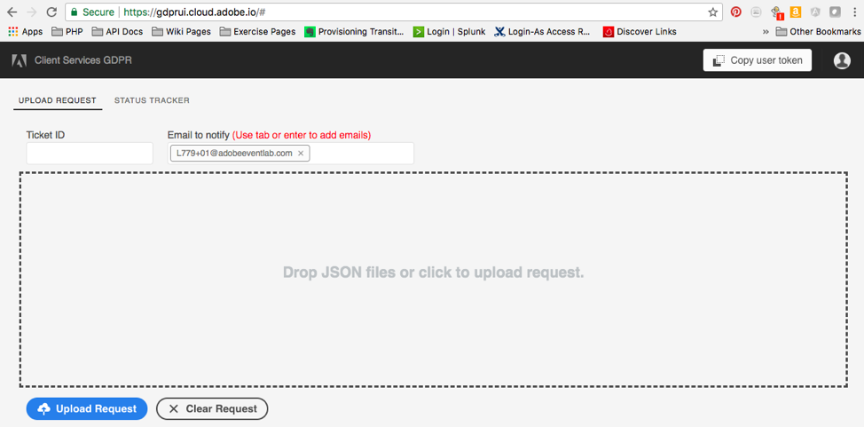
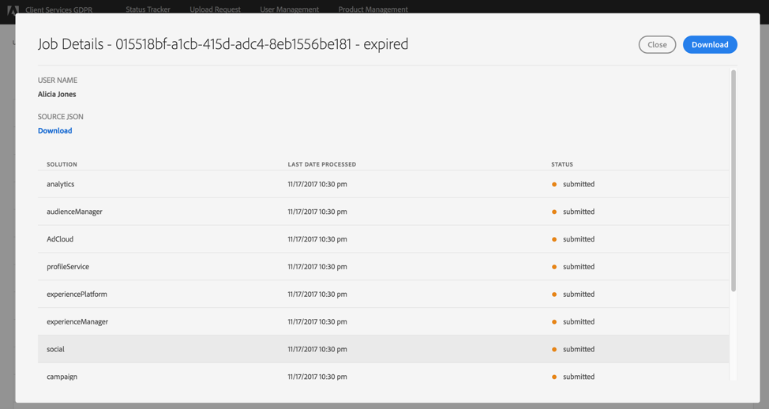

# Interacting with the GDPR API through the UI

## Objective

Become familiar with the GDPR UI and how it can help you track your GDPR jobs.

## GDPR API access

The GDPR API currently supports two types of interactions: 1) direct API, as we explored previously, and 2) a Web UI, which helps simplify the authentication and interaction.

This document explores the UI portion of the GDPR API service and helps you understand how to best leverage both of these options.

## Logging in

Authentication with an Adobe ID is required and the context of that user will determine the organization for which the GDPR requests are being made. The user must have administrative privileges within the organization.

As an exercise, please login at https://marketing.adobe.com with the following credentials:

- email: L779+[your workstation ID]@adobeeventlab.com
- password: Adobe2018!

## The User Interface

Currently, the user interface consists of three main screens: 1) the job submission screen, 2) the status tracker, and 3) the job details page. We will cover each in depth here.

### Job Submission Screen

This simple UI is for uploading JSON requests to the Adobe GDPR Central Service. You can either drag-and-drop a file or click on the "Upload Request" button to upload up a file.

As you can see, the UI prompts for a ticket ID. This ID is returned from a previously-created job. If you have an internal ticketing system or other tracking code, this field allows you to link the GDPR requests in the API to that specific identifier. Keep in mind that every user in a request will be tagged with this ticket ID.

1. You also have the ability to specify other email addresses for notification. By default, the person submitting the request is always included. However, you may change that as needed, and add multiple email addresses. To add/remove multiple email addresses, press &lt;TAB&gt; or &lt;ENTER&gt; after each entry to complete each email in the list. The addresses included in this list will receive a copy of any email notifications, which are sent when the job completes, finishes with errors, or times out.

2. Submit the request with valid JSON and allow the UI to navigate you to the next screen.

### Status Tracker

After submitting the request successfully, you will be taken to the Status Tracker screen, where you will be able to view all your submitted jobs. Here, you can see a default view of information related to jobs that have been submitted for your organization.

On the top-right of the screen, you can click the _Customize View_ drop-down to customize your view by selecting columns to show or hide. Feel free to experiment and see what other information you can display in this table.

The UI provides the ability to filter on any of the fields by simply typing in the search field. The search is executed against all visible columns. Experiment with showing and hiding fields and combine it with searching.

You can easily switch back to the previous screen to submit new requests by clicking on the _Submit New Request_ button to the right, or by selecting the tab _Upload Request_ in the top left.

Each unique job ID is a link to a more detailed description of the job itself, containing updated status values and responses from each Experience Cloud product orchestrated by the GDPR API.

### Job Details Page

As mentioned above, navigating from the Status Tracker by clicking on a job ID generates a popup dialog with details about an individual job.

The job details dialog contains status information about each Experience Cloud solution and its current state in relation to the overall job. As every GDPR job is asynchronous, you can see the latest communication date and time from each solution as well, as some will require more time than others to process a request.

If a solution has provided any additional data, it will be viewable in this dialog. You can expand the view by clicking on individual product rows and seeing what has been received.

You also have the ability to download the complete job data as viewed in this dialog as a .CSV file by clicking the _Download_ button.
