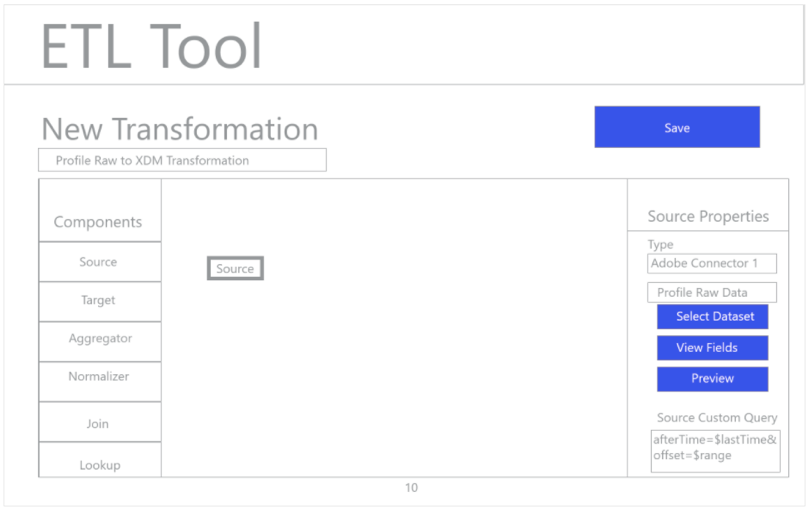
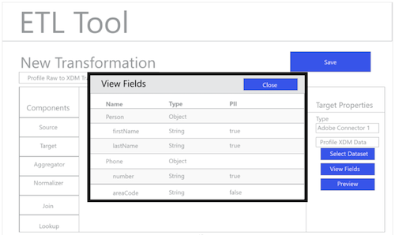
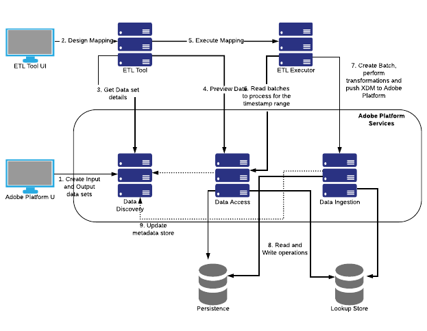

**Preview Release**

**Adobe Cloud Platform**

Updated on April 25<sup>rd</sup> 2018

Data integration patterns for ETL tools (ISVs)
=============================

Partners are key to the success of the Adobe Cloud Platform (ACP), and the
[Adobe Exchange
program](https://partners.adobe.com/exchangeprogram/experiencecloud.html)
assists with varying levels of partner integration through multiple
benefit packages, including ACP with the ETL Ecosystem. To support Adobe
Exchange partners participating in the ETL Ecosystem program, Adobe and
their partners can create premium ETL connectors to integrate with the Adobe
Cloud Platform.

In this guide, experts will direct you in creating high-performance, secure connectors for
Adobe/Partner integration, including implementation of the ACP functions. Building secure connectors allows Adobe and partners to effectively implement both the Adobe Cloud Platform and Partner ETL capabilities.

Developing ETL integrations for Adobe Cloud Platform
=============================

This guide shows the general steps to ingest data into Adobe Cloud Platform.

The ETL Connector for Adobe Cloud Platform is located, installed, and operated entirely
within the ETL Ecosystem. The ACP provides data storage, administration,
access, usage controls, and other domain-specific data services. The ACP
also exposes common REST-based APIs including:

-   Data Catalog API

-   Data Access API

-   Data Ingest API

-   Authentication and Authorization APIs.

**For ETL partners**. This guide includes sample ACP API calls for the
ETL partner when designing a connector.
A sample reference integration is available as Apache 2.0 license on [Github](https://github.com/adobe/acp-data-services-etl-reference)

<span id="_Toc497952512" class="anchor"><span id="Adobe-ETL.svg"
class="anchor"><span id="_ETL_Workflow_Examples"
class="anchor"></span></span></span>

ETL Workflow
============

ETL products differ in exposing similar functionality to combine data
sources, . The following example walks you through a general ETL user
experience.

**Note**: The following mock diagrams are based on common UI interaction
patterns, but can be adapted for a specific ETL user experience.


Figure 1 - Generic ETL Connection Management UI


Figure 2 - New Connector UI, Configuring the Adobe Cloud Platform
Connector


Figure 3 - Adobe Cloud Platform Connector activated


Figure 4 - ETL Transformation Management UI


Figure 5 - New Transformation UI, selecting Adobe Cloud Platform
Connection


Figure 6 - Browsing for source Adobe Cloud Platform Datasets


Figure 7 – Metadata and sample data from the Dataset in the ETL UI


Figure 8 - Viewing field schema information from Datasets



Figure 9 - Previewing data from Datasets


Figure 10 – Defining data sync parameters for the operation of the
transformation



Figure 11 - Defining the XDM target Dataset


Figure 12 - Viewing the XDM hierarchical schemas and metadata to support
mapping/transformations


Figure 13 - Save and run/scheduling the Transforms

Steps in the subsequent technical sections will have “Figure” numbers
annotated to refer to the flow showcased above the wireframes.

<span id="_Toc497952513" class="anchor"><span id="Adobe-ETL.svg" class="anchor"></span></span>Adobe Platform Components
====================================================================================================================================

#Adobe Cloud Platform Components#
This section identifies components and their relevance as required for
ETL partner integration.

-   **Data Discovery** - Records the metadata of ingested and
    transformed data in the platform.

-   **Data Access **- Provides users the interface to access their data
    on the platform.

-   **Data Ingestion **– Pushes data to the ACP with Data
    Ingestion APIs.

-   **Adobe Identity Management System (IMS) **- Provides framework for
    authentication for Adobe wide services

    -   **IMS Organization** - Any corporate entity that can own or
        license products and services and allow access to its members.

    -   **IMS User** - Members of IMS Organization. Organization to User
        relationship is many to many.

Each of Platform services need an IMS organization to be passed with the
request. The authentication token should have access to passed IMS
organization. More details in Authenticating to Adobe Platform section.

Authenticating to Adobe Platform
================================

Adobe is committed to privacy and security. Nearly all Adobe services
require your application to authenticate through the Adobe Identity
Management System (IMS) to receive client credentials. The client
credentials determine the access and permissions granted to your
application.

Any API that accesses a service or content on behalf of an end-user
authenticates using the OAuth and JSON Web Token standards.

-   Your application must be registered through the Adobe I/O Console.
    The I/O Console is where you can generate an API Key, an important
    requirement to obtain client credentials.

-   If your integration needs to access content or a service for an end
    user, that user must be authenticated as well. Your integration will
    need to pass the OAuth token granted by the Adobe IMS.

-   For service-to-service integrations, you will also need a JSON Web
    Token (JWT) that encapsulates your client credentials and
    authenticates the identity of your integration. You can exchange the
    JWT for the OAuth token that authorizes access. More documentation
    related to this can be found at:
    <https://www.adobe.io/apis/cloudplatform/console/authentication/gettingstarted.html>.

 Detailed information on the usage of the Adobe API Gateway (adobe.io)
can be found at:
<https://www.adobe.io/apis/cloudplatform/console/authentication/gettingstarted.html>.

Workflow diagram
================

The workflow diagram below provides the high-level overview of
integration of Adobe Cloud Platform components and the ETL application
and connector:




Design Phase
------------

1.  Partner logs in to Adobe Platform UI and creates datasets for
    ingestion using a standard connector or push-service connector.

2.  In the ACP user interface, the partner creates the output dataset by
    either selecting the Profile, Event or other custom Experience Data
    Models (XDMs).

3.  In the ETL tool, the partner will start designing their mapping
    transforms after configuring the appropriate connection (using
    their credentials). The ETL tool is assumed to already have the ACP
    connector installed via a process (and not defined in this
    Integration Guide).

4.  Using the source of data for mapping, a list of all available
    datasets can be fetched using **Data Discovery APIs**.

    > **Note**: Partners will also have to specify a time stamp filter
    > marking the date to ingest data and offset - what should be the window
    > for which data is to be read. ETL tool should support taking these two
    > parameters in this or another relevant UX. On the Adobe Cloud Platform
    > side these parameters will be mapped to either available dates (if
    > present) or captured date present in batch object of dataset.

    #### curl to fetch datasets
    ```
    $ curl -X GET
    "https://platform.adobe.io/data/foundation/catalog/dataSets" \
    -H "accept:application/json" \
    -H "x-gw-ims-org-id: AdobeIMSOrganization@AdobeOrg" \
    -H "Authorization: Bearer ACCESS_TOKEN" \
    -H "x-api-key: API_KEY"
    
    ```
    >  

    ##### Sample response
    ```
    {
        "598d6e81b2745f000015edcb": {
            "version": "1.0.0",
            "imsOrg": "AdobeIMSOrganization@AdobeOrg",
            "connectorId": "azure-blob",
            "name": "CredentialsTest",
            "created": 1502441089391,
            "updated": 1502441089669,
            "dule": {},
            "aspect": "production",
            "status": "enabled",
            "fields": [
                {
                    "name": "name",
                    "type": "string"
                },
                {
                    "name": "age",
                    "type": "string"
                }
            ],
            "fileDescription": {
                "persisted": false
            },
            "transforms":"@/dataSets/598d6e81b2745f000015edcb/views/598d6e81b2745f000015edcc/transforms",
            "files": "@/dataSets/598d6e81b2745f000015edcb/views/598d6e81b2745f000015edcc/files",
            "children": "@/dataSetViews/598d6e81b2745f000015edcc/children",
            "schema": {},
            "viewId": "598d6e81b2745f000015edcc"
        },
        :
        :
    }
    ```

5.  The *Schema of a dataset* can be retrieved with the following API
    call from **Data Discovery API **(Figure 8).

    #### curl to fetch dataset details for datasetId
    ```
    $ curl -X GET "https://platform.adobe.io/data/foundation/catalog/dataSets/DATASET_ID" \
    -H "accept: application/json" \
    -H "x-gw-ims-org-id: AdobeIMSOrganization@AdobeOrg" \
    -H "Authorization: Bearer ACCESS_TOKEN" \
    -H "x-api-key: API_KEY"
    
    ```
    >  
    ##### Sample response
    ```
    {
    "59c93f3da7d0c00000798f68": {
        "version": "1.0.4",
        "imsOrg": "AdobeIMSOrganization@AdobeOrg",
        "name": "ProfileOutput01",
        "created": 1506361139256,
        "updated": 1508475975514,
        "createdClient": "CLIENT_ID",
        "createdUser": "CLIENT_USER_ID@AdobeID",
        "updatedUser": "CLIENT_USER_ID@AdobeID",
        "dule": {},
        "aspect": "production",
        "status": "enabled",
        "fields": [
            {
                "name": "endUserIds",
                "title": "End User IDs",
                "description": "Condensed, normalized encapsulation of all end user identifiers. NOTE: At least one of the fields is required.\n",
                "created": 1516629739180,
                "updated": 1516629739180,
                "type": "object",
                "subFields": [
                    {
                        "name": "mcId",
                        "title": "Identity",
                        "description": "Identity from identity services which is the fact of being who or what a person or thing is.\n",
                        "created": 1516629739181,
                        "updated": 1516629739181,
                        "type": "object",
                        "subFields": [
                            {
                                "name": "id",
                                "title": "Identifier",
                                "type": "string",
                                "description": "Identity of the consumer in the related namespace."
                            },
                            {
                                "name": "namespace",
                                "title": "Data source",
                                "description": "Globally unique identification of a data source.\n",
                                "created": 1516629739176,
                                "updated": 1516629739176,
                                "type": "object",
                                "subFields": [
                                    {
                                        "name": "id",
                                        "title": "Identifier",
                                        "type": "integer",
                                        "description": "Globally unique identifier of the data source.\n"
                                    },
                                    {
                                        "name": "code",
                                        "title": "Code",
                                        "type": "string",
                                        "description": "The namespace code associated with the id attribute and matched up with the AAM data source integration code."
                                    },
                                    {
                                        "name": "tags",
                                        "title": "Tags",
                                        "type": "string",
                                        "description": "Tags are used to indicate how the aliases represented by a given data\nsource should be interpreted by applications using those aliases.\n\nExamples:\n\n* `isAVID`: data sources representing Analytics visitor IDs.\n* `isCRSKey`: data sources representing aliases that should be used as keys in CRS.\n\nTags are set when the data source is created but they are also included in\npipeline messages when referencing a given data source.\n",
                                        "uniqueItems": true
                                    }
                                ],
                                "xdmVersion": "0.9.2",
                                "xdmType": "entity",
                                "_refId": "../core/DataSource"
                            }
                        ],
                        "xdmVersion": "0.9.2",
                        "xdmType": "entity",
                        "_refId": "../core/Identity"
                    },
                    {
                        "name": "analytics",
                        "title": "Identity",
                        "description": "Identity from identity services which is the fact of being who or what a person or thing is.\n",
                        "created": 1516629739181,
                        "updated": 1516629739181,
                        "type": "object",
                        "subFields": [
                            {
                                "name": "id",
                                "title": "Identifier",
                                "type": "string",
                                "description": "Identity of the consumer in the related namespace."
                            },
                            {
                                "name": "namespace",
                                "title": "Data source",
                                "description": "Globally unique identification of a data source.\n",
                                "created": 1516629739176,
                                "updated": 1516629739176,
                                "type": "object",
                                "subFields": [
                                    {
                                        "name": "id",
                                        "title": "Identifier",
                                        "type": "integer",
                                        "description": "Globally unique identifier of the data source.\n"
                                    },
                                    {
                                        "name": "code",
                                        "title": "Code",
                                        "type": "string",
                                        "description": "The namespace code associated with the id attribute and matched up with the AAM data source integration code."
                                    },
                                    {
                                        "name": "tags",
                                        "title": "Tags",
                                        "type": "string",
                                        "description": "Tags are used to indicate how the aliases represented by a given data\nsource should be interpreted by applications using those aliases.\n\nExamples:\n\n* `isAVID`: data sources representing Analytics visitor IDs.\n* `isCRSKey`: data sources representing aliases that should be used as keys in CRS.\n\nTags are set when the data source is created but they are also included in\npipeline messages when referencing a given data source.\n",
                                        "uniqueItems": true
                                    }
                                ],
                                "xdmVersion": "0.9.2",
                                "xdmType": "entity",
                                "_refId": "../core/DataSource"
                            }
                        ],
                        "xdmVersion": "0.9.2",
                        "xdmType": "entity",
                        "_refId": "../core/Identity"
                    },
                    {
                        "name": "campaign",
                        "title": "Identity",
                        "description": "Identity from identity services which is the fact of being who or what a person or thing is.\n",
                        "created": 1516629739181,
                        "updated": 1516629739181,
                        "type": "object",
                        "subFields": [
                            {
                                "name": "id",
                                "title": "Identifier",
                                "type": "string",
                                "description": "Identity of the consumer in the related namespace."
                            },
                            {
                                "name": "namespace",
                                "title": "Data source",
                                "description": "Globally unique identification of a data source.\n",
                                "created": 1516629739176,
                                "updated": 1516629739176,
                                "type": "object",
                                "subFields": [
                                    {
                                        "name": "id",
                                        "title": "Identifier",
                                        "type": "integer",
                                        "description": "Globally unique identifier of the data source.\n"
                                    },
                                    {
                                        "name": "code",
                                        "title": "Code",
                                        "type": "string",
                                        "description": "The namespace code associated with the id attribute and matched up with the AAM data source integration code."
                                    },
                                    {
                                        "name": "tags",
                                        "title": "Tags",
                                        "type": "string",
                                        "description": "Tags are used to indicate how the aliases represented by a given data\nsource should be interpreted by applications using those aliases.\n\nExamples:\n\n* `isAVID`: data sources representing Analytics visitor IDs.\n* `isCRSKey`: data sources representing aliases that should be used as keys in CRS.\n\nTags are set when the data source is created but they are also included in\npipeline messages when referencing a given data source.\n",
                                        "uniqueItems": true
                                    }
                                ],
                                "xdmVersion": "0.9.2",
                                "xdmType": "entity",
                                "_refId": "../core/DataSource"
                            }
                        ],
                        "xdmVersion": "0.9.2",
                        "xdmType": "entity",
                        "_refId": "../core/Identity"
                    },
                    {
                        "name": "target",
                        "title": "Identity",
                        "description": "Identity from identity services which is the fact of being who or what a person or thing is.\n",
                        "created": 1516629739181,
                        "updated": 1516629739181,
                        "type": "object",
                        "subFields": [
                            {
                                "name": "id",
                                "title": "Identifier",
                                "type": "string",
                                "description": "Identity of the consumer in the related namespace."
                            },
                            {
                                "name": "namespace",
                                "title": "Data source",
                                "description": "Globally unique identification of a data source.\n",
                                "created": 1516629739176,
                                "updated": 1516629739176,
                                "type": "object",
                                "subFields": [
                                    {
                                        "name": "id",
                                        "title": "Identifier",
                                        "type": "integer",
                                        "description": "Globally unique identifier of the data source.\n"
                                    },
                                    {
                                        "name": "code",
                                        "title": "Code",
                                        "type": "string",
                                        "description": "The namespace code associated with the id attribute and matched up with the AAM data source integration code."
                                    },
                                    {
                                        "name": "tags",
                                        "title": "Tags",
                                        "type": "string",
                                        "description": "Tags are used to indicate how the aliases represented by a given data\nsource should be interpreted by applications using those aliases.\n\nExamples:\n\n* `isAVID`: data sources representing Analytics visitor IDs.\n* `isCRSKey`: data sources representing aliases that should be used as keys in CRS.\n\nTags are set when the data source is created but they are also included in\npipeline messages when referencing a given data source.\n",
                                        "uniqueItems": true                                    }
                                ],
                                "xdmVersion": "0.9.2",
                                "xdmType": "entity",
                                "_refId": "../core/DataSource"
                            }
                        ],
                        "xdmVersion": "0.9.2",
                        "xdmType": "entity",
                        "_refId": "../core/Identity"
                    }
                ],
                "xdmVersion": "0.9.2",
                "xdmType": "entity",
                "_refId": "../core/EndUserIds"
            },
            {
                "name": "person",
                "title": "Person",
                "description": "An individual actor, contact, or owner.",
                "created": 1516629739184,
                "updated": 1516629739184,
                "type": "object",
                "subFields": [
                    {
                        "name": "firstName",
                        "title": "First name",
                        "type": "string",
                        "description": "The personal, or given name."
                    },
                    {
                        "name": "lastName",
                        "title": "Last name",
                        "type": "string",
                        "description": "The inherited family name, surname, patronymic, or matronymic name."
                    },
                    {
                        "name": "middleName",
                        "title": "Middle name",
                        "type": "string",
                        "description": "Middle, alternative, or additional names supplied between the first and last names."
                    },
                    {
                        "name": "courtesyTitle",
                        "title": "Courtesy title",
                        "type": "string",
                        "description": "Normally an abbreviation of a persons *title*, *honorific*, or *salutation*.\nThe `courtesyTitle` is used in front of full or last name in opening texts.\ne.g Mr. Miss. or Dr J. Smith.\n"
                    },
                    {
                        "name": "birthDay",
                        "title": "Birth day",
                        "type": "integer",
                        "description": "The day of the month a person was born (1-31).\nDefault 0 means absence.\n",
                        "default": 0,
                        "minimum": 0,
                        "maximum": 31,
                        "format": "int8"
                    },
                    {
                        "name": "birthMonth",
                        "title": "Birth month",
                        "type": "integer",
                        "description": "The month of the year a person was born (1-12).\nDefault 0 means absence.\n",
                        "default": 0,
                        "minimum": 0,
                        "maximum": 12,
                        "format": "int8"
                    },
                    {
                        "name": "birthYear",
                        "title": "Birth year",
                        "type": "integer",
                        "description": "The year a person was born including the century (yyyy, e.g 1983).\nDefault 0 means absence.\n",
                        "default": 0,
                        "minimum": 0,
                        "format": "int16"
                    },
                    {
                        "name": "gender",
                        "title": "Gender",
                        "type": "string",
                        "enumValues": [
                            {
                                "unknown": {
                                    "title": "Unknown"
                                }
                            },
                            {
                                "male": {
                                    "title": "Male"
                                }
                            },
                            {
                                "female": {
                                    "title": "Female"
                                }
                            },
                            {
                                "withheld": {
                                    "title": "Withheld"
                                }
                            },
                            {
                                "other": {
                                    "title": "Other"
                                }
                            }
                        ],
                        "description": "Gender identity of the person.\n",
                        "default": "unknown"
                    }
                ],
                "xdmVersion": "0.9.2",
                "xdmType": "entity",
                "_refId": "../core/Person"
            },
            {
                "name": "addresses",
                "title": "Addresses",
				"type": "object",
				"subFields": [
					{
						"name": "primary",
						"title": "Primary",
						"type": "boolean",
						"description": "Primary address indicator.\n\nA Profile can have only one `primary` address at a given point of time.\n"
					},
					{
						"name": "type",
						"title": "Type",
						"type": "string",
						"enumValues": [
							{
								"home": {
									"title": "Home"
								}
							},
							{
								"work": {
									"title": "Work"
								}
							},
							{
								"unknown": {
									"title": "unknown"
								}
							}
						],
						"description": "The way the address relates to the person. e.g 'work' or 'home'. Note this is person neutral, all persons will have a common address.type, if it is person specific the relationship attribute should be used e.g address.relationship='residence'"
					},
					{
						"name": "label",
						"title": "Label",
						"type": "string",
						"description": "Free form name of the address."
					},
					{
						"name": "street1",
						"title": "Street 1",
						"type": "string",
						"description": "Primary Street level information, apartment number, street number and street name."
					},
					{
						"name": "street2",
						"title": "Street 2",
						"type": "string",
						"description": "Optional street information second line."
					},
					{
						"name": "street3",
						"title": "Street 3",
						"type": "string",
						"description": "Optional street information third line."
					},
					{
						"name": "street4",
						"title": "Street 4",
						"type": "string",
						"description": "Optional street information fourth line."
					},
					{
						"name": "city",
						"title": "City",
						"type": "string",
						"description": "The town, city, village or other metropolitan identity of the address."
					},
					{
						"name": "region",
						"title": "Region",
						"type": "string",
						"description": "The region, county, or district portion of the address."
					},
					{
						"name": "stateProvince",
						"title": "State or province",
						"type": "string",
						"description": "The state, province, region, territory portion of the address."
					},
					{
						"name": "stateProvinceISO",
						"title": "State or province ISO code.",
						"type": "string",
						"description": "The country subdivision as defined by the second part of [ISO 3166-2](https://www.iso.org/iso-3166-country-codes.html#2012_iso3166-2)\n(without the first part and the hyphen ISO 3166-1 alpha-2).\n\nExample:\n\n* CA: from ISO 3166-2 `US-CA` value designating the state of California in the United States of America.\n* 75: from ISO 3166-2 `FR-75` value designating the metropolitan department of Paris in France.\n\n> NOTE: This value must be combined with countryCodeISO to compose a valid ISO 3166-2 code.\n"
					},
					{
						"name": "postalCode",
						"title": "Postal code",
						"type": "string",
						"description": "The postal code, zip code of other postal ordering for the address. Note, if zip codes are used either the base zip or zip+4 format can be used."
					},
					{
						"name": "country",
						"title": "Country",
						"type": "string",
						"description": "The name of the government-administered territory."
					},
					{
						"name": "countryISO",
						"title": "Country ISO",
						"type": "string",
						"description": "The alpha-2 code of the country as defined by [ISO 3166-1](https://www.iso.org/iso-3166-country-codes.html).",
						"minLength": 2,
						"maxLength": 2
					},
					{
						"name": "latitude",
						"title": "Latitude",
						"type": "float",
						"description": "Defines the latitude of the delivery address.",
						"format": "float"
					},
					{
						"name": "longitude",
						"title": "Longitude",
						"type": "float",
						"description": "Defines the longitude of the delivery address.",
						"format": "float"
					},
					{
						"name": "status",
						"title": "Status",
						"type": "string",
						"enumValues": [
							{
								"active": {
									"title": "Active"
								}
							},
							{
								"incomplete": {
									"title": "Incomplete"
								}
							},
							{
								"pendingVerification": {
									"title": "Pending verification"
								}
							},
							{
								"blacklisted": {
									"title": "Blacklisted"
								}
							},
							{
								"blocked": {
									"title": "Blocked"
								}
							}
						],
						"description": "An indication as to the ability to use the address.",
						"default": "active"
					},
					{
						"name": "statusReason",
						"title": "Status reason",
						"type": "string",
						"description": "A description of the current status."
					},
					{
						"name": "lastVerifiedDate",
						"title": "Last verified date",
						"type": "string",
						"format": "date-only",
						"description": "The date that the address was last verified as still belonging to the person."
					}
				]
            },
            {
                "name": "emails",
                "title": "Emails",
				"type": "object",
				"subFields": [
					{
						"name": "primary",
						"title": "Primary",
						"type": "boolean",
						"description": "Primary email indicator.\n\nA Profile can have only one `primary` email address at a given point of time.\n"
					},
					{
						"name": "address",
						"title": "Address",
						"type": "string",
						"description": "The technical address, e.g 'name@domain.com' as commonly defined in RFC2822 and subsequent standards."
					},
					{
						"name": "label",
						"title": "Label",
						"type": "string",
						"description": "Additional display information that maybe available, e.g MS Outlook rich address controls display 'John Smith smithjr@company.uk', the 'John Smith' part is data that would be placed in the label."
					},
					{
						"name": "type",
						"title": "Type",
						"type": "string",
						"enumValues": [
							{
								"unknown": {
									"title": "Unknown"
								}
							},
							{
								"personal": {
									"title": "Personal"
								}
							},
							{
								"work": {
									"title": "Work"
								}
							},
							{
								"education": {
									"title": "Education"
								}
							}
						],
						"description": "The way the account relates to the person. e.g 'work' or 'personal'"
					},
					{
						"name": "status",
						"title": "Status",
						"type": "string",
						"enumValues": [
							{
								"active": {
									"title": "Active"
								}
							},
							{
								"incomplete": {
									"title": "Incomplete"
								}
							},
							{
								"pendingVerification": {
									"title": "Pending verification"
								}
							},
							{
								"blacklisted": {
									"title": "Blacklisted"
								}
							},
							{
								"blocked": {
									"title": "Blocked"
								}
							}
						],
						"description": "An indication as to the ability to use the email address.",
						"default": "active"
					},
					{
						"name": "statusReason",
						"title": "Status reason",
						"type": "string",
						"description": "A description of the current status."
					}
				]
            },
            {
                "name": "phoneNumbers",
                "title": "Phone numbers",
				"type": "object",
				"subFields": [
					{
						"name": "primary",
						"title": "Primary",
						"type": "boolean",
						"description": "Primary phone number indicator.\n\nUnlike for Address or EmailAddress, there can be multiple primary phone numbers; one per communication channel.\nThe communication channel is defined by the type:\n\n* `textMessaging`: type = `mobile`\n* `phone`: type = `home` | `work` | `unknown`\n* `fax`: type = `fax`\n"
					},
					{
						"name": "type",
						"title": "Type",
						"type": "string",
						"enumValues": [
							{
								"unknown": {
									"title": "Unknown"
								}
							},
							{
								"mobile": {
									"title": "Mobile"
								}
							},
							{
								"home": {
									"title": "Home"
								}
							},
							{
								"work": {
									"title": "Work"
								}
							},
							{
								"fax": {
									"title": "Fax"
								}
							}
						],
						"description": "The way the phone number relates to the person. e.g 'work' or 'personal'",
						"default": "unknown"
					},
					{
						"name": "number",
						"title": "Number",
						"type": "string",
						"description": "The phone number. Note the phone number is a string and may include meaningful characters such as brackets (), hyphens - or characters to indicate sub dialing identifiers like extensions x. E.g 1-353(0)18391111 or +613 9403600x1234."
					},
					{
						"name": "extension",
						"title": "Extension",
						"type": "string",
						"description": "The internal dialing number used to call from a private exchange, operator or switchboard."
					},
					{
						"name": "status",
						"title": "Status",
						"type": "string",
						"enumValues": [
							{
								"active": {
									"title": "Active"
								}
							},
							{
								"incomplete": {
									"title": "Incomplete"
								}
							},
							{
								"blacklisted": {
									"title": "Blacklisted"
								}
							},
							{
								"blocked": {
									"title": "Blocked"
								}
							}
						],
						"description": "An indication as to the ability to use the phone number.",
						"default": "active"
					},
					{
						"name": "statusReason",
						"title": "Status reason",
						"type": "string",
						"description": "A description of the current status."
					},
					{
						"name": "validity",
						"title": "Validity",
						"type": "string",
						"enumValues": [
							{
								"consistent": {
									"title": "Consistent"
								}
							},
							{
								"inconsistent": {
									"title": "Inconsistent"
								}
							},
							{
								"incomplete": {
									"title": "Incomplete"
								}
							},
							{
								"successfullyUsed": {
									"title": "Successfully used"
								}
							}
						],
						"description": "A level of technical correctness of the phone number."
					}
				]
            },
            {
                "name": "optInOut",
                "title": "OptInOut",
                "description": "Describes a users opting in and out preferences for communication by medium and communication type.",
                "created": 1516629739183,
                "updated": 1516629739183,
                "type": "object",
                "subFields": [
                    {
                        "name": "optingEmail",
                        "title": "Opting email",
                        "type": "string",
                        "enumValues": [
                            {
                                "notProvided": {
                                    "title": "Not provided"
                                }
                            },
                            {
                                "pendingConfirmation": {
                                    "title": "Pending verification"
                                }
                            },
                            {
                                "in": {
                                    "title": "In"
                                }
                            },
                            {
                                "out": {
                                    "title": "Out"
                                }
                            }
                        ],
                        "description": "Preference for Email communication.",
                        "default": "notProvided"
                    },
                    {
                        "name": "optingPhone",
                        "title": "Opting phone",
                        "type": "string",
                        "enumValues": [
                            {
                                "notProvided": {
                                    "title": "Not provided"
                                }
                            },
                            {
                                "pendingConfirmation": {
                                    "title": "Pending verification"
                                }
                            },
                            {
                                "in": {
                                    "title": "In"
                                }
                            },
                            {
                                "out": {
                                    "title": "Out"
                                }
                            }
                        ],
                        "description": "Preference for Phone voice communication.",
                        "default": "notProvided"
                    },
                    {
                        "name": "optingTextMessaging",
                        "title": "Opting text messaging",
                        "type": "string",
                        "enumValues": [
                            {
                                "notProvided": {
                                    "title": "Not provided"
                                }
                            },
                            {
                                "pendingConfirmation": {
                                    "title": "Pending verification"
                                }
                            },
                            {
                                "in": {
                                    "title": "In"
                                }
                            },
                            {
                                "out": {
                                    "title": "Out"
                                }
                            }
                        ],
                        "description": "Preference for instant Text communication.",
                        "default": "notProvided"
                    },
                    {
                        "name": "optingFax",
                        "title": "Opting fax",
                        "type": "string",
                        "enumValues": [
                            {
                                "notProvided": {
                                    "title": "Not provided"
                                }
                            },
                            {
                                "pendingConfirmation": {
                                    "title": "Pending verification"
                                }
                            },
                            {
                                "in": {
                                    "title": "In"
                                }
                            },
                            {
                                "out": {
                                    "title": "Out"
                                }
                            }
                        ],
                        "description": "Preference for Fax communication.",
                        "default": "notProvided"
                    },
                    {
                        "name": "optingAddress",
                        "title": "Opting address",
                        "type": "string",
                        "enumValues": [
                            {
                                "notProvided": {
                                    "title": "Not provided"
                                }
                            },
                            {
                                "pendingConfirmation": {
                                    "title": "Pending verification"
                                }
                            },
                            {
                                "in": {
                                    "title": "In"
                                }
                            },
                            {
                                "out": {
                                    "title": "Out"
                                }
                            }
                        ],
                        "description": "Preference for mail address communication.",
                        "default": "notProvided"
                    },
                    {
                        "name": "optingPushNotification",
                        "title": "Opting push notification",
                        "type": "string",
                        "enumValues": [
                            {
                                "notProvided": {
                                    "title": "Not provided"
                                }
                            },
                            {
                                "pendingConfirmation": {
                                    "title": "Pending verification"
                                }
                            },
                            {
                                "in": {
                                    "title": "In"
                                }
                            },
                            {
                                "out": {
                                    "title": "Out"
                                }
                            }
                        ],
                        "description": "Preference for push notification.",
                        "default": "notProvided"
                    },
                    {
                        "name": "globalOptout",
                        "title": "Global opt-out",
                        "type": "boolean",
                        "description": "Do not contact this profile on any communication channel.",
                        "default": false
                    }
                ],
                "xdmVersion": "0.9.2",
                "xdmType": "entity",
                "_refId": "../core/OptInOut"
            }
        ],
            "fileDescription": {
            "persisted": false,
            "format": "parquet"
        },
        "transforms": "@/dataSets/59c93f3da7d0c00000798f68/views/59c93f3da7d0c00000798f69/transforms",
        "files": "@/dataSets/59c93f3da7d0c00000798f68/views/59c93f3da7d0c00000798f69/files",
        "children": "@/dataSetViews/59c93f3da7d0c00000798f69/children",
        "schema": "@/xdms/model/Profile",
        "viewId": "59c93f3da7d0c00000798f69"
        }
    }
    ```
6.  The ETL application may provide a capability to *preview data* to
    the ETL Data Engineer. The **Data Access APIs** will be used to with
    the specified "limit" on the data (Figure 9). There are various API
    options to preview data:

    -   Get dataset details as done in step 5 above. Refer to the
        "files" attribute, it will appear as follows :

    #### Preview data  
    ```
     "files":
    "@/dataSets/59c93f3da7d0c00000798f68/views/59c93f3da7d0c00000798f69/files",
    ```
    -   **Data Discovery API** call to fetch the files details with the help
        of "files" attribute from the previous step.

    #### Curl command to list Dataset files
    ```
    $ curl -X GET \
    "https://platform.adobe.io/data/foundation/catalog/dataSets/59c93f3da7d0c00000798f68/views/59c93f3da7d0c00000798f69/files" \
    -H "accept: application/json" \
    -H "x-gw-ims-org-id: AdobeIMSOrganization@AdobeOrg" \
    -H "Authorization: Bearer ACCESS_TOKEN \
    -H "x-api-key : API_KEY"
    
    ```
    ##### Sample response
    ```
    {

        "74627653-6b6f-40a8-ad57-6bd1badfb9c6": {
            "version": "1.0.0",
            "batchId": "b026a233c9ad4ccd88f661efa63d4955",
            "created": 1509962578830,
            "updated": 1509962578830,
            "imsOrg": "AdobeIMSOrganization@AdobeOrg",
            "dataSetViewId": "5a0024512db5b501c6c3cd95",
            "createdClient": "CLIENT_ID",
            "createdUser": "CLIENT_USER_ID@AdobeID",
            "updatedUser": "CLIENT_USER_ID@AdobeID",
            "availableDates": {}
        },
        :
        :
        :
    }
    ```
    -   The list of file ids will be used in **Data Access API** to fetch
        further file details. The file Key of JSON field will be used in
        this call:: "28146732-2af7-41c6-9d4a-95fb3334216b" in this case.

    #### Curl to Fetch file details
    ```
    $ curl -X GET "https://platform.adobe.io/data/foundation/export/files/28146732-2af7-41c6-9d4a-95fb3334216b" \
    -H "accept: application/json" \
    -H "x-gw-ims-org-id: AdobeIMSOrganization@AdobeOrg" \
    -H "Authorization: Bearer ACCESS_TOKEN \
    -H "x-api-key : API_KEY"
    
    ```
    ##### Sample response
    ```
    [
        {
        "name": "webProfileSmall.csv",
        "length": 2576,
        "_links": {
            "self": {
                "href": "https://platform.adobe.io/data/foundation/export/files/28146732-2af7-41c6-9d4a-95fb3334216b?path=webProfileSmall.csv"
                }
            }
        }
    ]
    ```
    -   "**href**" field from previous call will be used to fetch preview
        data from the **Data Access API**

    ```
    $ curl -X GET \
    "https://platform.adobe.io/data/foundation/export/files/28146732-2af7-41c6-9d4a-95fb3334216b?path=webProfileSmall.csv" \
    -H "x-gw-ims-org-id: AdobeIMSOrganization@AdobeOrg" \
    -H "Authorization: Bearer ACCESS_TOKEN" \
    -H "x-api-key : API_KEY"
    
    ```
    ##### Sample response
    ```
    longitude,optin_email,optin_mobile,optin_address,username,created

    1,Dan,Hutchinson,1971-08-14,female,dan12.hutchinson@hotmail.com,,85 Windsor Drive,CORVALLIS,OR,97331,USA,44.56,-123.27,true,false,false,dan.hutchinson,2017-03-31 02:16:22
    2,Violat,Vaughan,1939-03-16,,violat.v901@yahoo.com,,,,,,,,,true,false,false,violat.vaughan,2017-03-31 19:47:00
    3,Roberto,Savage,1996-08-15,female,roberto.savage82@yahoo.com,,,,,,,,,true,false,false,roberto.savage,2017-03-31 02:44:05
    4,Orion,Weber,1990-04-17,male,orion.weber@planetone.tn,,192 Pine Street,STAPLETON,AL,36578,USA,30.74,-87.79,false,false,false,orion.weber,2017-03-31 06:51:54
    5,Dorthary,Murphy,1950-03-27,female,dorthary0.murphy@outlook.com,122-742-4590,730 Hickory Lane,BROWNSTOWN,IN,47220,USA,38.88,-86.04,true,false,true,dorthary.murphy,2017-03-31 03:41:33
    ```
7.  The destination component as output of transformed data, the Data
    Engineer will choose an Output Dataset (Figure 12). The XDM schema
    is associated with the output Dataset. The data to be written will
    be identified by the file description part of dataset entity from
    the **Data Discovery APIs**. This information will be fetched with
    the dataSets call using datasetId. The "fileDescription" property in
    the JSON response will provide the required information.

    #### File description from data set
    ```
    $ curl -X GET "https://platform.adobe.io/data/foundation/catalog/dataSets/DatasetId" \
    -H "accept: application/json" \
    -H "x-gw-ims-org-id: AdobeIMSOrganization@AdobeOrg" \
    -H "Authorization: Bearer ACCESS\_TOKEN \
    -H "x-api-key : API_KEY"
    
    ```
    >  

    ##### Sample response
    ```
    {
    "59c93f3da7d0c00000798f68": {
        "version": "1.0.4",
        :
        :

        "fields": [
            {
                "name": "VisitorId",
                "type": "object",
                "subFields": [
                    {
                    "name": "value",
                    "type": "string"
                    },
                    {
                    "name": "domain",
                    "type": "string"
                    }
                ]
            },
            :
            :
        ],
        "fileDescription": {
            "persisted": false,
            "format": "parquet"
        },
        :
        :
        }
    }
    ```
8.  Data will be written to the platform using the **Data Ingestion
    APIs. ** Writing of data is an asynchronous process. When data is
    written to the Adobe Cloud Platform, a batch is created and marked
    as a success only after data is fully written.

Execution phase
---------------

1.  As the execution starts, the Adobe Cloud Platform connector as
    defined in the source component will read the data from the platform
    using the **Data Access APIs**. The transformation process will read
    the data for a certain time range. Internally, it will query batches
    of source datasets. While querying it will use a parameterized
    (rolling for time series data, or incremental data) start date
    and list dataset files for those batches. And start making requests
    for data for those dataset files.

    #### Curl to Read data from platform
    This will give you all batches between start time and end time, sorted by the order they were created.
    ````
    $ curl -X GET \
    "https://platform.adobe.io/data/foundation/catalog/batches?    dataSet=DATASETID&createdAfter=START_TIMESTAMP&createdBefore=END_TIMESTAMP&sort=desc:created" \
    -H "accept: application/json" \
    -H "x-gw-ims-org-id: AdobeIMSOrganization@AdobeOrg" \
    -H "Authorization:Bearer ACCESS_TOKEN" \
    -H "x-api-key : API_KEY"
    
    ````
    ##### Sample response
    ```
    {
        "BATCHID1": {
            "imsOrg": "AdobeIMSOrganization@AdobeOrg",
            "created": 1519116010510,
            "createdClient": "xxxx",
            "createdUser": "xxxx",
            "updatedUser": "xxxx",
            "updated": 1519116010510,
            "status": "success",
            "version": "1.0.0",
            "availableDates": {},
            "relatedObjects": [
                {
                    "type": "dataSet",
                    "id": "DATASETID"
                }
            ]
        },
	"BATCHID2": {
	:
	:
    }
    ```
    Now take out dataset files belonging to these batches using below call
    
    #### Curl request to get files out of a batch
    ```
     curl -X GET https://platform.adobe.io/data/foundation/export/batches/BATCHID1/files \
     -H 'authorization: Bearer ACCESS_TOKEN' \
     -H "x-gw-ims-org-id: AdobeIMSOrganization@AdobeOrg" \
     -H "Authorization:Bearer ACCESS_TOKEN" \
     -H "x-api-key : API_KEY"
     
    ```
    ##### Sample response
    ```
    {
        "data": [
            {
                "dataSetFileId": "DATASETFILEID1",
                "dataSetViewId": "DATASETVIEWID1",
                "version": "1.0.0",
                "created": "xxxx",
                "updated": "xxxx",
                "isValid": false,
                "_links": {
                    "self": {
                        "href": "https://platform.adobe.io/data/foundation/export/files/DATASETFILEID1"
                    }
                }
            },
	    {
                "dataSetFileId": "DATASETFILEID2",
                "dataSetViewId": "DATASETVIEWID1",
                "version": "1.0.0",
                "created": "xxxx",
                "updated": "xxxx",
                "isValid": false,
                "_links": {
                    "self": {
                        "href": "https://platform.adobe.io/data/foundation/export/files/DATASETFILEID2"
                    }
                }
            },
	    :
	    :
        ],
        "_page": {
            "limit": 100,
            "count": 1
        }
    }
    ```
    -   limit and count above helps in pagination on dataset files level.
    
    Now we will iterate over individual file via _link > self > href
    
    #### Curl to access file metadata
    ```
    curl -X GET https://platform.adobe.io/data/foundation/export/files/DATASETFILEID1 \
    -H 'authorization: Bearer ACCESS_TOKEN' \
    -H "x-gw-ims-org-id: AdobeIMSOrganization@AdobeOrg" \
    -H "Authorization:Bearer ACCESS_TOKEN" \
    -H "x-api-key : API_KEY"
    ```
    ##### Sample response
    ```
    {
        "data": [
            {
                "name": "filename1.csv",
                "length": "93",
                "_links": {
                    "self": {
                        "href": "https://platform.adobe.io/data/foundation/export/files/DATASETFILEID1?path=filename1.csv"
                    }
                }
            },
	    :
	    :
        ],
        "_page": {
            "limit": 100,
            "count": 1
        }
    }
    ```
    -   limit and count above helps in pagination on physical file level.
    
    Now we will list content of file by using link under _links > self > href
    
    #### Curl to access file content
    ```
    curl -X GET https://platform.adobe.io/data/foundation/export/files/DATASETFILEID1?path=filename1.csv \
    -H 'authorization: Bearer ACCESS_TOKEN' \
    -H "x-gw-ims-org-id: AdobeIMSOrganization@AdobeOrg" \
    -H "Authorization:Bearer ACCESS_TOKEN" \
    -H "x-api-key : API_KEY"
    
    ```
    ##### Sample Response
    ```
    name,age,date,digit,gender,email,float,alpha
    John Kumar,,,,male,johnk@email.com,,
    Marry Gupta,,,,female,marryg@email.com,,

    ```

2.  Once the data is processed, the ETL tool will write the data back to
    platform using the **Data ingestion APIs**. Internally, it will
    first create a batch with Data Ingestion API and then start writing
    on that location

    #### Create a batch
    ```
     $ curl -X POST "https://platform.adobe.io/data/foundation/import/batches" \
     -H "accept: application/json" \
     -H "x-gw-ims-org-id: AdobeIMSOrganization@AdobeOrg" \
     -H "Authorization:Bearer ACCESS_TOKEN" \
     -H "x-api-key : API_KEY" \
     --data-binary '{"datasetId":"DATASETID"}'
     
    ```
    ##### Sample response
    ```
    {
        "BATCHID": {
            "id": "BATCHID",
            "status": "loading",
            "created": xxxx,
	    "relatedObjects": [
                {
                    "type": "dataSet",
                    "id": "DATASETID"
                }
            ]
        }
    }
    ```

    #### Write to dataset
    Multiple files can be posted in a batch until it is promoted.
    ```
    $ curl -X PUT "https://platform.adobe.io/data/foundation/import/batches/BATCHID/datasets/DATASETID/files/filename.csv" \
    -H "accept: application/json" \
    -H "x-gw-ims-org-id:AdobeIMSOrganization@AdobeOrg" \
    -H "Authorization:Bearer ACCESS_TOKEN" \
    -H "x-api-key: API_KEY" \
    -H "content-type: application/octet-stream" \
    -F file=@filename.csv
    
    ```

    ##### Sample response
    ```
    {
       "BATCHID": {
          "name": "filename.csv",
          "sizeInBytes": 281
       }
    }
    ```

3.  Once completed, it will mark the batch complete. Data will first
    land on the Adobe Cloud Platform staging location and then will be
    moved to final location after cataloging and validation. Batches
    will be marked as successful once all the data is moved to
    permanent location.

    #### Curl to mark batch upload complete
    ```
    $ curl -X POST "https://platform.adobe.io/data/foundation/import/batches/BATCHID?action=COMPLETE" \
    -H "x-gw-ims-org-id: AdobeIMSOrganization@AdobeOrg" \
    -H "Authorization:Bearer ACCESS_TOKEN" \
    -H "x-api-key : API_KEY"
    
    ```
    ##### Sample response
    ```
    #Status 200 OK, with empty response
    ```

4.  The ETL tool will make sure to note the timestamp of
    source dataset(s) as the data is read.

5.  In next transformation execution (likely by schedule or event
    invocation), the ETL will start requesting the data from the
    previously-saved timestamp and all data going forward.  

    Before running new tasks the ETL tool, you must ensure that the last
    batch was successfully completed. The **Data Discovery API**
    provides a batch-specific option which provides the details of the
    relevant batches

    #### Curl to get Last batch status
    ```
    curl -X GET "https://platform.adobe.io/data/foundation/catalog/batches?limit=1&sort=desc:created" \
    -H "accept: application/json" \
    -H "x-gw-ims-org-id: AdobeIMSOrganization@AdobeOrg" \
    -H "Authorization:Bearer ACCESS_TOKEN" \
    -H "x-api-key : X-API-KEY"
    ```
    ##### Sample response
    ```
    "BATCHID": {
        "imsOrg": "AdobeIMSOrganization@AdobeOrg",
        "created": xxxx,
        "createdClient": "CLIENT_ID",
        "createdUser": "CLIENT_USER_ID@AdobeID",
        "updatedUser": "CLIENT_USER_ID@AdobeID",
        "updated": xxxx,
        "status": "success",
        "errors": [],
        "version": "1.0.1",
        "availableDates": {}
    }
    ```

Incremental vs Snapshot Data, and Events vs Profiles
----------------------------------------------------

Data can be represented in a two by two metrics like below:

| Incremental Events            | Incremental Profiles |
|-------------------------------|----------------------|
| Snapshot Events (less likely) | Snapshot Profiles    |

Event data is typically when there are indexed time stamps columns in
each row.

Profile data is typically when there is not a time stamps in data and
each row can be identified by primary/composite key.

Incremental data is where only new/updated data comes into the system
and appends to current data in the Datasets.

Snapshot data is when all data comes into the system and replaces some
or all previous data in a Dataset.

In the case of incremental events, the ETL tool should use the available
dates/create date of batch entity. In case of push service, available
dates will not be present, so tool will use batch created/updated date
for marking increments. Every batch of incremental events is required to
be processed.

For incremental profiles, ETL tool will use created/updated dates of
batch entity. Commonly every batch of incremental profile data is
required to be processed.

Snapshot events are very less likely due to sheer size of the data. But
if this were to be required, the ETL tool must pick only the last batch
for processing.

When snapshot profiles are used, the ETL tool will have to pick the last
batch of the data that arrived in the system. But if requirement is to
keep track of the versions of changes, then all batches will be required
to be processed. De-duplication processing within the ETL process will
help in controlling storage costs.

Batch Replay and Data Reprocessing
==================================

This will be required in cases where a client discovers that for the
past n days, data being ETL processed has not occurred as expected or
source data itself may not have been correct. To do so, the clients data
administrators use the Adobe Cloud Platform UI and remove the batches of
corrupt data. Likely then the ETL needs to be re-run, thus repopulating
the corrected data. If source itself had corrupt data, the Data
Engineer/Administrator will need to correct the source batches and
re-ingest the data (either into the Adobe Cloud Platform, or via ETL
connectors).

Based upon the type of data being generated, it will be Data Engineers
choice to remove single batch or all batches from certain Datasets. Data
will be removed/archived as per platform guidelines TBD.

It is likely an ecosystem scenario the ETL functionality to **Data
Purge** may be important.

Once purging is complete, the client Admins will have to reconfigure
Adobe Cloud Platform to restart processing for core services from the
time from which the batches are deleted.

```
    {
        "id": "core/Person.schema.json",
        "$schema": "https://.../json-schema/schemas/schema.json",
        "label": {
            "en_us": "Person"
        },
        "version": "1.0",
        "type": "object",
        "description": "An individual actor, contact, or owner.",
        "properties": {
            "firstName": {
                "label": {
                    "en_us": "First name"
                },
                "type": "string",
                "description": "The personal, or given name."
            },
            :
            :
        }
    }
```
Concurrent Batch Processing
===========================

Data Admins/Engineers at the clients discretion may decide to ETL data
in sequential manner or concurrent manner depending of the
characteristics of a particular Dataset. This will also be based upon
use cases the client is targeting with the transformed data.

For example if the client is persisting to updatable persistence store
and the sequence of order of events is important, the client may need to
strictly sequentially process jobs with the ETL transformations.

In other cases, out of order data can be processed by downstream
applications/processes that internally sort first on some time stamp, in
those cases, parallelization of the transform by the ETL process can be
viable to improve processing times.

For source batches, it will again be dependent upon client preferences
and consumer constraints. If the source data can be picked up in
parallel without regard to the regency/ordering of a row, then the
transformation process can create process batches with a higher degree
of parallelism (optimization based of out of order processing). But if
the transform has to honor time stamps or change precedence ordering,
the Data Access API or ETL tool scheduler/invocation will have to ensure
that out of order batches are not processed out of order where possible.

Deferral
========

Deferral is a process in which input data after enrichment is not
complete enough to be sent out to downstream process currently, but may
be in future. Client tolerances for data windowing for future matching
vs cost of processing will inform individual clients decision making to
put aside the data and reprocess it in the next transformation execution
hoping it can be enriched and reconciled/stitched at some future time
inside the retention window. This cycle will keep on going until the row
is processed sufficiently or it is deemed too stale to continue
investing in. Every iteration will generate deferred data which is
superset of all deferred data in previous iterations.

The Adobe Cloud Platform does not identify deferred data currently, so
client implementations must rely on the ETL and Dataset manual
configurations to create another dataset in platform mirroring the
source dataset which can be used to keep deferred data. In this case
deferred data will be similar to snapshot data. In every execution of
the ETL transform, the source data will be union with deferred data and
sent for processing.


Contact and Legal Information
=============================

Check here for information to help contact Adobe to understand the legal
issues concerning your use of this product and documentation. See the
Code Licensing section for details about third-party licenses.

> **Account Support**

The Adobe support team is here to:

-   Answer specific product questions

-   Ensure that you can use the product to its maximum capacity

-   Help resolve any technical difficulties you might have

**Service and Billing Information**

Depending on your service level, some options described in this document
might not be available to you. Because each account is unique, refer to
your contract for pricing, due dates, terms, and conditions. If you
would like to add to or otherwise change your service level, or if you
have questions regarding your current service, please contact your
Account Support Manager.

**Feedback**

We welcome any suggestions or feedback. Please send comments about the
product to your Account Support Manager. 
