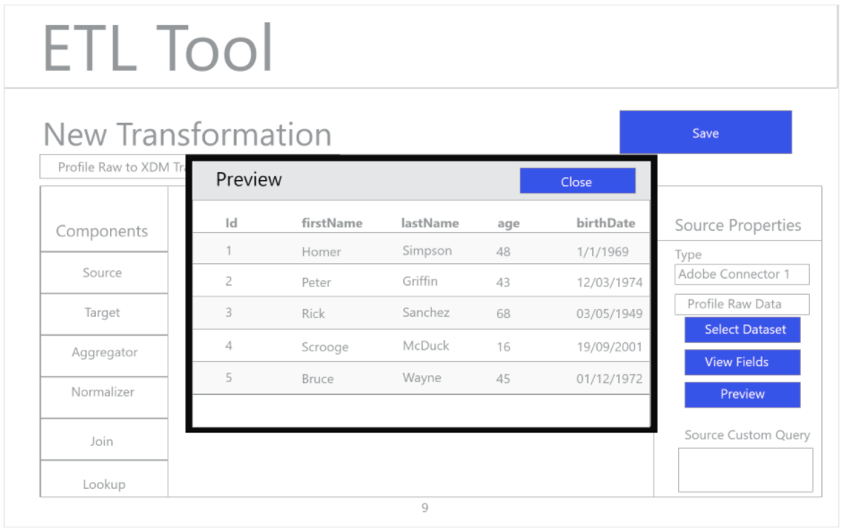

# ETL Workflow

Various extract, transform, and load (ETL) tools may differ in format, but most expose similar functionality to assist with the combining of multiple data sources.

## ETL Tool Example

The following diagrams provide mock-ups of common ETL actions and a generic user experience based on standard interactions. These images could easily be adapted for a specific ETL user experience. 
 
The actions illustrated below are described in the steps outlined within the [ETL Integration Guide](etl_integration_guide.md). Some steps reference specific "Figures", others describe similar actions to the workflow shown here.

#### Figure 1 - Configure New Adobe Experience Platform Connector:

#### Figure 2 - Experience Platform Connector Activated:

#### Figure 3 - ETL Transformation Management UI:

#### Figure 4 - New Transformation UI, selecting Experience Platform Connection:

#### Figure 5 - Browsing for source Experience Platform Datasets:

#### Figure 6 – Metadata and sample data from the Dataset in the ETL UI:

#### Figure 7 - Viewing field schema information from Datasets:

#### Figure 8 - Previewing data from Datasets:

#### Figure 9 – Defining data sync parameters for the operation of the transformation:

#### Figure 10 - Defining the Experience Data Model (XDM) target Dataset:

#### Figure 11 - Viewing the XDM hierarchical schemas and metadata to support mapping/transformations:

#### Figure 12 - Save and run/schedule the Transforms:
