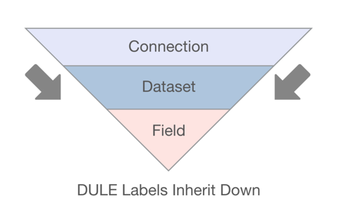
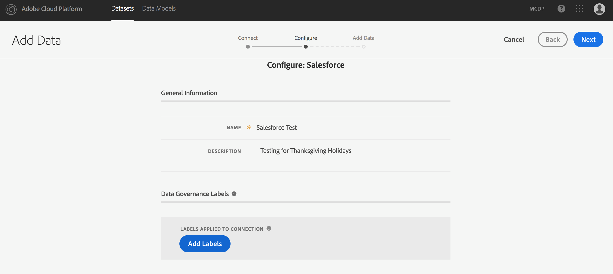
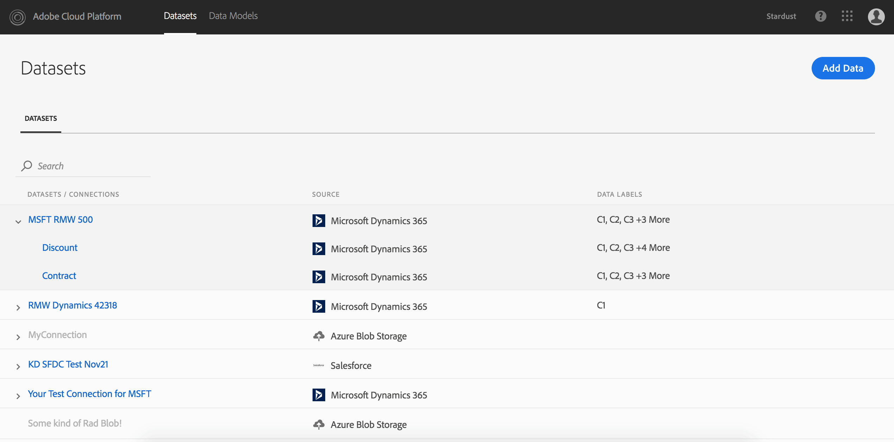
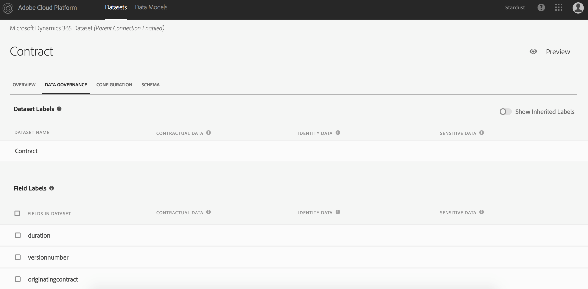
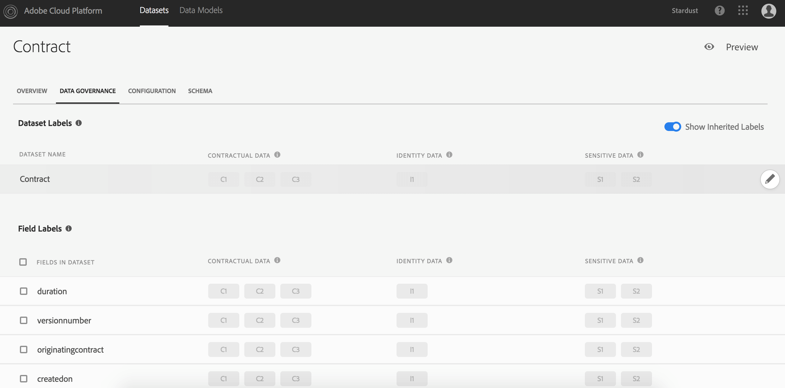
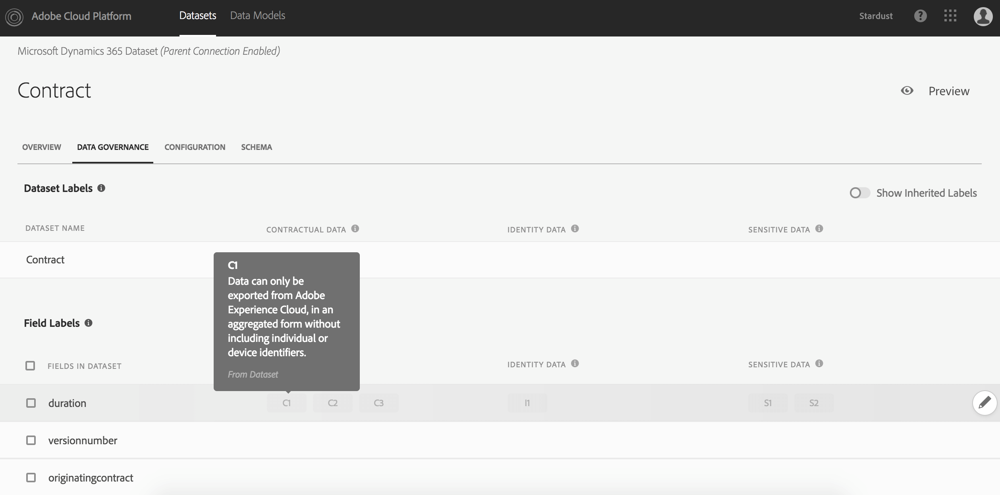
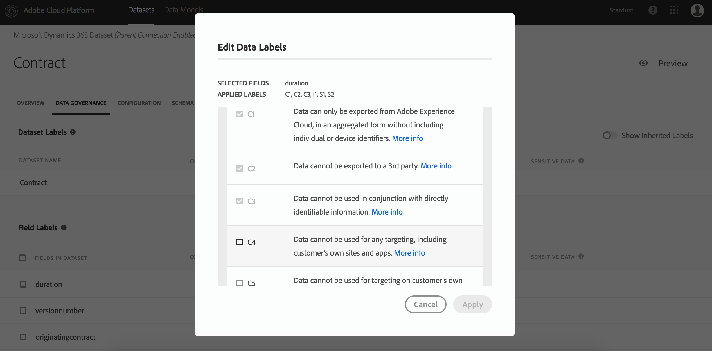
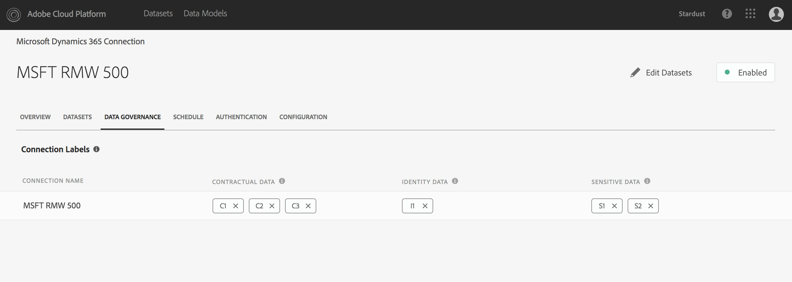

# Data Usage Labeling Basics

One of the key differentiators for the Adobe Cloud Platform (ACP) is that powerful and extensible data governance functionalities are deeply embedded within data processing mechanisms throughout the platform. These functionalities are embodied within a data governance framework known as "DULE" (Data Usage Labeling and Enforcement). DULE is a set of functionalities for applying specific labels (meta-data) to data to identify privacy or contract-related restrictions.

The main functionalities of DULE are:

* Data Usage Labeling
 - Allows users to label data based on their governance and compliance needs.
* Data Access Policies and Enforcement
 - Allows users to set data usage policies for enforcement

Currently, within DULE, there are three types of data to which labels can be applied, each with a fixed set of values (see table 1). The currently supported types of data are:

* Contractual Data:  This is data that is governed by customary contract-based restrictions
* Identity Data: This data falls in two categories:
 1.  Directly Identifiable Data (e.g. email, phone, name)
 2. Indirectly Identifiable Data (e.g. IP address, MCID, Loyalty Card #)
* Sensitivity Data: Data that refers to geolocations (e.g. GPS-based data)

The key step in [DULE](dule-terminology.html#DULE) is labeling data that is ingested by the Adobe Cloud Platform (ACP). Data can be ingested by ACP in several ways.

DULE provides flexible labeling options. A [Data Steward](dule-terminology.html#Data_Steward) can work with a data engineer during the setup of a connection to label data or simply go to dataset details page label data. The [Data Steward](dule-terminology.html#Data_Steward) can label data during:
1.	Connection Setup
2.	During data ingestion
3.	After data ingestion

In ACP you can apply labels at the following levels:

* Connection Level - Labels can be applied when creating a connector. This label will be inherited by all datasets and fields in the connection.
* Dataset Level - Labels can be applied at the dataset level which will be inherited by all the fields in the dataset.
* Field Level - Labels can be applied to individual fields in a dataset.

## List of Currently Supported Labels

| Labels | AKA | Definition |
| ------ | --- | ---------- |
| **Contractual Data** | ***Contractual Data Labels*** | **Contractual data labels - "C" labels - are used to categorize data that has contractual obligations or is related to a customer's data governance policies.** |
| **C1** | | Data can only be exported from Adobe Experience Cloud, in an aggregated form without including individual or device identifiers. |
| **C2** | | Data cannot be exported to a third party. |
| **C3** | | Data cannot be used in conjunction with directly identifiable information. |
| **C4** | | Data cannot be used for any targeting, including customer's own sites and apps. |
| **C5** | | Data cannot be used for targeting on customer's own sites and apps. |
| **C6** | | Data cannot be used for cross-site targeting. |
| **C7** | | Data cannot be used for performance and optimization of customer's own website. |
| **Identity Data** | ***Identity Data Labels*** | **Identity data labels - "I" labels - are used to categorize data that can identify or contact a specific person.** |
| **I1** | *Directly Identifiable Data* | Directly identifiable data that can identify or contact a specific person, rather than a device. |
| **I2** | *Indirectly Identifiable Data* | Indirectly identifiable data that can be used in combination with any other data to identify or contact a specific person. |
| **Sensitive Data** | ***Sensitive Data Labels*** | **Sensitive data labels - "S" labels - are used to categorize sensitive data such as geographic data.** |
| **S1** | *Geo Location Data* | Precise geo-location data specifying latitude and longitude that can be used to determine the precise location of a device. |
| **S2** | *Geofence Data* | Geo-location data that can be used to determine a broadly defined [geofence](dule-terminology.html#Geofence) area. |

Table 1: Types of data that can be labeled within DULE

## Support for Hierarchical Inheritance

ACP's concept of hierarchical inheritance  - Connection, Dataset, and Field - helps organizations easily apply labels. The inheritance hierarchy works in a top-down manner (see figure 1). Therefore, labels applied at the connection level gets inherited by datasets and fields; labels applied to datasets get inherited by all fields. A [Data Steward](dule-terminology.html#Data_Steward) can individually label datasets and fields to based on the needs.



Figure 1: DULE inheritance

## Step by step guide to apply labels to data

Step 1: Login to ACP

Step 2: If you are trying to setup a new connection - for example to Salesforce - to introduce a new dataset to the platform, click on "Add Data" and select the "Salesforce" connector. It will ask you for the Salesforce credentials in order to create the connection. Once you provide the credentials and an appropriate name and description to the connection, you can apply labels to the connection. See figure 2.



Figure 2: Configure Salesforce Screen

Step 3: During the Connection setup process you will see an option to apply labels at the connection level. Labels applied here will be inherited by all datasets and fields that are part of this connection.

Step 4: Now, navigate to the datasets detail page. Here you can see the list of connections, datasets and a glimpse of applied data labels. See figure 3.



Figure 3: Datasets Screen

Step 5: Go to the data governance section in the dataset details page. On the top of the page you can see the dataset name. In this example the dataset name is "Contract." See figure 4.



Figure 4: Data Governance Screen

Step 6: You can see if there are any labels associated with the dataset that were applied during the connection setup by toggling the "Show Inherited Labels" button. See figure 5.



Figure 5: Inherited Labels Screen

Step 7: You can edit existing labels or add new labels to the fields by clicking the "Edit" button. See figure 6.



Figure 6: Edit Labels Screen

Step 8: Once you click on the "Edit" button, you will be presented with a dialog showing a list of default labels supported in ACP. You can select the appropriate labels for each field in the dataset and apply the changes. Note that you will not be allowed to remove labels that were inherited from the connection and dataset levels. See figure 7.



Figure 7: Edit Labels Dialog

Step 9: To change the labels at the connection level, go to the data governance section of the connection detail page and make the appropriate changes to the labels. See figure 8.



Figure 8: Edit Connection Labels

## API & Extensibility

The DULE data governance framework is designed with extensibility and scalability in mind and all DULE functionalities are available via REST-based APIs. If you are importing data to the platform via APIs, you label datasets as they import.

DULE provides the following APIs:

```
/connectors/{id}

/dataSets/{id}

/dataSets/{id}/views

/dataSets/{id}/dule

/dataSetViews/{id}
```

## Future Releases
In the first release of ACP we support labeling datasets at different levels, i.e connections, datasets, and fields, with full support for inheritance. Subsequent releases with provide the following features:

1.	Policy Service and Management
 - Ability to create policies with marketing actions and labels.
2.	Custom Labels
 - Ability to create new labels and definitions based on your organization's needs.
3.	Advice and Enforcement
 - Using the policy framework to advise and enforce policies across different data access patterns.
4.	Monitoring
 - Ability to monitor data access activities and identify and report on compliance issues.
