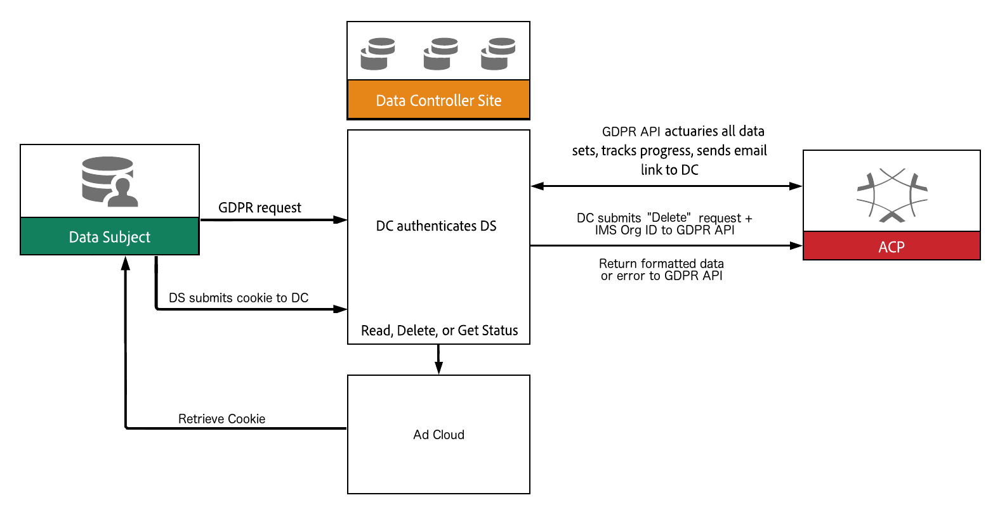

# Deleting Personal Data by a Data Subject

## Introduction

The General Data Protection Regulation (GDPR) framework from Adobe that provides a common, centralized, facility that allows Adobe customers to manage (access and delete) their personal data that is used by the Adobe Cloud Platform (ACP). The framework includes a UI for selecting and creating requests, a business layer (API) that will govern all data flowing in and out of ACP, and a facility to store, audit, and log information.

Every Adobe application and platform does presently or will offer a solution that provides a [Data Subject](../gdpr-terminology.html#DataSubject) with access to all [personally identifiable information (PII)](../gdpr-terminology.html#PII) in human-readable form upon request of a Customer. Each Adobe application and platform works in conjunction with the Adobe GDPR framework to maintain an audit trail of each request and associated compliance adherence.

Each solution facilitates access to the PII of a Data Subject by an Adobe tool accompanied by processes for the intake and delivery of a request

## Onboarding Your API Client

Any ACP API, such as Adobe's GDPR framework, that accesses a service or content on behalf of an end user authenticates uses the OAuth and JSON Web Token (JWT) standards.

An ACP API client application must be registered through the [Adobe I/O Console](https://console.adobe.io/). The I/O Console is where you can generate an API Key, an important requirement to obtain client credentials.

If your integration needs to access content or a service on behalf of an end user, that user must be authenticated as well. Your integration will need to pass the OAuth token granted by the Adobe IMS.

For service-to-service integrations, you will also need a JSON Web Token (JWT) that encapsulates your client credentials and authenticates the identity of your integration. You exchange the JWT for the OAuth token that authorizes access. See [Adobe I/O Authentication Overview](http://www.adobe.io/apis/cloudplatform/console/authentication/gettingstarted.html) for detailed instructions.

## GDPR Business Services

The Adobe GDPR business-service framework revolves around consuming and producing event messages, audit logging, and information gathering. The framework interacts with [IMS](../gdpr-terminology.html#IMS) for service token retrieval, as well as managing message encryption and decryption. The GDPR framework provides a REST API layer for `access`, `delete`, and `status` requests (see [API reference](TBD)).

[TODO: gather all IDs](gdpr-id-onboarding)

Below is a high-level workflow diagram showing the sequence of events for a `delete` request.



## Adobe GDPR Delete Request

### Example

Listing 1 illustrates an example of an Adobe GDPR `delete` request.

```java
GDPRCentralServiceApi apiInstance = new GDPRCentralServiceApi();
AGDPRRequestModel body = new AGDPRRequestModel();

ACompanyContextModel companyContextsItem = new ACompanyContextModel();
companyContextsItem.setNamespace("imsOrgID");
companyContextsItem.setValue("123456789@AdobeOrg");

body.addCompanyContextsItem(companyContextsItem);

AModelForUsers usersItem = new AModelForUsers();
usersItem.setKey("David Smith");
usersItem.addActionItem("delete");

UserId userId = new UserId();
userId.setNamespace("emails");
userId.setType("standard");
userId.setValue("dsmith@acme.com");
usersItem.addUserIDsItem(userId);

body.addUsersItem(usersItem);

try {
    List<AGDPRRequestModel> result = apiInstance.performDataOperation(body);
    System.out.println(result);
} catch (ApiException e) {
    System.err.println("Exception when calling GDPRCentralServiceApi#performDataOperation");
    e.printStackTrace();
}
```
**Listing 1:** Adobe GDPR `delete` request example

The raw JSON request for the example shown in Listing 1 will look similar to the example shown in Listing 2.

```json
{
    "companyContexts": [
        {
            "namespace": "imsOrgID",
            "value": "123456789@AdobeOrg"
        },
        {
            "namespace": "AdCloud",
            "value": "AdvId:12345"
        },
        {
            "namespace": "Campaign",
            "value": "acme-stg-us1"
        }
    ],
    "users": [
        {
            "key": "David Smith",
            "action": ["delete"],
            "userIDs": [
                {
                    "namespace": "email",
                    "value": "dsmith@acme.com",
                    "type": "standard"
                }
            ]
        }
    ]
}
```
**Listing 2:** Adobe GDPR raw `delete` request

In Listing 2, The `action` field is a collection of desired actions (`access`, `delete`, and `status`), and may be different for each client in the request. The `key` is a client identifier to wrap the various namespace entries, and is used to qualify job IDs returned in the response data. Clients may have 1 or more namespaces and this format allows for varying numbers of identifiers as outlined in the following section.

Listing 3 shows an example of a successful `delete` request.

```json
{
    "jobId":"12345AD43E",
    "action":"delete",
    "product":"analytics",
    "status":"complete",
    "message":"success",
    "results": {
        "userContexts":[
            {
                "namespace":"email",
                "namespaceId":125,
                "type":"standard",
                "value":"dsmith@acme.com"
            }
        ],
        "receiptData": {
            "recordsAffected":234,
            "tablesModified":12
        }
    }
}
```
**Listing 3:** Adobe GDPR raw `delete` request success response

Note the `jobId` value in the response shown in Listing 3. This value is used for subsequent API requests to retrieve the status of the `delete` request.

Listing 4 shows an example of an unsuccessful `delete` request.

```
{
    "jobId":"12345AD43E",
    "action":"delete",
    "product":"analytics",
    "status":"error",
    "message":"2 records failed to delete. Additional data can be found in product logs using reference ID: 1234567",
    "results": {
        "userContexts":[
            {
                "namespace":"email",
                "namespaceId":125,
                "type":"standard",
                "value":"dsmith@acme.com"
            }
        ],
        "receiptData": {
            "recordsAffected":234,
            "tablesModified":12
        }
    }
}
```
**Listing 4:** Adobe GDPR raw `delete` request error response

## Namespace Types

Namespace types categorize unique data that a customer uses to identify a service client. The `type` values specified in the `userIDs` array must contain one of the following qualifiers:

| Qualifier | Definition |
| --------- | ---------- |
| dpsc | A custom field type for DPS mappings, which support a set of three standard namespaces. |
| analytics | A custom namespace that is mapped internally in Analytics, not in the namespace service. This will be passed in directly as specified by the original request, without a namespace ID |
| target | A custom namespace that is understood internally by Target, not in the namespace service. This will be passed in directly as specified by the original request, without a namespace ID |
| unregistered | A freeform string that is not defined in the namespace service and will be taken "as is". Any solution that handles these kinds of namespaces will check against them and handle if appropriate for the company context and data set. No namespace ID will be provided. |
| custom | A unique namespace created in the context of an organization, not shared across the Experience Cloud. The value represents the friendly name ("name" field) to be searched for. Namespace ID will be provided. |
| namespaceId | Indicates the value is the actual ID of the namespace that was created or mapped through the namespace service. |
| integrationCode | Integration code - similar to "custom", but specifically defined as the integration code of a datasource to be searched for. Namespace ID will be provided. |
| standard | One of the standard namespaces defined globally, not tied to an individual organization data set (e.g. email, phone number, etc.). Namespace ID will be provided. |
