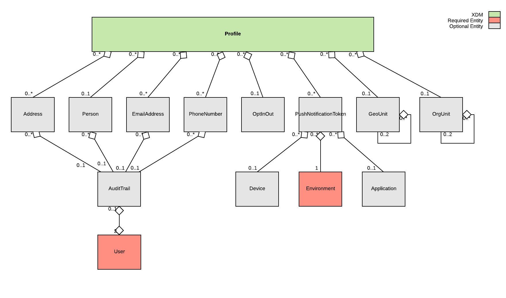
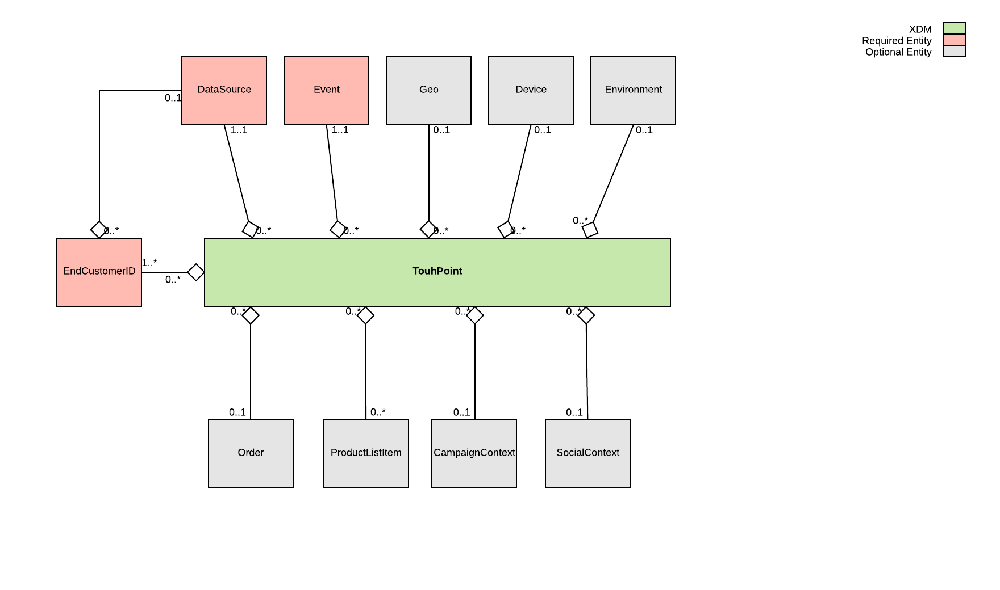
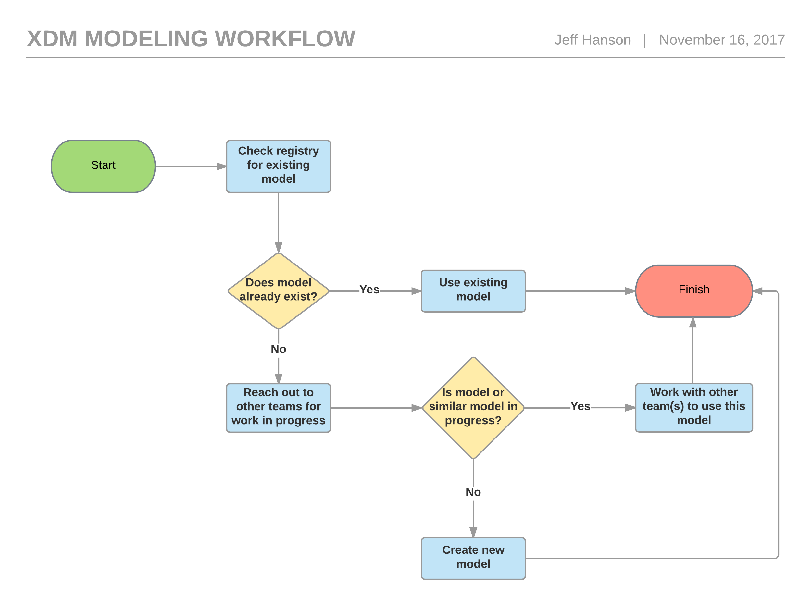

# Experience Data Model (XDM) Modeling: A Guide to Getting Started
# Overview
This cookbook is about the definition of the models. There are other sources that define the actual mapping and transformation of data to XDM, as well as onboarding of services and solutions to use XDM in the context of the Data Platform.

# Models
The Experience Data Model (XDM) provides a normalized and consistent information eco-system within which data is organized according to logical and reliable architectural standards. XDM offers the simplicity of single-source data management, the purpose of which being the direct and uncomplicated creation, storage, retrieval and manipulation of data. A homogeneous environment for information management, XDM provides a secure platform for the ingestion of data that might originate from many sources, be they internal or external. The definitive purpose of XDM is to allow the sharing of this data within a safe, agile, and normalized setting.

XDM is defined by a standardized format: JSON Schema (see http://json-schema.org/) and is composed of several models, entities and fields. This composition (data structure) allows for the manipulation of data by internal and external users via extensibility. Additionally, XDM enables the reuse of datasets for various use cases, helps applications work effortlessly across customers, and assists partners in providing consistent solutions to their clients.

Adobe currently has defined two standard models: Profile and Touchpoint. These are illustrated below and can be found at [https://git.corp.adobe.com/jefhanso/xdm/tree/master/schemas/draft-04/xdm](https://git.corp.adobe.com/jefhanso/xdm/tree/master/schemas/draft-04/xdm).

## Individual Profile
XDM Individual Profiles are a singular representation of the attributes of identified and partially-identified persons. Profiles that are highly identified may be used for personal communications or highly targeted engagements and can contain detailed personal information such as names, gender, date of birth, locations, and contact information like phone numbers and email addresses. Profiles may range to the other end of the identification spectrum where only anonymous behavioral signals are being observed and the amount of identification is simple browser cookies. In this latter case, the sparse Profile data is useful to build more knowledge on the interests and preferences of the anonymous profile, and over time can become richer as the person interacting with the brand becomes more engaged and ultimately signs-on to notifications, subscriptions, purchases and other connections with the brand that enrich and fill out the profile.

XDM Individual Profile can contain personal information, identification information, contact details and communication preferences. Over time, XDM Individual Profile will expand to cater for other Profile data such as preference, propensities and other attributes.


Figure 1: XDM Individual Profile

## Touchpoint
The core touchpoint XDM is used to capture observations that are altering one or more related XDMs/entities. The touchpoint captures information about the observation taking place and when it is occurring. It is critical for time-domain analytics as it allows observation and analysis of changes that occur in windows of time and comparison with other windows of time to track trends.

Touchpoint events are either explicit or implicit. Explicit events are direct observations of a human action taking place during a session. Implicit events are events that are being raised without a direct human action. Examples of implicit events are scheduled email sending of newsletters, battery voltage reaching a certain threshold, a person entering range of a proximity sensor.

While not all events are easily categorized across all data sources, it is extremely valuable to harmonize similar events into similar types for processing where possible, and the XDM specifications do this by defining a set of enumerated type attribute values with specific semantic meanings. Where possible, events must be constrained to these enumerated values to facilitate interoperability.


Figure 2: XDM Touchpoint

A model, is a JSON-based, definition of data for a unique customer engagement concept that is usable in the three main access patterns (analytical, operational, and definitional), Concepts can be things like channels, identity, segmentation, assets, shopping carts.
* Analytical Access Pattern: optimized for time-dimensional, massive queries. So highly denormalized, indexable by time. (Primary users: Analytics, OmniChannel Query Service aka ‘OCQS’)
* Operational/Transactional Access Pattern: Optimized for real-time requests of one or a small number of records where an update is required to be definitively recorded, maybe across models. (Primary users: Commerce)
* Rules/Logic: Optimized for ranges and combinational logic. IF inventory is high AND season is ending THEN prioritize offer. (Primary users -> Target, Campaign Offer Management)

# Entities
Entities are reusable aggregations of JSON data elements (normally complex data definitions with multiple fields) that can be composed or referentially associated into XDM models. In other words, an XDM model is composed of one or more entities. Example of entities include Address, Email, and Geo.

Entities:
* Represent a concept
* Are made up of fields
* Fields in an entity are interconnected and have similar change semantics
* Fields in entities are never arrays; are never entities
* Data dictionary constituent

The definitions for the core set of entities can be found at [https://git.corp.adobe.com/jefhanso/xdm/tree/master/schemas/draft-04/core](https://git.corp.adobe.com/jefhanso/xdm/tree/master/schemas/draft-04/core).

# Extensions
Normalization of data within a standard data model presents the inherent problem of incompatibility, whether from untranslated data unsuitable for the design schema of a specific data platform or from the platform itself (which may lack the architectural breadth to accommodate data representation requirements). Whatever the case, problems of standardization within data models do exist and can therefore prevent the sharing of data.

Fortunately, XDM accounts for potential complications pertaining to data ingestion, specifically by means of extensibility, which allows for customizable data. More specifically, the extensible XDM schema scales with the diverse data representation requirements of enterprise customers via the Adobe XDM Registry, which includes extensions, namespacing and versioning. Ultimately, extensibility allows for the adaptation of personalized data so that ingestion into the Experience Data Model is uncomplicated and the sharing of data effortless.

Extensions are injected into the base types. Whenever you have an object of such a defined type you get visibility to the function of the base type as well as all the extensions that have been defined on that type.

In this case, the customer would add additional fields to core.Person, but no new entity or name is created. The customer continues to refer to this as core.Person, but extensions are now injected and added to the entity based on the customer using that object.

Below is an example of adding "age" and "hairColor" to the Adobe-defined core.Person entity:

```
{
    "firstName" : "John",
    "lastName" : "Doe",
    "gender" : "male",
    // ...etc.
    "_customer" { // (alias to the customer's IMS Org namespace)
        "mycrm" { // (customer defined namespace - to manage different business units, teams, categories, etc. - more on this below)
            "age" : 45, // (extension field)
            "hairColor" : "black"
        }
    }
}
```
Note in the example above how the customer extension is encapsulated within the object "_customer." The underscore is the convention by which extensions are defined.

# Namespacing
Extensions are used to add non-standard data elements to XDM models and entities, as well as to create external entities that may act as the schema for a codified dataset or as independent extensions to other models and entities. With this level of flexibility there is always the possibility of data conflicting with an already existing definition. To mitigate this risk, Namespacing is used to isolate teams, vendors, and shared schemas, and therefore allowing isolation between distributed teams defining data models.

The XDM schema defines three scopes of Namespacing that have different usage semantics and enable the required set of diverse use cases. They are:

1. XDM Core - Core is the most standardized part of the XDM Schema data definitions. Definitions here are heavily managed with industry subject-matter experts, those who evaluate all additions to ensure maximum interoperability between experience applications. All implementations or tenants of XDM see the same definition of the Core scope. Across all customers that use XDM, Core is used consistently so that a person who understands the XDM implementation in one context can readily comprehend other implementations, and applications that can work on the standardized experience data can automatically do so for many use cases with little configuration. This allows resource and implementation portability and efficiency. XDM Core has a two-numeric version identifier (major.minor). The major denotes schematic compatibility and the minor the linear, incrementing revision. Because of the semantics of the XDM rule on evolution (see Fundamental Rule of Extensions), all updates to Core are strictly additions within a major version, and therefore a consuming application can ascertain compatibility with a dataset by checking the major version is equal to, and that the minor version is equal to or larger than, what the applications was built to support.
2. Customer - The Customer namespace scope is tenant-specific (isolated), which means that multiple customers neither see the specific definition nor are impacted by other tenants using the Customer namespace scope. This scope is identified as _customer in the technical schema.
3. Vendor - The Vendor scope allows vendors (software, consulting, data etc.) to define custom extensions that can be deployed into a customer's tenant. This provision is managed by processes that review and approve vendor submissions to ensure correct usage of namespacing and extensions. At Adobe, this is the Adobe Exchange Program, which works with third-party technology vendors to build offerings that are marketed to joint customers. This scope is identified as _vendor in the technical schema.

# What is XDM Modeling and Why?
The key to using data has always been understanding what the data means. Many marketing products started life with a specific focus on a functional area: targeting, audiences, analytics, etc. and they are optimized for that task. Over time, common concepts became manifested in these products, such as segments, identity, creatives, and others. Even though these common concepts were named similarly and were implemented in many of these products, they could not be easily shared because the definitions were all different in some way.

As Adobe moves to a platform-based architecture, we need to have common definitions for these concepts that all teams building solutions can reuse without transformation or reinterpretation. It will also make sense for our customers, partners, and competitors to use these common definitions because they work within the Adobe Cloud.

# Modeling Best Practices
* Follow the guidelines in "Contributing to XDM" at [https://git.corp.adobe.com/AdobeCloudPlatform/xdm/blob/master/CONTRIBUTING.md](https://git.corp.adobe.com/AdobeCloudPlatform/xdm/blob/master/CONTRIBUTING.md)
* Identify the concepts for your data management needs and include in the process other teams in which your work may impact
* Identify the main use cases that will be used to validate the utility and completeness of the modeling
* Define the list of data items that are in the concepts
* Working through the XDM Modeling Flow Chart to identify if your models are additions to existing models. Socialize the design as much as possible
* Send a Git pull request to the XDM WG team to review the proposal. Your proposal should be reviewed and a response given within 72 working hours
* Iterate through the reviews and feedback until conclusion
* Where applicable, support the generation of data for the new modeling with the XDM Data Generator team. This will mean that synthetic data is available for teams to test, train and demo the data without constraints.

# Modeling Process
At each step, you should meet with the XDM WG to socialize and get feedback, pointers. This is a relatively interactive process with the concept owners driving and the XDM WG supporting and facilitating.

## Step 1: Is the concept included already?
There is already a lot of modeling done, and some areas may already be covered.
1. Review the current model definitions at http://xdm.corp.adobe.com/
2. Pose questions to the mailing list at xdm@adobe.com and #xdm-questions on the Adobe Tech Ops Slack channel to see if any work is going on relating to your project

## Step 2: Identify the general concepts that your team can use to drive the modeling
You may be assigned to do so, it may be required by your project, or this may be just an area of special interest to you. Regardless of how you go into it, start by listing the concepts, which teams that may be impacted by this concept being modeled. Also, create a table of concepts for this effort.

Example of concepts table:

Concept name            | Teams Involved                            | Case
----------------------- | ----------------------------------------- | -------------
e.g. Campaign Tracking  | e.g. Analytics, Ad Cloud, Adobe Campaign  | e.g. Track the primary campaign for a hit
&nbsp;                  | &nbsp;                                    | &nbsp;
&nbsp;                  | &nbsp;                                    | &nbsp;

## Step 3: Meet with other teams that may have an interest
Ask the teams that have interests in the concepts in question and send them this guide. Explain what concepts you are going to be modeling and ask them to assign someone to work with you. You are responsible to ensure that models are generally usable for other teams that have dependencies with the same concepts. Flesh out the use cases and prioritize the aspects of the concept that make sense to tackle first. Look at third parties and see if there are standards to which we should conform. If something external exists and has traction, then we have no reason to rebuild it.

Specifically look at:
1. Microsoft CDM
2. Schema.org
3. W3C
4. ISO

## Step 4: Prepare a data dictionary
The data dictionary is a simple list of each data item that is a candidate for the concept. Additionally, the priority, usage, and formatting are captured.

Example data dictionary:

Data Item Name | Priority (1=urgent, 2=important, 3=sometime) | Data Type (min/max, integer, decimal, lengths, enumerated values, etc.) | Origin (source of the data, standard, 3rd party) | Category (common categorization grouping of this data item) | Description | Dependent teams | Corresponding XDM? | Notes |
--- | --- | --- | --- | --- | --- | --- | --- | --- |
xid | 1 | custom, alphanumeric, needs SDK | Adobe | Identity | A merging of an "Adobe data source ID" with a ID in that name space. Required for future Visitor ID Service. | All Solutions, Visitor ID Service | None |
firstName | 1 | string | Adobe |  Identity/Person | First name or given name of an individual | All solutions | core.Person |
The XDM data dictionary template can be found at: [https://wiki.corp.adobe.com/display/XDM/XDM+Data+Dictionary+Template](https://wiki.corp.adobe.com/display/XDM/XDM+Data+Dictionary+Template)

## Step 5: Decide on how the concepts get included in XDM
Prioritize what to start with, this will ensure progress can be made more quickly. The modeling can be done in iterative phases. To begin, choose the data items that support a high-priority use case first. Other cases can be implemented later when you are sure that current design decisions can scale to future needs without breaking compatibility.

Work through the XDM Modeling Flowchart to identify if the data needs to be represented as new models or if the data should be represented as extensions to existing models. Begin conceptualizing a proposal of the model(s) design. Socialize the design as much as possible.

### XDM Modeling Flowchart


## Step 6: Formally describe the model in JSON-LD in Git
Send a Git pull request to the XDM WG team with the model to review the proposal.

Reuse entities where possible when they mean the same thing. Entities can be found here is JSON Schema: [https://git.corp.adobe.com/experience-platform/sdm-specification/tree/master/json/release/core](https://git.corp.adobe.com/experience-platform/sdm-specification/tree/master/json/release/core)

Provide the location of the Git repository to where to make the pull request.

At this stage, there are a few conventions to follow:

* Naming Conventions (see https://git.corp.adobe.com/AdobeCloudPlatform/xdm/blob/master/CONTRIBUTING.md)
* Data Types (see https://wiki.corp.adobe.com/display/DMSArchitecture/XDM+Data+Types)

## Step 7: Reviews and Evolution
Iterate through the reviews and feedback until conclusion. This is a communal process. Ideally the designated representative from each interested team will approve or, at least, not block. At this point, the pull request is accepted and the XDM WG will continue the process of putting the model in the public specification and into the XDM Registry.

## Bonus Step 8. Synthetic Data Generation
Where applicable support the generation of data for the new modeling with the XDM Data Generator team. This will mean that synthetic data is available for teams to test, train and demo the data without constraints.

# Sample Use Case
A Campaign customer (data engineer) wants to define a new data model.
1. Campaign customer logs into Campaign server and then SSO to platform UI (Platform UI will provide the functionality to define new XDM data models)
2. Data engineer creates data models and extensions in platform UI and then saves. Note that customers can only create extensions under their IMS Org and can refer to Core XDM models as well as Campaign specific extensions but cannot modify Core XDM models or Campaign-specific extensions. Once the data model is saved, it will be stored in Catalog. XDM extensions, as well as Core XDMs, will be available via XDM APIs
3. Data engineer will switch to Campaign UI and will sync the XDM models to Campaign instance. Campaign server might provide UI to sync the XDM models from the platform using XDM APIs
4. Campaign server will create DB schemas inside Campaign database based on XDM model

# Terminology
| Term | Definition |
| ---- | ---------- |
| XDM | The Experience Data Model (XDM) is the term used to describe the data modeling project. As such the XDM defines all the different data models modeling real-world objects. Examples of XDM data models are Asset, TouchPoint, Profile, Event, etc. Across Adobe the Adobe Platform XDM Working Group is driving the standardization of the data models. (XDM Arch) |
| Model | - Models are abstract definitions of real-world objects. Examples of Models are Profile, TouchPoint, or Asset. A Model is the highest-level element in the XDM and consists of fields of Entities. (XDM Arch) <br/> - Models are the top-level constructs of the XDM environment. The models represent high-level experience concepts like Profile, Touchpoint, Product Catalog, and Campaign. You can use the schema of a model to create one or more physical datasets for the actual data to be formatted to persist or be accessed. (XDM Extension Whitepaper) |
| Entity | - Any entity is a named collection of fields. Entities model reusable facts such as Address, EmailAddress, or GeoUnit. (XDM Arch) <br/> - Entities are reusable aggregations of data elements (normally complex data definitions with multiple fields) that can be composed or referentially associated into XDM Models. Examples of an entity include Address, Email, and Geo. (XDM Extension Whitepaper) |
| Field | - A field is the lowest level element of an Entity. A field may be scalar, an array of items of the same type or an Entity. The accepted types for fields are described in XDM Data Types. (XDM Arch) <br/> - Fields are the lowest level data items and contain literal data. Examples include firstName, city, and pageName. (XDM Extension Whitepaper) |
| Enumeration | Enumerations are types of fields with that have an enumerated type that may be either an open or closed set of values. Examples include the Address Entities type field with the open set of values [“home”, “work”, “unknown”] (XDM Extensions Whitepaper) |
| XDM Schema | - A set of Models, Entities, Fields and Enumerations that enshrine the best way we know of to represent the data our customers need to deliver experience. (XDM Home) <br/> - A set of data elements comprised of Models, Entities, Fields and Enumerations that enshrine the best way creators of XDM know of to represent the data enterprises need to deliver compelling experiences. Adobe is sharing the XDM Schemas with Microsoft and other partners. (XDM Extension Whitepaper) <br/> - The Schema is derived from the Model and is applied to an actual Data Set. Multiple versions of the same Schema may be applied to the same Data Set where the currently "active" Schema can be queried from the Data Set Catalog. (XDM Arch) |
| XDM Schema Infrastructure | - Extensions and versioning semantics to ensure partners, customers and Adobe can adapt XDM for specific cases and evolve it into the future without conflicts in a managed way. (XDM Home) <br/> - Extensions and versioning semantics ensure that partners, customers, and Adobe engineers can adapt XDM for specific use cases and ensure that it evolves without namespace collisions. (XDM Extension Whitepaper) |
| XDM Registry | A common service that provides a multi-tenant directory of XDM and custom models and implements the XDM Infrastructure functionality. Available via API and UI. Internally know in DMa as "Catalog". (XDM Home) |
| XDM Namespaces | XDM uses namespacing to provide isolation between XDM Core entities (which are standardized for everyone who uses XDM across various implementations) and extensions that go beyond the XDM Core. They are: <br/><br/> XDM Core <br/><br/> Definitions in the XDM Core scope are heavily managed with industry subject matter experts evaluating all additions to ensure maximum utility, supporting interoperability between experience applications while being generally useful for many best practices. All implementations or tenants of XDM see the same definition of the Core scope. <br/><br/> _Customer <br/><br/> - The Customer namespace scope is tenant specific (isolated), which means that multiple customers do not see, and are not impacted by, any other tenants use of the Customer namespace scope. In the technical schema, this scope is identified as _customer. <br/><br/> _Vendor <br/><br/> - The Vendor scope allows vendors (software developers, consulting, data) to define custom schema extensions that can be optionally deployed into a customers’ tenant. This is managed by processes that review and approve vendor submissions to ensure correct usage of namespacing and extensions. At Adobe, the Adobe Exchange program works with technology vendors to build offerings that are marketed to joint customers. In the technical schema, this scope is identified as _vendor. <br/><br/> - Example: (include some from AA, AC) |
| XDM Extensions | You can use Extensions to add non-standard data elements to XDM entities and models, and to create external entities that serve as the schema lookup dataset or allow themselves be extensions to other models and entities. <br/><br/> Extensions to Core XDM Schemas are additive only. This is the recommended path to customers and vendors; but they can destructively remove extensions if needed. |
| Data Set | A Data Set is a named collection of data, comparable in a relational DB to a table. Unlike a Relational DB table, a Data Set is usually highly de-normalized. A Data Set consists of one or more Data Set Files which reflect the history of Data ingestions. A Data Set is related to a single Schema, though over time that linked Schema might evolve. <br/><br/> When reading data from a Data Set the platform infrastructure standardizes all data read from the physical Data Set Files such that a single Schema version view is presented. By default, the current version of the Data Sets Schema is used. An application may request, a previous version, though. (XDM Arch) |
| Data Set File | A single file part of a Data Set. A Data Set File is typically linked to an exact version of a Schema. The Schema of a Data Set File does not change over time. If the Schema of a Data Set evolves, new Data Set Files are created for that new Schema version. (XDM Arch) |
| Microsoft Common Data Model (CDM) | A set of business centric (B2B) models that Microsoft is sharing with Adobe as part of a deep strategic relationship. They will be bidirectionally incorporated (Adobe include CDM, Microsoft include XDM). (XDM Home) |
| XDM on Adobe.io | - The APIs from the XDM Registry and Adobe Cloud Platform services that support XDM as well as documentation and access management. (XDM Home) <br/> - XDM APIs on Adobe.io. APIs identified in the XDM Registry and Adobe Experience Cloud Platform support XDMs. Adobe.io also provides ECP and XDM documentation, the API Gateway, Event framework, and other ECP access management services. (XDM Extension Whitepaper) |
| Eco-system | Programs and processes that allow third parties to participate in the definition process of XDM Schemas and provide applications that use XDM on the Adobe Cloud Platform. (XDM Home) |
