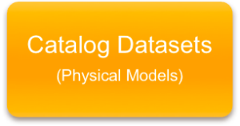
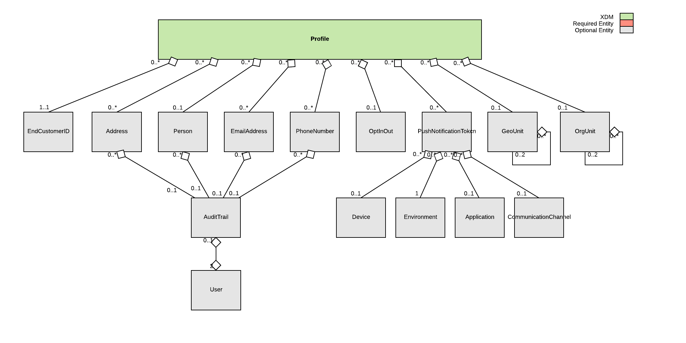
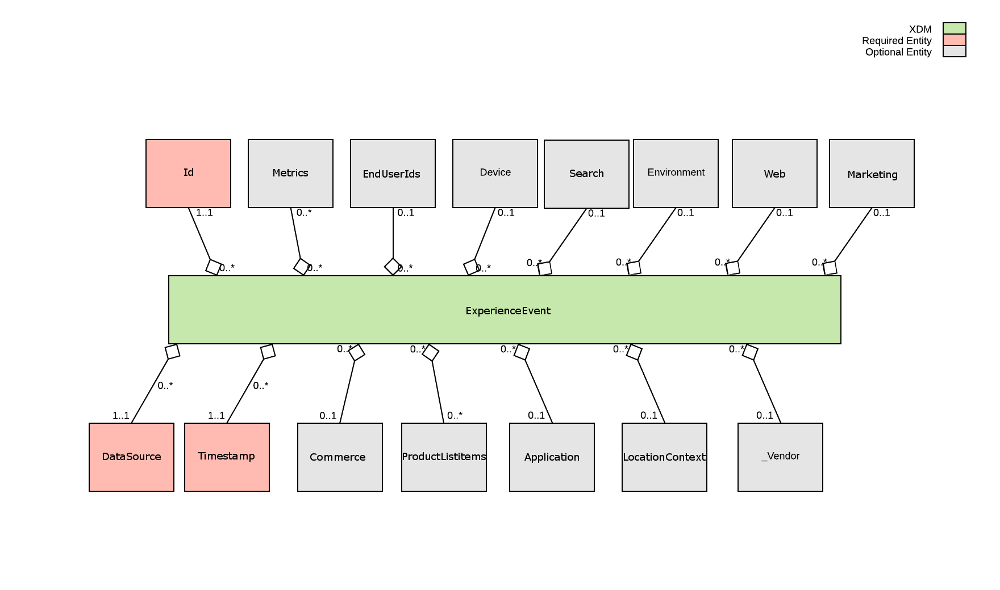

# Experience Data Model (XDM): A Brief Introduction
Adobe Experience Data Model (XDM) provides a normalized and consistent information eco-system within which data is organized according to logical and reliable architectural standards. XDM offers the simplicity of single-source data management, the purpose of which being the direct and uncomplicated creation, storage, retrieval and manipulation of data. A homogeneous environment for information management, XDM provides a secure platform for the ingestion of data that might originate from many sources, be they internal or external. The definitive purpose of Adobe Experience Data Model is to allow the sharing of this data within a safe, agile and normalized setting.

Because the standardization of data ingestion and storage can present challenges due to incongruent and unformatted sources of data, which may not comply with the standards of a specific data platform, XDM offers several models, entities and fields as a solution to complicated data ingestion problems. Moreover, these components allow for the manipulation of data by internal and external users (primarily by way of extensibility), which permits one to customize data within Adobe Experience Data Model. Additionally, XDM enables the reuse of datasets for various use cases, helps applications work effortlessly across customers, and assists partners in providing consistent solutions to their clients.

## The XDM Lifecycle

|  |  |  |
| ----- | ----- | ----- |
| - Base Objects and Models <br/>-- Touchpoint <br/>-- Profile <br/>-- ProductCatalog <br/>-- etc. <br/>- Base Vendor/Solution Extensions <br/>- Current Schema's | - XDM UI <br/>- Customer Extensions <br/>-- Add Fields <br/>-- Custom Objects <br/>- Common IMS Org Models <br/>- Support Different Reference Options <br/>-- Relational - PK:FK References (pending) <br/>-- Hierarchical - Objects within Objects | - Instantiate Model <br/>-- Logical to Physical Workflow (UI) <br/>- Physical Dataset(s) <br/>- Possibly multiple instances of the same model (Touchpoint from Analytics, Touchpoint from Campaign, etc.) |

### Step 1 (Base Objects)
XDM starts with the definition of base objects that are defined and managed by Adobe. These base objects are used to define low-level classes of data (Person, Address, Commerce, etc.) that are then used in reusable models/components that represent common marketing interactions (Profile, Touchpoint, etc.). These objects are intended to support different marketing use cases and verticals and utilize not only objects created by Adobe, but also include standards coming from Microsoft CDM and Schema.org.

Current Base Models: [Base Models](#The Models)

### Step 2 (Customer Extensions)
The logical model is where customers use an XDM management UI to extend the base objects with additional fields to meet their individual needs. In addition, customers can create new objects or combine objects into completely new models. At this level, the models are intended to represent the schema of the data that will be ingested and are intended to represent common use cases of the model.

Extension Details: [XDM Extensions](extensions.md)

### Step 3 (Catalog Datasets)
The physical layer is where an XDM model is converted into catalog datasets that represent actual data in the platform. If the model includes references to external datasets, this process needs to confirm with the user that these external datasets are new, or to link up existing datasets if they already exist. As models convert into physical datasets, those datasets ID's are then used to ingest data into the platform.

## The Models
The Standard Data Models (XDMs) provide a standard schema for data in the Data Platform such that applications and services can operate seamlessly across data sources and customers. XDMs will enable ease of integrating data from all our Adobe solutions and external sources, aid the ability to re-use the same datasets for various different use-cases, help applications work seamlessly across customers, and help partners provide consistent solutions to their clients.

The XDMs manage the small data wrangling problems around handling a large number of data sources. Most of the data coming into the data platform is within these models. In many ways, an impression log from Facebook "looks" similar to an impression log from Google. However, there are differences like column names and enumerations. The idea behind the XDMs is to manage away these differences in a lossless manner. With XDMs, applications can access the data in the data platform using standardized column names.

Additionally, some XDM models define standards for data farther down the data lifecycle. As such, they serve as a way to communicate a standard not just for taxonomy, but also for business logic. For example, a customer organization may struggle to define and distribute a primary statistic or KPI in a standard way. Agreement and usage of a particular XDM that houses that metric can provide great value for customers facing these problems.

### Profile

XDM Individual Profiles are a singular representation of the attributes of identified and partially-identified persons. Profiles that are highly identified may be used for personal communications or highly targeted engagements and can contain detailed personal information such as names, gender, date of birth, locations, and contact information like phone numbers and email addresses. Profiles may range to the other end of the identification spectrum where only anonymous behavioral signals are being observed and the amount of identification is simple browser cookies. In this latter case, the sparse Profile data is useful to build more knowledge on the interests and preferences of the anonymous profile, and over time can become richer as the person interacting with the brand becomes more engaged and ultimately signs-on to notifications, subscriptions, purchases and other connections with the brand that enrich and fill out the profile.

XDM Individual Profile can contain personal information, identification information, contact details and communication preferences. Over time XDM Individual Profile will expand to cater for other Profile data such as preference, propensities and other attributes.



### Example

```
{
  "endCustomerIds": {
    "campaign": {
      "profileId": 1234567
    }
  },
  "person": {
    "firstName": "John",
    "lastName": "Smith",
    "middleName": "Robert",
    "courtesyTitle": "Dr",
    "birthDay": 0,
    "birthMonth": 2,
    "birthYear": 1983,
    "gender": "male"
  },
  "addresses": [
    {
      "type": "home",
      "street1": "100 Great Mall Parkway",
      "city": "San Jose"
    },
    {
      "type": "work",
      "street1": "1 Main Street",
      "city": "San Jose"
    }
  ],
  "emails": [
    {
      "type": "personal",
      "address": "john@home.com"
    },
    {
      "type": "work",
      "address": "john@work.com"
    }
  ],
  "phoneNumbers": [
    {
      "type": "home",
      "number": "111-222-3333"
    },
    {
      "type": "work",
      "number": "444-555-6666"
    }
  ]
}
```

### Properties

| Property | Type | Description |
| -------- | ---- | ----------- |
| core.EndUserIds | [EndUserIds](schemas/common/EndUserIds.schema.md) | Condensed, normalized encapsulation of all end user identifiers. NOTE: At least one of the fields is required. |
| core.Person | [Person](schemas/common/Person.schema.md) | An individual actor, contact, or owner. |
| core.Address | [Address](schemas/common/Address.schema.md) | A postal address. Address could relate to a persons home, work, preferred store location etc. |
| core.EmailAddress | [EmailAddress](schemas/common/EmailAddress.schema.md) | A standard email address. |
| core.PhoneNumber | [PhoneNumber](schemas/common/PhoneNumber.schema.md) | Information that allows the phone calling of a person. Typically an alphanumeric number, 1-222-333 4444 in North America, but can have a wide range of formats. |
| core.OptInOut | [OptInOut](schemas/common/OptInOut.schema.md) | Describes a users opting in and out preferences for communication by medium and communication type. |
| core.PushNotificationToken | [PushNotificationToken](schemas/common/PushNotificationToken.schema.md) | Push notification tokens are used to communicate with applications that are installed on devices or SaaS application accounts. |
| core.Organization | [Organization](schemas/common/Organization.schema.md) | information that uniquely identifies an organized entity such as company, non-profit, government agency or educational institution, plus additional information that further qualifies the organization. |
| core.Geo | [Geo](schemas/common/Geo.schema.md) | The geographic related data where an event was observed. |
| core.AuditTrail | [AuditTrail](schemas/common/AuditTrail.schema.md) | Information related to the creation and the modifications of an entity. |

### ExperienceEvent

The core ExperienceEvent XDM is used to capture observations that are altering one or more related XDMs/entities. The ExperienceEvent captures information about the observation taking place and when it is occurring. It is critical for time domain analytics as it allows observation and analysis of changes that occur in windows of time and comparison with other windows of time to track trends. ExperienceEvent are either explicit or implicit. Explicit events are direct observations of a human action taking place during a session. Implicit events are events that are being raised without a direct human action. Examples of implicit events are scheduled email sending of newsletters, battery voltage reaching a certain threshold, a person entering into range of a proximity sensor. While not all events are easily categorized across all data sources, it is extremely valuable to harmonize similar events into similar types for processing where possible, and the XDM specifications does this by defining a set of enumerated type attribute values with specific semantic meanings. Where possible events must be constrained to these enumerated values to facilitate interoperability.



### Properties

| Property | Type | Description |
| -------- | ---- | ----------- |
| id | string - REQUIRED | The unique identifier for the ExperienceEvent. |
| dataSource | [core.DataSource](schemas/common/DataSource.schema.md) - REQUIRED | Globally unique identification of a data source |
| timestamp | integer - REQUIRED | The date and time when the first event of the ExperienceEvent occured. |
| endUserIds | [core.EndUserIds](schemas/common/EndUserIds.schema.md) | Condensed, normalized encapsulation of all end user identifiers. |
| metrics | [core.Metrics](schemas/common/Metrics.schema.md) | The metrics for actions performed during this observation. |
| environment | [core.Environment](schemas/common/Environment.schema.md) | Information about the surrounding situation the event observation occurred in, specifically detailing transitory information such as the network or software versions. |
| productListItems | [core.ProductListItem](schemas/common/ProductListItem.schema.md) | A list of items representing a product selected by a customer with specific options and pricing that are for that usage context at a specific point of time and may differ from the product record. |
| device | [core.Device](schemas/common/Device.schema.md) | An identified Device/Application or Device/Browser instance that is trackable across sessions, normally by cookies. |
| commerce | [core.Commerce](schemas/common/Commerce.schema.md) | The commerce specific data related to this interaction. |
| application | [core.Application](schemas/common/Application.schema.md) | The application related to the event observation. It could be either the application targeted by the event like the send of a push notification or the application originating the event such as a click, or a login. |
| search | [core.Search](schemas/common/Search.schema.md) | The information related to web or mobile search. |
| web | [core.Web](schemas/common/Web.schema.md) | The information related to web page and link of the ExperienceEvent. |
| marketing | [core.Marketing](schemas/common/Marketing.schema.md) | The information related to marketing activities that are active with the ExperienceEvent. |
| locationContext | [core.LocationContext](schemas/common/LocationContext.schema.md) | The transient circumstances related to the observation. Examples include locale specific information such as weather, local time, traffic, day of the week, workday vs. holiday, working hours. |
| _vendor | [_vendor.ExperienceEvent](schemas/vendor/ExperienceEvent.schema.md) | Vendor extensions to ExperienceEvent. |

## The Entities
### Core
[Address](schemas/common/Address.schema.md)<br/>
[AdvertisingMetrics](schemas/common/AdvertisingMetrics.schema.md)<br/>
[Application](schemas/common/Application.schema.md)<br/>
[AuditTrail](schemas/common/AuditTrail.schema.md)<br/>
[BrowserDetails](schemas/common/BrowserDetails.schema.md)<br/>
[Commerce](schemas/common/Commerce.schema.md)<br/>
[CommerceMetrics](schemas/common/CommerceMetrics.schema.md)<br/>
[CommunicationChannel](schemas/common/CommunicationChannel.schema.md)<br/>
[DataSource](schemas/common/DataSource.schema.md)<br/>
[Device](schemas/common/Device.schema.md)<br/>
[DirectMarketingMetrics](schemas/common/DirectMarketingMetrics.schema.md)<br/>
[Discount](schemas/common/Discount.schema.md)<br/>
[EmailAddress](schemas/common/EmailAddress.schema.md)<br/>
[EndUserIds](schemas/common/EndUserIds.schema.md)<br/>
[Environment](schemas/common/Environment.schema.md)<br/>
[Geo](schemas/common/Geo.schema.md)<br/>
[GeoCircle](schemas/common/GeoCircle.schema.md)<br/>
[GeoCoordinates](schemas/common/GeoCoordinates.schema.md)<br/>
[GeoShape](schemas/common/GeoShape.schema.md)<br/>
[Identity](schemas/common/Identity.schema.md)<br/>
[ListDetails](schemas/common/ListDetails.schema.md)<br/>
[LocationContext](schemas/common/LocationContext.schema.md)<br/>
[Marketing](schemas/common/Marketing.schema.md)<br/>
[Metric](schemas/common/Metric.schema.md)<br/>
[Metrics](schemas/common/Metrics.schema.md)<br/>
[OptInOut](schemas/common/OptInOut.schema.md)<br/>
[Order](schemas/common/Order.schema.md)<br/>
[Organization](schemas/common/Organization.schema.md)<br/>
[PaymentItem](schemas/common/PaymentItem.schema.md)<br/>
[Person](schemas/common/Person.schema.md)<br/>
[PhoneNumber](schemas/common/PhoneNumber.schema.md)<br/>
[ProductListItem](schemas/common/ProductListItem.schema.md)<br/>
[PushNotificationToken](schemas/common/PushNotificationToken.schema.md)<br/>
[Reference](schemas/common/Reference.schema.md)<br/>
[Search](schemas/common/Search.schema.md)<br/>
[Subscription](schemas/common/Subscription.schema.md)<br/>
[Web](schemas/common/Web.schema.md)<br/>
[WebLink](schemas/common/WebLink.schema.md)<br/>
[WebMetrics](schemas/common/WebMetrics.schema.md)<br/>
[WebPage](schemas/common/WebPage.schema.md)

## The Data Types

| High Level Type | Data Type | Format Details |
| --------------- | --------- | -------------- |
| string | string | Always UTF8<br/><br/>Specializations:<br/>- UUID<br/>- URI/URL<br/>- IPv4<br/>- IPv6<br/>- email address<br/>- phone number (only allow &quot;-+()#*. 0-9A-Z&quot;) |
| Floating Point | float, double<br/><br/>currency / money | 32, 64 bit floating point formats<br/><br/>Stores a monetary value, such as a price. Usually represented as a fixed point value. Cannot be a float, which cannot track pennies correctly for values above ~$65,000. Does not include the currency. |
| Integer | int8,<br/>int16,<br/>int32,<br/>int64<br/><br/>uint8,<br/>uint16,<br/>uint32,<br/>uint64 | Can specify min and max values within the range of values supported by the type. If a min value of zero is specified, then implementations may use the unsigned variant.<br/><br/>unsigned versions - also supports min and max values |
| Boolean | boolean | Values can be *true* or *false*. |
| Date | date-only<br/><br/>time-only<br/><br/>datetime-only<br/><br/>datetime | Date (without time and timezone offset)<br/><br/>Time of the day from 00:00:00.000 to 23:59:59.999[???]<br/><br/>Date + Time (no timezone)<br/><br/>Date + Time + Timezone offset |
| object | &nbsp; | A structure composed of fields of one or more data types. |
| array | list | An array of zero or more of one of the above data types |
| bytes | bytes | Binary data |
