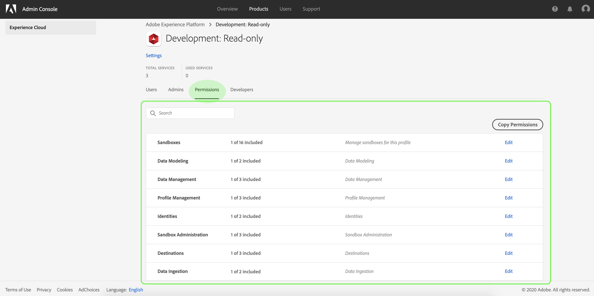

# Access control in Adobe Experience Platform

Access control for Experience Platform is provided through the [Adobe Admin Console](https://adminconsole.adobe.com). This functionality leverages product profiles in Admin Console, which link users with permissions and sandboxes.

This document serves as an overview of access control in Experience Platform and covers the following topics:

* [Access control hierarchy and workflow](#access-control-hierarchy-and-workflow)
* [Adobe Admin Console](#adobe-admin-console)
    * [Product profiles](#product-profiles)
    * [Default product profiles](#default-product-profiles)
* [Sandboxes and permissions](#sandboxes-and-permissions)

## Access control hierarchy and workflow

In order to configure access control for Experience Platform, you must have administrator privileges for an organization that has an Experience Platform product integration. The minimum role that grant or withdraw permissions is a **product profile administrator**. Other administrator roles that can manage permissions are **product administrators** (can manage all profiles within a product) and **system administrators** (no restrictions). See the Adobe Help Center article on [administrative roles](https://helpx.adobe.com/enterprise/using/admin-roles.html) for more information.

> **Note:** From this point on, any mentions of "administrator" in this document refer to a product profile administrator or higher (as outlined above).

A high-level workflow for gaining and assigning access permissions can be summarized as follows:

1. After subscribing to Adobe Experience Platform, an email is sent to the administrator specified in the registration form.
1. The administrator logs in to [Adobe Admin Console](#adobe-admin-console) and selects **Adobe Experience Platform** from the list of products on the overview page.
1. The administrator can view the default [product profiles](#product-profiles) or create new customer product profiles as needed.
1. The administrator can edit the permissions and users for any existing product profiles.
1. When creating or editing a product profile, the administrator adds users to the profile using the **users** tab, and grants permissions to these users (such as "Read Datasets" or "Manage Schemas") by accessing the **permissions** tab. Similarly, the administrator can assign access to sandboxes using the same permissions tab.
1. When users log in to the Experience Platform user interface, their access to Platform capabilities is driven by the permissions that have been granted to them from Step 2. For example, if a user does not have the "View Datasets" permission, the _Datasets_ tab in the side menu will not be visible to that user.

For more detailed steps on how to manage access control in Experience Platform, see the [access control user guide](access-control-user-guide.md). 

All calls to Experience Platform APIs are validated for permissions, and will return errors if the appropriate permission(s) are not found in the current user context. Within the UI, elements will be hidden or altered depending on permissions granted to the current user.

## Adobe Admin Console

Adobe Admin Console provides a central location for managing Adobe product entitlements and access for your organization. Through the console, you can grant groups of users access permissions for various Platform capabilities, such as "Manage Datasets", "View Datasets", or "Manage Profiles".

### Product profiles

In the Admin Console, permissions are assigned to users through the use of **product profiles**. Product profiles allow you to grant permissions to one or multiple users, and also contain their access to the scope of the sandboxes that are assigned to them through product profiles. Users can be assigned to one or multiple product profiles belonging to your organization.

### Default product profiles

Experience Platform comes with two pre-configured default product profiles. The following table outlines what is provided in each default profile, including the sandbox they grant access to as well as the permissions they grant within the scope of that sandbox.

Product profile | Sandbox access | Permissions
--- | --- | ---
Default Production - All Access | Production | All permissions applicable to Experience Platform, except for Sandbox Administration permissions.
Default Sandbox Administration | N/A | Provides access only to Sandbox Administration permissions.

## Sandboxes and permissions

Experience Platform provides access to one Production sandbox, and allows you to create Non-Production **sandboxes**. Non-Production sandboxes are a form of data virtualization that allow you to isolate data from other sandboxes and are typically used for development experiments, testing, or trials. A product profile's **permissions** give the profile's users access to Platform features within the sandbox environments to which they've been granted access to.

For more information about sandboxes in Experience Platform, please refer to the [sandboxes overview](../sandboxes/sandboxes-overview.md).

### Access to sandboxes

Access to sandboxes is managed through product profiles. For detailed steps on how to enable access to a sandbox for a product profile, see the [access control user guide](access-control-user-guide.md).

Users can be granted access to one or more sandboxes within a product profile. If one user is included in two or more product profiles, that user will have access to all sandboxes included in those profiles.

The "Sandbox Management" permission allows users to manage, view, or reset sandboxes.

### Permissions

The **permissions** tab within a product profile displays the sandboxes and permissions that are active for that profile:

Permissions that are granted through the Admin Console are sorted by category, with some permissions granting access to several low-level functionalities.

The following table outlines the available permissions for Experience Platform in the Admin Console, with descriptions of the specific Platform capabilities they grant access to. For detailed steps on how to add permissions to a product profile, see the [access control user guide](access-control-user-guide.md).

Category | Permission | Description 
--- | --- | ---
Data Modeling | Manage Schemas | Access to read, create, edit, and delete schemas and related resources.
Data Modeling | View Schemas | Read-only access to schemas and related resources.
Data Management | Manage Datasets | Access to read, create, edit, and delete datasets. Read-only access for schemas.
Data Management | View Datasets | Read-only access for datasets and schemas.
Profile Management | Manage Profiles | Access to read, create, edit, and delete datasets that are used for customer profiles. Read-only access to available profiles.
Profile Management | View Profiles | Read-only access to available profiles.
Profile Management | Export Audience for Segment | Ability to export an evaluated audience segment to a dataset.
Identities | Manage Identity Namespaces | Access to read, create, edit, and delete identity namespaces.
Identities | View Identity Namespaces | Read-only access for identity namespaces.
Data Monitoring | View Monitoring Dashboard | Read-only access to monitoring datasets and streams.
Sandbox Administration | Manage Sandboxes | Access to read, create, edit, and delete sandboxes.
Sandbox Administration | View Sandboxes | Read-only access for sandboxes belonging to your organization.
Sandbox Administration | Reset a Sandbox | Ability to reset a sandbox.

## Next steps

By reading this guide, you have been introduced to the main principles of access control in Experience Platform. You can now continue to the [access control user guide](access-control-user-guide.md) for detailed steps on how use the Admin Console to create product profiles and assign permissions for Platform.