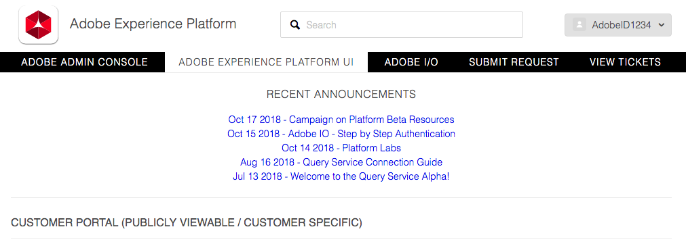
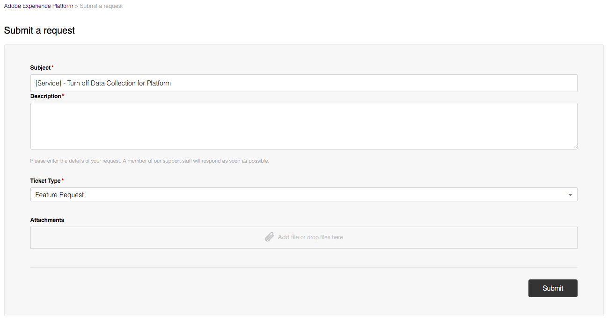

# Adobe Solutions Connector

This document provides information about how to turn on or off Solution Data on Adobe Experience Platform for:
  - [Adobe Analytics](#adobe-analytics)
  - [Adobe Audience Manager](#adobe-audience-manager)
  - [Adobe Advertising Cloud](#adobe-advertising-cloud)
  - [Adobe Campaign](#adobe-campaign)
  - [Adobe Target](#adobe-target)

 
## Adobe Analytics

To turn on or off any report suite data on Platform, you will need to [file a Zendesk ticket](#filing-a-zendesk-ticket) to request the change. 

Please include the following information in your Zendesk ticket.
- Report Suite ID
- Login Company
- Backfill Period
- IMS Organization

## Adobe Audience Manager

To turn on or off any data collected by Audience Manager on Platform, you will need to [file a Zendesk ticket](#filing-a-zendesk-ticket) to request the change. 

Please include your IMS Organization in your Zendesk ticket.

## Adobe Advertising Cloud

To turn on or off any data collected by Advertising Cloud on Platform, you will need to [file a Zendesk ticket](#filing-a-zendesk-ticket) to request the change. 

Please include your IMS Organization in your Zendesk ticket.

## Adobe Campaign

You can use Campaign UI to turn on or off any data collected by Campaign on Platform. Please see the [Data Mapping][datamapping] documentation for more information. 

## Adobe Target

To turn on or off any data collected by Target on Platform, you will need to [file a Zendesk ticket](#filing-a-zendesk-ticket) to request the change. 

Please include your IMS Organization in your Zendesk ticket.

> **Note:** Target data is automatically turned on after set up. 

### Filing a Zendesk ticket

_Prerequisite:_ A valid Adobe account. 

1. Log in to [Zendesk][Zendesk] using your Adobe account.
2. Select **Submit Request** 

3. Enter your subject, description, ticket type, and any additional attachments to the form.

    

    Where:
    - Subject: add the service and action you would like performed.
    - Description: provide your IMS Organization and other Solution Data information
    - Ticket Type: 'Feature Request'
    - Attachments: additional information to be included. 

4. Submit the form once completed. 

[datamapping]: https://docs.adobe.com/content/help/en/campaign/prerelease/administration/datamapping.html
[Zendesk]: https://adobeexperienceplatform.zendesk.com/hc/en-us