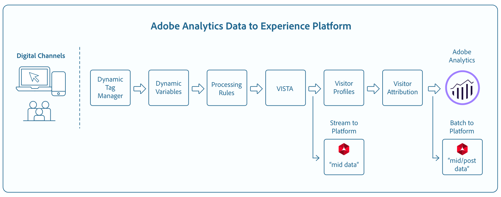

# Analytics Data Connector (ADC)

Adobe Experience Platform allows you to ingest Adobe Analytics data through the Analytics Data Connector (ADC). ADC streams data collected by Adobe Analytics to Platform in real time. The connector also converts SCDS-formated Analytics data into Experience Data Model (XDM) for consumption by Platform.

This document provides an overview of Adobe Analytics and describes the use-cases for Analytics data.

## Adobe Analytics and Analytics data

Adobe Analytics is a powerful engine to help you learn more about your customers, how they interact with your web properties, see where your digital marketing spend is effective, and identify areas of improvement. Adobe Analytics handles trillions of web-transactions per year and ADC allows you to easily tap into this rich behavioral data and enrich the Real-time Customer Profile in a matter of minutes.

At a high level, Adobe Analytics collect data from various digital channels and multiple data centers around the world. Once the data is collected, VISTA and processing rules are applied to shape the incoming data. After raw data has gone through this lightweight processing, it is then considered mid-data and is ready for consumption by the Real-time Customer Profile. In a process parallel to the aforementioned, the same processed data is micro-batched and ingested into Platform datasets for consumption by Data Science Workspace, Query Service, and other data-discovery applications.

## Experience Data Model (XDM)

XDM is a publicly documented specification that provides common structures and definitions for an application to use to communicate with services on Adobe Experience Platform. 

Adhering to XDM standards allows data to be uniformly incorporated, making it easier to deliver data and gather information.

For more information about XDM, check out how [XDM is used in Adobe Experience Platform][xdm].

## How are fields mapped from Adobe Analytics to XDM?

When a connection is established for bringing in Analytics data using Platform UI, data fields are automatically mapped and ingested into Real-time Customer Profile within minutes. For instructions on creating a connection with Adobe Analytics using the Platform UI, see the [Analytics data connector tutorial](../../tutorials/sources_tutorial/adobe-analytics-ui-tutorial.md).

## What is the expected latency for Analytics Data on Platform?

| Analytics Data | Latency | 
| --- | --- | 
| Streaming (mid) | <5 minutes.* | 
| Batch (mid & post) | 60-120 minutes.* | 
| Backfill data - 13 Months of Data or 10 Billion events (whichever is lower) | 4 weeks. |

> __*Note:__ Latency will vary depending on customer configuration, data volumes, and consumer applications. For example, if the Analytics implementation is configured with `A4T` the latency to Pipeline will increase to 5-10 minutes.

[xdm]: ../schema_registry/xdm_system/xdm_system_in_experience_platform.md