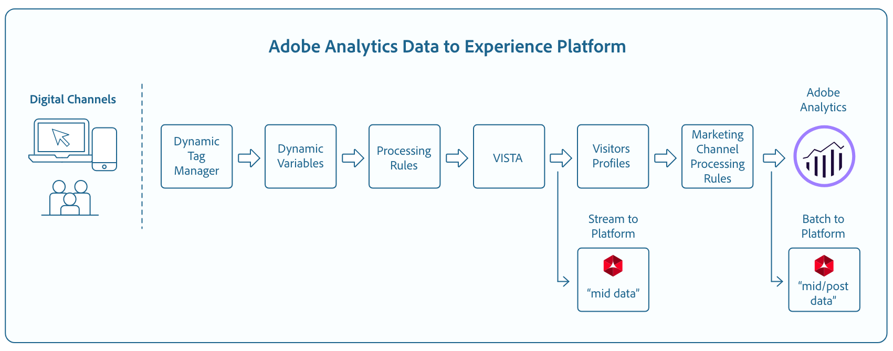

# Mapping Fields

## Direct Mapping Fields

These fields are directly mapped as is from Analytics to Experience Data Model (XDM).

### Midvalues vs Postvalues Datasets

When Adobe Analytics report suites publish to Adobe Experience Platofrm, it publishes to **two** separate datasets - midvalues and postvalues.

Midvalues data has data processing applied, but no attribution. Typically, these fields start with the prefix `m_`.

Postvalues data has additional processing applied, including attribution and visit based fields. Typically, these fields start with the prefix `post_`.

> **Note:** This table includes the following columns: "Analytics Field", "XDM Field", "XDM Type", "Dataset", "Description", and "Properties". Please scroll left/right to view the full contents of this table.

Analytics Field | XDM Field | XDM Type | Dataset | Description | Properties
--------------- | --------- | -------- | ------- | ---------- | ---------
m_evar1 - m_evar250 | _experience.analytics.customDimensions.eVars.eVar1 - _experience.analytics.customDimensions.eVars.eVar250 | string | mid | A custom variable, which can range from 1-250. Each organization will use these custom eVars differently.
m_prop1 - m_prop75 | _experience.analytics.customDimensions.props.prop1 - _experience.analytics.customDimensions.props.prop75 | string | mid | Custom traffic variables, which can range from 1-75.
m_browser | _experience.analytics.environment.browserID	| integer | mid | The number ID of the browser. 
m_browser_height | environment.browserDetails.viewportHeight | integer | mid | The height of the browser, in pixels.
m_browser_width | environment.browserDetails.viewportWidth | integer | mid | The width of the browser, in pixels.
m_campaign | marketing.trackingCode | string | mid | The variable used in the Tracking Code dimension.
m_channel | web.webPageDetails.siteSection | string | mid | The variable used in the Site Sections dimension.
m_domain | environment.domain | string | mid | The variable used in the Domain dimension. This will be based on the user's internet service provider (ISP).
m_geo_city | placeContext.geo.city | string | mid | The name of the city of the hit. This is based off of the hit's IP address.
m_geo_dma | placeContext.geo.dmaID | integer | mid | The numeric ID of the demographic area for the hit. This is based off of the hit's IP address.
m_geo_region | placeContext.geo.stateProvince | string | mid | The name of either the state or region of the hit. This is based off of the hit's IP address.
m_geo_zip | placeContext.geo.postalCode | string | mid | The ZIP code of the hit. This is based off of the hit's IP address.
m_keywords | search.keywords | string | mid | The variable used in the Keyword dimension.
m_os | _experience.analytics.environment.operatingSystemID | integer | mid | The numeric ID representing the operating system of the visitor. This is based on the user_agent column.
m_page_url | web.webPageDetails.URL | string | mid | The URL of the page hit. 
m_pagename_no_url | web.webPageDetails.name | string | mid | A variable used to populate the Pages dimension.
m_referrer | web.webReferrer.URL | string | mid | The Page URL of the previous page.
m_search_page_num | search.pageDepth | integer | mid | Used by the All Search Page Rank dimension. Indicates which page of search results your site appeared on before the user clicked through to your site. 
m_state | _experience.analytics.customDimensions.stateProvince | string | mid | State variable.
m_user_server | web.webPageDetails.server | string | mid | A variable used in the Server dimension.
m_zip | _experience.analytics.customDimensions.postalCode | string | mid | A variable used to populate the Zip Code dimension.
post_evar1 - post_evar250 | _experience.analytics.customDimensions.eVars.eVar1 - _experience.analytics.customDimensions.eVars.eVar250 | string | post | A custom variable, which can range from 1-250. Each organization will use these custom eVars differently.
post_prop1 - post_prop75 | _experience.analytics.customDimensions.props.prop1 - _experience.analytics.customDimensions.props.prop75	| string | post | Custom traffic variables, which can range from 1-75.
post_browser_height | environment.browserDetails.viewportHeight	| integer | post | The height of the browser, in pixels.
post_browser_width | environment.browserDetails.viewportWidth | integer | post | The width of the browser, in pixels.
post_campaign | marketing.trackingCode | string | post | The variable used in the Tracking Code dimension.
post_channel | web.webPageDetails.siteSection | string | post | The variable used in the Site Sections dimension.
post_cust_visid | endUserIDs._experience.aacustomid.id | string | mid,post |  The custom visitor ID, if set.
post_first_hit_page_url | _experience.analytics.endUser.firstWeb.webPageDetails.URL	| string | post | The URL of the first page the visitor reaches.
post_first_hit_pagename	| _experience.analytics.endUser.firstWeb.webPageDetails.name | string | post | A variable used in the Entry Page Original dimension. The page name of the entry page of the visitor.
post_keywords | search.keywords | string | post | The keywords that were collected for the hit.
post_page_url | web.webPageDetails.URL | string | post | The URL of the page hit.
post_pagename_no_url | web.webPageDetails.name | string | post | A variable used to populate the Pages dimension.
post_purchaseid | commerce.order.purchaseID | string | mid,post | Variable that is used to uniquely identify purchases.
post_referrer | web.webReferrer.URL | string | post | The URL of the previous page.
post_state | _experience.analytics.customDimensions.stateProvince | string | post | State variable.
post_user_server | web.webPageDetails.server | string | post | A variable used in the Server dimension.
post_zip | 	_experience.analytics.customDimensions.postalCode | string | post | A variable used to populate the Zip Code dimension.
accept_language | environment.browserDetails.acceptLanguage | string | mid,post | Lists all the accepted languages, as indicated in the Accept-Language HTTP header.
browser | _experience.analytics.environment.browserID | integer | post | The numeric ID of the browser.
domain | environment.domain | string | post | The variable used in the Domain dimension. This will be based on the user's internet service provider (ISP).
first_hit_referrer | _experience.analytics.endUser.firstWeb.webReferrer.URL | string | post | The first referring URL for the visitor. 
geo_city | placeContext.geo.city | string | post | The name of the city of the hit. This is based off of the hit's IP address. 
geo_dma | placeContext.geo.dmaID | integer | post | The numeric ID of the demographic area for the hit. This is based off of the hit's IP address. 
geo_region | placeContext.geo.stateProvince | string | post | The name of either the state or region of the hit. This is based off of the hit's IP address. 
geo_zip | placeContext.geo.postalCode | string | post | The ZIP code of the hit. This is based off of the hit's IP address. 
ipv6 | environment.ipV6 | string | mid,post | <No idea what this one is.> 
j_jscript | environment.browserDetails.javaScriptVersion | string | mid,post | The vesrion of JavaScript supported by the browser. 
os | _experience.analytics.environment.operatingSystemID | integer | post | The numeric ID representing the operating system of the visitor. This is based on the user_agent column. 
search_page_num | search.pageDepth | integer | post | This variable is used by the All Search Page Rank dimension, and indicates which page of search results your site appeared on before the user clicked through to your site. 
user_agent | environment.browserDetails.userAgent | string | mid,post | The user agent string sent in the HTTP header. 
visit_keywords | _experience.analytics.session.search.keywords | string | post | A variable used in the Search Keywords dimension. 
visit_num | _experience.analytics.session.num | integer | post | A variable used in the Visit Number dimension. This starts at 1, and increments each time a new visit starts (per user). 
visit_page_num | _experience.analytics.session.depth | integer | post | A variable used in the Hit Depth dimension. This value increases by 1 for each hit the user generates, and resets after each visit. 
visit_referrer | _experience.analytics.session.web.webReferrer.URL | string | post | The first referrer of the visit. 
visit_search_page_num | _experience.analytics.session.search.pageDepth | integer | post | The first Page Name of the visit. 
mobileappid | application.name | string | mid,post | The mobile app ID, stored in the following format: \[AppName]\[BundleVersion]. 
mobiledevice | device.model | string | mid,post | The name of the mobile device. On iOS, it is stored as a comma-separated 2-digit string. The first number represents the device generation and the second number represents the device family. 
pointofinterest | placeContext.POIinteraction.POIDetail.name | string | mid,post | Used by mobile services. Represents the point of interest. 
pointofinterestdistance | placeContext.POIinteraction.POIDetail.geoInteractionDetails.distanceToCenter | number | mid,post | Used by mobile services. Represents the point of interest distance. 
mobileplaceaccuracy | placeContext.POIinteraction.POIDetail.geoInteractionDetails.deviceGeoAccuracy | number | mid,post | Collected from the context data variable a.loc.acc. Indicates the accuracy of the GPS in meters at time of collection.
mobileplacecategory | placeContext.POIinteraction.POIDetail.category | string | mid,post | Collected from the context data variable a.loc.category. Describes the category of a specific place.
mobileplaceid | placeContext.POIinteraction.POIDetail.POIID | string | mid,post | Collected from the context data variable a.loc.id. Identifier for a given point of interest.
video | media.mediaTimed.primaryAssetReference._id | string | mid,post | The name of the video. 
videoad | advertising.adAssetReference._id | string | mid,post | Identifier of the ad asset. 
videocontenttype | media.mediaTimed.primaryAssetViewDetails.broadcastContentType | string | mid,post | The Video Content-Type. This is automatically set to "Video" for all video views. 
videoadpod | advertising.adAssetViewDetails.adBreak._id | string | mid,post | The pod which the Video Ad is in. 
videoadinpod | advertising.adAssetViewDetails.index | integer | mid,post | The position the Video Ad is in the pod. 
videoplayername | media.mediaTimed.primaryAssetViewDetails.playerName | string | mid,post | The name of the Video player.
videochannel | media.mediaTimed.primaryAssetViewDetails.broadcastChannel | string | mid,post | The Video channel.
videoadplayername | advertising.adAssetViewDetails.playerName | string | mid,post | The name of the Video Ad player.
videochapter | media.mediaTimed.mediaChapter.chapterAssetReference._id | string | mid,post | The Video chapter's name 
videoname | media.mediaTimed.primaryAssetReference._dc.title | string | mid,post | The Video name. 
videoadname | advertising.adAssetReference._dc.title | string | mid,post | The name of the Video Ad.
videoshow | media.mediaTimed.primaryAssetReference._iptc4xmpExt.Series._iptc4xmpExt.Name | string | mid,post | Video show.
videoseason | media.mediaTimed.primaryAssetReference._iptc4xmpExt.Season._iptc4xmpExt.Name | string | mid,post | Video Season.
videoepisode | media.mediaTimed.primaryAssetReference._iptc4xmpExt.Episode._iptc4xmpExt.Name | string | mid,post | Video episode.
videonetwork | media.mediaTimed.primaryAssetViewDetails.broadcastNetwork | string | mid,post | Video network.
videoshowtype | media.mediaTimed.primaryAssetReference.showType | string | mid,post | Video show type. 
videoadload | media.mediaTimed.primaryAssetViewDetails.adLoadType | string | mid,post | Video ad loads. 
videofeedtype | media.mediaTimed.primaryAssetViewDetails.sourceFeed | string | mid,post | Video feed type.
mobilebeaconmajor | placeContext.POIinteraction.POIDetail.beaconInteractionDetails.beaconMajor | number | mid,post | Mobile Services beacon major.
mobilebeaconminor | placeContext.POIinteraction.POIDetail.beaconInteractionDetails.beaconMinor | number | mid,post | Mobile Services beacon minor.
mobilebeaconuuid | placeContext.POIinteraction.POIDetail.beaconInteractionDetails.proximityUUID | string | mid,post | Mobile Services beacon UUID
videosessionid | media.mediaTimed.primaryAssetViewDetails._id | string | mid,post | Video session ID.
videogenre | media.mediaTimed.primaryAssetReference._iptc4xmpExt.Genre | array | mid,post | Video genre. | {title (Object), description (Object), type (Object), meta:xdmType (Object), items (string), meta:xdmField (Object)} 
mobileinstalls | application.firstLaunches | Object | mid,post | This is triggered at the first run after installation or re-installation | {id (string), value (number)} 
mobileupgrades | application.upgrades | Object | mid,post | Reports the number of app upgrades. Triggers at the first run after upgrade or any time the version number changes. | {id (string), value (number)} 
mobilelaunches | application.launches | Object | mid,post | The number of times the app has been launched. | {id (string), value (number)} 
mobilecrashes | application.crashes | Object | mid,post | <!-- MISSING --> | {id (string), value (number)} 
mobilemessageclicks | directMarketing.clicks | Object | mid,post | <!-- MISSING --> | {id (string), value (number)} 
mobileplaceentry | placeContext.POIinteraction.poiEntries | Object | mid,post | <!-- MISSING --> | {id (string), value (number)} 
mobileplaceexit | placeContext.POIinteraction.poiExits | Object | mid,post | <!-- MISSING --> | {id (string), value (number)} 
videotime | media.mediaTimed.timePlayed | Object | mid,post | <!-- MISSING --> | {id (string), value (number)} 
videostart | media.mediaTimed.impressions | Object | mid,post | <!-- MISSING --> | {id (string), value (number)} 
videocomplete | media.mediaTimed.completes | Object | mid,post | <!-- MISSING --> | {id (string), value (number)} 
videosegmentviews | media.mediaTimed.mediaSegmentViews | Object | mid,post | <!-- MISSING --> | {id (string), value (number)} 
videoadstart | advertising.impressions | Object | mid,post | <!-- MISSING --> | {id (string), value (number)} 
videoadcomplete | advertising.completes | Object | mid,post | <!-- MISSING --> | {id (string), value (number)} 
videoadtime | advertising.timePlayed | Object | mid,post | <!-- MISSING --> | {id (string), value (number)} 
videochapterstart | media.mediaTimed.mediaChapter.impressions | Object | mid,post | <!-- MISSING --> | {id (string), value (number)} 
videochaptercomplete | media.mediaTimed.mediaChapter.completes | Object | mid,post | <!-- MISSING --> | {id (string), value (number)} 
videochaptertime | media.mediaTimed.mediaChapter.timePlayed | Object | mid,post | <!-- MISSING --> | {id (string), value (number)} 
videoplay | media.mediaTimed.starts | Object | mid,post | <!-- MISSING --> | {id (string), value (number)} 
videototaltime | media.mediaTimed.totalTimePlayed | Object | mid,post | <!-- MISSING --> | {id (string), value (number)} 
videoqoetimetostart | media.mediaTimed.primaryAssetViewDetails.qoe.timeToStart | Object | mid,post | The video quality time to start. | {id (string), value (number)} 
videoqoedropbeforestart | media.mediaTimed.dropBeforeStarts | Object | mid,post | <!-- MISSING --> | {id (string), value (number)} 
videoqoebuffercount | media.mediaTimed.primaryAssetViewDetails.qoe.buffers | Object | mid,post | Video quality buffer count | {id (string), value (number)} 
videoqoebuffertime | media.mediaTimed.primaryAssetViewDetails.qoe.bufferTime | Object | mid,post | Video quality buffer time | {id (string), value (number)} 
videoqoebitratechangecount | media.mediaTimed.primaryAssetViewDetails.qoe.bitrateChanges | Object | mid,post | Video quality change count | {id (string), value (number)} 
videoqoebitrateaverage | media.mediaTimed.primaryAssetViewDetails.qoe.bitrateAverage | Object | mid,post | Video quality average bit rate | {id (string), value (number)} 
videoqoeerrorcount | media.mediaTimed.primaryAssetViewDetails.qoe.errors | Object | mid,post | Video quality error count | {id (string), value (number)} 
videoqoedroppedframecount | media.mediaTimed.primaryAssetViewDetails.qoe.droppedFrames | Object | mid,post | {id (string), value (number)} 
videoprogress10 | media.mediaTimed.progress10 | Object | mid,post | <!-- MISSING --> | {id (string), value (number)} 
videoprogress25 | media.mediaTimed.progress25 | Object | mid,post | <!-- MISSING --> | {id (string), value (number)} 
videoprogress50 | media.mediaTimed.progress50 | Object | mid,post | <!-- MISSING --> | {id (string), value (number)} 
videoprogress75 | media.mediaTimed.progress75 | Object | mid,post | <!-- MISSING --> | {id (string), value (number)} 
videoprogress95 | media.mediaTimed.progress95 | Object | mid,post | <!-- MISSING --> | {id (string), value (number)} 
videoresume | media.mediaTimed.resumes | Object | mid,post | <!-- MISSING --> | {id (string), value (number)} 
videopausecount | media.mediaTimed.pauses | Object | mid,post | <!-- MISSING --> | {id (string), value (number)} 
videopausetime | media.mediaTimed.pauseTime | Object | mid,post | <!-- MISSING -->| {id (string), value (number)} 
videosecondssincelastcall | media.mediaTimed.primaryAssetViewDetails.sessionTimeout | integer | mid,post | <!-- MISSING --> 

### Split Mapping

These fields have a single source and map to **multiple** XDM locations.

Analytics Field | XDM Field | XDM Type | Dataset | Description
--------------- | --------- | -------- | ------- | ----------
s_resolution | device.screenWidth, device.screenHeight | integer | mid,post | Numeric ID representing the resolution of the monitor.
mobileosversion | environment.operatingSystem, environment.operatingSystemVersion | string | mid,post | Mobile operating system version.
videoadlength | advertising.adAssetReference._xmpDM.duration | integer | mid,post | Video Ad length

### Generated Mapping Fields

These fields need to be transformed, and require logic beyond a direct copy from Adobe Analytics to be generated into Experience Data Model (XDM).

> **Note:** This table includes the following columns: "Analytics Field", "XDM Field", "XDM Type", "Dataset", "Description", and "Properties". Please scroll left/right to view the full contents of this table.

Analytics Field | XDM Field | XDM Type | Dataset | Description | Properties 
--------------- | --------- | -------- | ------- | ----------- | ----------
m_prop1 - m_prop75 | _experience.analytics.customDimensions.listprops.prop1 - _experience.analytics.customDimensions.listprops.prop75 | Object | mid | Custom traffic variables, ranging from 1-75 | {} 
m_hier1 - m_hier5 | _experience.analytics.customDimensions.hierarchies.hier1 - _experience.analytics.customDimensions.hierarchies.hier5 | Object | mid | Used by hierarchy variables. It contains a delimited llist of values. | {values (array), delimiter (string)} 
m_mvvar1 - m_mvvar3 | _experience.analytics.customDimensions.lists.list1.list[] - _experience.analytics.customDimensions.lists.list3.list[] | array | mid | List of variable values. Contains a delimited list of custom values, depending on the implementation | {value (string), key (string)} 
m_color | device.colorDepth | integer | mid | The color depth ID, which is based off of the value of the c_color column. | 
m_cookies | environment.browserDetails.cookiesEnabled | boolean | mid | A variable used in the Cookie Support dimension. 
m_event_list | commerce.purchases, commerce.productViews, commerce.productListOpens, commerce.checkouts, commerce.productListAdds, commerce.productListRemovals, commerce.productListViews | Object | mid | Standard commerce events triggered on the hit.| {id (string), value (number)} 
m_event_list | _experience.analytics.event1to100.event1 - _experience.analytics.event1to100.event100, _experience.analytics.event101to200.event101 - _experience.analytics.event101to200.event200, _experience.analytics.event201to300.event201 - _experience.analytics.event201to300.event300, _experience.analytics.event301to400.event301 - _experience.analytics.event301to400.event400, _experience.analytics.event401to500.event401 - _experience.analytics.event401to500.event500, _experience.analytics.event501to600.event501 - _experience.analytics.event501to600.event600, _experience.analytics.event601to700.event601 - _experience.analytics.event601to700.event700, _experience.analytics.event701to800.event701 - _experience.analytics.event701to800.event800, _experience.analytics.event801to900.event801 - _experience.analytics.event801to900.event900, _experience.analytics.event901to1000.event901 - _experience.analytics.event901to1000.event1000 | Object | mid | Custom events triggered on the hit. | {id (Object), value (Object)} 
m_geo_country | placeContext.geo.countryCode | string | mid | Abbreviation of the country where the hit came from, which is based off of the IP. 
m_geo_latitude | placeContext.geo._schema.latitude | number | mid | <!-- MISSING --> 
m_geo_longitude | placeContext.geo._schema.longitude | number | mid | <!-- MISSING -->
m_java_enabled | environment.browserDetails.javaEnabled | boolean | mid | A flag indicating whether Java is enabled. 
m_latitude | placeContext.geo._schema.latitude | number | mid | <!-- MISSING --> 
m_longitude | placeContext.geo._schema.longitude | number | mid | <!-- MISSING -->
m_page_event_var1 | web.webInteraction.URL | string | mid | A variable that is only used in link tracking image requests. This variable contains the URL of the download link, exit link, or custom link clicked. 
m_page_event_var2 | web.webInteraction.name | string | mid | A variable that is only used in link tracking image requests. This lists the custom name of the link, if it is specified. 
m_page_type | web.webPageDetails.isErrorPage | boolean | mid | A variable that is used to populate the Pages Not Found dimension. This variable should either be empty, or contain "ErrorPage". 
m_pagename_no_url | web.webPageDetails.pageViews.value | number | mid | The name of the page (if set). If no page is specified this value is left empty.
m_paid_search | search.isPaid | boolean | mid | A flag that is set if the hit matches paid search detection. 
m_product_list | productListItems[].items | array | mid | The product list, as passed in through the products variable. | {SKU (string), quantity (integer), priceTotal (number)} 
m_ref_type | web.webReferrer.type | string | mid | A numeric ID representing the type of referral for the hit. 1 means inside your site, 2 means other websites, 3 means search engines, 4 means hard drive, 5 means USENET, 6 means Typed/Bookmarked (no referrer), 7 means email, 8 means No JavaScript, and 9 means Social Networks. 
m_search_engine | search.searchEngine | string | mid | The numeric ID representing the search engine that referred the visitor to your site. 
post_prop1 - post_prop75 | _experience.analytics.customDimensions.listprops.prop1 - _experience.analytics.customDimensions.listprops.prop75 | Object | post | Custom traffic variables 1-75.
post_hier1 - post_hier5 | _experience.analytics.customDimensions.hierarchies.hier1 - _experience.analytics.customDimensions.hierarchies.hier5 | Object | post | Ussed by hierarchy variables and contains a delimited list of values. | {values (array), delimiter (string)} 
post_mvvar1 - post_mvvar3 | _experience.analytics.customDimensions.lists.list1.list[] - _experience.analytics.customDimensions.lists.list3.list[] | array | post | A list of variable values. Contains a delimited list of custom values, depending on implementation. | {value (string), key (string)} 
post_cookies | environment.browserDetails.cookiesEnabled | boolean | post | Variable used in the Cookie Support dimension. 
post_currency | commerce.order.currencyCode | string | mid,post | The currency code that was used during the transaction. 
post_cust_hit_time_gmt | timestamp | string | mid,post | This is only used in timestamp-enabled datasets. This is the timestamp sent with the it, based on Unix time. 
post_cust_visid | identityMap | object | mid,post | The customer visitor ID. 
post_cust_visid | endUserIDs._experience.aacustomid.primary | boolean | mid,post | The customer visitor ID. 
post_cust_visid | endUserIDs._experience.aacustomid.namespace.code | string | mid,post | The customer visitor ID.  
post_event_list | commerce.purchases, commerce.productViews, commerce.productListOpens, commerce.checkouts, commerce.productListAdds, commerce.productListRemovals, commerce.productListViews | Object | post | Standard commerce events triggered on the hit. | {id (string), value (number)} 
post_event_list | _experience.analytics.event1to100.event1 - _experience.analytics.event1to100.event100, _experience.analytics.event101to200.event101 - _experience.analytics.event101to200.event200, _experience.analytics.event201to300.event201 - _experience.analytics.event201to300.event300, _experience.analytics.event301to400.event301 - _experience.analytics.event301to400.event400, _experience.analytics.event401to500.event401 - _experience.analytics.event401to500.event500, _experience.analytics.event501to600.event501 - _experience.analytics.event501to600.event600, _experience.analytics.event601to700.event601 - _experience.analytics.event601to700.event700, _experience.analytics.event701to800.event701 - _experience.analytics.event701to800.event800, _experience.analytics.event801to900.event801 - _experience.analytics.event801to900.event900, _experience.analytics.event901to1000.event901 - _experience.analytics.event901to1000.event1000 | Object | post | Custom events triggered on the hit.| {id (Object), value (Object)} 
post_java_enabled | environment.browserDetails.javaEnabled | boolean | post | A flag indicating whether Java is enabled. 
post_latitude | placeContext.geo._schema.latitude | number | post | <!-- MISSING --> 
post_longitude | placeContext.geo._schema.longitude | number | post | <!-- MISSING --> 
post_page_event | web.webInteraction.type | string | mid,post | The type of hit that is sent in the image request (standard hit, download link, exit link, or custom link clicked). 
post_page_event | web.webInteraction.linkClicks.value | number | mid,post | The type of hit that is sent in the image request (standard hit, download link, exit link, or custom link clicked).  
post_page_event_var1 | web.webInteraction.URL | string | post | This variable is only used in link tracking image requests. This is the URL of the donwload link, exit link, or custom link clicked. 
post_page_event_var2 | web.webInteraction.name | string | post | This variable is only used in link tracking image requests. This will be the custom name of the link. 
post_page_type | web.webPageDetails.isErrorPage | boolean | post | This is used to populate the Pages Not Found dimension. This variable should either be empty or contain "ErrorPage" 
post_pagename_no_url | web.webPageDetails.pageViews.value | number | post | The name of the page (if set). If no page is specified this value is left empty.
post_product_list | productListItems[].items | array | post | The product list, as passed in through the products variable. | {SKU (string), quantity (integer), priceTotal (number)} 
post_search_engine | search.searchEngine | string | post | The numeric ID representing the search engine that referred the visitor to your site. 
post_visid_high + visid_low | identityMap | object | mid,post | A unique identifier for a visit. 
post_visid_high + visid_low | endUserIDs._experience.aaid.id | string | mid,post | A unique identifier for a visit.  
post_visid_high | endUserIDs._experience.aaid.primary | boolean | mid,post | Used in conjunction with visid_low to uniquely identify a visit. 
post_visid_high | endUserIDs._experience.aaid.namespace.code | string | mid,post | Used in conjunction with visid_low to uniquely identify a visit. 
post_visid_low | identityMap | object | mid,post | Used in conjunction with visid_high to uniquely identify a visit. 
mvvar1_instances | .list.items[] | Object | post | List of variable values. Contains a delimited list of custom values, depending on implementation. 
mvvar2_instances | .list.items[] | Object | post | List of variable values. Contains a delimited list of custom values, depending on implementation.
mvvar3_instances | .list.items[] | Object | post | List of variable values. Contains a delimited list of custom values, depending on implementation. 
color | device.colorDepth | integer | post | Color depth ID, based on the value of the c_color column. 
first_hit_ref_type | _experience.analytics.endUser.firstWeb.webReferrer.type | string | post | The numeric ID, representing the referrer type of the very first referrer of the visitor. 
first_hit_time_gmt | _experience.analytics.endUser.firstTimestamp | integer | post | Timestamp of the very first hit of the visitor in Unix time. 
geo_country | placeContext.geo.countryCode | string | post | Abbreviation of the country the hit came from, based on IP. 
geo_latitude | placeContext.geo._schema.latitude | number | post | <!-- MISSING --> 
geo_longitude | placeContext.geo._schema.longitude | number | post | <!-- MISSING --> 
hit_time_gmt | receivedTimestamp | string | mid,post | The timestamp of the hit, based in Unix time. 
hitid_high + hitid_low | _id | string | mid,post | A unique identifier to identify a hit. 
hitid_low | _id | string | mid,post | Used in conjunction with hitid_high to uniquely identify a hit. 
homepage | web.webPageDetails.isHomePage | boolean | mid,post | No longer used. Indicated if the current URL is the browser's homepage. <!-- If no longer used should this be taken out?> 
ip | environment.ipV4 | string | mid,post | The IP Address, based on the HTTP header of the image request. 
j_jscript | environment.browserDetails.javaScriptEnabled | boolean | mid,post | The version of JavaScript used. 
mcvisid_high + mcvisid_low | identityMap | object | mid,post | The Experience Cloud Visitor ID. 
mcvisid_high + mcvisid_low | endUserIDs._experience.mcid.id | string | mid,post | The Experience Cloud Visitor ID.  
mcvisid_high | endUserIDs._experience.mcid.primary | boolean | mid,post | The Experience Cloud Visitor ID.  
mcvisid_high | endUserIDs._experience.mcid.namespace.code | string | mid,post | The Experience Cloud Visitor ID.  
mcvisid_low | identityMap | object | mid,post | The Experience Cloud Visitor ID.  
paid_search | search.isPaid | boolean | post | A flag that is set if the hit matches paid search detection. 
ref_type | web.webReferrer.type | string | post | A numeric ID representing the type of referral for the hit. 
sdid_high + sdid_low | _experience.target.supplementalDataID | string | mid,post | Hit Stitching ID. The analytics field sdid_high and sdid_low is the supplemental data id used to stitch two (or more) incoming hits together. 
visit_paid_search | _experience.analytics.session.search.isPaid | boolean | post | A flag (1=paid, 0=not paid) indicating if the first hit of the visit was from a paid search hit. 
visit_ref_type | _experience.analytics.session.web.webReferrer.type | string | post | Numeric ID representing the referrer type of the first referrer of the visit. 
visit_search_engine | _experience.analytics.session.search.searchEngine | string | post | Numeric ID of the first search engine of the visit. 
visit_start_time_gmt | _experience.analytics.session.timestamp | integer | post | Timestamp of the first hit of the visit in Unix time. 
mobilebeaconproximity | placeContext.POIinteraction.POIDetail.beaconInteractionDetails.proximity | string | mid,post | Mobile Services beacon proximity.
videochapter | media.mediaTimed.mediaChapter.chapterAssetReference._xmpDM.duration | integer | mid,post | The name of the video chapter. 
videolength | media.mediaTimed.primaryAssetReference._xmpDM.duration | integer | mid,post | The length of the video. 