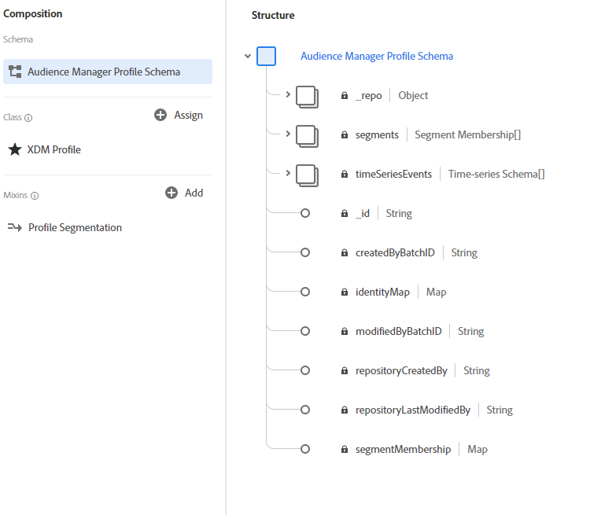

# Adobe Audience Manager data connector

The Adobe Audience Manager data connector streams first party data collected in Adobe Audience Manager to Adobe Experience Platform. The Audience Manager connector ingests three categories of data to Platform:

- **Realtime data:** Data captured in real time on Audience Manager's data collection server. This data is used in Audience Manager to populate rule based traits and will surface in Platform in the shortest latency time. 
- **Onboarded (inbound) data:** These are the files uploaded by a user into an Amazon S3 location hosted by Audience Manager. Audience Manager uses this data to populate onboarded traits using the inbound file method and will have some latency. 
- **Profile data:** Audience Manager uses realtime and onboarded data to derive customer profiles. These profiles are used to populate identity graphs and traits on segment realizations. 

The Audience Manager connector maps these data categories to Experience Data Model (XDM) schema and sends them to Platform. Realtime data and Onboarded data are sent as XDM ExperienceEvent data, while Profile data is sent as XDM Individual Profiles.

## What is Experience Data Model (XDM)?
XDM is a publicly documented specification that provides a standardized framework by which Platform organizes customer experience data.

Adhering to XDM standards allows customer experience data to be uniformly incorporated, making it easier to deliver data and gather information.

For more information about how XDM is used in Experience Platform, see the [XDM Systems overview][xdm]. To learn more about how XDM Schemas like Profile and ExperienceEvent are structured, see the [basics of schema composition][schema-comp].

## XDM schemas examples

Below are examples of the Audience Manager structure mapped to XDM ExperienceEvent and XDM Individual Profile in Platform.

### ExperienceEvent - for Realtime data and Onboarded data

### XDM Individual Profile - for Profile data

## How are fields mapped from Adobe Audience Manager to XDM?
Please see documentation for [Audience Manager mapping fields][audience-manager-mapping-fields] for more information.

## Data management on Platform
You will find Audience Manager data under two data management sections in the UI:
- [Datasets](#datasets)
- [Connections](#connections)

### Datasets	
Datasets are a storage and management construct for a collection of data, typically a table, that contains schema (columns) and fields (rows) and is made available by a data connection. Audience Manager data consists of Realtime data, Inbound data, and Profile data. To locate your Audience Manager datasets, use the search function in the UI with the provided naming conventions for each type of data. 

**Realtime**
The Realtime data lands into a dataset called "**AAM Realtime**".	

**Inbound**	
All Inbound datasets follow the naming convention "**AAM Inbound Dataset {Datasource ID}**". Where the {Datasource ID} is known from the inbound files you upload to S3. Specifically, the ID is the [_DPID_TARGET_DATA_OWNER](https://marketing.adobe.com/resources/help/en_US/aam/inbound-s3-filenames.html).

There is a _meta dataset_ for Inbound with either of the following names:	
- **AAM inbound Meta Dataset**	
- **[Meta - No Data] AAM Inbound**	

These datasets are important for Audience Manager inbound ingestion and contain 0 size batches. Do not delete these meta datasets. 	

**Profile**
In Platform, all the profiles created from CRM data can be found in the dataset "**AAM Profile Dataset userprofile**". All the profiles created from CRMs can be found in the dataset "**AAM Profile Dataset crmprofile {Datasource ID}**". Where the {Datasource id} is the CRM datasource ID. 	

The following _meta datasets_ exist for Profile:	
- **[Meta - No Data] AAM crmprofile**	
- **[Meta - No Data] AAM userprofile**	

These datasets are important for Audience Manager profile ingestion and contain 0 size batches. Do not delete these meta datasets.	

### Connections	

Adobe Audience Manager creates one connection in Catalog: **Audience Manager Connection**. Catalog is the system of the records for data location and lineage within Adobe Experience Platform. A connection is a Catalog object that is a customer-specific instance of Connectors. Please see the [Catalog Service overview][catalog] for more information on Catalog, connections, and connectors. 	

## What is the expected latency for Audience Manager Data on Platform?

| Audience Manager Data | Latency | Notes |
| --- | --- | --- |
| Realtime data | < 35 minutes. | Time from being captured at Realtime node to appearing on Platform Data Lake. |
| Inbound data | < 13 hours | Time from being captured at S3 buckets to appearing on Platform Data Lake. |
| Profile data | < 2 days  | Time from being captured from Realtime/Inbound data to being added to a user profile and finally appearing on Platform Data Lake. | 

[xdm]: ../schema_registry/xdm_system/xdm_system_in_experience_platform.md
[xdm-field-dictionary]: ../schema_registry/schema_composition/xdm_field_dictionary.md
[catalog]: ../catalog_architectural_overview/catalog_architectural_overview.md
[schema-comp]: ../schema_registry/schema_composition/schema_composition.md
[audience-manager-mapping-fields]: audience_manager_mapping_fields.md