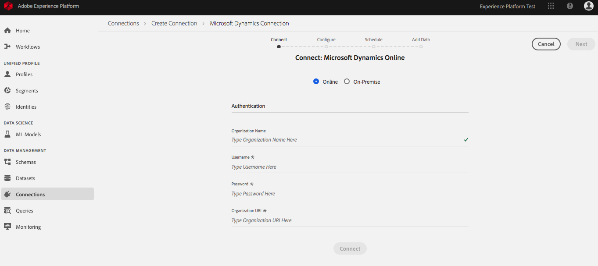
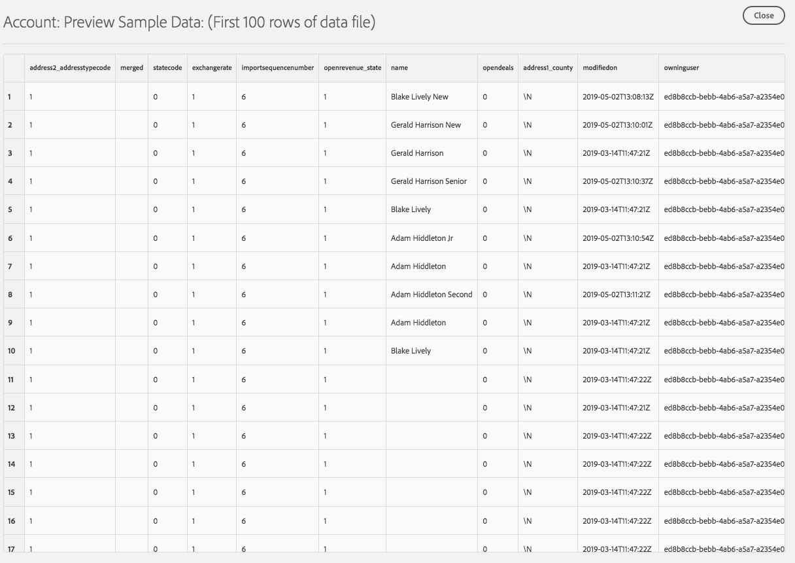

# Data connectors guide

This document will help you set up, configure, and monitor a Salesforce and/or Microsoft Dynamics connector using the user interface within [Adobe Experience Platform](https://platform.adobe.com). 

This tutorial requires you to have an Adobe ID and access to the Adobe Experience Platform UI. 

## Create a new connector
1. Log-in to [Adobe Experience Platform](https://platform.adobe.com/connection/create). 
2. Select **Connections** from the left-navigation. If connections have been made, they will be listed here with Name, Source, and Status. The Connections workspace also includes information regarding the number of connections in your organization, recently updated connections, and composition of connections across sources. 

    

3. To create a new connection, click **Create Connection** in the top-right of the Connections workspace.
4. From here, you can create a **Salesforce Connection** or a **Microsoft Dynamics Connection**. Each connector has its own steps to authenticate and connect to the service, after that, they both follow the same steps of configuration, scheduling, and adding data. In this tutorial, a connection will be made to Microsoft Dynamics. Click on **Microsoft Dynamics Connection** to proceed. 

    

5. Use your Microsoft Dynamics credentials to complete the authentication fields, then click **Connect**. Once the connection is confirmed, click **Next**

    Note: Please contact your system administrator if you need help accessing your oganization credentials. 

6. After authenticating, you can begin configuring your connection. On the **Configure: Microsoft Dynamics Online** screen, give your connection a Name (required) and a description (optional). You can now click **Add Labels** to add Data Governance Labels. For more information about Data Usage Labeling and Enforcment (DULE) and implementing labels at the connection-level, read the [working with data usage labels](../../tutorials/dule/dule_working_with_labels.md) documentation.

    

7. Once configuration has been completed, click **Next**.

> Note: You can not modify this step once you have finished creating your connector.

8. On the **Ingestion Schedule** screen you can set how frequently you want to run data ingestion for this connector and when to start. Once completed, click **Next**.

    

9. You can now select datasets for ingestion. You can first preview the available datasets by clicking on the **eye** next to it. This can help ensure you are adding the correct data. You can always come back at a later time to add or remove any dataset. Here is an example of a dataset preview:

    
    
10. After selecting the datasets you want for ingestion, they will be moved to a list on the right. From here, you can edit the save strategy and backfill for each dataset. By default it will overwrite the previous ingested data and store a backfill of the last 60 days. Once you have selected at least one dataset, click **Save & Ingest** to finish creating your connector.

    

## Monitoring data ingestion 
After setting up your connection, you can begin to monitor the data that is being ingested. 

1. First, select one of the datasets you previously added.

    

2. From here, you can see the rate of messages being consumed in the form of a graph as well as a list of successful and failed batches. Click a batch ID for a detailed view.

    

For more information about monitoring data ingestion, please read the [Monitoring Streaming Data Flows](../streaming_ingest/e2e-monitor-streaming-data-flows.md).