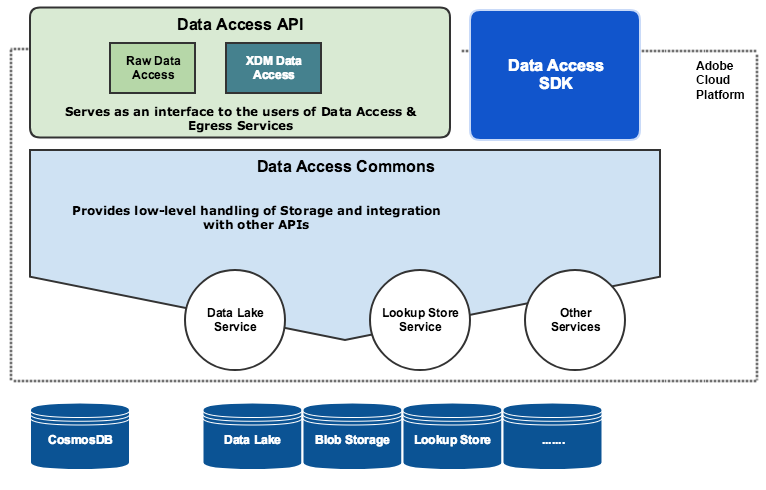

# Data Access Overview

## 1. Overview
The Data Access API provides users with a REST interface to access ingested data in Adobe Cloud Platform.

### 1.1 Audience
This document is aimed at technical personas and should be a useful tool for all users that need to consume the Adobe Cloud Platform APIs, understand the Adobe Cloud Platform architecture, or architect integrations between customer-owned and 3rd party systems with the Adobe Cloud Platform.

Personas Include: Data Engineers, Data Architects, Data Scientists, App Developers

### 1.2 Version Information
*Version* : Preview

### 1.3 License Information
*Terms of service* : https://www.adobe.com/legal/terms.html

### 1.4 URI Scheme
*Host* : __platform.adobe.io__   
*BasePath* : __/data/foundation/export/__  
*Schemes* : __HTTPS__  

### 1.5 About the Docs
The HTML rendition of this documentation is kept up-to-date on a per commit basis and can therefore change without announcement. If you require a persistent version of the documentation, it is recommended that you seek out the PDF rendition.

---

## 2 What is Data Access API?
The Data Access API supports Adobe Cloud Platform by providing users with a REST interface focused on the discoverability and accessibility of ingested datasets within Adobe Cloud Platform.


## 3 API Specification Reference
The Swagger API reference documentation can be found [here](../apireference.html#!acpdr/data-access-api.yaml)


## 4 High-level Architecture Diagram



## 5 Common Use Cases
The Data Access API supports a multitude of common use cases in order to streamline data access and discovery:

* Retrieving a list of files under a batch
* Access and Download files within a batch
* Parallel / Resumable downloads using HTTP Range headers
* Pagination Support for Directory listings

### 5.1 Retrieving a list of files under a batch

By using a batch's identifier (batchID), the Data Access API can retrieve a list of files belonging to that particular batch.

#### Request
GET /batches/{BATCH_ID}/files

``` SHELL
curl -X GET https://platform.adobe.io/data/foundation/export/batches/{BATCH_ID}/files \
  -H 'Authorization: Bearer {ACCESS_TOKEN}' \
  -H 'x-api-key: {API_KEY}' \
  -H 'x-gw-ims-org-id: {IMS_ORG}'
```

* `BATCH_ID`: The ID of the batch to retrieve from  
* `ACCESS_TOKEN`: Token provided after authentication.  
* `API_KEY`: Your specific API key value found in your unique Adobe Cloud Platform integration.  
* `IMS_ORG`: Your IMS org credentials found in your unique Adobe Cloud Platform integration.  

#### Response
```JSON
{
  "data": [
    {
      "dataSetFileId": "{FILE_ID_1}",
      "dataSetViewId": "string",
      "version": "1.0.0",
      "created": "string",
      "updated": "string",
      "isValid": true,
      "_links": {
        "self": {
          "href": "https://platform.adobe.io/data/foundation/export/files/{FILE_ID_1}"
        }
      }
    },
    {
      "dataSetFileId": "{FILE_ID_2}",
      "dataSetViewId": "string",
      "version": "1.0.0",
      "created": "string",
      "updated": "string",
      "isValid": true,
      "_links": {
        "self": {
          "href": "https://platform.adobe.io/data/foundation/export/files/{FILE_ID_2}"
        }
      }
    },
    :
  ],
  "_page": {
    "limit": 100,
    "count": 1
  }
}
```

The data array returned contains a list of all files within the specified batch. Each file returned has its own unique ID (file ID) contained within the dataSetFileId field. This unique ID can then be used to access or download the file.

* `FILE_ID_1`: The file ID of the first file in the specified batch  
* `FILE_ID_2`: The file ID of the second file in the specified batch   
* `_link > self > href`: The url to access the file  


### 5.2 Access and Download files within a batch

By using a file's identifier (file ID), the Data Access API can be used to access the specific details of the file, including its name, size in bytes, and a link to download it.

The response will contain a data array. Depending on whether the file pointed to by the ID is an individual file or a directory the data array returned may contain a single entry or a list of files belonging to that directory. Each file element will include the details of the file.

#### Request
GET /files/{dataSetFileId}

``` SHELL
curl -X GET https://platform.adobe.io/data/foundation/export/files/{FILE_ID} \
  -H 'Authorization: Bearer {ACCESS_TOKEN}' \
  -H 'x-api-key: {API_KEY}' \
  -H 'x-gw-ims-org-id: {IMS_ORG}'
```

* `FILE_ID`: The ID of the file to access
* `ACCESS_TOKEN`: Token provided after authentication.  
* `API_KEY`: Your specific API key value found in your unique Adobe Cloud Platform integration.  
* `IMS_ORG`: Your IMS org credentials found in your unique Adobe Cloud Platform integration.  

#### Response (Case 1 : Response points to a single file)
```JSON
{
  "data": [
    {
      "name": "{FILE_NAME}",
      "length": "{LENGTH}",
      "_links": {
        "self": {
          "href": "https://platform.adobe.io/data/foundation/export/files/{FILE_ID}?path={FILE_NAME}"        
        }
      }
    }
  ],
  "_page": {
    "limit": 100,
    "count": 1
  }
}
```

* `FILE_NAME`: Name of the file (E.g. profiles.csv)
* `LENGTH`: Size of the file (in bytes)
* `_links > self > href`: URL to download the file

#### Response (Case 2 : Response points to a directory)
```JSON
{
  "data": [
    {
      "dataSetFileId": "{FILE_ID_1}",
      "dataSetViewId": "string",
      "version": "1.0.0",
      "created": "string",
      "updated": "string",
      "isValid": true,
      "_links": {
        "self": {
          "href": "https://platform.adobe.io/data/foundation/export/files/{FILE_ID_1}"
        }
      }
    },
    {
      "dataSetFileId": "{FILE_ID_2}",
      "dataSetViewId": "string",
      "version": "1.0.0",
      "created": "string",
      "updated": "string",
      "isValid": true,
      "_links": {
        "self": {
          "href": "https://platform.adobe.io/data/foundation/export/files/{FILE_ID_2}"
        }
      }
    }
  ],
  "_page": {
    "limit": 100,
    "count": 2
  }
}
```

When a directory is returned, it contains an array of every file held within it. The `_links > self > href` field within each array item links to the unique file within the directory.
* `FILE_ID_1`: The file ID of the first file in the specified batch
* `FILE_ID_2`: The file ID of the second file in the specified batch
* `_links > self > href`: The url to access the file


### 5.3 Access the contents of a file
The Data Access API can also be used to access the contents of a file. This can then be used to download the contents to an external source.

#### Request
GET /files/{dataSetFileId}?path={file_name}

``` SHELL
curl -X GET https://platform.adobe.io/data/foundation/export/files/{FILE_ID}?path={FILE_NAME} \
  -H 'Authorization: Bearer {ACCESS_TOKEN}' \
  -H 'x-api-key: {API_KEY}' \
  -H 'x-gw-ims-org-id: {IMS_ORG}'
```

* `FILE_ID`: The ID of the file within a dataset
* `FILE_NAME`: The full name of the file (E.g. profiles.csv)
* `ACCESS_TOKEN`: Token provided after authentication.  
* `API_KEY`: Your specific API key value found in your unique Adobe Cloud Platform integration.  
* `IMS_ORG`: Your IMS org credentials found in your unique Adobe Cloud Platform integration.  

#### Response

```JSON
Contents of the file
```

## 6 Additional Code Samples
Please refer to the tutorial [How to Query Data via Data Access API](../alltutorials.html#!api-specification/markdown/narrative/tutorials/data_access_tutorial/data_access_tutorial.md)


## 7. Terminology

| Term          | Description                                                                            |
| ------------- |----------------------------------------------------------------------------------------|
| Dataset       | A collection of data that includes schema and fields.                                  |
| Batch         | A set of data collected over a period of time and processed together as a single unit. |

---
