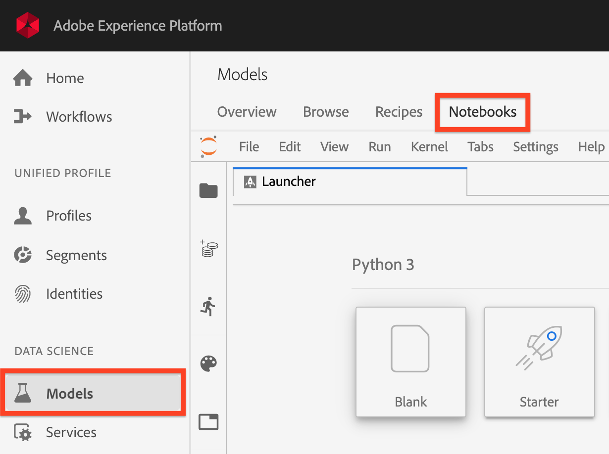
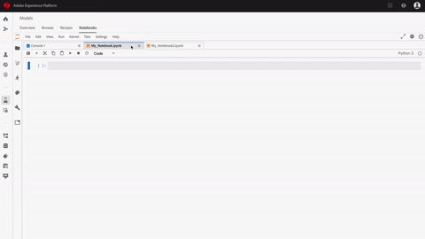

# JupyterLab user guide

[//]: # (Intro paragraph here - High level description and What is JupyterLab and Notebooks)

JupyterLab is a web-based user interface for <a href="https://jupyter.org/" target="_blank">Project Jupyter</a> and is tightly integrated into Adobe Experience Platform. It provides an interactive development environment for data scientists to work with Jupyter notebooks, code, and data.

This document provides an overview of JupyterLab and its features as well as instructions to perform common actions:
-   [JupyterLab on Adobe Experience Platform](#jupyterlab-on-adobe-experience-platform)
-   [Integration with other Platform services](#integration-with-other-platform-services)
-   [JupyterLab features and user guide](#jupyterlab-features-and-user-guide)

The appendix to this document includes additional useful resources related to JupyterLab, including:
-   [Supported libraries](#appendix-supported-libraries)
-   [Technical limitations](#appendix-technical-limitations)

## JupyterLab on Adobe Experience Platform

The integration of JupyterLab on Experience Platform is accompanied with architectural changes, design considerations, customized notebook extensions, pre-installed libraries, and an Adobe themed interface.

The following list outline some of the features that are unique to JupyterLab on Platform:

*   **Kernels**
    *   Kernels provide notebook and other JupyterLab front-ends the ability to execute and introspect code in different programming languages. Experience Platform provides additional kernels to support development in Python, R, PySpark, and Spark. See the [kernels](#kernels) section for more details
*   **Data access**
    *   Access existing datasets directly from within JupyterLab with full support for read and write capabilities
*   **Development libraries**
    *   JupyterLab on Experience Platform provides pre-installed libraries for all your development needs. See the [appendix](#appendix-supported-libraries) for a complete list of supported libraries
*   **Platform service integration**
    *   Built-in integrations allows you to utilize other Platform services directly from within JupyterLab. A complete list of supported integrations is provided in the section [Integration with other Platform services](#integration-with-other-platform-services)
*   **Authentication**
    *   In addition to <a href="https://jupyter-notebook.readthedocs.io/en/latest/security.html" target="_blank">JupyterLab's built-in security model</a>, every interaction between your application and Experience Platform, including Platform service-to-service communication is encrypted and authenticated through the <a href="https://www.adobe.io/authentication/auth-methods.html" target="_blank">Adobe Identity Management System (IMS)</a>
*   **Library controller**
    *   When the the pre-installed libraries are lacking for your needs, additional libraries can be installed for Python and R, and are temporarily stored in isolated containers for maintaining Platform integrity and to keep your data safe. See the [kernels](#kernels) section for more details
        >   **Note:** Additional libraries are only available for the session in which they were installed. If needed, reinstall any additional libraries for new sessions.

[//]: # (*   **OPTION 1:** To ensure compatibility and stability, an extensive list of approved libraries are supported. These libraries provide access to functionalities such as exploration, transformation, numerical simulation, machine learning, data visualization, and many more. Refer to the [appendix]\(#supported-libraries\) for a complete list of pre-installed libraries)
[//]: # (*   **OPTION 2:** An extensive list of supported libraries providing you with access to functionalities such as exploration, transformation, numerical simulation, machine learning, data visualization, and many more. Refer to the [appendix]\(#supported-libraries\) for a complete list of pre-installed libraries)

## Integration with other Platform services

Standardization and interoperability are key concepts behind Experience Platform. The integration of JupyterLab on Platform as an embedded IDE allows it to interact directly with other platform services, providing you the ability to utilize Platform at its full potential. The following Platform services are available in JupyterLab:

*   **Data Catalog:** Access and explore datasets with read and write functionalities.
*   **Query Service:** Access and explore datasets using SQL, providing lower data access overheads when dealing with large amounts of data.
*   **Sensei ML Framework:** Model development with the ability to train and score data, as well as recipe creation with a single click.

>   **Note:** Some Platform service integrations on JupyterLab are limited to specific kernels. Refer to the section on [Kernels](#kernels) for more details.

## JupyterLab features and user guide

Information regarding key features of JupyterLab and instructions on common usages are provided in the sections below:

-   [Access JupyterLab](#access-jupyterlab)
-   [JupyterLab interface](#jupyterlab-interface)
    -   [Menu bar](#menu-bar)
    -   [Left sidebar](#left-sidebar)
    -   [Main work area](#main-work-area)
-   [Kernels](#kernels)
    -   [Kernel sessions](#kernel-sessions)
-   [Launcher](#launcher)
-   [Code cells](#code-cells)
    -   [Add, move, execute, and delete a cell](#add-move-execute-and-delete-a-cell)

### Access JupyterLab

On <a href="https://platform.adobe.com" target="_blank">Adobe Experience Platform</a>, click **Models** from the left navigation column, then click **Notebooks** found in the top navigation to access JupyterLab. Allow some time for JupyterLab to fully initialize.

### JupyterLab interface

The JupyterLab interface consists of a [menu bar](#menu-bar), a [collapsible left sidebar](#left-sidebar), and the [main work area](#main-work-area) containing tabs of documents and activities.

#### Menu bar

The menu bar at the top of the interface has top-level menus that expose actions available in JupyterLab with their keyboard shortcuts:

*   **File:** Actions related to files and directories
*   **Edit:** Actions related to editing documents and other activities
*   **View:** Actions that alter the appearance of JupyterLab
*   **Run:** Actions for running code in different activities such as notebooks and code consoles
*   **Kernel:** Actions for managing kernels
*   **Tabs:** A list of open documents and activities
*   **Settings:** Common settings and an advanced settings editor
*   **Help:** A list of JupyterLab and kernel help links

#### Left sidebar

The left sidebar contains clickable tabs that provides access to the following features:

*   **File browser:** A list of saved notebook documents and directories
*   **Data explorer:** Browse, access, and explore datasets and schemas
*   **Running kernels and terminals:** A list of active kernel and terminal sessions with the ability to terminate
*   **Commands:** Listing of useful commands
*   **Cell inspector:** A cell editor providing access to tools and meta data useful for setting up a notebook for presentation purposes
*   **tabs:** A list of open tabs

Click on a tab to expose its features or click on expanded tab to collapse the left sidebar as demonstrated below:

#### Main work area

The main work area in JupyterLab enables you to arrange documents and other activities into panels of tabs that can be resized or subdivided. Drag a tab to the center of a tab panel to migrate the tab. Divide a panel by dragging a tab to the left, right, top, or bottom of the panel:

### Kernels

Notebook kernels are the language-specific computing engines for processing notebook cells. In addition to Python, JupyterLab on Experience Platform provides additional language support in R, PySpark, and Spark. When you open a notebook document, the associated kernel is launched. When a notebook cell is executed, the kernel performs the computation and produces results which may consume significant CPU and memory resources. Note that allocated memory is not freed until the kernel is shut-down.

Certain features and functionalities are limited to particular kernels as described in the table below:

| kernel | library installation support | Platform integrations |
| :----: | :--------------------------: | :-------------------- |
| **Python** | yes | <ul><li>Sensei ML Framework</li><li>Data Catalog</li><li>Query Service</li></ul> |
| **R** | yes | <ul><li>Sensei ML Framework</li><li>Data Catalog</li></ul> |
| **PySpark** | no | <ul><li>Sensei ML Framework</li><li>Data Catalog</li></ul> |
| **Spark** | no | <ul><li>Sensei ML Framework</li><li>Data Catalog</li></ul> |

#### Kernel sessions

Each active notebook or activity on JupyterLab utilizes a kernel session, all active sessions can be found by expanding the **Running terminals and kernels** tab from the left sidebar. The type and state of the kernel for a notebook can be identified by observing the top right of the notebook interface. In the diagram below, the notebook's associated kernel is **Python 3** and the its current state is represented by a grey circle to the right. A hollow circle implies an idling kernel and a solid circle implies a busy kernel.

If the kernel is shut-down or inactive for a prolonged period, then **No Kernel!** with a solid circle is shown. Activate a kernel by clicking the kernel status and selecting the appropriate kernel type as demonstrated below:

### Launcher

[//]: # (Talk about the different Notebooks, introduce that certain starter notebooks are limited to particular kernels)

The customized *Launcher* provides you with useful notebook templates for their supported kernels to help you kickstart your task, including:

*   **Blank:** An empty notebook file
*   **Starter:** A pre-filled notebook demonstrating data exploration using sample data
*   **Retail Sales:** A pre-filled notebook featuring the [Retail Sales Recipe]() using sample data
*   **Recipe Builder:** A pre-filled notebook that describes and demonstrates the approach of Recipe creation through JupyterLab
*   **Query Service:** A pre-filled notebook demonstrating the usage of Query Service directly in JupyterLab with provided sample workflows that analyzes data at scale
*   **XDM Events:** A pre-filled notebook demonstrating data exploration on postvalue Experience Event data, focusing on features common across the data structure
*   **XDM Queries:** A pre-filled notebook demonstrating sample business queries on Experience Event data
*   **Aggregation:** A pre-filled notebook demonstrating sample workflows to aggregate large amounts of data into smaller, manageable chunks
*   **Clustering:** A pre-filled notebook demonstrating the end-to-end machine learning modeling process using clustering algorithms

Some notebook templates are limited to certain kernels, availability is mapped in the table below:

<table>
    <tr>
        <td></td>
        <th scope="col"><strong>Blank</strong></th>
        <th scope="col"><strong>Starter</strong></th>
        <th scope="col"><strong>Retail Sales</strong></th>
        <th scope="col"><strong>Recipe Builder</strong></th>
        <th scope="col"><strong>Query Service</strong></th>
        <th scope="col"><strong>XDM Events</strong></th>
        <th scope="col"><strong>XDM Queries</strong></th>
        <th scope="col"><strong>Aggregation</strong></th>
        <th scope="col"><strong>Clustering</strong></th>
    </tr>
    <tr>
        <th scope="row" style="text-align:left"><strong>Python</strong></th>
        <td style="text-align:center; background-color:#66ff66">yes</td>
        <td style="text-align:center; background-color:#66ff66">yes</td>
        <td style="text-align:center; background-color:#66ff66">yes</td>
        <td style="text-align:center; background-color:#66ff66">yes</td>
        <td style="text-align:center; background-color:#66ff66">yes</td>
        <td style="text-align:center; background-color:#66ff66">yes</td>
        <td style="text-align:center; background-color:#ff6666">no</td>
        <td style="text-align:center; background-color:#ff6666">no</td>
        <td style="text-align:center; background-color:#ff6666">no</td>
    </tr>
    <tr>
        <th scope="row" style="text-align:left"><strong>R</strong></th>
        <td style="text-align:center; background-color:#66ff66">yes</td>
        <td style="text-align:center; background-color:#66ff66">yes</td>
        <td style="text-align:center; background-color:#66ff66">yes</td>
        <td style="text-align:center; background-color:#ff6666">no</td>
        <td style="text-align:center; background-color:#ff6666">no</td>
        <td style="text-align:center; background-color:#ff6666">no</td>
        <td style="text-align:center; background-color:#ff6666">no</td>
        <td style="text-align:center; background-color:#ff6666">no</td>
        <td style="text-align:center; background-color:#ff6666">no</td>
    </tr>
    <tr>
        <th scope="row" style="text-align:left"><strong>PySpark</strong></th>
        <td style="text-align:center; background-color:#66ff66">yes</td>
        <td style="text-align:center; background-color:#66ff66">yes</td>
        <td style="text-align:center; background-color:#ff6666">no</td>
        <td style="text-align:center; background-color:#ff6666">no</td>
        <td style="text-align:center; background-color:#ff6666">no</td>
        <td style="text-align:center; background-color:#ff6666">no</td>
        <td style="text-align:center; background-color:#66ff66">yes</td>
        <td style="text-align:center; background-color:#66ff66">yes</td>
        <td style="text-align:center; background-color:#ff6666">no</td>
    </tr>
    <tr>
        <th scope="row" style="text-align:left"><strong>Spark</strong></th>
        <td style="text-align:center; background-color:#66ff66">yes</td>
        <td style="text-align:center; background-color:#66ff66">yes</td>
        <td style="text-align:center; background-color:#ff6666">no</td>
        <td style="text-align:center; background-color:#ff6666">no</td>
        <td style="text-align:center; background-color:#ff6666">no</td>
        <td style="text-align:center; background-color:#ff6666">no</td>
        <td style="text-align:center; background-color:#ff6666">no</td>
        <td style="text-align:center; background-color:#ff6666">no</td>
        <td style="text-align:center; background-color:#66ff66">yes</td>
    </tr>
</table>

To open a new *Launcher*, click the **File** menu and click **New Launcher**. Alternatively, expand the **File browser** from the left sidebar and click the plus symbol (**+**):

### Code cells

Code cells are the primary content of notebooks, they contain source code in the language of the notebook's associated kernel and the output as a result of executing the code cell. An execution count is displayed to the right of every code cell which represents its order of execution.

#### Add, move, execute, and delete a cell

Common cell actions are described below:

*   **Add a cell:** Click the plus symbol (**+**) from the notebook menu to add an empty cell. New cells are placed under the cell that is currently being interacted with, or at the end of the notebook if no particular cell is in focus.

*   **Move a cell:** Place your cursor to the right of the cell you wish to move, click and drag the cell to a new location. Additionally, moving a cell from one notebook to another replicates the cell along with its contents.

*   **Execute a cell:** Click on the body of the cell you wish to execute and then click the **play** icon from the notebook menu. An asterisk (**\***) is displayed in the cell's execution counter when the kernel is processing the execution, and is replaced with an integer upon completion.

*   **Delete a cell:** Click on the body of the cell you wish to delete and then click the **scissor** icon.

## Appendix: supported libraries

Click the kernels below to show their supported libraries:

Python / R

library | version
:------ | :------
notebook | 6.0.0
requests | 2.22.0
plotly | 4.0.0
folium | 0.10.0
ipywidgets | 7.5.1
bokeh | 1.3.1
gensim | 3.7.3
ipyparallel | 0.5.2
jq | 1.6
keras | 2.2.4
nltk | 3.2.5
pandas | 0.22.0
pandasql | 0.7.3
pillow | 6.0.0
scikit-image | 0.15.0
scikit-learn | 0.21.3
scipy | 1.3.0
scrapy | 1.3.0
seaborn | 0.9.0
statsmodels | 0.10.1
elastic | 5.1.0.17
ggplot | 0.11.5
py-xgboost | 0.90
opencv | 3.4.1
pyspark | 2.4.3
pytorch | 1.0.1
wxpython | 4.0.6
colorlover | 0.3.0
geopandas | 0.5.1
pyshp | 2.1.0
shapely | 1.6.4
rpy2 | 2.9.4
r-essentials | 3.6
r-arules | 1.6_3
r-fpc | 2.2_3
r-e1071 | 1.7_2
r-gam | 1.16.1
r-gbm | 2.1.5
r-ggthemes | 4.2.0
r-ggvis | 0.4.4
r-igraph | 1.2.4.1
r-leaps | 3.0
r-manipulate | 1.0.1
r-rocr | 1.0_7
r-rmysql | 0.10.17
r-rodbc | 1.3_15
r-rsqlite | 2.1.2
r-rstan | 2.19.2
r-sqldf | 0.4_11
r-survival | 2.44_1.1
r-zoo | 1.8_6
r-stringdist | 0.9.5.2
r-quadprog | 1.5_7
r-rjson| 0.2.20
r-forecast | 8.7
r-rsolnp | 1.16
r-reticulate | 1.12
r-mlr | 2.14.0
r-viridis | 0.5.1
r-corrplot | 0.84
r-fnn | 1.1.3
r-lubridate | 1.7.4
r-randomforest | 4.6_14
r-tidyverse | 1.2.1
r-tree | 1.0_39
pymongo | 3.8.0
pyarrow | 0.14.1
boto3 | 1.9.199
ipyvolume | 0.5.2
fastparquet | 0.3.2
python-snappy | 0.5.4
ipywebrtc | 0.5.0
jupyter_client | 5.3.1
wordcloud | 1.5.0
graphviz | 2.40.1
python-graphviz | 0.11.1
azure-storage | 0.36.0
jupyterlab | 1.0.4
pandas_ml | 0.6.1
tensorflow-gpu | 1.14.0
nodejs | 12.3.0
mock | 3.0.5
ipympl | 0.3.3
fonts-anacond1
psycopg2 | 2.8.3
nose | 1.3.7
autovizwidget | 0.12.9
altair | 3.1.0
vega_datasets | 0.7.0
papermill | 1.0.1
sql_magic | 0.0.4
iso3166 | 1.0
nbimporter | 0.3.1

PySpark / Spark

library | version
:------ | :------
requests | 2.18.4
gensim | 2.3.0
keras | 2.0.6
nltk | 3.2.4
pandas | 0.20.1
pandasql | 0.7.3
pillow | 5.3.0
scikit-image | 0.13.0
scikit-learn | 0.19.0
scipy | 0.19.1
scrapy | 1.3.3
statsmodels | 0.8.0
elastic | 4.0.30.44
py-xgboost | 0.60
opencv | 3.1.0
pyarrow | 0.8.0
boto3 | 1.5.18
azure-storage-blob | 1.4.0
python | 3.6.7
mkl-rt | 11.1

## Appendix: technical limitations

[//]: # (information in https://git.corp.adobe.com/ml/ml/tree/master/limits can possibly go here)
[//]: # (Let PM decide whether this section is necessary)

The table below provides details on known limitations regarding JupyterLab:

use case | description | limit (hours) | notes
-------- | ----------- | ------------- | -----
Interactive notebooks | Executing a Jupyter Notebook through JupyterLab UI | 1.5 | The session connection timeout is 1.5 hrs. After 1.5 hrs the connection between client and the server is terminated. The process may continue to run but cell output will not be returned to browser session.
