# Datasets user guide

This user guide provides instructions on performing common actions when working with datasets within Adobe Experience Platform user interface. 

Instructions are provided for the following topics:

*   [View datasets](#view-datasets)
*   [Preview a dataset](#preview-a-dataset)
*   [Create a dataset](#create-a-dataset)
*   [Enable a dataset for Real-time Customer Profile](#enable-a-dataset-for-real-time-customer-profile)
*   [Manage and enforce data governance on a dataset](#manage-and-enforce-data-governance-on-a-dataset)
*   [Delete a dataset](#delete-a-dataset)
*   [Delete a Profile-enabled dataset](#delete-a-profile-enabled-dataset)
*   [Monitor data ingestion](#monitor-data-ingestion)

## Getting started

This user guide requires a working understanding of the following components of Adobe Experience Platform:

*   [Datasets](./datasets-overview.md): The storage and management construct for data persistence in Experience Platform.
*   [Experience Data Model (XDM) System](../schema_registry/xdm_system/xdm_system_in_experience_platform.md): The standardized framework by which Experience Platform organizes customer experience data.
    *   [Basics of schema composition](../schema_registry/schema_composition/schema_composition.md): Learn about the basic building blocks of XDM schemas, including key principles and best practices in schema composition.
    *   [Schema Editor tutorial](../../tutorials/schema_editor_tutorial/schema_editor_tutorial.md): Learn how to build your own custom XDM schemas using the Schema Editor within the Platform user interface.
*   [Real-time Customer Profile](../unified_profile_architectural_overview/unified_profile_architectural_overview.md): Provides a unified, real-time consumer profile based on aggregated data from multiple sources.
*   [Data Governance](../data_governance/dule_overview.md): Ensure compliancy with regulations, restrictions, and policies regarding the usage of customer data.

## View datasets

In the Experience Platform UI, click **Datasets** in the left-navigation to open the *Datasets* dashboard. The dashboard lists all available datasets for your organization. Details are displayed for each listed dataset, including its name, the schema the dataset adheres to, and status of the most recent ingestion run.

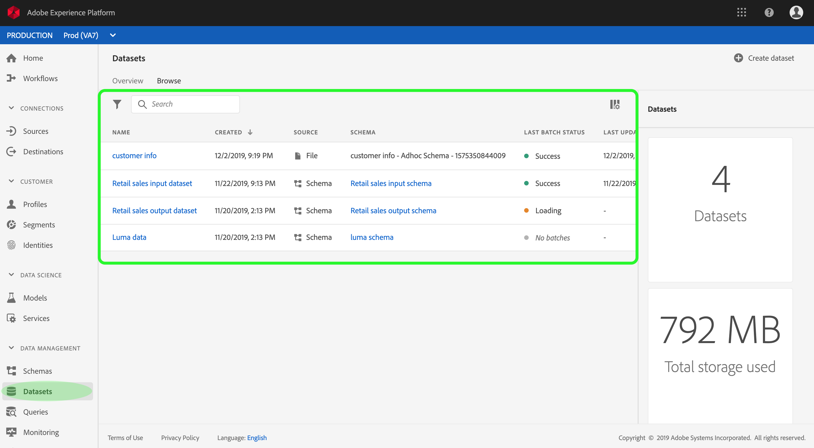

Click the name of a dataset to access its *Dataset activity* screen and see details of the dataset you selected. The activity tab includes a graph visualizing the rate of messages being consumed as well as a list of successful and failed batches.

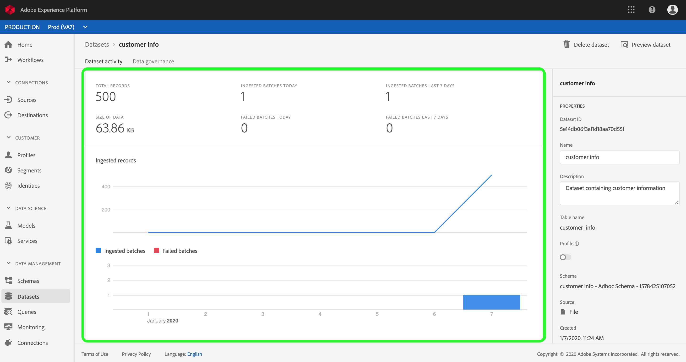
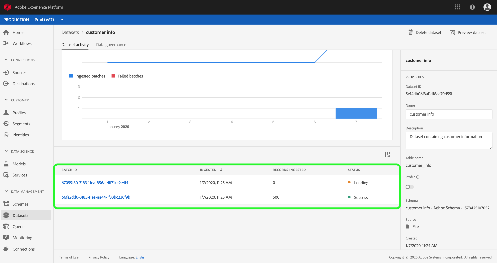

## Preview a dataset

From the *Dataset activity* screen, click **Preview dataset** near the top-right corner of your screen to preview up to 100 rows of data. If the dataset is empty, the the preview link will be deactivated and will instead say **Preview not available**.

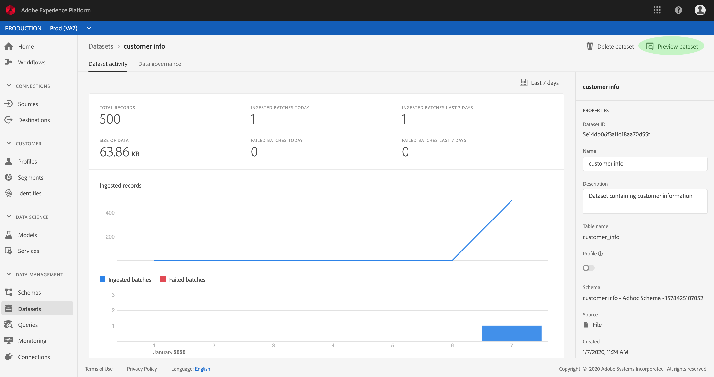

In the preview window, the hierarchical view of the schema for the dataset is shown on the right.

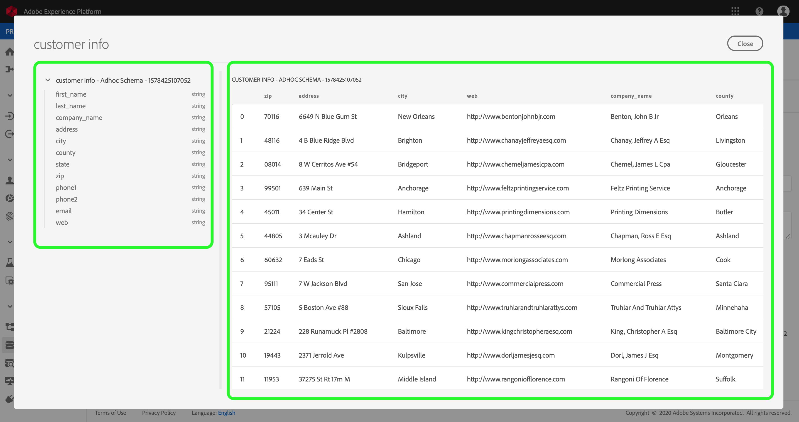

For more robust methods to access your data, Experience Platform provides downstream services such as Query Service and JupyterLab to explore and analyze data. See the following documents for more information:

*   [Query Service overview](../query-service/overview/overview.md)
*   [JupyterLab user guide](../data_science_workspace_overview/jupyterlab/jupyterlab_overview.md#access-platform-data-using-notebooks)

## Create a dataset

To create a new dataset, start by clicking **Create dataset** in the *Datasets* dashboard.

In the next screen, you are presented with the following two options for creating a new dataset:

*   [Create dataset from schema](#create-a-dataset-with-an-existing-schema)
*   [Create dataset from CSV file](#create-a-dataset-with-a-csv-file)

### Create a dataset with an existing schema

In the *Create dataset* screen, click **Create dataset from schema** to create a new empty dataset.

The *Select schema* step appears. Browse the schema listing and select the schema that the dataset will adhere to before clicking **Next**.

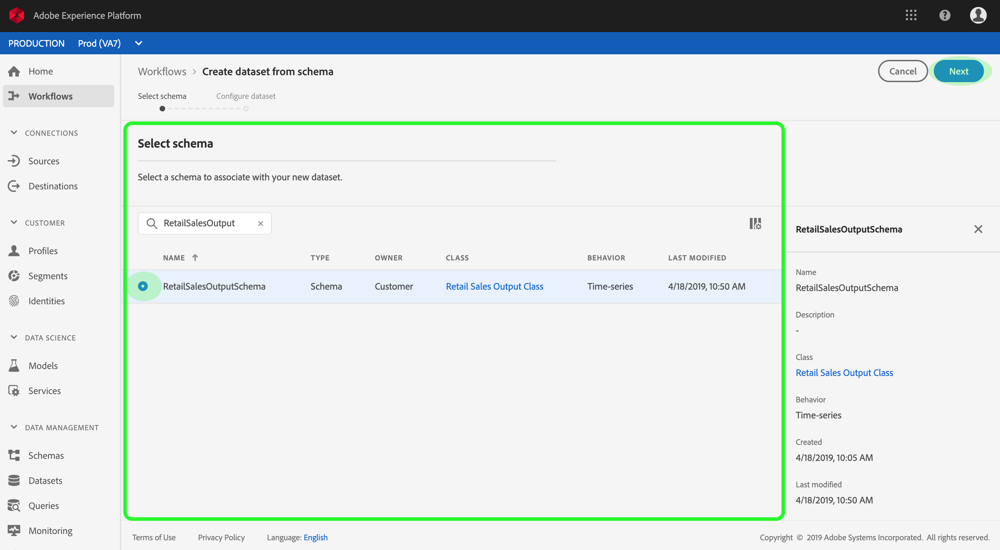

The *Configure dataset* step appears. Provide the dataset with a name and optional description, then click **Finish** to create the dataset.

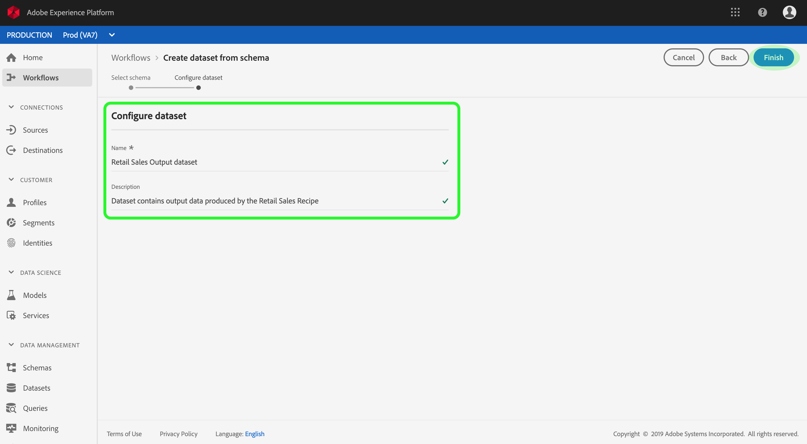

### Create a dataset with a CSV file

When a dataset is created using a CSV file, an ad hoc schema is created to provide the dataset with a structure that matches the provided CSV file. In the *Create dataset* screen, click the box saying **Create dataset from CSV file**.

The *Configure* step appears. Provide the dataset with a name and optional description, then click **Next**.

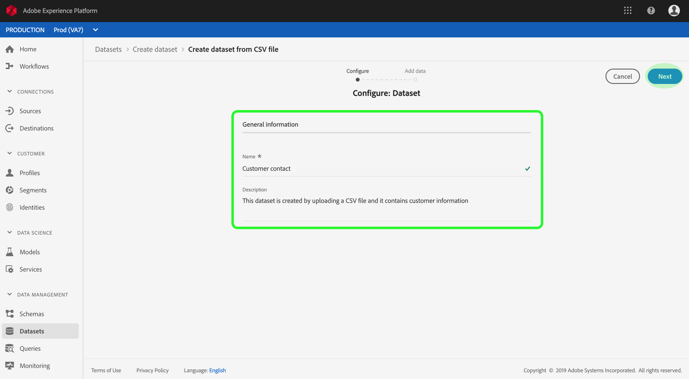

The *Add data* step appears. Upload the CSV file by either dragging and dropping it onto the center of your screen, or click **Browse** to explore your file directory. The file can be up to ten gigabytes in size. Once the CSV file is uploaded, click **Save** to create the dataset.

>   **Note:** CSV column names must start with alphanumeric characters, and can contain only letters, numbers, and underscores.

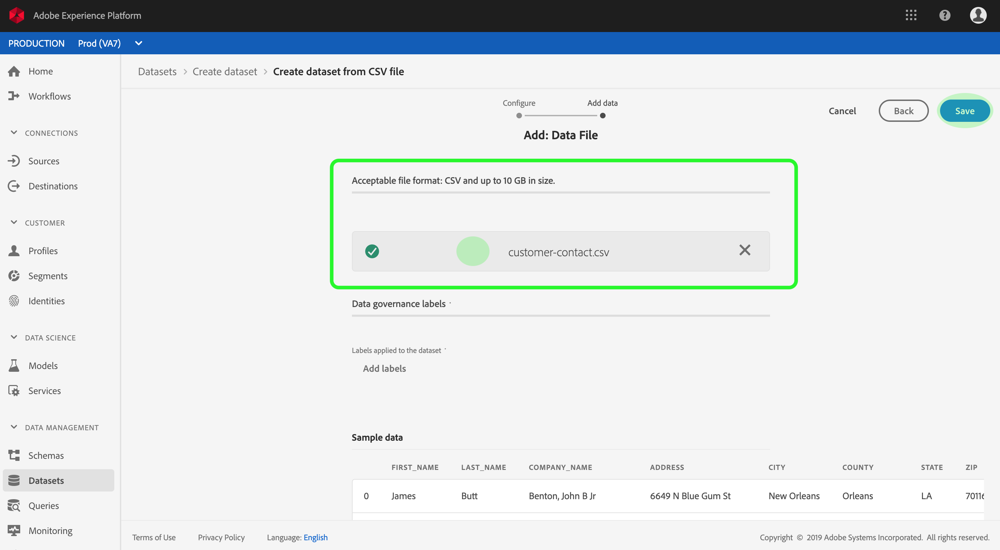

## Enable a dataset for Real-time Customer Profile

Every dataset has the ability to enrich customer profiles with its ingested data. To do so, the schema that the dataset adheres to must be compatible for use in Real-time Customer Profile. A compatible schema satisfies the following requirements:

*   The schema has at least one attribute specified as an identity property.
*   The schema has an identity property defined as the primary identity.

For more information on enabling a schema for Profile, see the [schema editor tutorial](../../tutorials/schema_editor_tutorial/schema_editor_tutorial.md).

To enable a dataset for Profile, access its *Dataset activity* screen and click the **Profile** toggle within the *Properties* column. Once enabled, data that is ingested into the dataset will also be used to populate customer profiles.

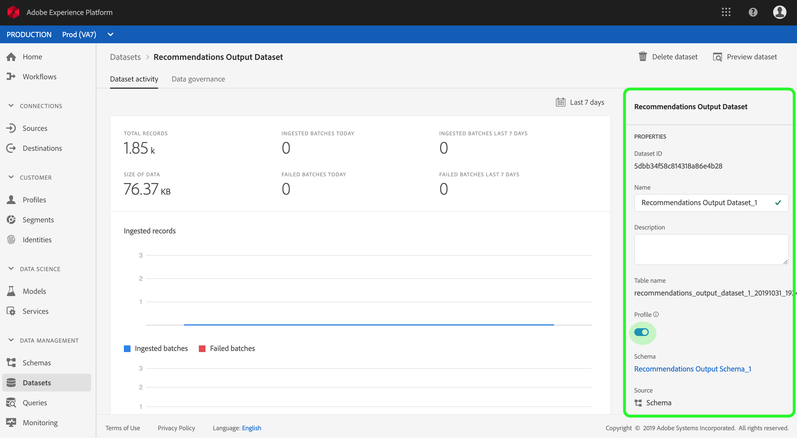

If a dataset already contains data and is then enabled for Profile, the existing data is not consumed by Profile. After a dataset is enabled for Profile, it is recommended that you re-ingest any existing data to have them populate customer profiles.

## Manage and enforce data governance on a dataset

Data Usage Labeling and Enforcement (DULE) is the core data governance mechanism for Experience Platform. DULE labels allow you to categorize datasets and fields according to usage policies that apply to that data. See the [Data Governance overview](../data_governance/dule_overview.md) to learn more about DULE labels, or refer to the [DULE user guide](../../tutorials/dule/dule_working_with_labels.md) for instructions on how to apply data usage labels.

## Delete a dataset

You can delete a dataset by first accessing its *Dataset activity* screen. Then, click **Delete dataset** to delete it. 

**Note:** Datasets created and utilized by Adobe applications and services (such as Adobe Analytics, Adobe Audience Manager, or Decisioning Service) cannot be deleted.

A confirmation box appears. Click **Delete** to confirm the deletion of the dataset.

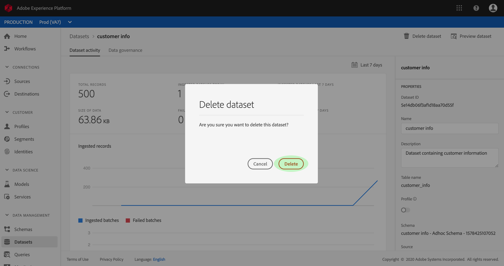

For more information on deleting datasets including how to delete them using APIs, see the tutorial on [deleting a dataset](../../tutorials/datasets/delete-dataset.md).

## Delete a Profile-enabled dataset

If a dataset is enabled for Profile, deleting it through the UI disables the dataset for ingestion, but does not automatically delete the dataset in the backend. In order to fully delete the dataset including the profile and identity data that it provides, an additional delete request must be made. For steps on how to fully delete a Profile-enabled dataset, see the tutorial on [deleting datasets and batches](../../tutorials/datasets/delete-dataset.md#deleting-a-dataset-using-the-experience-platform-ui).

## Monitor data ingestion

In the Experience Platform UI, click **Monitoring** in the left-navigation. The *Monitoring* dashboard lets you view the statuses of inbound data from either batch or streaming ingestion. To view the statuses of individual batches, click either *Batch end-to-end* or *Streaming end-to-end*. The dashboards lists all batch or streaming ingestion runs, including those that are successful, failed, or still in progress. Each listing provides details of the batch, including the batch ID, the name of the target dataset, and the number of records ingested. If the target dataset is enabled for Profile, the number of ingested identity and profile records is also displayed.

You can click on an individual **Batch ID** to access the *Batch overview* dashboard and see details for the batch, including error logs should the batch fail to ingest.

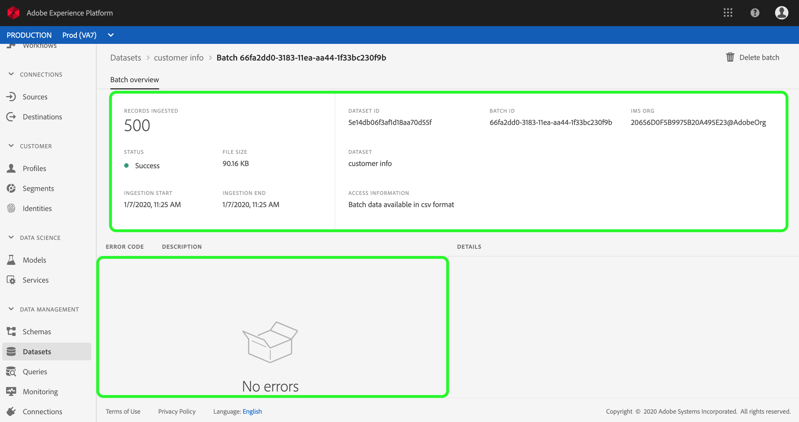

If you wish to delete the batch, you can do so by clicking **Delete batch** found near the top right of the dashboard. Doing so will also remove its records from the dataset the batch was originally ingested to.

## Next steps

This user guide provided instructions for performing common actions when working with datasets in the Experience Platform user interface. For steps on performing common Platform workflows involving datasets, please refer to the following tutorials:

*   [Create a dataset using APIs](../../tutorials/creating_a_dataset_tutorial/creating_a_dataset_tutorial.md)
*   [Query dataset data using the Data Access API](../../tutorials/data_access_tutorial/data_access_tutorial.md)
*   [Configure a dataset for Real-time Customer Profile and Identity Service using APIs](../../tutorials/unified_profile_dataset_tutorial/unified_profile_dataset_api_tutorial.md)
*   [Create a dataset for exporting an audience segment](../../tutorials/segmentation/segment-export-dataset.md)