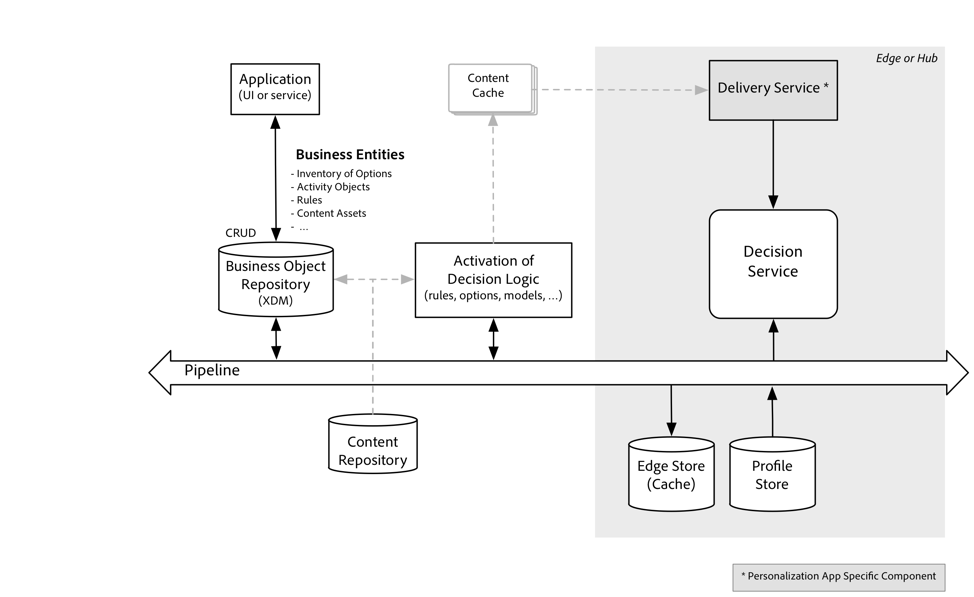
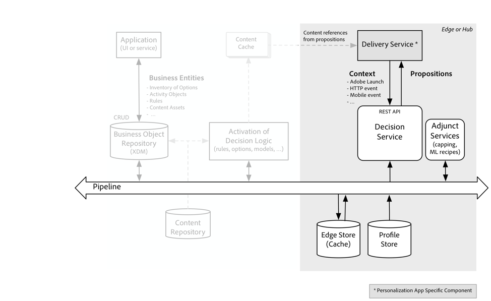
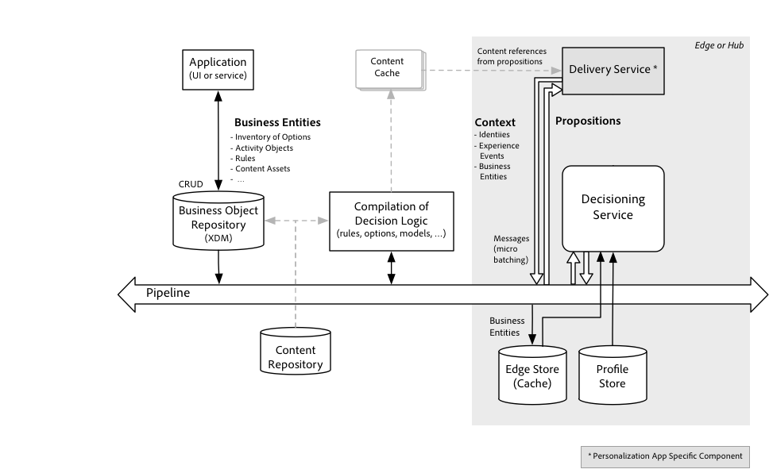

# Decisioning API
The Decisioning Services, like other Experience Platform services, adopt an API-first philosophy. This means that the API is the primary interface into Decisioning services, all functions, including administrative functions, are available via API. Other Platform services, Adobe solutions, and third-party integrations all use the same APIs.

The usage of Experience Platform is simply extended by a set of APIs to create and manage decision components, and by a set of APIs to call up decisions that can be delivered by an application. You can use the Platform with or without the Decisioning services and does not need to change its usage of the other Platform services.

To make the most out of the Decisioning Service, a customer will use the Profile store - both the Hub and Edge Profile store are available for decisioning logic. The advantage is that profile records and events do not have to be retrieved back into the customer solution as the Decisioning services accesses them in place where they are stored. See Figure 3, the right side.


The Decisioning Service has very simple APIs, but before they can be called, the decision logic must be developed.
How the Decisioning Service fits into the workflows of Platform usage
As stated above, the usage of the Decisioning Service is optional and only requires a few steps in addition to the typical steps required to create profile entities and manage them. 

## How the Decisioning Service fits into the workflows of Platform usage
As stated above, the usage of the Decisioning Service is optional and only requires a few steps in addition to the typical steps required to create profile entities and manage them. 

1. Authenticate to the Platform.
2. Define a schema based on the profile class and optionally define a schema based on the experience event class.
3. Configure a dataset to upload record and time series data and prepare it for upload of datasets to Real-time Customer Profile.
4. Add data via the dataset configured in the prior step.

Following these four steps, Decisioning Service adds the steps:

5. Define Decision Components, i.e. the business logic entities. See Figure 3, the left side. This is also called the design-time step.
6. Invoke the runtime API to obtain the best option as per the business logic defined in the prior step.

The Activation of the business logic entities happens automatically and continuously. As soon as a new option is saved in the repository and it is marked as "approved", it will be a candidate for inclusion the set of available options. As soon as a decision rule is updated the ruleset will be reassembled, prepared for runtime execution. At this automatic activation step, any constraints defined by the business logic that aren't depending on runtime context will be evaluated. The results of this activation step are sent to a cache where they are available to the runtime decision service. This is illustrated in Figure 4.



Once the option sets, rule sets and constraints are activated and have been pushed to the Decision Service nodes, a simple API is used to post a request for a decision. The API is typically called by a delivery service that then takes the proposed option (e.g. Next Best Action or Next Best Offer) and assembles the experience or executes the action. If the proposition is an offer, then the content that represents that offer is looked up and is inserted in an experience delivered to the end user. This is illustrated in Figure 5



The Delivery Service is assembling data for the decision request. It determines the ID of the profile entity for which the best option is returned. It also assembles any context data that is not stored in the Real-time Customer Profile Store but is potentially used by the decision logic. 

The decision logic is organized by Activities each of them specifies a filter for the subset of options that should be considered for this activity, along with a single fallback option that is selected when all the general options fail to meet the constraints defined in the decision logic.

Each decision is made by a) applying constraints to reduce the number of options and b) ranking the options. although most of the logic is evaluated inside the Decision Service, various adjunct services are used to help with these two aspects. E.g. a capping service manages upper bounds for how often an option can be used in any decision, another service may host an ML model that is used to calculate scores for a profile and option.

Invoking a Rest API endpoint is not the only way a decision request is made. There is a mode by which messages can be streamed that contain micro-batches of decision requests, for up to a configurable number of profiles at a time. Using this mode, a large number of decisions can be made in bulk and the results will be send back to subscribers via a messaging interface. Figure 6 illustrates the streaming invocation mode.



## Decision components - Anatomy of a decision strategy
A developer can define decision components that make up a specific decision strategy. This is the first step in the workflow.

1. Options
  * General option types
  * Fallback options
2. Collections
  * Tags 
  * Filters
3. Content-centric Components
  * Placements
  * Representations

4. Constraint Components
  * Calendar Constraints
  * Capping Constraints
  * Duplication Constraints
  * Profile Constraints -> Eligibility Rules (Predicate based)

5. Ranking Components
  * Arithmetic Function 
    
    ```
    SortBy({o <sub>n</sub>})(o => o.rank.priority) => (on)  
    Extensions are possible by external ranking function 
    SortBy({on},a)  ((o,a)   => extRanking(o,a))   => (on)  

    SortBy({on},a,p)((o,a,p) => extRanking(o,a,p)) => (on) 


  * Logic based
    ```
    if p1(o)(a,p) then r1 
    else if p2(o)(a,p) then r2
    else if pn(o)(a,p) then rn
    else rmin  
  
  * Prediction function
  ```
    𝑦̂ = f:({on},a,p)→(on)
