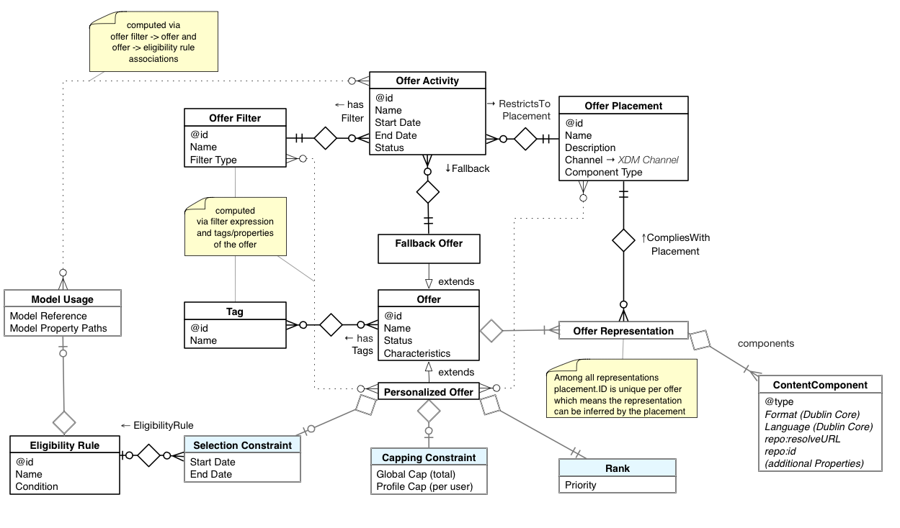

# Decisioning Service

Decisioning Service provides the capability to create personalized, optimized, and orchestrated experiences in applications running on Adobe Experience Platform. Using Decisioning Service, you can configure arrangements of possible choices and algorithms for determining the next best option for each of your customers' experiences from among them. These choices, also called alternatives or options, could be offers, product recommendations, content components for a web experience, conversation scripts, and actions to take. Currently offer decisioning is supported, where decision options are referred to specifically as offers, with support for more use cases to come.

Decisioning algorithms, referred to as activities, can factor any XDM real-time customer data, including both record and time series data. This allows you to build decisioning that considers the many interactions a customer has had, across many channels and applications. For instance, call center application activity could enable or suppress a marketing message for some time following a complaint, and that message itself may be based on purchases made and reviews posted by the customer.

Decisioning Service facilitates evolved experience personalization.

Before Experience Decisioning | After Experience Decisioning
--- | ---
End-to-end customer experiences are disjointed treatments served by independent applications or business functions. | Experiences are orchestrated responses across Experience Platform using its inherently coordinated data integration and workflow features.
Options, and the strategies for selecting which to present during a customer's experience, are typically coded deeply inside of an application. | Options and strategies are leveraged regardless of when, how, and on which channel a user interacts with a business or organization.
Customer experiences are personalized and optimized within a single channel, across a small set of experience touchpoints (e.g. just the home page of a site, or the checkout workflow of a commerce application) | Customer experiences are based on a holistic understanding of the customer's current needs and adapts to all experiences the user had, good or bad. For example, a marketing campaign may not be appropriate for a customer who has recently placed a complaint about a product or service.

Decisioning Service moves your experience personalization capabilities from targeting in a single channel to determining the overall stage in the lifecycle of your customers' engagement with your brand independent of channels. A lifecycle stage is much more complex than a segment membership, and is almost always based on complex events streams, business rules and predicted attributes. 

Other terms used by products and services aiming to serve similar use cases:
* Real time interaction management (RTIM)
* Journey management
* Omni-channel marketing and personalization
* Real time decisioning 

---

## How does Decisioning Service work?

Experiences can be customized using Decisioning Service in real time, as your customer engages with your brand via an inbound channel, such as your site or mobile app. Decisioning can also be used to customize messages via outbound channel, like an email or push notification. 

Decisions can be made in many ways. One approach is to eliminate options successively until either only one is left or the options have been pared down and there is some subset remaining. In this latter case, to be supported in future releases, a winner is randomly picked from the reduced set or the options' rank are considered. Ranking options is accomplished using a function. For offer decisioning, that function could calculate the cost, the value of the offer to the business and the likelihood that the offer is accepted by the end user. The resulting score could be used to rank the offers.

Alternatively or additionally, a strategy could be based on data collected from prior interactions with similar customers who were proposed similar options. In this strategy, the option with the highest predicted outcome value is selected. The predicted outcome value is tied to the goals of the activity and the key performance indicator is how frequently the outcome was achieved after the option was proposed.

There are a seemingly infinite number of ways to come up with a “best” option. Each of those arrangements of steps is a specific decision strategy, and a strategy is tuned for the use case it is serving. Each strategy has one or more steps which can be connected in a linear or parallel fashion and is built using an arsenal of available components.

### Decision strategy

Each decision strategy is essentially an algorithm or a function that takes N options {o1, o2, …oN} as input and produces an ordered list of options (o1, o2,…oK) whereby the first option in the list is considered the best one according to an optimization criteria, the second option in the result list is then considered the second best option and so forth. Each strategy has one or more steps which can be connected in a linear or parallel fashion and is built using an arsenal of available components.

 > To make the most out of Decisioning Service, use the profile store.

At any given time during a customer's journey, the best option for a given activity is re-evaluated based on the most current set of context variables, rules, and constraints. Context variables include the records stored in Real Time Customer Profile. A central record entity is a customer’s profile, but other entities like operational business data are equally available to the activity.

The algorithm or function that produces the list of top-K options varies with the use case. The components of that algorithm, the sequence in which they are invoked and how one component’s output is used as the input for another component is different for different use cases. Each component is an actor and the execution is modeled as a data flow, not as a series of instructions happening in a specific order (control flow). A decision strategy emphasizes the movement of data along a series of connections between actor components. Defined inputs and outputs connect components and algorithm can be modeled as a directed graph. 

To learn more about using the Decisioning Service runtime, see [the tutorial](../../tutorials/decisioning_tutorial/decisioning_runtime_api_tutorial.md).

### Integration and activation

Audiences built using Decisioning Service can be used for systems external to Experience Platform, referred to as direct activation. Using the Decisioning Service APIs, you can enhance the data from your various data management systems to be used by your and third party systems.

You can use Decisioning Service in a synchronous request-response interaction mode facilitated by a simple HTTP REST API. The API returns the currently best option for a single profile. The “currently best option" selection will change based on the rules and constraints applied to all options that are in consideration by a given activity. The REST API allows getting the next best option for multiple activities at once. This allows the arbitration of options across channels. When responses for multiple activities are obtained together, additional rules may have been applied.

<!--
**RESTFul API** - There is a synchronous request-response interaction mode facilitated by a simple HTTP REST API. The API returns the currently best option for a single profile. As new experience events stream into Platform, the “Currently Best Option" selection will change based on the rules and constraints applied to all options that are in consideration by this activity. The REST API allows getting the next best option for multiple activities at once. This allows the arbitration of options across channels. When responses for multiple activities are obtained together, additional rules may have been applied.  
**Streaming** - Another interaction model allows streaming of requests to the Decisioning Service. This model is still request-response-based in that a request is made to return the currently best option for a given set of activities and each of those requests is answered by a single response. However, in contrast to the HTTP REST API the request-response pattern is not synchronous. Rather the requests are streamed to one topic and the responses are read from another topic. Experience Platform’s Pipeline messaging infrastructure is leveraged for this interaction model. The sequence of request messages is continuous and does not end. The request messages allow micro-batching of requests for multiple profile entities in one message to increase the overall throughput.  
**Proactive** A third interaction model allows truly proactive experiences. In this model, requests do not just calculate the currently best option for a given context and Profile entity. A single request is sent to an activity to start it. The activity then sends the next best option back via a stream, and whenever the best option selection changes, another message will be sent. The activity will continue to send changes and the receiver of the message will execute the actions that were defined on the newly selected option. The updates will be sent until the activity is requested to stop and the stream will be closed. This mode enables proactive real time decisioning applications on Experience Platform.
-->

### Offer decisioning 

<!-- TODO: as more use cases are supported, create a separate Use Cases section wherein this and the others are listed -->
Offer decisioning is a use case of Decisioning Service within which you formalize and centrally manage the rules and predictions used for engaging customers with offers. Offer decisioning is considered a type of content decisioning. In this use case, the decisioning options are referred to as offers, and are characterized as such by the content attached to them. Offers could be created by different departments of your organization or by partners, and those offers could be added and removed daily. In addition to manual administration, offers can have a validity period and can be configured to be invalidated as of a certain date. 

Offers are visually placed into larger experiences by the application that is delivering the experience. Placements, sometimes called spots or slots, are important components for crafting a strategy. Designing an offer strategy often starts with the definition of those placements. An offer typically has multiple content representations so that it can be correctly integrated into a variety of slots, where each has varying dimensional or other constraints or standards.

Decisioning Service provides several ways to control which offers are presented based on criteria such as:

* Profile characteristics - Referred to as eligibility constraints, allows you to define criteria controlling the use of offers based on the current profile.
* Time window - Calendar constraints facilitate the automatic activation and deactivation of offers based on a time frame of validity.
* Frequency of use - Capping constraints allow you to create limits on the number of times an offer can be used across your entire profile set, as well as per profile.

Constraints are listed and discussed [below](#constraints).

---

## Components of Decisioning Service

In this section, the components of Decisioning Service are explained and the ways in which those components act and interact are detailed. These fundamental components come into play regardless of how you use Decisioning Service.

### Context

So far, only the business logic that affects the decision was described. But even more impactful on the output are the input parameters of the decision process. Those parameters are called the Context. For real-time decisioning the Context will need to be determined in real-time as well. 

There are three paths the Context data takes to arrive at the point when the decision is made. Record and time series data can be uploaded via dataset files. This path is mainly for bulk synchronization with external systems. Record and time series data can also be streamed into Platform where the data is indexed and joined to form entities. Via the third path, context data can be passed as parameters to the decision request. This form of data is ephemeral in nature and is only relevant for the decision requested. It is also not persisted as an entity and is not available for other requests.

Profile entities represent end-user data, but not every Profile entity represents an individual. It could be a household, a social group, or any other subject. If there is an experience, then there is a subject of the experience. The Profile is also the entity that is used to combine targeting with personalization because segment membership state is reflected in the Profile record and is accessible for decisioning.

The objects of the interactions are called business entities. Those objects are often referenced in the ExperienceEvents of Profile entities. Like Profile entities, business entities are part of the decision context. Examples of business objects are web sites, stores, product details, content metadata, production inventory data, etc. Business objects can also have time series data that is used in the decision’s context. An event of type “Is Delayed” of an object of type “Scheduled Flight“ is an example.

### Option

An option is a potential experience that could be presented to a given customer. An option is also referred to as a choice or alternative. When deciding on the next best option for a customer, Decisioning Service considers options from amongst a finite group of options.

Decisions are made by identifying the best option amongst a set of available options.

### Decision algorithm

On a functional level, all decisions are set operations. That means they take an input set of options and produce an output set of options. The decision algorithm is not just one set function. Rather there are multiple of those functions and the outputs of some of them are used as the inputs of others. Each of those set functions is a step in a decision algorithm. We can say data or metadata flows between those function steps.

### Proposition

A proposition is a concrete selection that was made in response to an actual decision request. A proposition is persisted and so has an identifier, and a reference to the selected option(s) and can record as much of the context data that was used in making the decision. Having an identifier gives a proposition the quality of an entity and propositions can be referenced from other entities. Adding the timestamp marking the date the decision was made (i.e. when the proposition was created combined with the immutability of the proposition) results in a decision event. A decision event is a recorded occurrence of the action of executing the decision strategy.

### Outcome

It is important to differentiate between the output (the proposition) and the outcome. A decision cannot produce an outcome. The decision is only selecting (or proposing) the option with the best predicted outcome. Between propositions and outcomes lie many events and interactions. The outcomes may not be achieved in one step and it is important to track the propositions through a series of ExperienceEvents so they can be attributed to the outcomes. This feedback is used to improve the prediction accuracy.

### Collections

The option inventory is the overall pool of options that are considered for decisioning. A collection of options is represented by a common tag on those options, thereby representing a category. Filters are used to isolate options of a certain category, or more specifically, sharing the same tag.

#### Tags

Tags provide a way to express that a group of options belongs to a category.

An option can have more than one tag and can therefore be in multiple categories at the same time. Categories can also overlap or contain another one. When a category "S" is defined by offers having the tag "A" and the category "R" is defined by options with both tag "A" and "B" then "S" is going to be a superset of "R".

#### Filters

Filters are used to define the criteria for a set of options that belongs to a category. Filters can be thought of as queries against the inventory of general offers. There are two basic ways to form a filter: by stating that an offer has one or more tag and by selecting the set of offers explicitly. The former method can be configured to state that an offer in that collection must have all of the specified tags or that an option qualifies when it has at least one of the specified tags. 

When options are explicitly placed into a collection their tag set is ignored for that collection.

### Activities

Activities control the algorithm and parameters for a specific decision strategy. The strategy parameters include the constraints applied to the options. All decisions are made in the context of an activity. Decisioning Service hosts many activities, and activities can be reused across channels.

An activity defines the collection of the options to be considered, i.e. the subset out of all options representing those of interest. At any given time, the best option is re-evaluated, or ranked, based on the most current set of context variables, rules, and constraints. Activities will execute if needed and when needed. Whether an activity is running continuously or only when the most current decisions are needed depends on how the activity is activated. 

By serving as an input parameter for a decision, activities are also used to select the content of an experience. An experience can be assembled using many activities simultaneously. Currently, up to 30 activities can be addressed in a single decisioning request. Above that, multiple requests can be made for the same profile to obtain the offer propositions for additional activities if needed. When activities are included in the same decision request, deduplication of offer propositions will be performed among those activities. On the other hand, if activities are defined in a way that they select from disjointed sets of offers, then it makes little difference whether activities are combined in the same request or in split up into separate requests. But, network and response time constraints may call for combining activities into the same request. As different requests may get routed to different service nodes, the same profile data may need to be fetched into different nodes. This reduces the effective IO bandwidth available for other requests.

Activities are used to insert content into an experience. To facilitate (not to ensure) that the content items will “fit” correctly, an activity references a single placement. Notice that a placement is not always a concrete place/slot but more like an abstraction of those places/slots. For instance, in a web page with a grid of tiles each tile could be governed by the same placement, assuming they all have similar shape and size and can hold similar content. However, an individual tile would typically be supplied by its own activity. 

The following figure illustrates how the business entities are related to each other:

 

When clients create and link the object graph for decisions, there will typically be three different work streams. These are as follows:

1.  Setting up the supporting entities such as tags and placements. Those entities are used to structure, filter and group other entities. They are also used to provide some coordination between the second and third workflow. This workflow constitutes some upfront work but at any given time refinements can be made to the setup. While tags are relatively straightforward, placements require a little more planning. At a minimum a business needs to take an inventory of all the places where a decision gets presented.
2.  Creating offers with the various representations and business rules (constraints). This central workflow provides the options amongst which we need to select the best ones. The tags of the first workflow are used to categorize offers and the placements are used to indicate what options can be presented, and where.
    *   This workflow also defines absolute constraints for the offers. They are absolute because they will always be enforced and aren’t merely affecting the ranking amongst a set of offers. For instance, when a calendar constraint is set it is enforced that the offer will never be selected before its set start date/time and never after its end date/time. The constraints that will be set in this workflow are the [calendar constraints](#calendar-constraints), [capping constraints](#capping-constraints) and [eligibility constraints](#profile-constraints-eligibility-rules). A sub workflow here is the definition of additional rules that determine who is eligible to receive a given offer.
    *   At the same time constraints are created for an offer, its representations are selected. This workflow assumes that the content is already created somewhere and is simply uploaded to and picked from the content repository. Here is where the placements from the first workflow come into play. An offer can pick placements and associate the content under that [placement](#placements).
    *   Creating suitable fallback offers is the last step in this workflow. A fallback offer is very much like a general offer without constraints.
3.  The last workflow is concerned with creating activities. However, this step doesn't necessarily occur sequentially after the workflow to create offers. Both processes are ongoing and concurrent. Activities are used to narrow the scope of the options by topic and by location where the decisions are presented. An activity references a [collection](#collections) and a placement. It also must specify a [fallback offer](#fallback-offers) that is used in cases when a qualifying offer cannot be determined.

## Components of offer decisioning

A developer can define decision components that make up a specific decision strategy. This is the first step in the workflow. This section describes the entities for the offer decisioning domain.

### General offers

General offers, also called personalized offers, are the options at the center of the offer decision activities. They have attributes like name and status. The status attribute indicates if the entity is ready to be included in the list of active approved offers. General offers will have several constraints added to them. 

### Fallback offers

Fallback offers are decision options that do not have additional constraints except for the placements rules. Fallback offers have content representations that are tied to placements, just like any other offer. 

Fallback offers are specified in activities to indicate a viable content experience for use when combined constraints disqualify all narrowed-down options. Because it is not dependent on runtime context or the profile, the placement constraint can be checked ahead of time when the activity is assembled. Using fallback offers, there is always an answer to the question: What is currently the best offer?

### Constraints

#### Calendar constraints

In the offer decisioning domain, the offers have a validity period. That means that the offer cannot be proposed before its start date and time has passed and cannot be proposed any longer after its end date and time has passed. The offer entity has a simple structure which defines those calendar constraints.

#### Capping constraints

Offers can have an optional capping constraint. It consists of two values: 

* The global cap value restricts how often an offer can be proposed across the entire profile set (targeted audience). 
* The per profile cap and determines how often that Offer can be proposed to the same profile. 

#### Duplication constraints

When a decision is requested the client can ask for propositions for multiple activities at once. This is a typical scenario in content decisioning. Each activity contributes one or more content options to the overall experience. Because of the composition aspect, decisions need to arbitrate across activities to avoid duplication - unless the activities each pick a from disjointed subset of the overall option inventory. A high-ranking option is likely going to rank high in all activities and it would be poor experience if all activities proposed the same option. On the other hand, if a delivery system wants to know what the Next Best Conversion is across all channels and there is no capping constraint, it may be ok to propose the same option across different activities.

Duplication constraints are currently not written into the business object repository. Instead, de-duplication is the default strategy at runtime. A request parameter can override the default behavior to suppress de-duplication step.

#### Profile constraints - Eligibility rules

So far, the constraints discussed have been applicable regardless of whom the offer selection is made for. Experience Decisioning also supports a use case wherein personalizing propositions are based on a customer’s record and time series events. Rules are evaluated per profile, to decide if an offer qualifies or must be suppressed for that user. To do that an eligibility rule can be associated with each offer. Aside from the profile and experience events of an end user the eligibility rule will take real-time context data into account. That data is provided by the delivery channel and can take the form of data that is not related to a profile such as inventory levels, weather conditions, flight schedules. It is important to distinguish between targeting and segmentation rules, and between eligibility and priority rules for decisioning. For targeting a set of profiles is the output (audience selection) for eligibility a set of options (e.g. Next Best Action) is the output of the evaluation.

### Placements

Placements define content constraints and used with an activity to specify the place into which the next best experience is delivered. This reduces further the number of options that can be considered and is another constraint imposed by the activity. This is called the placement constraint. Only options that have content meeting a placement constraint, such as offers, will be considered. This is evaluated in the early stages of the decision strategy. When option definitions change the placement constraints of each activity are reevaluated and the option may come into consideration or fall out of it for one or more activities.

All placements across all channels must be given identities.

### Representations

To ensure that an offer can be presented properly in the varying parameters of the placements in your channels, different representations of that offer must be created. The content that gets attached to offers is grouped by placements. Each offer can have one or more representations whereby each of those representations reference one of the defined placements. Each representation in an offer must use a different placement. The more representations an offer has the more opportunity exists to use the offer in different placement contexts.

## Working with Decisioning Service

The Decisioning Service, like other Platform services, adopts an API first philosophy. This means that the API is the primary interface where all functions, including administrative functions, are made available via APIs. It also means that other Platform services, Adobe solutions, and 3rd party integrations use the same APIs.

Use of Decisioning Service is optional and only requires a few steps in addition to the typical steps required to create Profile entities and manage them.

The typical sequence of steps is as follows:

1.	Authenticate to Experience Platform.
2.	Define a schema based on the profile class and optionally define a schema based on the experience event class.
3.	Configure a dataset to upload record and time series data to Customer Profile.
4.	Add data via the dataset configured in the prior step or stream instance data via Pipeline.

Additionally, to use Decisioning Service, the following steps:

5.	Define decision components. These are the business logic entities for Decisioning Service.
6.	Invoke the runtime API to obtain the best option as per the business logic defined in the prior step.

The activation of the business logic entities happens automatically and continuously. As soon as a new option is saved in the repository and it is marked as "approved", it will be a candidate for inclusion in the set of available options. As soon as a decision rule is updated, the rule set will be reassembled and prepared for runtime execution. At this automatic activation step, any constraints defined by the business logic that aren’t dependent on runtime context will be evaluated. The results of this activation step are sent to a cache where they are available to the Decisioning Service runtime. This is illustrated in the following diagram.
 

Once the option sets, rule sets and constraints are activated, and have been pushed to Decisioning Service nodes, a simple API is used to post a request for a decision. The API is typically called by a delivery service that then takes the proposed option (e.g. next best action or next best offer) and assembles the experience or executes the action. If the proposition is an offer, then the content that represents that offer is looked up and is inserted in an experience delivered to the end user. This is illustrated in the following diagram.
 

Delivery Service assembles data for the decision request. It determines the ID of the profile entity for which the best option is decided upon. It also assembles any context data that is not stored in Customer Profile but is potentially used by the decision logic. 

The decision logic is organized by activities, each of which specifies a filter for the subset of options that should be considered for this activity, along with a single fallback option.

Each decision is made by applying constraints to reduce the number of options and ranking the remaining options. Although most of the logic is evaluated inside Decisioning Service, various adjunct services are used to help with these two aspects. For example, a capping service manages upper bounds for how often an option can be used in any decision, and another service may host an machine learning model that is used to calculate scores for a profile and option.
 
