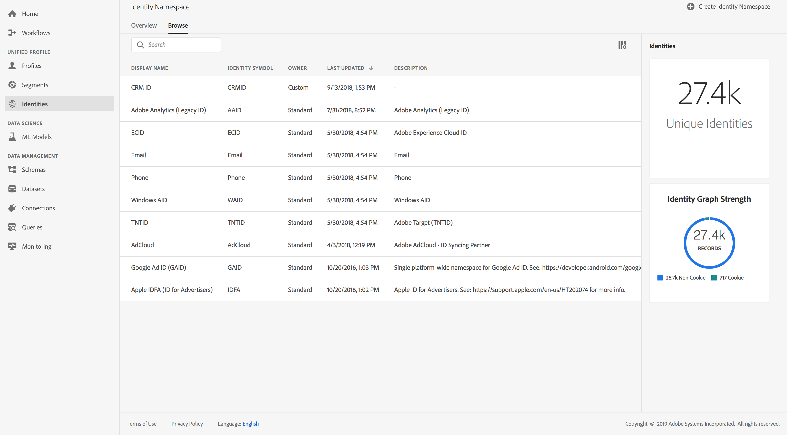

# Identity namespace overview

Identity namespaces are a component of [Identity Service](../identity_services_architectural_overview/identity_services_architectural_overview.md) and serve as indicators of the context to which the identity relates, such as to contextualize a value of "someone<i></i>@somewhere.com" as an email address, or "443522" as a numeric ID used by a particular CRM. 

This document discusses identity namespaces in depth, and is a good starting point to help orient you if you have questions like:

* What is an identity namespace?
* How can I see what namespaces are available for use in my data?
* How can I create custom namespaces?
* How do I include namespace in my identity data?

---

## Understanding identity namespaces

A fully qualified identity includes the ID value, and a namespace. This is described in the Identity Service overview, [here](../identity_services_architectural_overview/identity_services_architectural_overview.md#identities). When matching record data across profile fragments, as when Unified Profile is merging profile data, both the identity value and the namespace must match. For example, two profile fragments with different primary IDs, but sharing the same value for the "Phone" namespace, are seen as being the same individual.

### Identity data

A consumer could be identified by the identity types listed below. The identity type is specified at the time of identity namespace creation and controls whether and how the data is handled when persisted in the identity graph. An identity type can have the following values: "Cookie", "Email", "Phone", "Device", "Cross_device".

* **Cookie** - These identities are critical for expansion and constitute majority of the graph. However, by nature they decay fast and loose their value over time. Deletion of cookie will be handled specially in the identity graph.
* **Email** - Identities of this type are personally identifiable information (PII). This is indication to Identity Service to handle the value sensitively. 
* **Phone** - Identities of this type are PII. This is indication to Identity Service to handle the value sensitively.
* **Device** - Includes IDFA, GAID & other IOT IDs. These can be shared by people in households.
* **Cross_device** -  Includes Login ID, CRM, Loyalty ID etc. This is ideally not shared. This indicates Identity Service to consider as strong people identifier and hence preserve forever.

### Standard namespaces

The following namespaces are provided for use by all organizations. These are referred to as the standard namespaces. Depending on your implementation, you may require additional namespaces. Creating custom namespaces is discussed later.

|Display Name|ID|Code|Description|
|------------|---|---|-----------|
|CORE|0|CORE|legacy name: "Adobe AudienceManager"|
|ECID|4|ECID|alias: "Adobe Marketing Cloud ID", "Adobe Experience Cloud ID", "Adobe Experience Platform ID"|
|Email|6|Email||
|Email (SHA256, lowercased)|11|Emails|Standard namespace for pre-hashed email. Values provided in this namespace must be lower-cased before hashing with SHA-256.|
|Phone|7|Phone||
|Windows AID|8|WAID||
|AdCloud|411|AdCloud|alias: Ad Cloud|
|Adobe Target|9|TNTID|Target ID|
|Google Ad ID|20914|GAID|GAID|
|Apple IDFA|20915|IDFA|ID for Advertisers|

> **Note:** The purpose of ‘code’ is to allow short hand (easy to memorize) representation of identity namespaces.

### Identity namespaces and GDPR

Identity namespaces are also used to comply with General Data Protection Regulation (GDPR) concerns, where GDPR requests can be made relative to a namespace. Visit [GDPR on Adobe Experience Platform Overview](../../../../../api-specification/markdown/narrative/gdpr/gdpr-on-platform-overview.md) for a step by step breakdown. Or, go straight to the [Adobe Experience Platform GDPR Service Overview](../../../../../api-specification/markdown/narrative/gdpr/use-cases/gdpr-api-overview.md) to understand the GDPR Service API.

---

## Managing namespaces for your organization

Adobe provides several pre-defined standard identity namespaces including a namespace for each Adobe solution, as well as for many industry standard solutions IDs such as the Windows AID (WAID) and Google Ad ID (GAID). You may also create new namespaces to represent additional systems and identity types. The namespaces you create are private to your organization.

On the Platform UI, available namespaces are listed on the Identity Namespace page, accessed by selecting "Identities" from the left rail. 

For information on listing namespaces using the API, see [Listing available namespaces](../identity_services_architectural_overview/identity_services_api.md#listing-available-namespaces).

From here you can view the details of a namespace by clicking on one listed, or select "Create Identity Namespace" to create a custom namespace. Instruction on performing these tasks via API can be found in the [Identity Service API overview](../identity_services_architectural_overview/identity_services_api.md).

---

## Namespaces in identity data

Supplying the namespace for an identity depends on the method you use for providing identity data. There are two ways to provide identity data to Identity Service; identity map, or mark a field as identity. 

For details on this, see [Include identity data in XDM](../identity_services_architectural_overview/identity_services_architectural_overview.md#include-identity-data-in-xdm).
