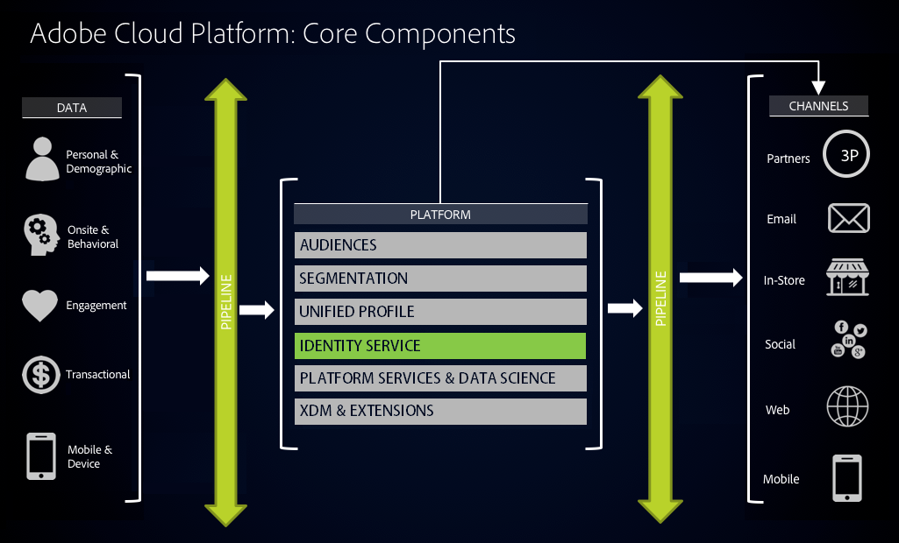

# Identity Services - Overview
<!-- The majority of the documentation here came from: https://wiki.corp.adobe.com/display/DMSArchitecture/Unified+Identity+Service+-+API+Specification-->

## 1. Overview

Delivering relevant digital experiences requires a complete identification of your end user. Unified Identity Service (UIS) provides API based access to consumer Identity Graphs which resolves a known or anonymous identity to all other known and anonymous identities of a person. Identity Graph solves the fundamental challenge posed by the fragmentation of identities and thus profiles, across multiple devices owned by a consumer, and is needed for improving the accuracy and reach of digital marketing campaigns.



## 2. Definition of Terms

### 2.1. Identity Namespace

Each of your end users could potentially be represented using as many different identifiers as there are systems of record in your infrastructure. 
With all of that profile data being ingested into the Adobe Cloud Platform, Identity Namespaces provide the context in which a given ID was set and is referenced by. 
For more information, see the [Identity Namespace Overview](../identity_namespace_overview/identity_namespace_overview.md). 

### 2.2 IMS Org Id

Customer/Partner IMS Org Id as created in Adobe's customer onboarding process. For more information, see the [Adobe I/O Authentication Overview](https://www.adobe.io/apis/cloudplatform/console/authentication/gettingstarted.html).

### 2.3 XID

Experience ID (XID) is the identity object for Experience Cloud, serving as the encapsulation of the Namespace ID (NID) and the identity in the Namespace. 
There are multiple representations of XIDs - including the existing solution specific representations such as AMO Id, Analytics Id, Target ID, AAM ID and the Marketing Cloud ID. 
All types of identities can be expressed as an XID, including a consumer identity or a physical device id.

An AMO cookie-id (for example `Was_2AAAAFZ7q3xO`) is an XID with a Namespace ID of 411.  Similarly an AAM cookie-id (for example `64077380566994308300716050799446918829`) is an XID with a namespace of 0. 
<!-- CORE-13607 - Please explain: The native serialized format also supports one way hashing of PII type of identities through the SDK. -->
Unified Identity Services provide a native serialized format of XID. A native format of XID can be obtained either using an SDK or using a REST API. 
The native serialized format also supports one way hashing of PII type of identities through the SDK.

## 3. Ingesting XDM Data to Identity Graph

### 3.1 Decide on Identity Fields

Depending on your enterprise data collection strategy, you will decide which fields you want to mark as identity.
Some examples could be:

* A Telecom company prefers ‘Phone Number’ in both offline and online data sets
* A retail company relies on ‘Email address’ in offline data sets and MCID in online data sets (because of high percentage of anonymous visitors)
* A bank prefers ‘Loyalty #’ in offline data sets and ‘login ID’ in online data sets (because 90% users are authenticated)
* Companies like Adobe prefer ‘GUID’ which is their own proprietary ID

### 3.2 Specify Record IDs

When ingesting data conforming to the Profile XDM, specify the relevant IDs by adding them to the `identities` array. For example: 

```JSON
{
  "identities": [
    { 
      "xid": "GU8rb925s2L2fkF55boQKCbliQ8", 
      "namespace": { 
        "code": "CRMId" 
      },
      "id": "87374043487584731811119677934421981925" 
    },
    { 
      "xid": "GbZWRW8tXrZ4gABvwzC_gAAAAAAA", 
      "namespace": { 
        "code": "AVID" 
      },
      "id": "2d5eb67880006fc3-30bf800000000000" 
    },
    { 
      "xid": "A2-s19jafhDickW6PP0c5dpi", 
      "namespace": { 
        "code": "mcId" 
      },
      "id": "82781972020839607487123257673310321221" 
    }
  ]
}
```

For data conforming to the ExperienceEvent XDM, identities can be provided as an entry in `endUserIds`:

```JSON
{
  "endUserIds": { 
    "_vendor": { 
      "adobe": { 
        "experience": { 
          "mcId": { 
            "id": "55115069898928455152185628961882945298", 
            "namespace":{ 
              "code": "mcId" 
            }
          }, 
          "analytics": { 
            "id": { 
              "id": "2d542d820000593e-045f400000000035", 
              "namespace":{
                "code": "AVID"
              } 
            }
          }
        }
      }
    }
  }
}
```

### 3.2 Tag DataSet

UIS maintains XDM data in the identity graph which can be updated via batch or stream ingestion. 
XDM data can be ingested into the UIS based on and triggered by batch data being [ingested](../ingest_architectural_overview/ingest_architectural_overview.md) and managed by [Data Catalog Service](../catalog_architectural_overview/catalog_architectural_overview.md).

Enablement for ingestion by identity graph is handled by a tag on a DataSet, named specifically "unifiedIdentity".

```http request
PATCH https://platform.adobe.io/data/foundation/catalog/dataSets/5a7d26e92a6e55000086d459 HTTP/1.1
```

__Example body__

```json
{
    "tags" :  {
        "unifiedIdentity": ["enabled:true"]
    }
}
```

Most use cases require data to be used by both [Unified Profile Services](../unified_profile_architectural_overview/unified_profile_architectural_overview.md) and UIS. 
Below is an example of adding tags enable your data to be ingested to both systems.

```
PATCH https://platform.adobe.io/data/foundation/catalog/dataSets/5a7d26e92a6e55000086d459 HTTP/1.1
```

__Example body__

```json
{
    "tags" :  {
        "unifiedProfile": ["enabled:true"],
        "unifiedIdentity": ["enabled:true"]
    }
}
```

## 4. ECID - An Essential Tool

Experience Cloud ID Service (ECID) is Adobe’s client side tool to perform identity management, serving three primary functions:

*  Identify each visitor 
*  Provide synchronization with Partners 
*  Feed pairwise links to connect with offline or other IDs to the graph

Identifying your online users requires instrumentizing your site or mobile app with the ECID, which provides a universal and persistent ID that identifies your visitors across all solutions in the Experience Cloud.
 
If you are working with a website implementation, explore the resources [here](https://marketing.adobe.com/resources/help/en_US/mcvid).

If you are working with a mobile app, see how ECID is used to [track visitors between an app and mobile web](https://marketing.adobe.com/resources/help/en_US/mobile/ios/hybrid_app.html).

Deploying these tools can be simple and easy to manage if you use [Adobe Launch](https://docs.adobelaunch.com).

Also, see the [GDPR Documentation](https://www.adobe.io/apis/cloudplatform/gdpr/docs/alldocs.html#!api-specification/markdown/narrative/gdpr/gathering-your-ids.md) for information on using ECID for GDPR compliance.

## 5. Identity Services API

<!-- CORE-15066 - TODO: what use-cases to use the API? -->

### 5.1 Using the API

This section describes interacting with Identity Namespace Services using Adobe's Platform APIs. 
See the [Adobe I/O Authentication Overview](https://www.adobe.io/apis/cloudplatform/console/authentication/gettingstarted.html) for information on how to access these services.

 Before you start using the APIs, please read though these notes.

* All variations of Cluster and Mapping APIs support both XID and NID in their requests and response. One of the parameters is required - `xid` or combination of (`nsid`, `id`) to use these APIs
* To limit the payload in response, APIs are adapt their responses to `xid` or `uid`. That is, if you pass XID your responses will have XIDs, if you pass NID responses will have NIDs
* The below examples don't cover all usages of XIDs and NIDs. For the complete API, see [the Swagger](https://git.corp.adobe.com/pages/experience-platform/api-specification) by selecting Core Services/Identity Services from the __Select a spec__ drop down menu on the top right

#### 5.2 Required Headers

All APIs in this document require the following headers unless otherwise indicated:

|Header|Value|Description|
|---|---|---|
|content-type|application/json|The input content type (Only for POST)|
|Authorization|Bearer {TOKEN}|The IMS service token used for authenticating the caller, prefixed with the string "Bearer "|
|Accept|application/vnd.adobe.identity+json;version=1.2|The version of the resource's representation|
|x-gw-ims-org-id|{imsOrgId}, Eg: 17FA2AFD56CF35747F000101@AdobeOrg|The IMS Org ID of client|
|x-api-key|API key|The Client ID/API key of whitelisted client|

## 6. Working with Identity Services

As the single source of truth for identity resolution in the Adobe Cloud Platform, Identity Services provide the following behavior:

* __Generation of ID__ - establishment of links between namespaces
* __Computation of identity clusters__ - internal device graph resolves device specific identities
* __Access to identify clusters and mappings through APIs__ - this document covers the Identity Services API

The following are examples meant to describe the way the UIS APIs behave. 
For details on the complete API, see [the Swagger](https://git.corp.adobe.com/pages/experience-platform/api-specification) by selecting Core Services/Identity Services from the __Select a spec__ drop down menu on the top right.

### 6.1 Get XID

Given the Namespace (identified by Namespace ID (e.g. "411") or Namespace code (e.g. "AMO") as `nsId` or `ns` respectively) and `id` in that Namespace, returns XID string.

```http request
GET https://platform.adobe.io/data/core/identity?nsId=411&id=WTCpVgAAAFq14FMF HTTP/1.1
```

or

```http request
GET https://platform.adobe.io/data/core/identity?ns=AMO&id=WTCpVgAAAFq14FMF HTTP/1.1
```

__Example cURL requests__

```
# Request for stubbed data
curl -X GET \
  'https://platform.adobe.io/data/core/identity/identity?nsId=411&id=WTCpVgAAAFq14FMF' \
  -H 'authorization: CALLERS_IMS_SERVICE_TOKEN' \
  -H 'x-api-key: CALLERS_API_KEY/CLIENT_ID' \
  -H 'x-uis-cst-ctx: stub' \
  -H 'x-gw-ims-org-id: 111'
 
# Real API
curl -X GET \
  'https://platform.adobe.io/data/core/identity/identity?nsId=411&id=WTCpVgAAAFq14FMF' \
  -H 'authorization: CALLERS_IMS_SERVICE_TOKEN' \
  -H 'x-api-key: CALLERS_API_KEY/CLIENT_ID' \
  -H 'x-gw-ims-org-id: 111'
```

 NOTE: Usage of `x-uis-cst-ctx: stub` header will return a stubbed response. 
This is only a stop gap solution for our consumers to facilitate early integration development progress, while services are being completed. 
We will keep our consumers advised to when this is no longer needed or supported.

__Example response__

Returns an HTTP 200 OK on success.

```json
{
    "xid": "CJsDEAMaEAHmCKwPCQYNvzxD9JGDHZ8"
}
```

### 6.2 Cluster Members API

Given an XID return all XIDs, in the same or other Namespaces, that are linked to it by the device graph type. The related XIDs are considered to be part of the same "cluster". 

 NOTE: Use optional `graph-type` parameter to indicate the output type to get the cluster from. Options are:

* __coop__ - graph built by using coop data
* __pdg__ - private device graph  
* __psr__ - propriatery stiched rules

```http request
GET https://platform.adobe.io/data/core/identity/cluster/members?xid=CJsDEAMaEAHmCKwPCQYNvzxD9JGDHZ8 HTTP/1.1
```

or

```http request
GET https://platform.adobe.io/data/core/identity/cluster/members?nsId=411&id=WTCpVgAAAFq14FMF HTTP/1.1
```

or

```http request
GET https://platform.adobe.io/data/core/identity/cluster/members?ns=AMO&id=WTCpVgAAAFq14FMF HTTP/1.1
```


OR, use `POST` as a batch equivalent of `GET` method. Returns the XIDs that belong to the same cluster, for multiple XIDs.

 NOTE: Caller should limit their requests to 1000 XIDs. Request exceeding 1000 XIDs will result in 400 status code.

```http request
POST https://platform.adobe.io/data/core/identity/clusters/members HTTP/1.1
```

__Example body__ 

```json
{
    "xids": ["GYMBWaoXbMtZ1j4eAAACepuQGhs","b2NJK9a5X7x4LVE4rUqkMyM"]
}
```

or

```json
{
    "xids": ["GYMBWaoXbMtZ1j4eAAACepuQGhs","b2NJK9a5X7x4LVE4rUqkMyM"],
    "graph-type": "coop"
}
```

or

```json
{
    "compositeXids": [{
            "nsid": 411,
            "id": "WRbM7AAAAJ_PBZHl"
        },
        {
            "nsid": 411,
            "id": "WY-RNgAAArI4rGBo"
        }
    ],
    "graph-type": "coop"
}
```

__Example cURL requests__

```
## Stub
curl -X POST \
  https://platform.adobe.io/data/core/identity/clusters/members \
  -H 'authorization: CALLERS_IMS_SERVICE_TOKEN' \
  -H 'content-type: application/json' \
  -H 'x-api-key: CALLERS_API_KEY/CLIENT_ID' \
  -H 'x-uis-cst-ctx: stub' \
  -H 'x-gw-ims-org-id: B3349894589501FE0A494034@AdobeOrg' \
  -d '{
    "xids": ["GYMBWaoXbMtZ1j4eAAACepuQGhs","b2NJK9a5X7x4LVE4rUqkMyM"]
}'
  
## Real Call - Using XIDs
curl -X POST \
  https://platform.adobe.io/data/core/identity/clusters/members \
  -H 'authorization: CALLERS_IMS_SERVICE_TOKEN' \
  -H 'content-type: application/json' \
  -H 'x-api-key: CALLERS_API_KEY/CLIENT_ID' \
  -H 'x-gw-ims-org-id: B3349894589501FE0A494034@AdobeOrg' \
  -d '{
    "xids": ["GYMBWaoXbMtZ1j4eAAACepuQGhs","b2NJK9a5X7x4LVE4rUqkMyM"],
    "graph-type": "coop"
}' | json_pp
  
## Real Call - Using UIDs
curl -X POST \
  https://platform.adobe.io/data/core/identity/clusters/members \
  -H 'authorization: CALLERS_IMS_SERVICE_TOKEN' \
  -H 'content-type: application/json' \
  -H 'x-api-key: CALLERS_API_KEY/CLIENT_ID' \
  -H 'x-gw-ims-org-id: B3349894589501FE0A494034@AdobeOrg' \
  -d '{
    "compositeXids": [{
            "nsid": 411,
            "id": "WRbM7AAAAJ_PBZHl"
        },
        {
            "nsid": 411,
            "id": "WY-RNgAAArI4rGBo"
        }
    ],
    "graph-type": "coop"
}' | json_pp
```

 Usage of `x-uis-cst-ctx: stub` header will return a stubbed response. 
This is only a stop gap solution for our consumers to facilitate early integration development progress, while services are being completed. 
We will keep our consumers advised to when this is no longer needed or supported.

__Example stubbed response__

```json
{
   "version": 1,
   "clusters": [{
           "xid": "GZsBQnHQaGtL46ZKSvO9bNRE1DcUyQA",
           "compositeXid": {
               "nsid": 411,
               "id": "WRbM7AAAAJ_PBZHl"
           },
           "members": ["e8138f65-d3d3-4485-a7e1-6712e047349d", "21312343536983537571245438594"],
           "members": [{
                   "nsid": 0,
                   "id": "27064814400205787570627663430729680462"
               },
               {
                   "nsid": 411,
                   "id": "86826386186182763871263871263876128612"
               }
           ]
       },
       {
           "xid": "CJsDEAMaEAHmCKwPCQYNvzxD9JGDHZ8",
           "compositeXid": {
               "nsid": 411,
               "id": "WRbM7AAAAJ_PBZHl"
           },
           "members": [],
           "members": []
       }
   ],
   "unprocessedXids": ["cb0665db616f49758713252d8a335c1e"],
   "unprocessedNids": [{
       "nsid": 411,
       "id": "WY-RNgAAArI4rGBo"
   }]
}
``` 

__Example real response__

```json
{
   "unprocessedXids": [],
   "unprocessedNids": [],
   "version": "1.0.0",
   "clusters": [{
           "xid": "411|WRbM7AAAAJ_PBZHl",
           "members": [
               "411|WRbM7AAAAJ_PBZHl",
               "0|47713142741924778930324734610798294416"
           ],
           "compositeXid": {
               "nsid": 411,
               "id": "WRbM7AAAAJ_PBZHl"
           },
           "members": [{
                   "nsid": 411,
                   "id": "WRbM7AAAAJ_PBZHl"
               },
               {
                   "nsid": 0,
                   "id": "47713142741924778930324734610798294416"
               }
           ]
       },
       {
           "xid": "411|WY-RNgAAArI4rGBo",
           "compositeXid": {
               "nsid": 411,
               "id": "WY-RNgAAArI4rGBo"
           },
           "members": [
               "411|WY-RNgAAArI4rGBo",
               "411|WY-RNgAAArI4rGGy"
           ],
           "members": [{
                   "nsid": 411,
                   "id": "WY-RNgAAArI4rGBo"
               },
               {
                   "nsid": 411,
                   "id": "WY-RNgAAArI4rGGy"
               }
           ]

       }
   ]
}
```
   
 The response will always have one entry for each XID provided in the request regardless of whether a request's XIDs belong to the same cluster or if one or more have any cluster associated at all.

### 6.3 Cluster History API

Given an XID, return all cluster associations with that XID. Cluster Associations - XIDs can move clusters over the course of various device graph runs, this API provides cluster id associations of a given XID over time.

 NOTE: Use optional `graph-type` parameter to indicate the output type to get the cluster from. Options are:

* __coop__ - graph built by using coop data
* __pdg__ - private device graph  
* __psr__ - proprietary stitched rules

```http request
GET https://platform.adobe.io/data/core/identity/cluster/history?xid=CJsDEAMaEAHmCKwPCQYNvzxD9JGDHZ8 HTTP/1.1
```

or

```http request
GET https://platform.adobe.io/data/core/identity/cluster/history?nsId=411&id=WTCpVgAAAFq14FMF HTTP/1.1
```

or

```http request
GET https://platform.adobe.io/data/core/identity/cluster/history?ns=AMO&id=WTCpVgAAAFq14FMF HTTP/1.1
```

OR, use POST as a batch equivalent of GET method. Returns the cluster history for each of the given XIDs.

 Caller should limit their requests to 1000 XIDs. Request exceeding 1000 XIDs will result in 400 status code.

```http request
POST https://platform.adobe.io/data/core/identity/clusters/history HTTP/1.1
```

__Example body__


```json
{
    "xids": ["GYMBWaoXbMtZ1j4eAAACepuQGhs","b2NJK9a5X7x4LVE4rUqkMyM"],
    "graph-type": "coop"
}
```

or

```json
{
    "xids": ["GYMBWaoXbMtZ1j4eAAACepuQGhs","b2NJK9a5X7x4LVE4rUqkMyM"],
    "graph-type": "coop"
}
```

or

```json
{
    "compositeXids": [{
            "nsid": 411,
            "id": "WRbM7AAAAJ_PBZHl"
        },
        {
            "nsid": 411,
            "id": "WY-RNgAAArI4rGBo"
        }
    ],
    "graph-type": "coop"
}
```

__Example cURL requests__

```
#Stub Response
curl -X POST \
  https://platform.adobe.io/data/core/identity/clusters/history \
  -H 'authorization: CALLERS_IMS_SERVICE_TOKEN' \
  -H 'content-type: application/json' \
  -H 'x-api-key: CALLERS_API_KEY/CLIENT_ID' \
  -H 'x-gw-ims-org-id: B3349894589501FE0A494034@AdobeOrg' \
  -H 'x-uis-cst-ctx: stub' \
  -d '{
    "xids": ["GYMBWaoXbMtZ1j4eAAACepuQGhs","b2NJK9a5X7x4LVE4rUqkMyM"],
    "graph-type": "coop"
}'
 
 
# Using XIDs
curl -X POST \
  https://platform.adobe.io/data/core/identity/clusters/history \
  -H 'authorization: CALLERS_IMS_SERVICE_TOKEN' \
  -H 'content-type: application/json' \
  -H 'x-api-key: CALLERS_API_KEY/CLIENT_ID' \
  -H 'x-gw-ims-org-id: B3349894589501FE0A494034@AdobeOrg' \
  -d '{
    "xids": ["GYMBWaoXbMtZ1j4eAAACepuQGhs","b2NJK9a5X7x4LVE4rUqkMyM"],
    "graph-type": "coop"
}' | json_pp
 
# Using UIDs
curl -X POST \
  https://platform.adobe.io/data/core/identity/clusters/history \
  -H 'authorization: CALLERS_IMS_SERVICE_TOKEN' \
  -H 'content-type: application/json' \
  -H 'x-api-key: CALLERS_API_KEY/CLIENT_ID' \
  -H 'x-gw-ims-org-id: B3349894589501FE0A494034@AdobeOrg' \
  -d '{
    "compositeXids": [{
            "nsid": 411,
            "id": "WRbM7AAAAJ_PBZHl"
        },
        {
            "nsid": 411,
            "id": "WY-RNgAAArI4rGBo"
        }
    ],
    "graph-type": "coop"
}' | json_pp
```

 Usage of `x-uis-cst-ctx: stub` header will return a stubbed response. 
This is only a stop gap solution for our consumers to facilitate early integration development progress, while services are being completed. 
We will keep our consumers advised to when this is no longer needed or supported.

__Example response__

```json
{
    "version": 1,
    "xidsClusterHistory": [{
            "xid": "GZsBQnHQaGtL46ZKSvO9bNRE1DcUyQA",
            "compositeXid": {
                "nsid": 411,
                "id": "WY-RNgAAArI4rGBo"
            },
            "clusterHistory": [{
                    "clusterId": "4c686f23-0871-41c2-b4f4-adef89f6bd2c",
                    "cRecordedTS": "1504741401382"
                },
                {
                    "clusterId": "29bf066c-971a-11e7-abc4-cec278b6b50a",
                    "cRecordedTS": "1502063001629"
                },
                {
                    "clusterId": "aeb2f60c-b0f1-446a-91dd-d28ab6a44ff9",
                    "cRecordedTS": "1499384601763"
                }
            ]
        },
        {
            "xid": "CJsDEAMaEAHmCKwPCQYNvzxD9JGDHZ8",
            "compositeXid": {
                "nsid": 411,
                "id": "WY-RNgAAArI4rGBo"
            },
            "clusterHistory": [{
                "clusterId": "4c686f23-0871-41c2-b4f4-adef89f6bd2c",
                "cRecordedTS": "1504741401937"
            }]
        }
    ],
    "unprocessedXids": ["cb0665db616f49758713252d8a335c1e"],
    "unprocessedNids": [{
        "nsid": 411,
        "id": "WY-RNgAAArI4rGBo"
    }]
 
}
```

 The response will always have one entry for each XID provided in the request regardless of whether a request's XIDs belong to the same cluster or if one or more have any cluster associated at all.

### 6.4 Mapping API

Given an XID, returns all XID mappings in the requested Namespace (targetNs).

```http request
GET https://platform.adobe.io/data/core/identity/mapping?xid=CJsDEAMaEAHmCKwPCQYNvzxD9JGDHZ8 HTTP/1.1
```

or

```http request
GET https://platform.adobe.io/data/core/identity/mapping?nsId=411&id=WTCpVgAAAFq14FMF HTTP/1.1
```

or

```http request
GET https://platform.adobe.io/data/core/identity/mapping?ns=AMO&id=WTCpVgAAAFq14FMF HTTP/1.1
```

Or, use POST as a batch equivalent of GET method. Returns mappings for multiple identities.

 Caller should limit their requests to 1000 XIDs. Request exceeding 1000 XIDs will result in 400 status code.

```http request
POST https://platform.adobe.io/data/core/identity/mappings HTTP/1.1
```

__Example body__

```json
{
 "xids" : ["GesCQXX0CAESEE8wHpswUoLXXmrYy8KBTVgA"],
 "targetNs": "0",
 "graph-type": "coop"
}
```

or 

```json
{
    "compositeXids": [{
            "nsid": 411,
            "id": "WRbM7AAAAJ_PBZHl"
        },
        {
            "nsid": 411,
            "id": "WY-RNgAAArI4rGBo"
        }
    ],
 "targetNs": "0",
 "graph-type": "coop"
}
```

__Example cURL requests__

```
# Using XIDs
curl -X POST \
  https://platform.adobe.io/data/core/identity/mappings \
  -H 'authorization: CALLERS_IMS_SERVICE_TOKEN' \
  -H 'content-type: application/json' \
  -H 'x-api-key: CALLERS_API_KEY/CLIENT_ID' \
  -H 'x-gw-ims-org-id: 111111@AdobeOrg' \
  -d '{
 "xids" : ["GesCQXX0CAESEE8wHpswUoLXXmrYy8KBTVgA"],
 "targetNs": "0",
 "graph-type": "coop"
}' | json_pp
  
# Using UIDs
curl -X POST \
  https://platform.adobe.io/data/core/identity/mappings \
  -H 'authorization: CALLERS_IMS_SERVICE_TOKEN' \
  -H 'content-type: application/json' \
  -H 'x-api-key: CALLERS_API_KEY/CLIENT_ID' \
  -H 'x-gw-ims-org-id: 111111@AdobeOrg' \
  -d '{
    "compositeXids": [{
            "nsid": 411,
            "id": "WRbM7AAAAJ_PBZHl"
        },
        {
            "nsid": 411,
            "id": "WY-RNgAAArI4rGBo"
        }
    ],
 "targetNs": "0",
 "graph-type": "coop"
}' | json_pp
```

If no related identities were found with the provided input, an `HTTP 204` response code is returned with no content.

 Usage of `x-uis-cst-ctx: stub` header will return a stubbed response. 
This is only a stop gap solution for our consumers to facilitate early integration development progress, while services are being completed. 
We will keep our consumers advised to when this is no longer needed or supported.

__Example response__
<!-- CORE-15066 - Duplicate key: mapping... Should this be broken out into valid JSON objects? -->

```JSON
{
    "version": 1,
    "mappings": [{
        "xid": "CAESEPl1uYyma1kMDWxx7dhbwGo",
        "mapping": [{
            "xid": "81218968060697815473313992060878182012",
            "lastAssociationTime": "1493310475047"
        }],
        "compositeXid": {
            "nsid": 411,
            "id": "WY-RNgAAArI4rGBo"
        },
        "mapping": [{
            "compositeXid": {
                "nsid": 411,
                "id": "WY-RNchvdsTSJS"
            },
            "lastAssociationTime": "1493310475047"
        }],
 
        "regions": [{
            "regionId": "10",
            "lastAssociationTime": "1493310475047"
        }]
    }],
    "unprocessedXids": ["cb0665db616f49758713252d8a335c1e"],
    "unprocessedNids": [{
        "nsid": 411,
        "id": "WY-RNgAAArI4rGBo"
    }]
}
```

Where `lastAssociationTime` represents the timestamp when the input identity was last associated with this this identity and a `region` is a tuple of `regionId` and `lastAssociationTime` for where the identity was seen.
