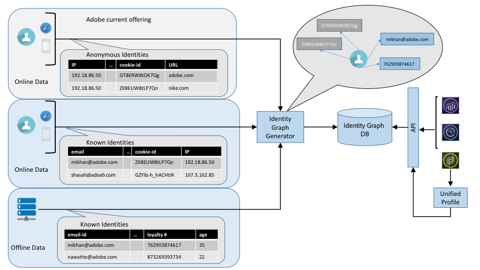

# Identity Services - Technical Overview
<!-- The majority of the documentation here came from: https://wiki.corp.adobe.com/display/DMSArchitecture/Unified+Identity+Service+-+API+Specification-->

## 1. Overview

Delivering right and relevant digital experiences requires a correct and complete identification of your End User. Identity Service provides API based access to consumer Identity Graphs which resolves a known or anonymous identity to all other known and anonymous identities of a person. Identity Graph solves the fundamental challenge posed by the fragmentation of identities and thus profiles, across multiple devices owned by a consumer, and is needed for improving the accuracy and reach of digital marketing campaigns.

## 2. Definition of Terms

### 2.1 XID

Experience ID (XID) is the identity object for Experience Cloud, serving as the encapsulation of the Namespace ID (NID) and the identity in the Namespace. There are multiple representations of XIDs - including the existing solution specific representations such as AMO Id, Analytics Id, Target ID, AAM ID and the Marketing Cloud ID. All types of identities can be expressed as an XID, including a consumer identity or a physical device id.

An AMO cookie-id (for example `Was_2AAAAFZ7q3xO`) is an XID with a Namespace ID of 411.  Similarly an AAM cookie-id (for example `64077380566994308300716050799446918829`) is an XID with a namespace of 0. 
<!-- CORE-13607 - Please explain: The native serialized format also supports one way hashing of PII type of identities through the SDK. -->
Identity Services provide a native serialized format of XID. A native format of XID can be obtained either using an SDK or using a REST API. The native serialized format also supports one way hashing of PII type of identities through the SDK.

### 2.2. Identity Namespace

Profile data in the ACP is an aggregate of data from varying solutions, creating the need to qualify a given identifier with the system from which it comes. Namespaces are a cornerstone of the Identity Services. For more information, see the [Identity Namespace Overview](../identity_namespace_overview/identity_namespace_overview.md). 

### 2.3 IMS Org Id

Customer/Partner IMS Org Id as created in Adobe's customer onboarding process. For more information, see the [Adobe I/O Authentication Overview](https://www.adobe.io/apis/cloudplatform/console/authentication/gettingstarted.html).

## 3. Components

Identity services can be used to identify users of your website or mobile app. For more information on implementation, see [Experience Cloud ID Service](https://marketing.adobe.com/resources/help/en_US/mcvid/) documentation.

For more information on using Identity Services for GDPR, see [Gathering Your IDs](https://www.adobe.io/apis/cloudplatform/gdpr/docs/alldocs.html#!api-specification/markdown/narrative/gdpr/gathering-your-ids.md) for GDPR.

