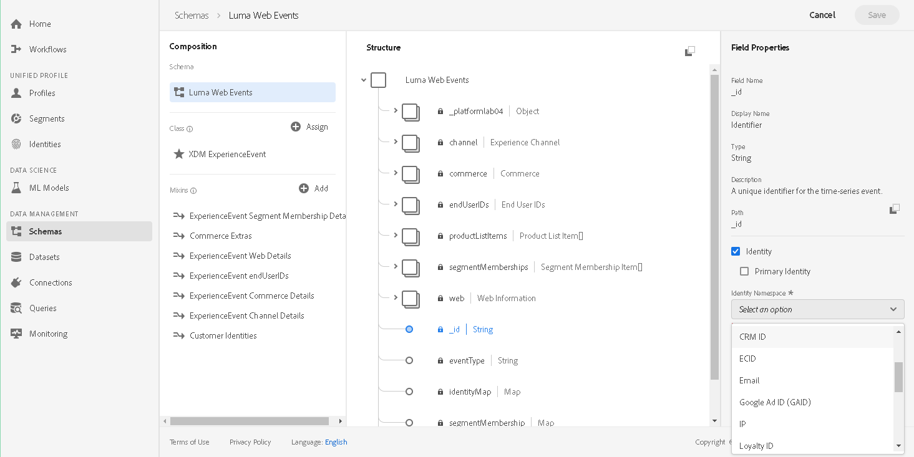
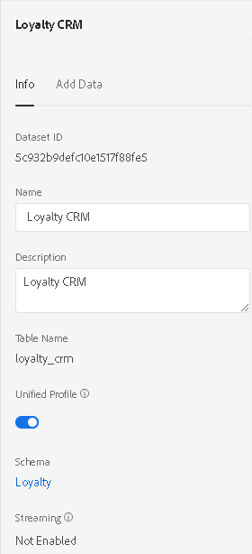

# Identity Service overview

Delivering relevant digital experiences requires resolving all identities of each of your end users, giving you the power to react to your consumers based on unlimited aspects of their profile or behavior. Identity Service solves the fundamental challenge posed by the disconnected identities of your customers caused by the fragmented nature of their data as it exists across each of the disparate systems at play in your organization's ecosystem. It does this by bridging identities across devices and across the various systems used by your consumers to engage with your brand. In this way, Identity Service facilitates a complete understanding of your customers and their behavior so you can deliver impactful digital experiences in real-time.

This document describes the function and use of Identity Service on Adobe Experience Platform.

In specific, this document will help orient you if you have questions like:

* What is Identity Service, and what are the related components?
* How might unified profiles work for me, and what role does Identity Service play in that?
* What is an identity graph, and what options do I have for finding related identities?
* How do I provide identity data, and how does Identity Service manage my private identity graph?
* How do I use Identity Service to work with my identity graph directly, as an integration?

---

## Understanding Identity Service

Each day, you receive countless visits from consumers seeking a relationship with your brand. A typical consumer may have data and activity in any number of the systems at play in your organization's infrastructure, such as your eCommerce, loyalty and help-desk systems. That same consumer may also engage anonymously on any number of devices. Identity Service provides the power to piece together the complete picture of your consumers, facilitating the aggregation of related data otherwise existing in silos across disparate systems.

Consider an every day example of a consumer's relationship with your brand.

> Mary has an account on your eCommerce site where she has completed a few orders in the past. She typically uses her personal laptop to shop, where she logs in each time. She visits your site on her tablet and shops for sandals, but doesn't place an order and doesn't log in. 
> 
> At this point, Mary's activity appears as two separate profiles: Mary's eCommerce login and her device, perhaps identified by device ID. 
> 
> When Mary subscribes to your newsletter on her tablet and enters her email address, send the updated record data using Streaming Ingestion, updating the profile data and adding the new identity: the email address. Identity Service now relates Mary's device activity with her eCommerce account history.
> 
> By the next click on her tablet, your targeted content could reflect Mary's full profile and history, rather than just a tablet used by a window shopper. 

By uploading all identity data, Identity Service builds and maintains relationships between identities found to be related, facilitating the unified profile. For more on this, visit the [Unified Profile overview](../unified_profile_architectural_overview/unified_profile_architectural_overview.md). Identity Service can also be used in your integrations. To learn more, start with the [Identity Service API overview](identity_service_api.md).


### Identities

An identity is data that can be used to identify an individual, where an individual could be a person or organization. An identity such as a login ID, ECID, and loyalty ID, is referred to as a known identity. Personally identifiable information (PII) is information that can identify a person directly. PII is profile data such as email address and phone number, and is the data which would be used to match a person across systems.

Unknown, or anonymous identities single out a device without identifying the actual person. Included in this category are a visitor's IP address, ECID, or AMO cookie ID. Much behavioral data could be obtained as performed on a device using unknown identities, but associating identities across devices or mediums is limited until your users supply PII during their journey.

Some examples could be:

* A Telecom company may rely on the "phone number" value, where a phone number would refer to the same individual of interest in both offline and online data sets
* A retail company may use "email address" in offline data sets and ECID in online data sets, perhaps because of the high percentage of anonymous visitors
* A bank may prefer "account number" in offline data sets, such as branch transactions. They may depend on "login ID" in online data sets, because most visitors would be authenticated during their visit
* Companies like Adobe prefer the "GUID" value, a proprietary ID

### Identity data

Consider this question:

> What is your ID?

It would be impossible to interpret any value provided in response to that question without context. The string value representing an identity value, whether it is a system generated ID or an email address, is only complete when supplied with a qualifier that gives the string value context; the identity namespace.

### Identity namespaces

Identity namespaces provide the context in which a given ID can be used to look up or refer to an individual and serves to compartmentalize the value provided as the identity value.

Identity namespaces also prevent collision of identities that belong to different namespaces. For example, ID "123456" may refer to one person in your eCommerce system, and someone altogether different in your help desk system. For more information, see the [Identity Namespace overview](../identity_namespace_overview/identity_namespace_overview.md).

### Identity graphs

An identity graph is a map of relationships between identities that updates with customer activity in near real time. Identity Service manages an identity graph visible by only your organization and built based on your data, referred to as the private graph. Identity Service augments your private graph when a record of ingested data contains more than one identity, adding a relationship between the identities found.

As an example of the potential types of factors to consider when supplying and labeling identity data: Using phone numbers such as "work phone" may result in more relationships than you intend in the identity graph. You may find many employees refer to the same number for work, and that "home" and "mobile" better serve to keep relationships as precise as possible.

<!-- Update this section with reference to Co-op doc when it's avail -->

---

## Supplying identity data to Identity Service

This section discusses the ways to format and send identity data to Platform for Identity Service to process and build your private identity graph.

### Decide on identity fields

Depending on your enterprise data collection strategy, you will decide which fields you want to mark as identity, or which data to include in your identity map. To get the maximum benefit of Platform and the most complete identities, you should upload both online and offline data. Online data is data such as a username or perhaps email address, and describes online presence and behavior. Offline data refers to data such as from your CRM or the ID from a loyalty program and makes your identities more robust and provides cohesion of the data across your disparate systems.

### Create needed identity namespaces

To properly categorize your identities, you may need to create additional namespaces. For information on viewing and creating namespaces, view the section [View and create namespaces for your organization](../identity_namespace_overview/identity_namespace_overview.md#view-and-create-namespaces-for-your-organization) in the identity namespace overview.

> **Note:** Namespaces are a qualifier for identities. As such, once a namespace has been created, it cannot be deleted.

### Include identity data in XDM

Both consumer record and time series schemas provide the means to include identity data. As data is ingested, data fragments containing more than one identifier create new relationships in the identity graph between those identities.

There are two ways to include identities in XDM data. You may use either or both simultaneously.

* Mark XDM fields as identity - Label an XDM field such that values are interpreted as identities in Identity Service automatically.
* Identity map - An `identitymap` is a standard XDM mixin that is a collection of identities related to an individual, included in the Record and Time Series schemas.

#### Marking XDM fields as identity

Any string typed field in schemas implementing either record or time series XDM classes can be labeled as an identity field, and is the recommended approach for sending identity data to Identity Service. After doing so, any value provided for that attribute would be considered an identity and the identity graph would be enhanced with the relationships between it and the other identities in the data. 

By using identity fields, identities can be linked as they are found to share PII values organically. For instance, by labeling phone number fields as identity, Identity Service automatically graphs relationships with the other individuals found using the same phone number.

An XDM schema field can be labeled as identity using the Experience Platform UI or the Identity Service API. The namespace of resulting identities is provided at the time the field is labeled.

To learn how to label an identity field via API, see [Defining descriptors in the API](../schema_registry/schema_registry_developer_guide.md#defining-descriptors-in-the-api).

Using the UI, the tools to mark a field as identity are located on the right side rail when viewing the schema. You will be presented with an option to mark the field as "Primary Identity" as well as a dropdown list of "Identity Type" (namespaces) options available to your organization.



#### Identity maps

Identities can be provided as a map in XDM data ingested into Platform. Using this method, provide a collection of identity constructs representing known identities, keyed on the namespace.

The following demonstrates an `identityMap` construct, providing multiple values for the "Email" namespace, as well as values for other namespaces, specifying "ECID" as the primary identity.

```
{
  "identityMap": {
    "Email": [
      {
        "id": "identity_email_a@someplace.com",
        "primary": false
      },
      {
        "id": "identity_email_b@someplace.com",
        "primary": false
      }
    ],
    "ECID": [
      {
        "id": "72204922746797553008253714834957578266",
        "primary": true
      }
    ],
    "AVID": [
      {
        "id": "2e248c9f800047ed-0e99c00000000000",
        "primary": false
      }
    ],
    "CRMId": [
      {
        "id": "64847653466462621911465369865412299222",
        "primary": false
      }
    ]
  }
}
```

To gain a deeper understanding of XDM and schemas, visit [XDM System in Adobe Experience Platform](../schema_registry/xdm_system/xdm_system_in_experience_platform.md).

### Configure your dataset for Identity Service

Identity Service ingests identity data from record or time series data sent using streaming ingestion automatically, without configuration. A dataset, however, must be enabled for Identity Service before it will consume ingested data. On the Platform UI, both Unified Profile and Identity Service are enabled on a dataset using the same control - the "Unified Profile" switcher - from the right rail of the dataset's detail page. 



For information on how to do this, visit [Configuring a Dataset for Unified Profile and Identity Service using APIs](../../tutorials/unified_profile_dataset_tutorial/unified_profile_dataset_api_tutorial.md).

### Upload your data to Adobe Experience Platform

To get the most complete consumer identity, aim to upload profile and behavioral data from all of the systems where relevant data is stored, and from all systems used by your consumers to interact with your brand. 

Identity Service consumes XDM compliant data sent to Platform by way of Batch or Streaming Ingestion.

#### Batch ingestion

Batches of data can be uploaded to datasets in Platform using [Batch Ingestion](../ingest_architectural_overview/ingest_architectural_overview.md).

#### Streaming ingestion

Use Platform's [Streaming Ingestion](../streaming_ingest/getting_started_with_platform_streaming_ingestion.md) to upload data, allowing you to react to changes to your consumers' data and to their interactions with your brand near real-time. 


## Data handling

Identity Service was built with privacy in mind. Using DULE labeling, you can ensure your customers' sensitive PII is always encrypted prior to being persisted. This is accomplished by applying the `I1` label to the schema field. For more information on DULE, visit the [Data Usage Labeling and Enforcement (DULE) User Guide](../../../../../end-user/markdown/dule_overview/dule_overview.md).

Identity data under either the "email" or "phone" namespace is always encrypted by default.
