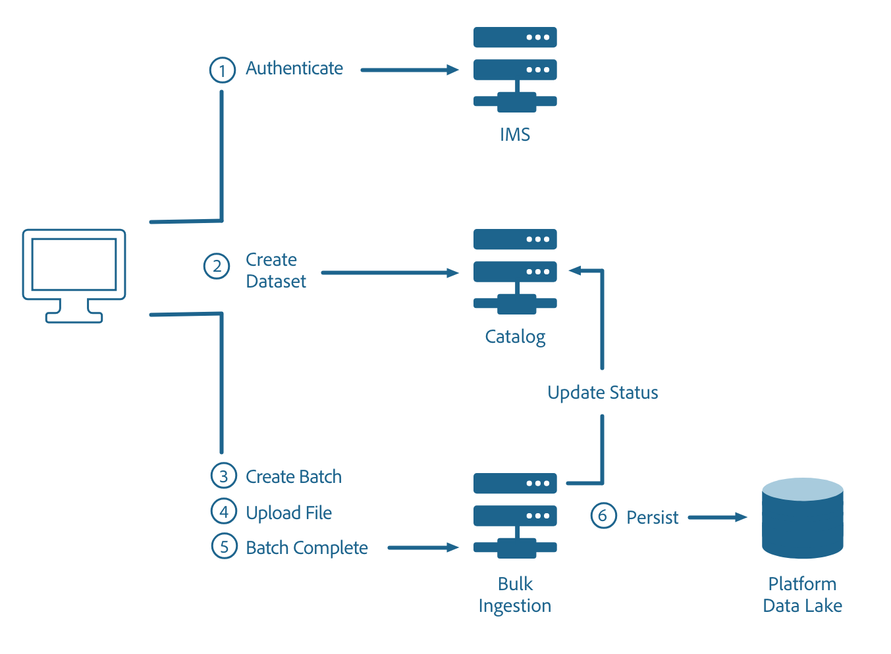

# Bulk Ingestion Overview

## 1. Overview
The Bulk Ingestion service APIs enable clients to push batch data into the Adobe Cloud Platform. This document will cover the Bulk Ingestion API.

---

## 2. Understanding the API
The Data Ingestion API is necessary for clients to be able to push batch data into the Adobe Cloud Platform.  Data being uploaded can either be ad hoc (eg. profile data from a CRM system) or data that conforms to a known schema that is registered in the XDM registry.



## 3. API Specification Reference
The Swagger API reference documentation can be found [here](../../api-reference.html#!acpdr/swagger/bulk-ingest-api.yaml)

## 4. Using the API
The most common operation of the Data Ingestion API is to upload (ingest) data onto the Adobe Cloud platform. This is accomplished through creating a new batch (a unit of data that consists of one or more files to be ingested as a single unit), uploading files to a specified dataset that matches the data's XDM schema, and signaling the end of the batch. The following tutorial will follow this three step process to upload new batches into a pre-existing dataset.

### 4.1 Data Ingestion Pre-requisites
- Data to upload must be in [.parquet](http://parquet.apache.org/documentation/latest/) format
- A [Dataset created in Data Catalog] (../allservices.html.html#!api-specification/markdown/narrative/technical_overview/catalog_architectural_overview/catalog_architectural_overview.md)
- Contents of the parquet file must match (a subset of) the schema of the dataset being uploaded into
- Have your unique Access Token, given after authentication

### 4.2 Creating a Batch

#### POST /batches

Before data can be added to a dataset, it must be linked to a batch, which will later be uploaded into a specified dataset.

#### Request
POST /batches

```SHELL
curl -X POST "https://platform.adobe.io/data/foundation/import/batches" \
-H "accept: application/json" \
-H "x-gw-ims-org-id: {IMS_ORG}" \
-H "Authorization: Bearer {ACCESS_TOKEN}" \
-H "x-api-key : {API_KEY}"
-d '{"datasetId":"{DATASET_ID}"}'
```
**IMS_ORG:** Your IMS org credentials found in your unique Adobe Cloud Platform integration.
**ACCESS_TOKEN:** Token provided after authentication.
**API_KEY:** Your specific API key value found in your unique Adobe Cloud Platform integration.
**DATASET_ID:** The ID of the dataset to upload the files into.

#### Response
```JSON
{
    "id": "{BATCH_ID}",
    "imsOrg": "{IMS_ORG}",
    "updated": 0,
    "status": "loading",
    "created": 0,
    "relatedObjects": [
        {
            "type": "dataSet",
            "id": "{DATASET_ID}"
        }
    ],
    "version": "1.0.0",
    "tags": {},
    "createdUser": "string",
    "updatedUser": "string"
}
```
**BATCH_ID:** The ID of the batch that was just created (used in subsequent requests).
**IMS_ORG:** Your IMS org specified in the request.
**DATASET_ID:** The ID of the dataset to upload the files into.


### 4.3 File Upload
After successfully creating a new batch for uploading, files can be then be uploaded to a specific dataset.

You should be able to upload files using the Small File Upload API but if your files are too large and you start seeing gateway limits being hit(e.g. timeouts, request body size exceeded, etc.) you can switch over to the Large File Upload API, upload the file in chunks and stitch it together in the end via the Large File Upload Complete API call.

### 4.3.1 Small File Upload
Once a batch is created, data can be uploaded to a pre-existing dataset.  The file being uploaded must match the XDM schema of the dataset it will be uploaded into.

#### Request
PUT /batches/{BATCH_ID}/datasets/{DATASET_ID}/files/{FILE_NAME}

```SHELL
curl -X PUT "https://platform.adobe.io/data/foundation/import/batches/{BATCH_ID}/datasets/{DATASET_ID}/files/{FILE_NAME}.parquet" \
-H "content-type: application/octet-stream" \
-H "x-gw-ims-org-id: {IMS_ORG}" \
-H "Authorization: Bearer {ACCESS_TOKEN}" \
-H "x-api-key : {API_KEY}" \
--data-binary "@{FILE_PATH_AND_NAME}.parquet"
```
**BATCH_ID:** The ID of the batch to write files to.
**DATASET_ID:** The ID of the dataset to upload the files into.
**FILE_NAME:** Name of file as it will be seen in the dataset.
**IMS_ORG:** Your IMS org credentials found in your unique Adobe Cloud Platform integration.
**ACCESS_TOKEN:** Token provided after authentication.
**FILE\_PATH\_AND_NAME:** The path and filename of the file to be uploaded into the dataset.

#### Response
```JSON
#Status 200 OK, with empty response
```

### 4.3.2.1 Large File Upload - Create File
To upload a large file, the file must be split into smaller chunks and uploaded one at a time.

#### Request
POST /batches/{BATCH_ID}/datasets/{DATASET_ID}/files/{FILE_NAME}?action=initialize

```SHELL
curl -X POST "https://platform.adobe.io/data/foundation/import/batches/{BATCH_ID}/datasets/{DATASET_ID}/files/part1=a/part2=b/{FILE_NAME}.parquet?action=initialize" \
-H "x-gw-ims-org-id: {IMS_ORG}" \
-H "Authorization: Bearer {ACCESS_TOKEN}" \
-H "x-api-key: {API_KEY}"
```
**BATCH_ID:** The ID of the batch to write files to.
**DATASET_ID:** The ID of the dataset to upload the files into.
**IMS_ORG:** Your IMS org credentials found in your unique Adobe Cloud Platform integration.
**ACCESS_TOKEN:** Token provided after authentication.
**API_KEY:** Your specific API key value found in your unique Adobe Cloud Platform integration.

#### Response
```JSON
#Status 201 CREATED, with empty response
```

### 4.3.2.2 Large File Upload - Upload Subsequent Parts
After the file has been created, all subsequent chunks can be uploaded by making repeated PATCH requests, one for each piece of the file.

#### Request
PATCH /batches/{BATCH_ID}/datasets/{DATASET_ID}/files/{FILE_NAME}

```SHELL
curl -X PATCH "https://platform.adobe.io/data/foundation/import/batches/{BATCH_ID}/datasets/{DATASET_ID}/files/part1=a/part2=b/{FILE_NAME}.parquet" \
-H "content-type: application/octet-stream" \
-H "x-gw-ims-org-id: {IMS_ORG}" \
-H "Authorization: Bearer {ACCESS_TOKEN}" \
-H "x-api-key: {API_KEY}" \
-H "Content-Range: bytes {CONTENT_RANGE}" \
--data-binary "@{FILE_PATH_AND_NAME}.parquet"
```
**BATCH_ID:** The ID of the batch to write files to.
**DATASET_ID:** The ID of the dataset to upload the files into.
**FILE_NAME:** Name of file as it will be seen in the dataset.
**IMS_ORG:** Your IMS org credentials found in your unique Adobe Cloud Platform integration.
**ACCESS_TOKEN:** Token provided after authentication.
**FILE\_PATH\_AND_NAME:** The path and filename of the file to be uploaded into the dataset.
**CONTENT_RANGE:** The range of bytes of the file being uploaded with this request. (ex. 0-82/164)

#### Response
```JSON
#Status 200 OK, with empty response
```

### 4.4 Signal Batch Completion
After all files have been uploaded to the batch, it can be signaled for completion. By doing this, the Catalog DataSetFile entries are created for the completed files and associated with the Batch generated above. The Catalog Batch is then marked as successful which triggers any downstream flows that can then work on the now available data.

#### Request
POST /batches/{BATCH_ID}?actions=COMPLETE

```SHELL
curl -X POST "https://platform.adobe.io/data/foundation/import/batches/{BATCH_ID}?action=COMPLETE" \
-H "x-gw-ims-org-id: {IMS_ORG}" \
-H "Authorization: Bearer {ACCESS_TOKEN}" \
-H "x-api-key : {API_KEY}"
```
**BATCH_ID:** The ID of the batch to be uploaded into the dataset.
**IMS_ORG:** Your IMS org credentials found in your unique Adobe Cloud Platform integration.
**ACCESS_TOKEN:** Token provided after authentication.
**API_KEY:** Your specific API key value found in your unique Adobe Cloud Platform integration.

#### Response
```JSON
#Status 200 OK, with empty response
```
