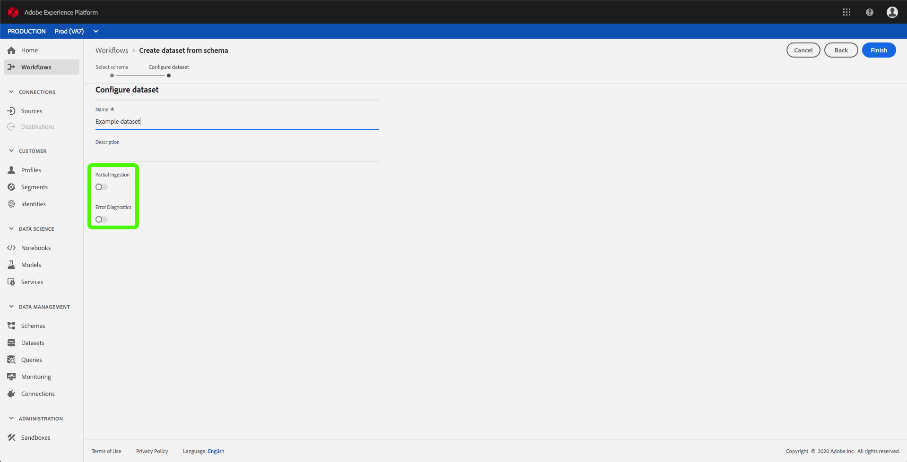
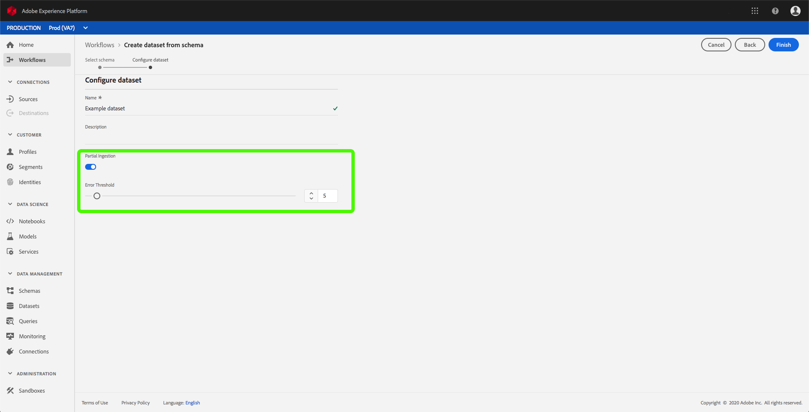
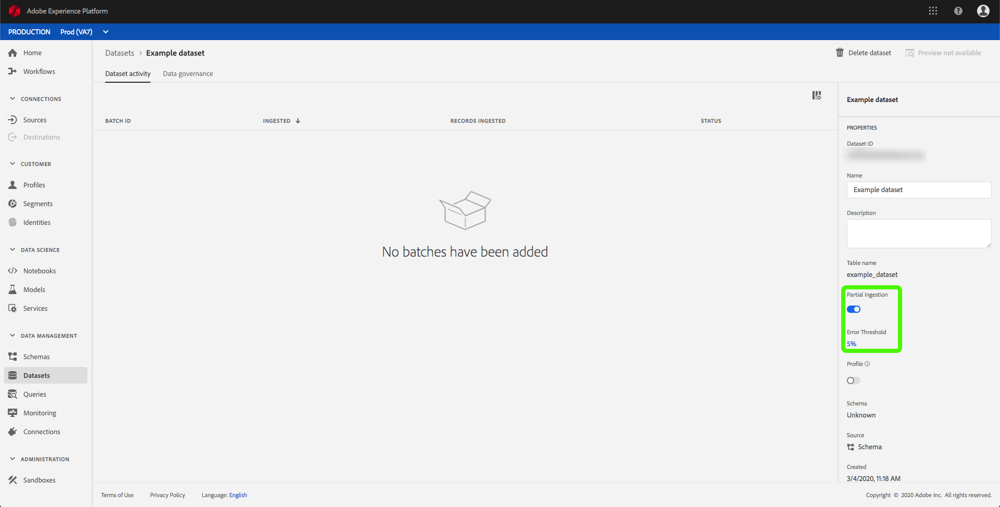

# Partial batch ingestion

Partial batch ingestion is the ability to ingest data containing errors, up to a certain threshold. With this capability, users can successfully ingest all their correct data into Adobe Experience Platform while all their incorrect data is batched separately, along with details as to why it is invalid.

This document provides a tutorial for managing partial batch ingestion. Specifically, this tutorial covers the following details:

- [Enable a dataset for partial batch ingestion in the API](#enable-a-dataset-for-partial-batch-ingestion-in-the-api)
- [Enable a dataset for partial batch ingestion in the UI](#enable-a-dataset-for-partial-batch-ingestion-in-the-ui)
- [Retrieve partial batch ingestion errors](#retrieve-partial-batch-ingestion-errors)

In addition, the [appendix](#partial-batch-ingestion-error-types) to this tutorial provides a reference for partial batch ingestion error types.

## Getting started

This tutorial requires a working knowledge of the various Adobe Experience Platform services involved with partial batch ingestion. Before beginning this tutorial, please review the documentation for the following services:

- [Batch ingestion](./ingest_architectural_overview.md): The method which Platform ingests and stores data from data files, such as CSV and Parquet.
- [Experience Data Model (XDM)](../schema_registry/xdm_system/xdm_system_in_experience_platform.md): The standardized framework by which Platform organizes customer experience data.

The following sections provide additional information that you will need to know in order to successfully make calls to Platform APIs.

### Reading sample API calls

This guide provides example API calls to demonstrate how to format your requests. These include paths, required headers, and properly formatted request payloads. Sample JSON returned in API responses is also provided. For information on the conventions used in documentation for sample API calls, see the section on [how to read example API calls](../platform_faq_and_troubleshooting/platform_faq_and_troubleshooting.md#how-do-i-format-an-api-request) in the Experience Platform troubleshooting guide.

### Gather values for required headers

In order to make calls to Platform APIs, you must first complete the [authentication tutorial](../../tutorials/authenticate_to_acp_tutorial/authenticate_to_acp_tutorial.md). Completing the authentication tutorial provides the values for each of the required headers in all Experience Platform API calls, as shown below:

- Authorization: Bearer `{ACCESS_TOKEN}`
- x-api-key: `{API_KEY}`
- x-gw-ims-org-id: `{IMS_ORG}`

All resources in Experience Platform are isolated to specific virtual sandboxes. All requests to Platform APIs require a header that specifies the name of the sandbox the operation will take place in:

- x-sandbox-name: `{SANDBOX_NAME}`

> **Note:** For more information on sandboxes in Platform, see the [sandbox overview documentation](../sandboxes/sandboxes-overview.md). 

## Enable a dataset for partial batch ingestion in the API

>**Note:** This section describes enabling a dataset for partial batch ingestion using the API. For instructions on using the UI, please read the [enable a dataset for partial batch ingestion in the UI](#enable-a-dataset-for-partial-batch-ingestion-in-the-ui) step.

You can create a new dataset or modify an existing dataset with partial ingestion enabled.

To create a new dataset, follow the steps in the [create a dataset tutorial](../../tutorials/creating_a_dataset_tutorial/creating_a_dataset_tutorial.md). Once you reach the *Create a dataset* step, add the following field within the request body:

```json
{
    ...
    "tags" : {
        "partialBatchIngestion":["errorThresholdPercentage:5"]
    },
    ...
}
```

| Property | Description |
| -------- | ----------- |
| `errorThresholdPercentage` | The percentage of acceptable errors before the entire batch will fail. |

Similarly, to modify an existing dataset, follow the steps in the [Catalog developer guide](../catalog_architectural_overview/catalog-developer-guide.md#update-an-object). 

Within the dataset, you will need to add the tag described above.

## Enable a dataset for partial batch ingestion in the UI

>**Note:** This section describes enabling a dataset for partial batch ingestion using the UI. If you have already enabled a dataset for partial batch ingestion using the API, you can skip ahead to the next section.

To enable a dataset for partial ingestion through the Platform UI, click **Datasets** in the left navigation. You can either [create a new dataset](#create-a-new-dataset-with-partial-batch-ingestion-enabled) or [modify an existing dataset](#modify-an-existing-dataset-to-enable-partial-batch-ingestion).

### Create a new dataset with partial batch ingestion enabled

To create a new dataset, follow the steps in the [dataset user guide](../datasets/datasets-user-guide.md). Once you reach the *Configure dataset* step, take note of the *Partial Ingestion* and *Error Diagnostics* fields.



The *Partial ingestion* toggle allows you to enable or disable the use of partial batch ingestion.

The *Error Diagnostics* toggle only appears when the *Partial Ingestion* toggle is off. This feature allows Platform to generate detailed error messages about your ingested batches. If the *Partial Ingestion* toggle is turned on, enhanced error diagnostics are automatically enforced.



The *Error threshold* allows you to set the percentage of acceptable errors before the entire batch will fail. By default, this value is set to 5%.

### Modify an existing dataset to enable partial batch ingestion

To modify an existing dataset, select the dataset you want to modify. The sidebar on the right populates with information about the dataset. 



The *Partial ingestion* toggle allows you to enable or disable the use of partial batch ingestion.

The *Error threshold* allows you to set the percentage of acceptable errors before the entire batch will fail. By default, this value is set to 5%.

## Retrieve partial batch ingestion errors

If batches contain failures, you will need to retrieve error information about these failures so you can re-ingest the data.

### Check status

To check the status of the ingested batch, you must supply the batch's ID in the path of a GET request.

#### API format

```http
GET /catalog/batches/{BATCH_ID}
```

| Parameter | Description |
| --------- | ----------- |
| `{BATCH_ID}` | The `id` value of the batch you want to check the status of. |

#### Request

```shell
curl -X GET https://platform.adobe.io/data/foundation/catalog/batches/{BATCH_ID} \
  -H 'Authorization: Bearer {ACCESS_TOKEN}' \
  -H 'x-api-key: {API_KEY}' \
  -H 'x-gw-ims-org-id: {IMS_ORG}' \
  -H 'x-sandbox-name: {SANDBOX_NAME}'
```

#### Response

A successful response returns HTTP status 200 with detailed information about the batch's status.

```json
{
    "af838510-2233-11ea-acf0-f3edfcded2d2": {
        "status": "success",
        "tags": {
            ...
        },
        "relatedObjects": [
            {
                "type": "dataSet",
                "id": "5deac2648a19d218a888d2b1"
            }
        ],
        "id": "af838510-2233-11ea-acf0-f3edfcded2d2",
        "externalId": "af838510-2233-11ea-acf0-f3edfcded2d2",
        "inputFormat": {
            "format": "parquet"
        },
        "imsOrg": "{IMS_ORG}",
        "started": 1576741718543,
        "metrics": {
            "inputByteSize": 568,
            "inputFileCount": 4,
            "inputRecordCount": 519,
            "outputRecordCount": 497
        },
        "completed": 1576741722026,
        "created": 1576741597205,
        "createdClient": "{API_KEY}",
        "createdUser": "{USER_ID}",
        "updatedUser": "{USER_ID}",
        "updated": 1576741722644,
        "version": "1.0.5"
    }    
}
```

If the batch has an error and has error diagnostics enabled, the status will be "success" with more information about the error provided in a downloadable error file.

## Next steps

This tutorial covered how to create or modify a dataset to enable partial batch ingestion. For more information on batch ingestion, please read the [batch ingestion developer guide](./batch_data_ingestion_developer_guide.md).

## Partial batch ingestion error types

Partial batch ingestion has four different error types when ingesting data.

- [Unreadable files](#unreadable-files)
- [Invalid schemas or headers](#invalid-schemas-or-headers)
- [Unparsable rows](#unparsable-rows)
- [Invalid XDM conversion](#invalid-xdm-conversion)

### Unreadable files

If the batch ingested has unreadable files, the batch's errors will be attached on the batch itself. More information on retrieving the failed batch can be found in the [retrieving failed batches guide](../streaming_ingest/retrieving_failed_batches.md).

### Invalid schemas or headers

If the batch ingested has an invalid schema or invalid headers, the batch's errors will be attached on the batch itself. More information on retrieving the failed batch can be found in the [retrieving failed batches guide](../streaming_ingest/retrieving_failed_batches.md).

### Unparsable rows

If the batch ingested has unparsable rows, the batch's errors will be stored in a file that can be accessed by using the endpoint outlined below.

#### API format

```http
GET /export/batches/{BATCH_ID}/failed?path=parse_errors
```

| Parameter | Description |
| --------- | ----------- |
| `{BATCH_ID}` | The `id` value of the batch you are retrieving error information from. |

#### Request

```shell
curl -X GET https://platform.adobe.io/data/foundation/export/batches/{BATCH_ID}/failed?path=parse_errors \
  -H 'Authorization: Bearer {ACCESS_TOKEN}' \
  -H 'x-api-key: {API_KEY}' \
  -H 'x-gw-ims-org-id: {IMS_ORG}' \
  -H 'x-sandbox-name: {SANDBOX_NAME}'
```

#### Response

A successful response returns HTTP status 200 with details of the unparsable rows.

```json
{
    "_corrupt_record":"{missingQuotes:"v1"}",
    "_errors": [{
         "code":"1401",
         "message":"Row is corrupted and cannot be read, please fix and resend."
    }],
    "_filename": "a1.json"
}
```

### Invalid XDM conversion

If the batch ingested has invalid XDM conversions, the batch's errors will be stored in a file that can be accessed by using the following endpoint.

#### API format

```http
GET /export/batches/{BATCH_ID}/failed?path=conversion_errors
```

| Parameter | Description |
| --------- | ----------- |
| `{DATASET_ID}` | The `id` value of the dataset you are retrieving error information from. |
| `{BATCH_ID}` | The `id` value of the batch you are retrieving error information from. |

#### Request

```shell
curl -X GET https://platform.adobe.io/data/foundation/export/batches/{BATCH_ID}/failed?path=conversion_errors \
  -H 'Authorization: Bearer {ACCESS_TOKEN}' \
  -H 'x-api-key: {API_KEY}' \
  -H 'x-gw-ims-org-id: {IMS_ORG}' \
  -H 'x-sandbox-name: {SANDBOX_NAME}'
```

#### Response

A successful response returns HTTP status 200 with details of the failures in XDM conversion.

```json
{
    "col1":"v1",
    "col2":"v2",
    "col3":[{
        "g1":"h1"
    }],
    "_errors":[{
        "column":"col3",
        "code":"123",
        "message":"Cannot convert array element from Object to String"
    }],
    "_filename":"a1.json"
},
{
    "col1":"v1",
    "col2":"v2",
    "col3":[{
        "g1":"h1"
    }],
    "_errors":[{
        "column":"col1",
        "code":"100",
        "message":"Cannot convert string to float"
    }],
    "_filename":"a2.json"
}
```