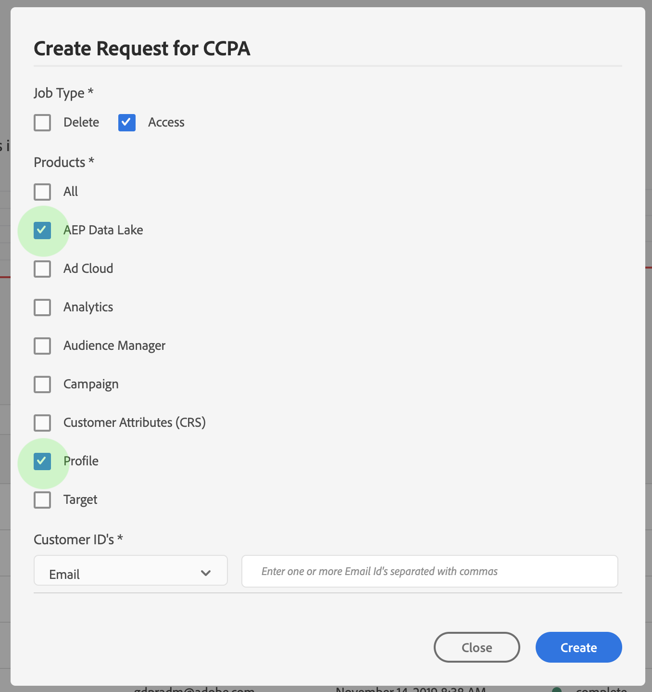

# Privacy request processing in Adobe Experience Platform

Adobe Experience Platform Privacy Service provides a method to submit both access and delete requests by the data controller as delineated by privacy regulations such as the General Data Protection Regulation (GDPR) and California Consumer Privacy Act (CCPA).

Privacy Service receives customer data access and delete requests (referred to as "privacy jobs" in this document) from Experience Platform through either the [Privacy Service API](../tutorials/privacy_service_tutorial/privacy_service_api_tutorial.md) or [Privacy Service UI](../tutorials/privacy_service_tutorial/privacy_service_ui_tutorial.md). There are two different data stores on Experience Platform where privacy job requests can be processed:

- Data Lake
- Real-time Customer Profile

This document describes how to format and label your datasets in Experience Platform in order for Privacy Service to process access/delete requests from your customers. The following topics are covered:

- [Understanding identity namespaces](#understanding-identity-namespaces)
- [Labeling data fields with privacy namespaces](#labeling-data-fields-with-privacy-namespaces)
- [Submitting requests](#submitting-requests)
- [Delete request processing](#delete-request-processing)

## Understanding identity namespaces

[Adobe Experience Platform Identity Service](../identity_services_architectural_overview/identity_services_architectural_overview.md) bridges customer identity data across systems and devices. Identity Service honors **identity namespaces** which serve as indicators of the context to which an identity relates, such as a value of "someone<i></i>@somewhere.com" being an email address, or "443522" as a numeric ID used by a particular CRM. 

Identity namespaces are registered with the Identity core service for your IMS Organization. A list of standard namespaces are available for all organizations (for example, "Email" and "ECID"), while your organization can also create custom namespaces to suit its particular needs. If data ingested into [Real-time Customer Profile](../unified_profile_architectural_overview/unified_profile_architectural_overview.md) has an associated identity namespace, Profile can process a privacy job request in the appropriate format against that data.

For more information about identity namespaces in Experience Platform, see the [identity namespace overview](../identity_namespace_overview/identity_namespace_overview.md).

## Labeling data fields with privacy namespaces

In order for the Data Lake to process privacy requests, any relevant data fields in Platform datasets must be labeled with appropriate privacy namespaces with which you expect to send privacy requests. This section demonstrates how to add a privacy namespace to a dataset.

Consider the following dataset:

```json
{
    "5d8e9cf5872f18164763f971": {
        "name": "Loyalty Members",
        "description": "Dataset for the Loyalty Members schema",
        "imsOrg": "{IMS_ORG}",
        "tags": {
            "adobe/pqs/table": [
                "loyalty_members"
            ]
        },
        "namespace": "ACP",
        "state": "DRAFT",
        "id": "5d8e9cf5872f18164763f971",
        "dule": {
            "identity": [],
            "contract": [
                "C2",
                "C5"
            ],
            "sensitive": [],
            "contracts": [
                "C2",
                "C5"
            ],
            "identifiability": [],
            "specialTypes": []
        },
        "version": "1.0.2",
        "created": 1569627381749,
        "updated": 1569880723282,
        "createdClient": "acp_ui_platform",
        "createdUser": "{USER_ID}",
        "updatedUser": "{USER_ID}",
        "viewId": "5d8e9cf5872f18164763f972",
        "aspect": "production",
        "status": "enabled",
        "fileDescription": {
            "persisted": true,
            "containerFormat": "parquet",
            "format": "parquet"
        },
        "files": "@/dataSets/5d8e9cf5872f18164763f971/views/5d8e9cf5872f18164763f972/files",
        "schemaMetadata": {
            "primaryKey": [],
            "delta": [],
            "dule": [
                {
                    "path": "/properties/personalEmail/properties/address",
                    "identity": [
                        "I1"
                    ],
                    "contract": [],
                    "sensitive": [],
                    "contracts": [],
                    "identifiability": [
                        "I1"
                    ],
                    "specialTypes": []
                }
            ],
            "gdpr": []
        },
        "schemaRef": {
            "id": "https://ns.adobe.com/{TENANT_ID}/schemas/2c66c3a4323128d3701289df4468e8a6",
            "contentType": "application/vnd.adobe.xed-full+json;version=1"
        },
        "streamingIngestionEnabled": "false"
    }
}
```

The `schemaMetadata` property for the dataset contains a `gdpr` array, which is currently empty. To add privacy namespaces to the dataset, this array must be updated using a PATCH operation to the [Catalog Service API](../../../../../../acpdr/swagger-specs/catalog.yaml).

> **Note:** Although the array is named `gdpr`, adding namepaces to it will allow for privacy job requests for both GDPR and CCPA regulations.

#### API format

```http
PATCH /dataSets/{DATASET_ID}
```
* `{DATASET_ID}`: The `id` value of the dataset to be updated.

#### Request

In this example, a dataset includes an email address in the `personalEmail.address` field. The following request assigns an `email_label` namespace to the field, enabling it to be used when submitting access and delete requests using the Privacy Service API.

> **Important:** When running a PATCH operation on a dataset's `schemaMetadata` property, be sure to copy any existing sub-properties within the request payload. Excluding any existing values from the payload will cause them to be removed from the dataset.

```shell
curl -X PATCH 'https://platform.adobe.io/data/foundation/catalog/dataSets/5d8e9cf5872f18164763f971' \ \
  -H 'Authorization: Bearer {ACCESS_TOKEN}' \
  -H 'x-api-key: {API_KEY}' \
  -H 'x-gw-ims-org-id: {IMS_ORG}' \
  -H 'Content-Type: application/json' \
  -d '{ 
    "schemaMetadata": { 
      "primaryKey": [],
      "delta": [],
      "dule": [
        {
          "path": "/properties/personalEmail/properties/address",
          "identity": [
              "I1"
          ],
          "contract": [],
          "sensitive": [],
          "contracts": [],
          "identifiability": [
              "I1"
          ],
          "specialTypes": []
        }
      ],
      "gdpr": [
          {
              "path": "/properties/personalEmail/properties/address",
              "namespace": ["email_label"]
          }
      ]
  }'
```
* `gdpr > path`: The path to the field to be updated within the dataset's associated schema. Ideally, labels should only be applied to "leaf" fields (fields without sub-fields).
* `gdpr > namespace`: An array listing the namespaces to be added to the field specified in `path`. In this case, the namespace `email_label` is added.

#### Response

A successful response returns HTTP status 200 (OK) with the ID of the dataset provided in the payload. Using the ID to lookup the dataset again reveals that the privacy namespaces have been added.

```json
[
    "@/dataSets/5d8e9cf5872f18164763f971"
]
```

### Labeling nested map-type fields

It is important to note that there are two kinds of nested map-type fields that do not support privacy labeling:

* A map-type field within an array-type field
* A map-type field within another map-type field

Making privacy job requests on either of two examples above will eventually fail. For this reason, it is recommended that you avoid using nested map-type fields to store private customer data. Relevant consumer IDs should be stored as a non-map datatype within a profile's `identityMap` (itself a map-type field), or the `endUserID` field of an ExperienceEvent.

## Submitting requests 

Privacy Service provides a RESTful API and user interface that allow you to submit privacy job requests to Adobe Experience Platform. Please refer to the [Privacy Service API](../tutorials/privacy_service_tutorial/privacy_service_api_tutorial.md) or [Privacy Service UI](../tutorials/privacy_service_tutorial/privacy_service_ui_tutorial.md) documentation for information about how to submit and monitor of privacy job requests.

When creating job requests in the API, be sure to provide the product values for Data Lake ("aepDataLake") and/or Real-time Customer Profile ("ProfileService") within the `include` array in the request payload, as shown below.

```shell
curl -X POST \
  https://platform.adobe.io/data/core/privacy/jobs \
  -H 'Authorization: Bearer {ACCESS_TOKEN}' \
  -H 'Content-Type: application/json' \
  -H 'x-api-key: {API_KEY}' \
  -H 'x-gw-ims-org-id: {IMS_ORG}' \
  -d '{
    "companyContexts": [
      {
        "namespace": "imsOrgID",
        "value": "{IMS_ORG}"
      }
    ],
    "users": [
      {
        "key": "user12345",
        "action": ["access","delete"],
        "userIDs": [
          {
            "namespace": "email",
            "value": "ajones@acme.com",
            "type": "standard"
          }
        ]
      }
    ],
    "include": ["aepDataLake", "ProfileService"],
    "expandIds": false,
    "priority": "normal",
    "analyticsDeleteMethod": "anonymize",
    "regulation": "ccpa"
}'
```

When creating job requests in the UI, be sure to select "AdobeCloudPlatform" and/or "Profile Service" under _Products_ to access/delete data stored in the Data Lake or Real-time Customer Profile, respectively.

<br>

## Delete request processing

When Experience Platform receives a data delete request, Platform sends confirmation to Privacy Service that the request has been received and affected data has been marked for deletion. The records are then removed from the Data Lake within seven days. During that seven-day window, the data is soft-deleted and is therefore not accessible by any Platform service.

In future releases, Platform will send confirmation to Privacy Service after data has been physically deleted.