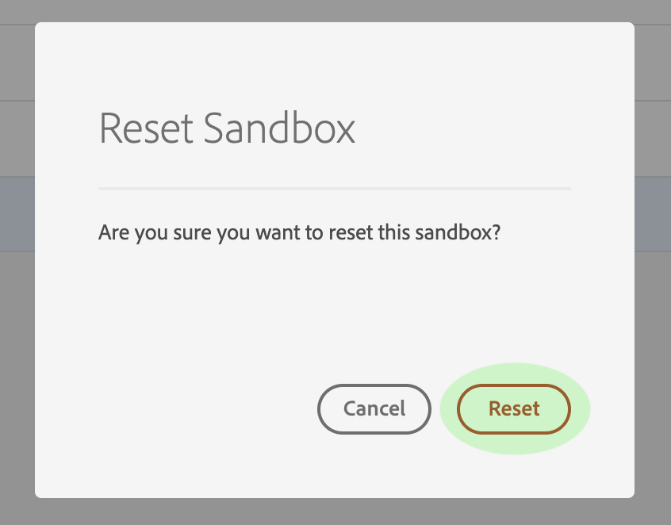

# Sandbox user guide

Adobe Experience Platform provides virtual sandboxes that partition a single Platform instance into separate, isolated  virtual environments. This document provides steps for performing various tasks related to sandboxes within the [Experience Platform user interface](https://platform.adobe.com). For steps on performing different operations using the Sandbox API, see the [sandbox developer guide](sandbox-developer-guide.md). For a high-level overview of sandboxes in Experience Platform, please refer to the [overview documentation](sandboxes-overview.md).

The following tasks are covered:
- [View sandboxes](#view-sandboxes)
- [Switch between sandboxes](#switch-between-sandboxes)
- [Create a new sandbox](#create-a-new-sandbox)
- [Reset a sandbox](#reset-a-sandbox)
- [Delete a sandbox](#delete-a-sandbox)

## View sandboxes

In the Experience Platform UI, click **Sandboxes** in the left-navigation to open the _Sandboxes_ dashboard. The dashboard lists all available sandboxes for your organization, including the sandbox type (production or development) and state (active, creating, deleted, or failed).

## Switch between sandboxes

The **sandbox switcher** control at the top-left of the screen displays the currently active sandbox.

To switch between sandboxes, click the sandbox switcher and select the desired sandbox from the dropdown list.

Once a sandbox is selected, the screen refreshes with the selected sandbox now featured in the sandbox switcher.

## Create a new sandbox

To create a new sandbox in the UI, click **Sandboxes** in the left-nav, then click **Create Sandbox**.

The _Create Sandbox_ dialog appears, prompting you to provide a display title and name for the sandbox. The **display title** is meant to be human-readable and should be descriptive enough to be easily identifiable. The sandbox **name** is an all-lowercase identifier for use in API calls, and should therefore be unique and concise.

When finished, click **Create**.

> **Note**: Since you are restricted to creating non-production sandbox types only, the **type** option is locked at "Non-Production" and cannot be manipulated.

Once you have finished creating the sandbox, refresh the page and the new sandbox appears in the _Sandboxes_ dashboard with a status of "Creating". New sandboxes take approximately 15 minutes to be provisioned by the system, after which their status changes to "Active".

## Reset a sandbox

> **Note:** This functionality is only available for non-production sandboxes. Production sandboxes cannot be reset.

Resetting a non-production sandbox deletes all resources associated with that sandbox (schemas, datasets, and so on), while maintaining the sandbox's name and associated permissions. This "clean" sandbox continues to be available under the same name for users that have access to it.

To reset a sandbox in the UI, click **Sandboxes** in the left-nav, then click the sandbox you want to reset. In the dialog that appears on the right-hand side of the screen, click **Reset Sandbox**.

A dialog appears prompting you to confirm your choice. Click **Reset** to continue.

 

A confirmation message appears and the sandbox's state changes to "Resetting". Once it has been provisioned by the system, its state will update to "Active" or "Failed".

## Delete a sandbox

> **Note:** This functionality is only available for non-production sandboxes. Production sandboxes cannot be deleted.

Deleting a non-production sandbox permanently removes all resources associated with that sandbox, including permissions.

 To delete a sandbox in the UI, click **Sandboxes** in the left-nav, then click the sandbox you want to delete. In the dialog that appears on the right-hand side of the screen, click **Delete Sandbox**.

A dialog appears prompting you to confirm your choice. Click **Delete** to continue.

 

A confirmation message appears and the sandbox is removed from the _Sandboxes_ workspace. 

## Next steps

This document demonstrated how to manage sandboxes within the Experience Platform UI. For information on how to manage sandboxes using the Sandbox API, see the [sandbox developer guide](sandbox-developer-guide.md).