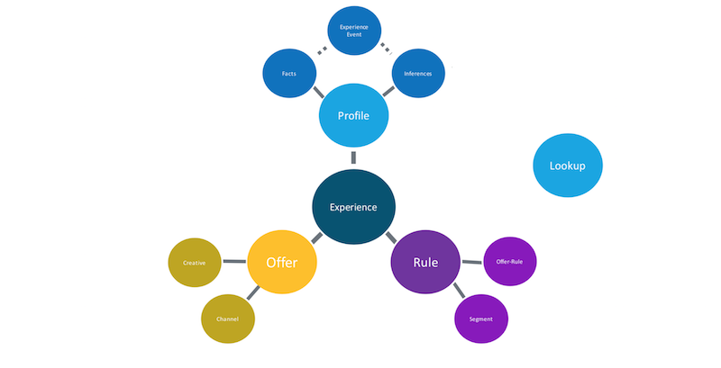

# Schema Design Principles and Best Practices

## Overview

This document provides an introduction to schemas and the building blocks, principles, and best practices for designing schemas to be used with Adobe Cloud Platform.

After reading this document, you will be able to answer the following questions:
- What is a schema?
- How do you define a schema?
- What are the building blocks of schema?
- What are some best practices in schema design?
- What is Experience Data Model?

## Understanding Schemas

A schema is a set of rules to help represent and validate data. At a high-level, schemas provide an abstract definition of a real-world object (such as a Person) and outline what data should be included in each instance of that object (such as First Name, Last Name, and Birthday). 

In addition to describing the structure of data, schemas provide constraints and expectations that can be applied and used to validate data as it is moved between systems. These standard definitions allow data to be interpreted consistently, regardless of origin, and remove the need for translation across applications.

Think of the schema as the blueprint, and the dataset as a house built from that blueprint.

### Schema and Big Data

With the availability of high volumes of data from unlimited data sources (behavioral data logs, third-party web server logs, etc.), big data presents the problem of rapidly increasing amounts of similar data, all with slightly different meanings. In order to gain value from the data, the structure, format, and definitions of the data must be standardized so that it can be processed consistently.

Schemas solve this big data problem by allowing data to be integrated from multiple sources, standardized through common structures and definitions, and shared across solutions. This interoperability allows subsequent processes and services to answer any type of question being asked of the data, moving away from the traditional approach to data modeling where all of the questions that will be asked of the data are known in advance and the data is modeled to suit.

### Schema and Datasets

To ingest data into the platform, a dataset is created which references a target schema, providing constraints to how the data should look. If the dataset is created without a target schema, the platform will derive an observed schema through the inspection of fields and field types.

In some systems, observed and target schemas are stored alongside the data, providing important definitions for the data and how it should look.

### Relational Tables vs Embedded Objects

When working with relational databases, best practices involve normalizing data, or taking an entity and dividing it into discrete pieces that are then displayed across multiple tables. In order to read the data as a whole or update the entity, read and write operations must be made across many individual tables using JOIN.

Through the use of embedded objects, schemas denormalize data and store it in self-contained documents with a hierarchical structure. The data is encapsulated and stored as a complete record, allowing you to query the information without the need for expensive JOIN operations.

## Building Blocks of Schema

Schemas are designed to be modular and reusable, consisting of multiple components such as scalar fields, schema fragments, and fields that represent specific customer or vendor data. Schemas represent key behavior types and are capable of evolving over time. 

### Defining a Schema

The first step in building a schema is to determine the concept, or real world object, that you are trying to capture within the schema. Once you determine what you are trying to describe with the schema, you can begin to identify the properties, or fields, that you will need. Listing these fields creates the beginning of the schema hierarchy.

**Example:** A simple schema for a Buyer might look like this:

```
    Buyer:
        firstName
        lastName
        phoneNumber
        emailAddress
        address
        companyName
```

**Note:** Best practices for defining fields include writing field names in camelCase, as shown above.

### Field Types

Once the fields for the schema have been identified, you will need to determine the field types. In addition to describing the structure of data, schemas provide constraints regarding the type of data contained within each field. In order for schemas to be compatible with Adobe Cloud Platform, fields must adhere to the following data types:

- string
- integer
- number
- boolean
- array

The valid ranges of these scalar types can be further constrained to certain patterns, formats, minimums/maximums, or pre-defined values. Using these constraints, a wide range of more specific field types can be represented, including:

- enum
- long
- short
- byte
- date
- date-time

**Example:** The fields we defined for our Buyer schema would have the following types:

```
    Buyer:
        firstName (string)
        lastName (string)
        phoneNumber (string)
        emailAddress (string)
        address (string)
        companyName (string)
```

**Note:** When specifying field types, scalar types such as 'string' don't strongly enforce the data that can be contained within a field. Experience Data Model (XDM) defines an additional [dictionary](#xdm-field-dictionary) of stronger field types that are recommended for common fields such as "firstName" and "phoneNumber". These [XDM field types](#xdm-field-types) contain specific definitions that provide consistency in behavior across platform services for any fields sharing the same XDM field type.

### Principal Schemas

Principal schemas contain a complete representation of an object and can be instantiated. Principal schemas have a nested structure, with all information organized hierarchically in a single object.

To ensure similar concepts are consistently represented, principal schemas are defined in a modular way and may contain references to sub-schemas, known as reference schemas, that are included when the principal schema is read for use. 

### Reference Schemas

A reference schema is a schema definition that is intended to be used as a field within another schema.  These reusable sub-schemas (normally complex data definitions with multiple fields) are not intended to stand on their own and directly describe data in a dataset. Instead, reference schemas are embedded in principal schemas or combined with other reference schemas and scalar fields to define a principal schema.

#### Using Reference Schemas

As you define a schema, you may notice that you have defined a set of fields that describe a particular concept you would like to reuse across other schemas that describe your business domain. These fields would be better collected into their own schema and included as a reference within a principal schema.

**Note:** There are a number of reference schemas available in Adobe Cloud Platform, and similar to XDM field types, these existing schemas contain definitions that are understood across platform and provide added functionality with platform services.

**Example:** The Buyer schema contains several fields that are very common and are likely to be reused across multiple schemas. Person, Address, Email Address, and Phone Number are all pre-existing schemas and can therefore be _referenced_ by the Buyer schema. 

Here is a breakdown of the Person schema, showing the fields it contains. Notice that the `name` field is a reference to another pre-existing schema, Person Name. This schema provides additional name-related fields whose definitions are understood across Adobe Cloud Platform.

```
    Person:
        name (schema:personName)
            firstName (string)
            lastName (string)
            middleName (string)
            courtesyTitle (string)
            fullName (string)
        birthDay (integer)
        birthMonth (integer)
        birthYear (integer)
        gender (string)
```

The schema hierarchy would now have these reference schemas, and their fields, embedded within Buyer:

```
    Buyer:
        person (schema:person)
            name (schema:person-name)
                firstName (string)
                lastName (string)
                middleName (string)
                courtesyTitle (string)
                fullName (string)
            birthDay (integer)
            birthMonth (integer)
            birthYear (integer)
            gender (string)
        phoneNumber (schema:phonenumber)
            primary (boolean)
            number (string)
            extension (string)
            status (string)
            statusReason (string)
            validity (string)
        emailAddress (schema:emailaddress)
            primary (boolean)
            address (string)
            label (string)
            type (string)
            status (string)
            statusReason (string)
        address (schema:address)
            countryCode (string)
            stateProvince (string)
            city (string)
            postalCode (string)
            primary (boolean)
            label (string)
            street1 (string)
            street2 (string)
            street3 (string)
            street4 (string)
            region (string)
            postOfficeBox (string)
            country (string)
            status (string)
            statusReason (string)
            lastVerifiedDate (date)
        companyName (string)
```

### Extending a Schema

In order to accommodate non-standard data, existing schemas may be 'extended' by adding one or more fields that define personalized data.

You should be thoughtful when extending a schema and first check that an XDM defined schema or field does not already exist. If one does exist, you will benefit more from using the XDM defined schema or field as platform services will implicitly understand the definition for that schema or field.

It is best to avoid creating custom extensions unless you are defining a narrow use case that exists outside the scope of existing schemas and fields.

#### How to Extend a Schema

While principal and reference schemas provide a lot of possibilities, you may find that there is data specific to your business that is not defined in available schema. This data can be injected by extending the existing schema.

**Example:** You would like to include a list of Interests in your Person schema. This list can be represented by _extending_ the Person schema to include a field called "Interests" with a field type of "array".

```
    Person:
        name (schema:person-name)
            firstName (string)
            lastName (string)
            middleName (string)
            courtesyTitle (string)
            fullName (string)
        birthDay (integer)
        birthMonth (integer)
        birthYear (integer)
        gender (string)
        interests* (array)
```

This extension will now appear anywhere the Person schema is used, including your Buyer schema:


```
    Buyer:
        person (schema:person)
            name (schema:person-name)
                firstName (string)
                lastName (string)
                middleName (string)
                courtesyTitle (string)
                fullName (string)
            birthDay (integer)
            birthMonth (integer)
            birthYear (integer)
            gender (string)
            interests* (array)
        phoneNumber (schema:phonenumber)
            primary (boolean)
            number (string)
            extension (string)
            status (string)
            statusReason (string)
            validity (string)
        emailAddress (schema:emailaddress)
            primary (boolean)
            address (string)
            label (string)
            type (string)
            status (string)
            statusReason (string)
        address (schema:address)
            countryCode (string)
            stateProvince (string)
            city (string)
            postalCode (string)
            primary (boolean)
            label (string)
            street1 (string)
            street2 (string)
            street3 (string)
            street4 (string)
            region (string)
            postOfficeBox (string)
            country (string)
            status (string)
            statusReason (string)
            lastVerifiedDate (date)
        companyName (string)
```

### Schema Evolution Principles

As the nature of digital experiences continues to evolve, so must the schemas used to represent them. Therefore, a well designed schema is able to adapt and evolve as needed, without causing destructive changes to previous or future versions of the schema.

#### Additive Versioning

Maintaining backwards compatibility is crucial for schema evolution. A purely additive versioning principle ensures that any revision to the schema results in non-destructive updates and changes only. **Breaking changes are not supported.**

|Supported Changes                   | Breaking Changes (Not Supported)|
|------------------------------------|---------------------------------|
|Adding new fields to existing schema|Removing previously defined fields|
|Making a mandatory field optional   |Introducing new mandatory fields|
|                                    |Renaming or redefining existing fields|
|                                    |Removing or restricting previously supported field values|
|                                    |Moving attributes to a different location in the tree|

### Schema Behavior Types

Principal schemas for Adobe Cloud Platform can be grouped into two different behavior types: Time Series and Record.

Time Series data provides a snapshot of the environment at the time an action was taken either directly or indirectly by a subject. ExperienceEvent is one example of a Time Series schema, but you can also define your own. It is best practice to use ExperienceEvent, as it is the platform preferred schema to express Time Series data.

Record data provides information about attributes of the subject. The Profile schema is not the only example of a Record schema, but it is the platform preferred schema for subject record data. Best practices encourage using the Profile schema to express Record data.

Record schemas and Time Series schemas can contain one or more identity fields. These fields contain the identity representation of a subject, such as a CRM identifier, Experience Cloud ID (ECID), browser cookie, AdvertisingId, or other IDs in different domains.

## Experience Data Model (XDM)

Experience Data Model (XDM) is a publicly documented specification, driven by Adobe, to improve the interoperability, expressiveness, and power of digital experiences.

XDM provides a common format for any application to use to communicate with solutions on Adobe Cloud Platform. By adhering to XDM standards, all customer experience data can be incorporated into a common representation delivering insights in a faster, more integrated way.

### Concepts Behind XDM

Experience Data Model is centered around customer experiences, helping you to gain valuable insights from them, define customer audiences through segments, and express their attributes for personalization purposes.

Each Experience includes three key parts: Who, What, and When, with each part correlating to standard schemas provided by XDM.

- "Who" represents the subject, their behavior and attributes.
    - Profile: Individual subject profile containing data that is aggregated over time.
    - ExperienceEvent: A snapshot showing the state of the environment when a subject took an action.
- "What" represents the asset or offer displayed to the subject
    - Asset: A reference to the specific asset displayed to the subject. 
    - Experience Channel: The content type and location for asset interactions.
- "When" involves rules around segmentation and timing of certain marketing actions.
    - Segment: The audience defined by the segment rules.



### XDM Field Types

XDM defines a set of fields "out of the box" that can be used when extending principal schemas or building custom schemas. This common set of fields have predefined meanings that are widely understood by platform solutions and ensure that meaning is maintained across schemas.

Since XDM fields include added connotations beyond the basic scalar field types, platform solutions automatically know that any fields sharing the same XDM field type will behave the same way across Adobe Cloud Platform. 

### XDM Extensions

In addition to defining a set of fields, XDM also defines a number of extensions that are broadly understood across Adobe Cloud Platform. There are key extensions related to each platform service that enable additional functionality within their respective solutions.

We recommend using XDM extensions whenever possible because of their shared understanding across platform, and encourage you to avoid creating custom extensions unless absolutely necessary to define a very narrow use case that exists outside the scope of XDM.

### XDM Field Dictionary

A complete list of XDM defined fields that can be used to extend and create custom schemas is available through the [XDM Field Dictionary](xdm_field_dictionary.md).
