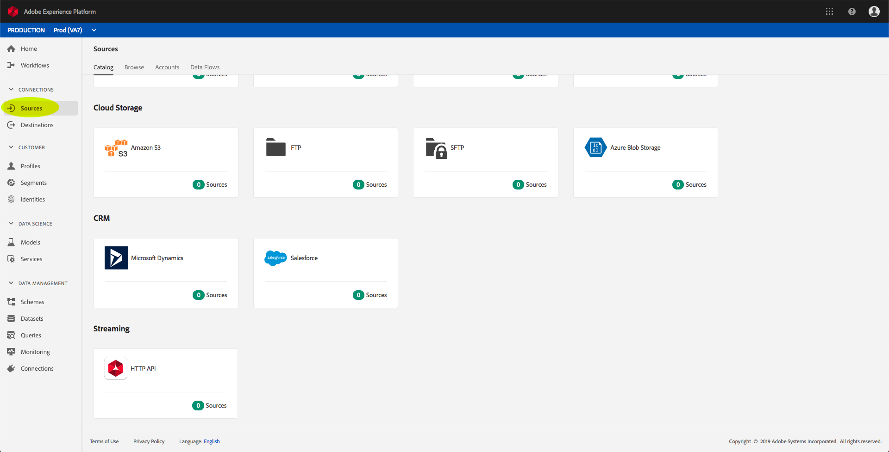
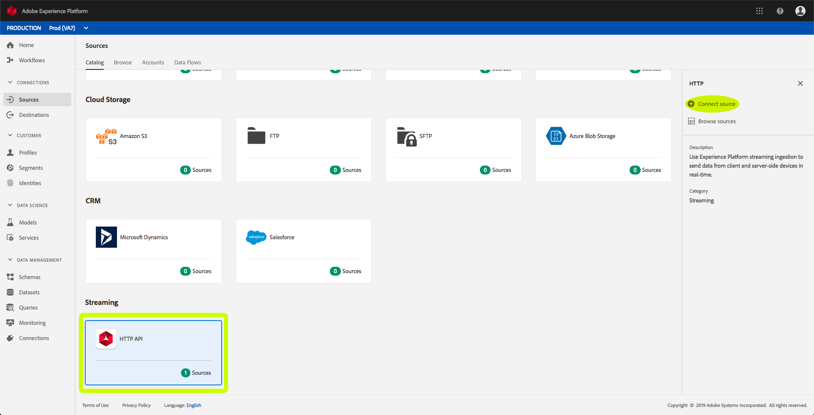
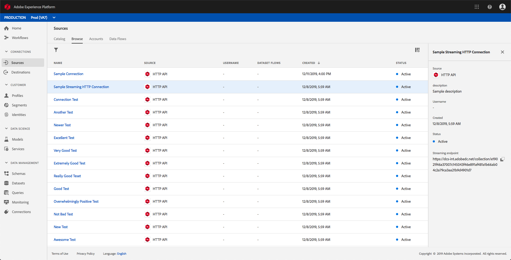
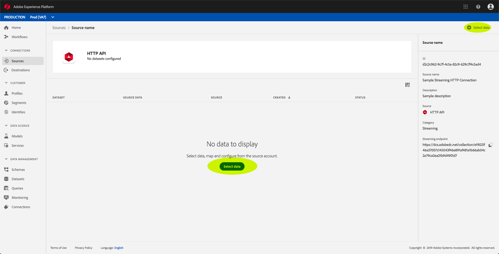
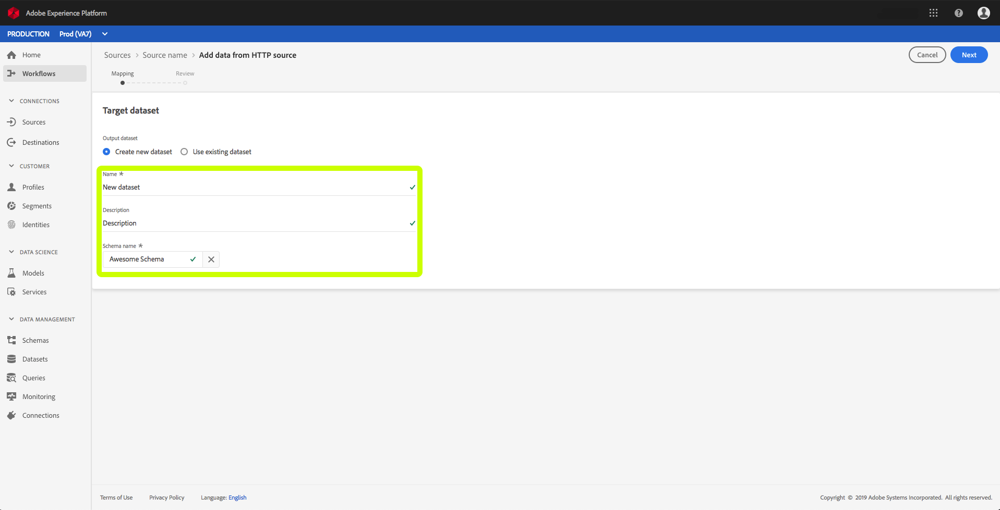
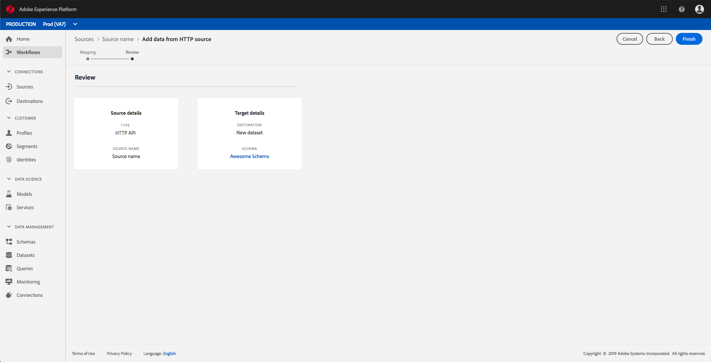
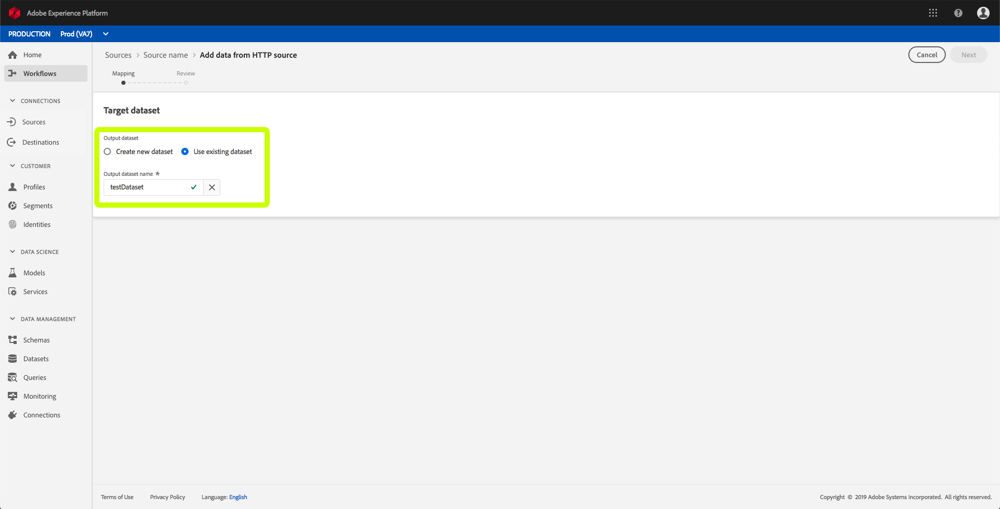

# Create a Streaming Connection using the Experience Platform UI

This UI guide will help you create a streaming connection using Adobe Experience Platform.

## Getting started

In order to start streaming data to Experience Platform, you must first create a streaming HTTP connection. When creating a streaming connection, you need to provide key details such as the source of streaming data, and whether or not you intend to send data from a trusted (authenticated) or an untrusted (unauthenticated) source.

After registering a streaming connection you will have a unique URL which can be used to stream data to Platform.

Please note that in order to complete this guide, you will need access to Adobe Experience Platform. If you do not have access to Platform, please contact your system administrator before proceeding.

## Create a streaming connection

After logging in to the Experience Platform UI, click **Sources** to open the *Catalog* tab. This page displays the available source types as individual cards, with each card containing a bubble that displays the number of data flows that have been created from streaming connections to datasets. 

On the *Sources* page, click **HTTP API**, then **Connect source**. 

The *Connect to HTTP* screen appears. Under *Service details*, provide both the **name** and a **description** for your new streaming connection.

Under *Account Authentication*, select the following configuration properties for your streaming connection:

- **Authentication:** Whether or not the streaming connection requires authentication. Authentication ensures that data is collected from trusted sources. It is recommended that this is turned on if dealing with Personally Identifiable Information (PII).
- **XDM Schema Compatibility:** Whether or not this streaming connection will be sending events which are compatible with XDM schemas. By default, this property is turned **on**.

Once you have finished selecting your configuration properties, click **Connect**. Your streaming HTTP connection is now created, and can now be viewed under the *Browse* tab in the *Sources* workspace.

From the *Browse* tab, you can click on your newly created Streaming HTTP Connection and view the details of that connection.

By clicking on the hyperlink of the connection name, you can select data to be displayed by configuring which dataset is connected, by clicking *Select data*.

You can either [create a new dataset](#create-a-new-dataset) or [use an existing dataset](#use-an-existing-dataset). 

### Create a new dataset

To create a new dataset, provide the **Name**, **Description**, as well as the target **Schema** for the dataset.

Upon inserting all the details and clicking **Next**, you can review the provided details before clicking **Finish** to connect the dataset to your streaming HTTP connection.

### Use an existing dataset

To use an existing dataset, select the **Output dataset name**.

After clicking **Next**, you can review the details before clicking **Finish** to connect the selected dataset to your streaming HTTP connection.

## Next steps

By following this tutorial, you have created a streaming HTTP connection, enabling you to use the streaming endpoint to access a variety of Data Ingestion APIs. For examples of API operations that can be performed by using a streaming endpoint, please read the [streaming ingestion developer guide][ingestion-dev-guide].

[ingestion-dev-guide]: ./getting_started_with_platform_streaming_ingestion.md

[xdminfo]: ../schema_registry/schema_composition/schema_composition.md