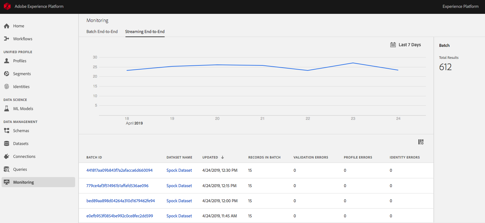
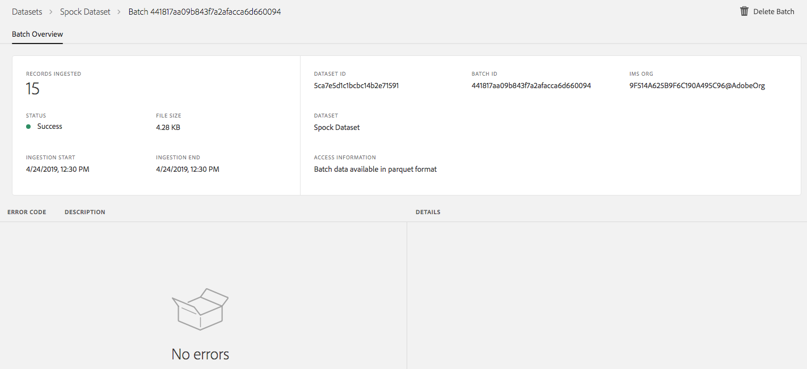
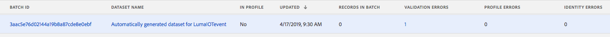
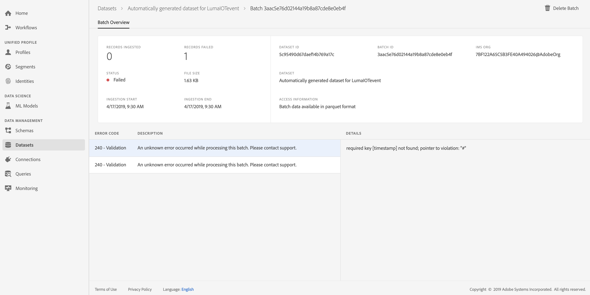

# Monitoring Streaming Data Flows
This document will help familiarize you with using [Adobe Experience Platform][platform] to monitor your streaming ingested data. Experience Platform lets you monitor incoming data from end-to-end, meaning you can see your data from ingestion to consumption in the Data Lake and Real-time Customer Profile.

## Navigating 
1. Login to [Experience Platform][platform]. 
2. Select the **Monitoring** section on the side navigation menu located on the left. 
3. Select **Streaming End-to-End** at the top of the page. You will then see a screen similar to image below.

## Streaming end-to-end
The "Streaming End-to-End" page is divided into two parts: a graph displaying the rate of messages being streamed and a detailed view of the incoming streamed data.

The first part of the page displays the rate of messages being streamed into Platform for your entire organization. This view defaults to showing you the trend for the last seven days, but you can increase or decrease the range to help locate the batches you are interested in. 

The second part of the page provides you a detailed view into how the streamed data is getting persisted into the Data Lake. As part of ingestion process, streamed data gets discretized into batches of roughly 15 minutes each affording the view below. 

Batches can be of two types, successful or failed. Successful batches contain records which were persisted successfully into the Data Lake. Failed batches, as the name implies, contain records which encountered failures on the ingestion path to Platform. 

### Successful batches 
Successful batches contain records which were persisted successfully into the Data Lake.   

From the detailed view, you can see the total number of records ingested in the batch.

### Failed batches
Failed batches contain records which failed processing due to validation errors, profile errors, or identity errors.

Select a failed batch for a detailed view that will provide more information including: batch ID, record count, error code, and reason for failure. 

The details section includes information about the error as well as the location in the published JSON where the error was encountered. 

For more information on failed batches and how to download them, please see: [Retrieving Failed Batches](retrieving_failed_batches.md).

[platform]: http://platform.adobe.com