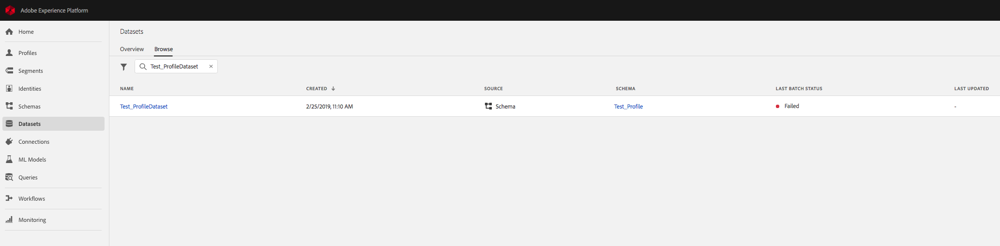
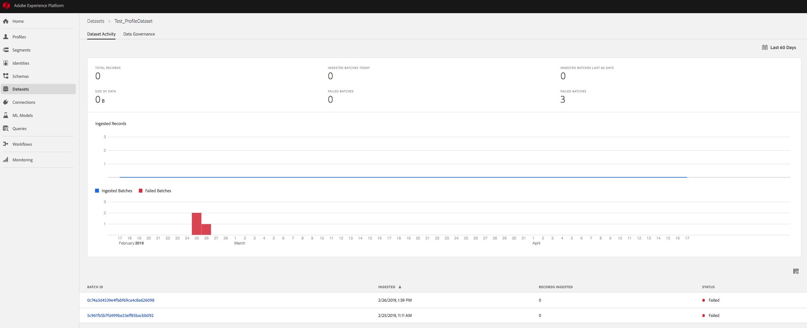
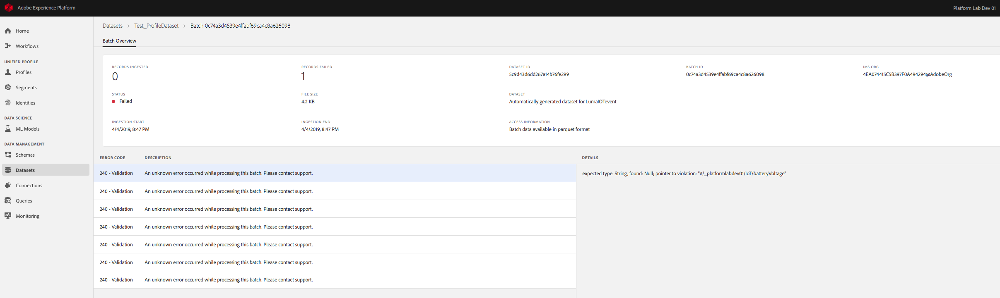

# Retrieving Failed Batches

So what happens if you post data that has formatting errors? For example, when you stream in data with an incorrectly formatted timestamp, by making the month's value to be **00**, like so:

<pre style="color:#183691">
{
    <span style="color:#4b7d46">"body"</span>: {
        <span style="color:#4b7d46">"xdmEntity"</span>: {
            <span style="color:#4b7d46">"id"</span>: "c8d11988-6b56-4571-a123-b6ce74236036",
            <span style="color:#4b7d46; font-weight:bold">"timestamp"</span>: "2018-<span style="font-weight:bold">00</span>-10T22:07:56Z",
            <span style="color:#4b7d46">"environment"</span>: {
                <span style="color:#4b7d46">"browserDetails"</span>: {
                    <span style="color:#4b7d46">"userAgent"</span>: "Mozilla\/5.0 (Windows NT 5.1) AppleWebKit\/537.36 (KHTML, like Gecko) Chrome\/29.0.1547.57 Safari\/537.36 OPR\/16.0.1196.62",
                    <span style="color:#4b7d46">"acceptLanguage"</span>: "en-US",
                    <span style="color:#4b7d46">"cookiesEnabled"</span>: true,
                    <span style="color:#4b7d46">"javaScriptVersion"</span>: "1.6",
                    <span style="color:#4b7d46">"javaEnabled"</span>: true
                },
                <span style="color:#4b7d46">"colorDepth"</span>: 32,
                <span style="color:#4b7d46">"viewportHeight"</span>: 799,
                <span style="color:#4b7d46">"viewportWidth"</span>: 414
            },
        }
    }
}
</pre>

The payload above will not properly validate against the XDM schema due to the malformed timestamp.

Let's assume you didn't know the reason for failure upfront. To find out what might have happened to this record, you'll need to log into [Adobe Experience Platform][platform], and click the "Data" tab, and find the failed batch. 

From here, you can search for the dataset that you've attempted to insert the data into, by searching for the dataset's name:



Now, you'll be able to see a list of batches and consequently the batch ID of the failed batch.



Next, you can select the failed batch to view the batch details page



Using the failed batch ID, you can now get more information about the failed batch with the following request.

## Request

```shell
curl -X GET "https://platform.adobe.io/data/foundation/export/batches/{BATCH_ID}/failed" \
  -H "Authorization: Bearer {ACCESS_TOKEN}" \
  -H "Cache-Control: no-cache" \
  -H "Content-Type: application/json" \
  -H "x-api-key: {API_KEY}" \
  -H "x-gw-ims-org-id: {IMS_ORG}"
```

- `{BATCH_ID}`: The ID of the batch that you're looking up.
- `{ACCESS_TOKEN}`:  Your specific bearer token value provided after authentication.   
- `{API_KEY}`: Your specific API key value found in your unique Adobe Experience Platform integration.  
- `{IMS_ORG}`: Your IMS organization ID can be found under the integration details in the Adobe I/O Console.  

## Response

```json
{
    "data": [
        {
            "name": "_SUCCESS",
            "length": "0",
            "_links": {
                "self": {
                    "href": "https://platform.adobe.io:443/data/foundation/export/batches/{BATCH_ID}/failed?path=_SUCCESS"
                }
            }
        },
        {
            "name": "part-00000-44c7b669-5e38-43fb-b56c-a0686dabb982-c000.json",
            "length": "1800",
            "_links": {
                "self": {
                    "href": "https://platform.adobe.io:443/data/foundation/export/batches/{BATCH_ID}/failed?path=part-00000-44c7b669-5e38-43fb-b56c-a0686dabb982-c000.json"
                }
            }
        }
    ],
    "_page": {
        "limit": 100,
        "count": 2
    }
}
```

With the above response, you can see which chunks of the batch succeeded and failed. From this response, you can see that the file `part-00000-44c7b669-5e38-43fb-b56c-a0686dabb982-c000.json` contains the failed batch.

Now, since we know which batch failed, we can download the failed batch and see what the error message is.

## Request

```shell
curl -X GET 'https://platform.adobe.io/data/foundation/export/batches/{BATCH_ID}/failed?path={FAILED_FILE}' \
  -H 'Authorization: Bearer {ACCESS_TOKEN}' \
  -H 'Content-Type: application/json' \
  -H 'cache-control: no-cache' \
  -H 'x-api-key: {API_KEY}' \
  -H 'x-gw-ims-org-id: {IMS_ORG}'

```

Where:

- `{BATCH_ID}`: The ID of the batch that contains the failed file.
- `{FAILED_FILE}`: The name of the file that has the failed formatting.
- `{ACCESS_TOKEN}`:  Your specific bearer token value provided after authentication.   
- `{API_KEY}`: Your specific API key value found in your unique Adobe Experience Platform integration.  
- `{IMS_ORG}`: Your IMS organization ID can be found under the integration details in the Adobe I/O Console.  

## Response

Since the previous ingested batch had an invalid date-time, the following validation error will be shown.

```json
{
    "_validationErrors": [
        {
            "causingExceptions": [],
            "keyword": "format",
            "message": "[2018-00-23T22:07:01Z] is not a valid date-time. Expected [yyyy-MM-dd'T'HH:mm:ssZ, yyyy-MM-dd'T'HH:mm:ss.[0-9]{1-9}Z, yyyy-MM-dd'T'HH:mm:ss[+-]HH:mm, yyyy-MM-dd'T'HH:mm:ss.[0-9]{1,9}[+-]HH:mm]",
            "pointerToViolation": "#/timestamp",
            "schemaLocation": "#/properties/timestamp"
        }
    ]
}
```

## Other error types

### Missing or invalid IMS Org ID

This error is shown if the IMS Org ID is either missing from the payload is invalid.

```json
{
    "type": "http://ns.adobe.com/adobecloud/problem/data-collection-service/inlet",
    "status": 400,
    "title": "Invalid XDM Message Format",
    "report": {
        "message": "inletId: [{INLET_ID}] imsOrgId: [{IMS_ORG}@AdobeOrg] Message has an absent or wrong ims org in the header"
    }
}
```

### Missing XDM schema

This error is shown if the `schemaRef` for the `xdmMeta` is missing.

```json
{
    "type": "http://ns.adobe.com/adobecloud/problem/data-collection-service/inlet",
    "status": 400,
    "title": "Invalid XDM Message Format",
    "report": {
        "message": "inletId: [{INLET_ID}] imsOrgId: [{IMS_ORG}@AdobeOrg] Message has unknown xdm format"
    }
}
```

### Missing source name

This error is shown if the `source` in the header is missing its `name`.

```json
{
    "_errors":{
        "_streamingValidation": [
            {
                "message": "Payload header is missing Source Name"
            }
        ]
    }
}
```

### Missing XDM entity

This error is shown if there is no `xdmEntity` present.

```json
{
    "_validationErrors": [
        {
            "message": "Payload body is missing xdmEntity"
        }
    ]
}
```

### Other validation errors

Like the timestamp error in the previous example flow, these errors are due to incorrectly formatted XDM. These error messages will vary quite a bit depending on the nature of the problem.

[platform]: http://platform.adobe.com
