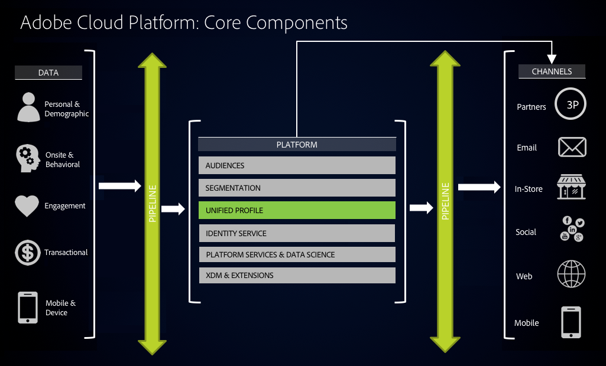
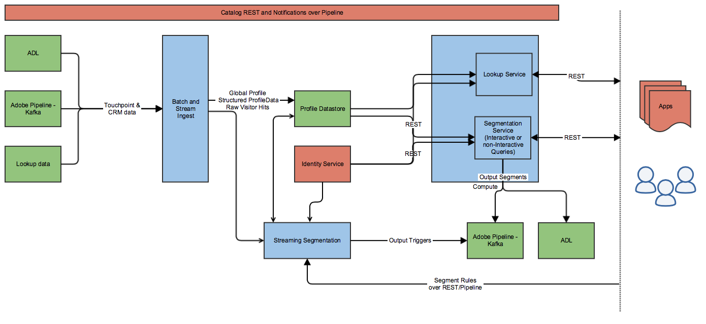

# Unified Profile Overview

## 1. Overview

The Unified Profile Service (UPS) in Adobe Cloud Platform provides a Unified, 360° Consumer Profile that enables marketers to drive coordinated, consistent and relevant experiences with their audiences across channels. With Unified Profile, you have one place to go to get a holistic view of your entire user base aggregated across all systems, as well as actionable timestamped account of every event they've had in any of your systems, when you need it.



### 1.1 Unified Profile in Adobe Cloud Platform

Unified Profile provides cohesion of data across any standardized datasets you choose to onboard.



### 1.2 Using the API

This document describes interacting with UPS using Adobe's Platform APIs. See the [Adobe I/O Authentication Overview](https://www.adobe.io/apis/cloudplatform/console/authentication/gettingstarted.html) for information on how to access these services.

---

## 2. Ingesting XDM Data

UPS maintains XDM data in the Profile Store which can be updated via batch or stream ingestion. XDM data can be ingested into the UPS based on and triggered by batch data being [ingested](../ingest_architectural_overview/ingest_architectural_overview.md) and managed by Data Catalog Service.

Both enablement and configuration for ingestion by Unified Profile are handled by a Tag on a dataset, named specifically "unifiedProfile". The Tag is configured with an array of key:value properties providing configuration values. The `identityField` Tag property names the location in the XDM schema of the primary identity field. Dot-notation is used to specify attributes within a hierarchy. The `enabled` property set to true enables the dataset for ingestion into UPS.

### 2.1 Batch Ingestion of Profile XDM DataSets

The following is an example `PATCH` request adding the "unifiedProfile" Tag to a dataset using the dataset ID. The resulting profile ID is set to the value of the `identities.id` field. `identities` is an array in the XDM Profile schema. `identities.id`, then, will resolve to the `id` property of the first element in that array.

__Example Data Catalog Service request - Add Unified Profile configuration Tag__

```
PATCH https://platform.adobe.io/data/foundation/catalog/dataSets/5a7d26e92a6e55000086d459 HTTP/1.1

Example body:

{
   "tags" : {
        "unifiedProfile": ["enabled:true"],
        "unifiedIdentity": ["enabled: true"]
    }
}
```

### 2.2 Batch Ingestion of ExperienceEvent XDM DataSets

The following is an example `PATCH` request adding the "unifiedProfile" Tag for an ExperienceEvent dataset using the `datasetId`. Initial releases limit ExperienceEvents to being related to only XDM Profiles, or extensions of the XDM Profile schema.

```
PATCH https://platform.adobe.io/data/foundation/catalog/dataSets/5a7d26e92a6e55000086d459 HTTP/1.1
```

__Example body__

```
{
   "tags" : {
        "unifiedProfile": ["enabled:true"],
        "unifiedIdentity": ["enabled: true"]
    }
}
```

### 2.1.3 Verify a DataSet is Enabled in Profile

To check if your dataset has been enabled in UPS, use the Data Catalog Service API to `GET` the dataset using the `datasetId`. A dataset is enabled if it contains a `unifiedProfile` Tag with a colon-delimited property string for `enabledAt`. The value of this tuple reports the time after which ingested Profile data would be made accessible via UPS.

```
GET https://platform.adobe.io/data/foundation/catalog/dataSets/5b020a27e7040801dedbf46e HTTP/1.1
```

__Example response__ 

```
{
    "5b020a27e7040801dedbf46e": {
        "version": "1.0.3",
        "imsOrg": "1BD6382559DF0C130A49422D@AdobeOrg",
        "name": "Unified Profile Ingestion Test Events DataSet",
        "created": 1526860327407,
        "updated": 1526860337773,
        "createdClient": "AEP_UNIFIED_PROFILE",
        "createdUser": "AEP_UNIFIED_PROFILE@AdobeID",
        "updatedUser": "acp_foundation_dataTracker@AdobeID",
        "namespace": "ACP",
        "tags": {
            "unifiedProfile": [
                "enabled:true",
                "identityField:endUserIds._vendor.adobe.experience.analytics.id.id",
                "orderField:timestamp",
                "relatedModels:test_small_1526860248587",
                "enabledAt:2018-05-20 23:52:09"
            ]
        },
        "dule": {},
        "statsCache": {},
        "lastBatchId": "c134eeb63cc1421ea6baeb6149aeb597",
        "lastBatchStatus": "success",
        "lastSuccessfulBatch": "c134eeb63cc1421ea6baeb6149aeb597",
        "viewId": "5b020a27e7040801dedbf46f",
        "aspect": "production",
        "status": "enabled",
    }
}
```

For more details on this and other Data Catalog Service APIs, visit the [Swagger API reference](../../../../../../acpdr/swagger-specs/catalog.yaml).

### 2.4 Monitoring Ingestion

Depending on the size of the data, batches take varying lengths of time to ingest. Using the Bulk Ingestion API, the first step to uploading a batch of data is to create the batch. You are provided with a `batchId` in the response. In the example below the batch ID is "29285e08378f4a41827e7e70fb7cb8f0", provided as the value to the `batch` request parameter, indicating to retrieve all batches _related to that batch_. Using that ID, you are able to poll the dataset for the status of the batch from ingestion until the `status` in the response indicates completion ("success" or "failure").

__Example request for related Unified Profile batches__

```
GET https://platform-stage.adobe.io/data/foundation/catalog/batches?batch=29285e08378f4a41827e7e70fb7cb8f0&createdClient=acp_core_unifiedProfile_feeds HTTP/1.1
```

__Arguments__

* `batch` - Indicates to retrieve all batches _related to_ the ID provided as the value of this parameter
* `createdClient` - This parameter filters by the client who generated the batch. In the case of Unified Profile, that will always be "acp_core_unifiedProfile_feeds"

__Example positive response__

```
{
    "5b7129a879323401ef2a6486": {
        "imsOrg": "F47E32E75AB004490A49403E@AdobeOrg",
        "created": 1534142888068,
        "createdClient": "acp_core_unifiedProfile_feeds",
        "createdUser": "acp_core_unifiedProfile_feeds@AdobeID",
        "updatedUser": "acp_core_unifiedProfile_feeds@AdobeID",
        "updated": 1534142955152,
        "replay": {},
        "status": "success",
        "errors": [],
        "version": "1.0.3",
        "availableDates": {},
        "relatedObjects": [
            {
                "type": "batch",
                "id": "29285e08378f4a41827e7e70fb7cb8f0"
            }
        ],
        "metrics": {
            "startTime": 1534142943819,
            "endTime": 1534142951760,
            "recordsRead": 108,
            "recordsWritten": 108
        }
    }
}
```

__Example negative response__

```
{
    "5b96ce65badcf701e51f075d": {
        "imsOrg": "4A21D36B544916100A4C98A7@AdobeOrg",
        "status": "failed",
        "relatedObjects": [
            {
                "type": "batch",
                "id": "29285e08378f4a41827e7e70fb7cb8f0"
            }
        ],
        "replay": {},
        "availableDates": {},
        "metrics": {
            "startTime": 1536610322329,
            "endTime": 1536610438083,
            "recordsRead": 4004,
            "recordsWritten": 4004,
            "failureReason": "Job aborted due to stage failure: Task 0 in stage 1.0 failed 4 times,:"
        },
        "errors": [
            {
                "code": "0070000017",
                "description": "Unknown error occurred."
            },
            {
                "code": "unknown",
                "description": "Job aborted."
            }
        ],
        "created": 1536609893629,
        "createdClient": "acp_core_unifiedProfile_feeds",
        "createdUser": "acp_core_unifiedProfile_feeds@AdobeID",
        "updatedUser": "acp_core_unifiedProfile_feeds@AdobeID",
        "updated": 1536610442814,
        "version": "1.0.5"
    }
}
```

A recommended interval is two minutes. For more information on working with Catalog datasets and batches, see [Data Catalog Services](../catalog_architectural_overview/catalog_architectural_overview.md).

---

## 3. Profile Merging

One of the key features of UPS is being able to unify multi-channel data. Unified Profile stores data in "profile fragments". A profile fragment is a tuple of {ID, dataset/datastream} where:

* __ID__ is the primary identity of the record (e.g. XID in case of XDM Profile)
* __Dataset/Datastream__ refers to where the data came from (e.g. catalog batch dataset, streaming datastream etc.). Each dataset/datastream conforms to exactly one XDM schema

As Unified Profile ingests data, records within a profile fragment are updated at ingest time. However, records across profile fragments are merged at access time using merge policies.
 
### 3.1 Merge Policies

A merge policy is a set of configurations controlling aspects of identity stitching and attribute merging. UPS provides the tools to manage various merge policies for unified profiles by way of the Merge Policies API. Merge policies are related to a schema, where an IMS Org can create any number of merge policies for a single schema.

Merge policies give you the control to handle situations such as:

* An environment where multiple datasets, say datasets DS1 and DS2, store the same attribute of a Profile (eg: firstName). Using merge policies, you are able to give precedence to DS1 such that merged Profiles always contain the value of the data from DS1
* DULE Labels restrict you from using data from a particular dataset. By creating a merge policy and leaving that dataset out of the dataset precedence list, you are able to suppress any data from that dataset from being used in a merged Profile

The merge policies API centralizes merge rules used throughout UPS APIs, including Segmentation Jobs and the Profile Access API.

When using an API that accepts a merge policy without specifying one, the IMS Org's default merge policy for the given schema will be used. If a default merge policy has not been specified, the system will generate one automatically when needed.

There are two parts to merging Profile data across stores:

* Identity stitching
* Attribute merging

#### 3.1.1 Identity stitching

Identity Stitching refers to determining when multiple fragments of a Profile refer to a single person. For more information, see [Identity Services](../identity_services_architectural_overview/identity_services_architectural_overview.md).

#### 3.1.2 Attribute merging

When multiple profile fragments contain the same data elements, merge policies can be used to tune prioritization of your data by allowing you to specify the order of data precedence by dataset. When a merge policy is created with an attribute merge type of "dataSetPrecedence", you supply a list of datasets sorted from highest to lowest precedence. The following demonstrates creating a merge policy wherein a dataset "ds1" should be regarded as highest priority data when the records' `createdAt` value fails to distinguish.

```
POST https://platform.adobe.io/data/core/ups/config/mergePolicies HTTP/1.1
```

__Example body__

```
{
  "name":"Name",
  "id":1,
  "updateTime":1529687772669,
    "identityGraph": {
        "type":"none"
    },
    "attributeMerge": {
    "type": "dataSetPrecedence",
    "data": {
      "order": ["ds1", "ds2"]
    }
  },
  "imsOrgId":"1BD6382559DF0C130A49422D@AdobeOrg",
  "creationTime":1529687772669
}
```

Note that when "dataSetPrecedence" is used, only data from the datasets listed is merged. In other words, using the example merge policy above, merged data will only ever include data from datasets "ds1" and "ds2".

### 3.2 Working with the Merge Policies API

Using the merge policies API, you are able to:

* GET all merge policies
* CREATE a merge policy
* GET a merge policy by id
* DELETE a merge policy by id

See the [Swagger specification](../../../../../../acpdr/swagger-specs/profile-access.yaml) for more details.

---

## 4. Accessing Profiles in the Unified Profile Service

This section describes the methods for accessing Unified Profiles as they exist in the Profile Store.

Profiles and time-series ExperienceEvent data are retrieved from separate `GET` calls.

### 4.1 Access Unified Profile By Record ID

This operation gets a Profile by ID and retrieves all its properties.

The parameters for the access service are as follows:

* `schema.name` (__required__) - Names the entity type, by schema name, for the record to return. Support both XED and FullURINameXED
* `entityId` (__required__) - Record ID for the entity
* `entityIdNS` (optional) - Represents the [Identity Namespace](../identity_namespace_overview/identity_namespace_overview.md) if the ID provided is NOT in native XID format
* `mergePolicyId` (optional) - Names the merge policy to use for the exported data

__Example Unified Profile Service request - Get a Unified Profile by ID__

```
GET https://platform.adobe.io/data/core/ups/access/entities/?schema.name={schema}&entityId={id}&entityIdNS={IDNS} HTTP/1.1
```

__Example response__ 

```
{
    "GU8rb925s2L2fkF55boQKCbliQ8,GbZWRW8tXrZ4gABvwzC_gAAAAAAA,A2-s19jafhDickW6PP0c5dpi": {
        "record": {
            "extraField1": 1,
            "personalEmail": {
                "address": "vmountneyji@pcworld.com"
            },
            "extraField2": 2,
            "identities": [
                {
                    "xid": "GU8rb925s2L2fkF55boQKCbliQ8",
                    "namespace": {
                        "code": "CRMId",
                        "id": 11111
                    },
                    "id": "87374043487584731811119677934421981925"
                },
                {
                    "xid": "GbZWRW8tXrZ4gABvwzC_gAAAAAAA",
                    "namespace": {
                        "code": "AVID",
                        "id": 22222
                    },
                    "id": "2d5eb67880006fc3-30bf800000000000"
                },
                {
                    "xid": "A2-s19jafhDickW6PP0c5dpi",
                    "namespace": {
                        "code": "ecId",
                        "id": 4
                    },
                    "id": "82781972020839607487123257673310321221"
                }
            ],
            "homePhone": {
                "number": "878-183-0090"
            },
            "person": {
                "firstName": "Val",
                "lastName": "Mountney",
                "gender": "xy",
                "courtesyTitle": "Mr"
            }
        }
    }
}
```

### 4.2 Access ExperienceEvents by Profile Record ID

Access a paginated list of ExperienceEvents for a given Profile.

The parameters for the access service are as follows:
<!-- TODO: CORE-11543 What information from this page to include, and how? https://wiki.corp.adobe.com/pages/viewpage.action?pageId=1441927960
     Need more info -->

* `schema.name` (__required__) - Names the entity type, by schema name, for the record to return. Support both XED and FullURINameXED
* `entityId` (__required__) - Record ID for the entity
* `entityIdNS` - Represents the [Identity Namespace](../identity_namespace_overview/identity_namespace_overview.md) if the ID provided is NOT in native XID format
* `mergePolicyId` - Names the merge policy to use for the exported data
* `relatedSchema.name` - Names the schema of the Profile
* `relatedEntityId` - Names the ID of the Profile
* `relatedEntityIdNS` - Names the namespace of the Profile ID provided

__Example UPS request - Get ExperienceEvents for a Unified Profile__

```
GET https://platform.adobe.io/data/core/ups/access/entities/?schema.name=_xdm.context.experienceevent&relatedschema.name=_xdm.context.profile&entityID={}&relatedentityIdNS={} HTTP/1.1
```

__Example response__ 

```
{
    "records": [
        {
            "recordId": "2d542d820000593e-045f400000000035",
            "timestamp": "1519511589000",
            "sourceId": "5af4be93e787d301dab86453",
            "record": {
                "timestamp": 1519511589000,
                "productListItems": [
                    {
                        "SKU": "PS",
                        "name": "Brooklyn",
                        "quantity": 38,
                        "priceTotal": 25.46
                    }
                ],
                "locationContext": {
                    "localTime": "2018-02-24T17:33:09 EST",
                    "geo": {
                        "city": "Penhold",
                        "latitude": 52.13342,
                        "longitude": -113.8687,
                        "postalCode": "L2E",
                        "stateProvince": "Alberta",
                        "countryCode": "CA"
                    }
                },
                "web": {},
                "id": "b0a52a9b-fea3-44e3-acf2-9422e70426f7",
                "environment": {
                    "colorDepth": 32,
                    "viewportHeight": 267,
                    "viewportWidth": 1585
                },
                "metrics": {
                    "commerce": {
                        "productViews": {
                            "value": 1
                        }
                    },
                    "web": {
                        "pageViews": {
                            "value": 1
                        }
                    }
                },
                "endUserIds": {
                    "_vendor": {
                        "adobe": {
                            "experience": {
                                "ecId": {
                                    "id": "55115069898928455152185628961882945298",
                                    "namespace": {
                                        "id": 0,
                                        "code": "ecId"
                                    }
                                },
                                "analytics": {
                                    "id": {
                                        "id": "2d542d820000593e-045f400000000035",
                                        "namespace": {
                                            "id": 22222,
                                            "code": "AVID"
                                        }
                                    }
                                }
                            }
                        }
                    }
                }
            }
        }
        ],
        "page": {
            "sortField": "timestamp",
            "sort": "asc",
            "pageOffset": "2d542d820000593e-045f400000000035-5af4be93e787d301dab86453-1519511589000",
            "pageSize": 7
        },
        "link": {
            "next": ""
        }
    }
}
```

---

## 5. Segmenting Your Base - Creating and Working with Audiences

The cornerstone of your marketing campaign is your audience. UPS provides the tools for segmenting your user base into audiences consisting of members meeting criteria with exactly the precision you require. With segmentation, you can isolate members of your user base by criteria such as:

* Users for whom one week has passed since last making a purchase
* Users for whom the sum of the purchases is greater than $10,000
* Users who have seen a campaign and then clicked on it within 30 minutes, for any 3 of a list of campaigns specified by their Campaign ID

UPS behaves on/with the following components:

* __Segments__ are classified subsets of your user base, such as "Men over 50"
* __Definitions__ are the rules, in terms of the conditions that an XDM object must meet to qualify for a Segment
* __Segmentation Jobs__ are asynchronous processes which isolate members of your user base per the rules described by a Definition
* An __Audience__ is the collection of XDM objects which met the qualifications, or conditions, as set out by the Segment Definition

Segmentation is supported for XDM Profile and ExperienceEvent schemas, with plans to expand to include additional schemas in the future. Segmentation is handled in the steps described by the remainder of this section. In summary, the following tasks are involved in segmentation and are detailed in this section:

* __Develop a Definition__ - Determine and design the criteria that objects must meet to qualify for your Segment, and write the query representation of those rules
* __Estimate and Preview Your audience__ - As an optional step in the iterations of writing and testing your Definition, process your Definition in a summary mode, gleaning information summarizing your audience as well as the progress of the asynchronous Preview Job
* __Segment Your Audience__ - Create a reusable Definition and use Segmentation Jobs to keep that audience current and relevant
* __Get Results__ - Using the Export API, persist audience members to a Profile dataset

### 5.1 Develop a Segment Definition

A Definition encapsulates the complete set of criteria that define a specific audience, written as a query in Adobe's proprietary Profile Query Language (PQL) specifically designed for building queries on XDM data. The following summarizes PQL, though more in-depth detail can be found [here](unified_profile_pql.md). In the context of this section, to develop the Segment Definition is to compose the PQL query describing the desired audience.

* Queries may be over Profile-only (e.g. [q1](unified_profile_supported_queries.md#q1)), ExperienceEvent-only (e.g. [q5](unified_profile_supported_queries.md#q5)), or a combination of Profile and ExperienceEvent ([q11](unified_profile_supported_queries.md#q11)).
* Queries can contain variables, which simplify or make clearer a single field or a composite value resulting from a calculation or condition (e.g. [q10](unified_profile_supported_queries.md#q10): two orders within a two-week period).
* Operators/functions:
  * Boolean operators (and, or, not) - e.g. [q2](unified_profile_supported_queries.md#q2).
  * Equality, inequality (=, !=)
  * Numerical comparisons (<, >, <=, >=) - e.g. [q1](unified_profile_supported_queries.md#q1), [q3](unified_profile_supported_queries.md#q3).
  * Time series conditions: occurs - e.g. [q7](unified_profile_supported_queries.md#q7), [q10](unified_profile_supported_queries.md#q10).
  * Others: like, in - e.g. [q2](unified_profile_supported_queries.md#q2), [q4](unified_profile_supported_queries.md#q4).
  * Set formation over variable definitions: {} - e.g. [q6](unified_profile_supported_queries.md#q6)-[q11](unified_profile_supported_queries.md#q11).
  * Count

#### 5.1.1 Persist the Definition

Definitions are persisted to the Experience Cloud Platform as a predicate expression in PQL to be referenced by ID. This is helpful in creating a centrally-managed collection of queries to be reused, and simplifying API calls. The request body consists of the following properties:

* `name` (__required__) - Specify a name by which to refer to the Segment. Choose a name that is descriptive and unique per Segment
* `schema` (__required__) - Entity which consists of either an `id` or `name` field, naming the schema of the entities in the Segment
* `expression` (__required__) - Entity which consists of the following fields:
  * `type` - Specifies the expression type. Currently only "PQL" is supported
  * `format` - Either "pql/text" or "pql/json" <!-- TODO: more info? -->
  * `value` - Expression of above type to select records from xdmSchema
  * `meta` - This can contain more info about the expression and related meta data
* `mergePolicyId` - Specify the merge policy to use for the exported data <!-- TODO: mergePolicy or mergePolicyId? -->
* `description` - Human readable description of the definition <!-- TODO: SEEMS TO BE GONE? How long should the value max -->

__Example Unified Profile request - Create a new Definition__

```
POST https://platform.adobe.io/data/core/ups/segment/definition HTTP/1.1
```

__Example body__

```
{
    "name": "My Sample Cart Abandons Segment Definition",
    "schema": {
        "name": "MyProfile",
    },
    "type": "PQL",
    "format": "pql/text",
    "mergePolicyId": "mpid1",
    "description": "This Segment represents those users who have abandoned a cart",
    "expression": "xEvent.metrics.commerce.abandons.value > 0"
}
```

__Example response__

```
{
    "id": "1234",
    "name": "My Sample Cart Abandons Segment Definition",
    "description": "This Segment represents those users who have abandoned a cart",
    "type": "PQL",
    "format": "pql/text",
    "expression": "xEvent.metrics.commerce.abandons.value > 0",
    "_links": {
        "self": {
            "href": "https://platform.adobe.io/data/core/ups/segment/definition/1234"
        }
    }
}
```

#### 5.1.2 Supported Query Types

You can find a list of supported PQL query examples [here](unified_profile_supported_queries.md), and more detailed information covering the Profile Query Language [here](unified_profile_pql.md).

### 5.2 Estimate and Preview Your Audience

The Preview API allows for a direct path between Definition query and a summary of the qualifying/relevant audience.

Because of the varying length of time required to run a query, the estimate and preview processes are asynchronous. Once the query execution has initiated, you would need to `GET` the preview or estimate and determine its state as it progresses.

#### 5.2.1 Estimate and Preview audience - Step 1: Create a Preview Job

Run a query as a Preview Job using the `POST https://platform.adobe.io/data/core/ups/preview` API call. The response from this call includes a `previewId` which will be used to `GET` estimate or preview results. In the body of this `POST` will be the query information. For example, the expression, type, model, graph type, and merge strategy. The `state` of the preview will be "RUNNING" until processing is complete, at which point it becomes "RESULT_READY" or "FAILED".

__Example request to create a Preview Job__

```
POST https://platform.adobe.io/data/core/ups/preview HTTP/1.1
```

__Example body__

```
{
    "predicateExpression": "person.birthDay",
    "predicateType": "pql/text",
    "predicateModel": "_xdm.context.profile",
    "graphType": "simple",
    "mergeStrategy": "simple"
}
```

__Example response__

```
{
   "state": "RUNNING",
   "previewQueryId": "4a45e853-ac91-4bb7-a426-150937b6af5c",
   "previewQueryStatus": "RUNNING",
   "previewId": "MDoyOjRhNDVlODUzLWFjOTEtNGJiNy1hNDI2LTE1MDkzN2I2YWY1Yzo0Mg==",
   "previewExecutionId": 42
}
```

A Preview Job can be used to access estimate or preview information summarizing the audience yielded by the query run.

#### 5.2.2 Estimate and Preview audience - Step 2: Retrieve Estimate or Preview

Using the `previewId` returned from Step 1, periodically get the estimate or preview using one of the following services until the `state` in the response reaches "RESULT_READY".

##### Estimate

```
GET https://platform.adobe.io/data/core/ups/estimate/{previewId} HTTP/1.1
```

__Example response__

```
{
    "estimatedSize": 45,
    "state": "RESULT_READY",
    "profilesReadSoFar": 83834,
    "standardError": 0,
    "error": {
        "description": "",
        "traceback": ""
    },
    "profilesMatchedSoFar": 46,
    "totalRows": 82473,
    "confidenceInterval": "95%",
    "_links": {
        "preview": "https://platform.adobe.io/data/core/ups/preview?previewQueryId=f88bc056-ee48-40d5-9ddb-8865d7d6a0e0"
    }
}
```

##### Preview

```
GET https://platform.adobe.io/data/core/ups/preview/{previewId} HTTP/1.1
```

__Example response__

```
{
   "results": [{
         "XID_ADOBE-MARKETING-CLOUD-ID-1": {
            "_href": "https://platform.adobe.io/data/core/ups/models/profile/XID_ADOBE-MARKETING-CLOUD-ID-1",
            "endCustomerIds": {
               "XID_COOKIE_ID_1": {
                  "_href": "https://platform.adobe.io/data/core/ups/models/profile/XID_COOKIE_ID_1"
               },
               "XID_PROFILE_ID_1": {
                  "_href": "https://platform.adobe.io/data/core/ups/models/profile/XID_PROFILE_ID_1"
               }
            }
         }
      },
      {
         "XID_COOKIE-ID-2": {
            "_href": "https://platform.adobe.io/data/core/ups/models/profile/XID_COOKIE-ID-2",
            "endCustomerIds": {
               "XID_COOKIE_ID_2-1": {
                  "_href": "https://platform.adobe.io/data/core/ups/models/profile/XID_COOKIE_ID_2-1"

               },
               "XID_PROFILE_ID_2": {
                  "_href": "https://platform.adobe.io/data/core/ups/models/profile/XID_PROFILE_ID_2"
               }
            }
         },
         ...
         "XID_ADOBE-MARKETING-CLOUD-ID-1000": {
            "_href": "https://platform.adobe.io/data/core/ups/models/profile/XID_ADOBE-MARKETING-CLOUD-ID-1000"
         },
         "state": "RESULT_READY",
         "links": {
            "_self": "https://platform.adobe.io/data/core/ups/preview?expression=<expr-1>&limit=1000",
            "next": "",
            "prev": ""
         }
      }
   ],
   "page": {
      "offset": 0,
      "size": 5
   }
}
```

#### 5.2.3 Estimate and Preview audience - Step 3: Delete Preview Job

You can delete a Preview Job by using the following API:

```
DELETE https://platform.adobe.io/data/core/ups/preview/{previewId} HTTP/1.1
```

__Example response__

```
{
    "status": true,
    "message": "KILLED"
}
```

### 5.3 Create a Segment Job

A Segment Job is an asynchronous process which isolates members of your user base per one or more Definitions. The [Export API](#export-api) is used to access these audiences by the `snapshot.name` name which is provided on creation of the Segment Job; "Profile_Segmented" in the example below.

__Example request to create a Segment Job__

```
POST https://platform.adobe.io/data/core/ups/segment/jobs HTTP/1.1
```

__Example body__

```
[
    {
        "segmentId" : "42f49f2d-edb0-474f-b29d-2799d89cd5a6",
        "snapshot" : {
            "name" : "Canadian1",
            "overrideTTLInDays" : 1
        }
    }
]
```

__Example response__

```
{
    "profileInstanceId": "ups",
    "computeJobId": 1,
    "id": "b0f99dde-6d3b-4d92-aa92-28072ded71a0",
    "status": "PROCESSING",
    "segments": [
        {
            "segmentId": "42f49f2d-edb0-474f-b29d-2799d89cd5a6",
            "segment": {
                "id": "42f49f2d-edb0-474f-b29d-2799d89cd5a6",
                "version": 1,
                "expression": {
                    "type": "PQL",
                    "format": "pql/text",
                    "value": "homeAddress.country = \"US\""
                },
                "mergePolicy": {
                    "id": "mpid1",
                    "version": 1
                }
            },
            "snapshot": {
                "name": "Canadian1",
                "ttlInDays": 1
            }
        }
    ],
    "updateTime": 1533581808162,
    "imsOrgId": "1BD6382559DF0C130A49422D@AdobeOrg",
    "creationTime": 1533581808162,
    "_links": {
        "cancel": {
            "href": "/segment/jobs/b0f99dde-6d3b-4d92-aa92-28072ded71a0",
            "method": "DELETE"
        },
        "checkStatus": {
            "href": "/segment/jobs/b0f99dde-6d3b-4d92-aa92-28072ded71a0",
            "method": "GET"
        }
    }
}
```

Segment Jobs run asynchronously, and a job's `status` can be checked by retrieving a Segment Job by ID (returned from creating the Segment Job), which will return its status.

```
GET https://platform.adobe.io/data/core/ups/segment/jobs/3456 HTTP/1.1
```

__Example response__

```
{
    "status": true,
    "segmentJob": {
        "id": 3456,
        "type": "string",
        "imsOrgId": "string",
        "status": "string",
        "progress": "string",
        "definitionIds": "string",
        "definitions": "string",
        "model": "Profile",
        "computeJobId": 0,
        "dataStart": "string",
        "dataEnd": "string",
        "dataGraphType": "string",
        "snapshot" {
            "name" : "Profiles_Segmented"
        },
        "mergeStrategy": "string",
        "creationTime": "2018-03-20T08:24:07.200Z",
        "updateTime": "2018-03-20T08:24:07.200Z"
    }
}
```

Repeat the call to retrieve your Segment Job until the `status` reaches "SUCCEEDED", indicating the Export Job is ready to be run.

<a name="export-api"></a>
### 5.4 Export Your Audience

The export API is used to isolate an audience built by a Segment Job for access. Once a Segment Job has completed running (its `status` attribute has reached "SUCCEEDED"), the Export API can be used to generate XDM Profiles for each member of that audience in your chosen dataset. In summary, the following steps are required to export your audience:

* __Identify your dataSet__ - A dataset should be created to hold audience members
* __Generate audience Profiles in dataset__ - Export jobs populate the results of a Segment Job as XDM Profiles in a dataset
* __Wait for audience Profiles to complete persisting__ - Export Jobs are asynchronous. Get an Export Job until its status indicates completion (its `status` attribute has reached "SUCCEEDED", or "FAILED")
* __Read Audience Data__ - Using the Data Access SDK, retrieve the resulting XDM Profiles representing the members of your audience

#### 5.4.1 Export Audience - Step 1: Create or Select Audience DataSet

A dataset used to store audiences can be reused, but must exist prior to running the export, and must have been created with the following properties (either via the API or UI), where `schema` must be a standard XDM Profile or an extension of a standard XDM Profile. The following is an example:

```
POST https://platform.adobe.io/data/foundation/catalog/dataSets HTTP/1.1
```

__Example body__

```
{
  "fileDescription" : {
    "persisted": true,
    "containerFormat": "parquet",
    "format": "parquet"
  },
  "schema" : "@/xdms/model/Profile"
}

Example response:

[
    "@/dataSets/MyIsolatedProfilesDS_Id"
]
```

> You will use this dataset ID ("MyIsolatedProfilesDS_Id" in the above example) in other API calls

#### 5.4.2 Export Audience - Step 2: Generate XDM Profiles for Audience Members

Trigger an Export Job to persist the audience members to the dataset from above by providing the `datasetId` from establishing the audience dataset in Step 1. An Export Job is an asynchronous process triggered using a `POST` to `https://platform.adobe.io/data/core/ups/export/jobs` with a request body which defines:

* `destination` (__required__) - Indicates the dataset into which to persist the members meeting the conditions of the related definition ("MyIsolatedProfilesDS_Id" from the example above)
* `model` (__required__) - Names the XDM schema name of the members. A schema will only be relative to the IMS Org ID specified in API calls, preventing members from other Orgs' data from being accessible
* `filter` (__required__) - When creating the Segment Job, you specified a `snapshot.name` value, naming the audience. This value ("Profiles_Segmented" from the example above), or `segment-id` are permissible values for this property
* `schema` - Names the schema of the exported dataset <!-- TODO: Does this not come from destination? -->
* `mergePolicyId` - Specify the merge policy to use for the exported data
* `fields` - You can choose to limit the size of each audience member by using the `fields` property to limit the data populated within the members in the dataset.
For example, a value of `name,workAddress.city` would result in Profile records which contain only the values of each member's `name` and `workAddress.city`.

The result of successfully running an export job is a dataset populated with only those Profiles which qualified for the last completed run of the Segment Job. Any members who existed in that dataset, but did not qualify for the Segment at the time of the last completed run of the Segment Job, will be removed from the dataset.

__Example Unified Profile request - Run an Export Job__

```
POST https://platform.adobe.io/data/core/ups/export/jobs HTTP/1.1
```

__Example body__

```
{
    "fields" : [] //list of fields,
    "mergePolicyId" : 123, //only applicable if segment filter is not there
    "filter" : {
        "segments" : [{"id":"segment-name:snapshot-name"}]
    }

    "destination" : {
        "dataSetId" : ""
    }
    "schema" : {
        "name":"_xdm.context.profile"
    }
}
```

__Example response__

```
{
    "id": 111,
    "jobType": "BATCH",
    "destination" : {
        "dataSetId" : ""
        "batchId": "",
      },
    "fields": "",
    "schema" : {
        "name":"_xdm.context.profile"
    },
    "imsOrgId": "test@AdobeOrg",
    "status": "PROCESSING",
    "filter" : {
        "segments" : [{"id":"segment-name:snapshot-name"}]
     }
    "mergePolicyId" : 123,
    "updateTime": "2018-07-25 15:17:30",
    "creationTime": "2018-07-25 15:17:30"
}
```

#### 5.4.3 Export Audience - Step 3: Wait for Export to Complete

Iteratively retrieve the Export Job by ID until the `status` reaches "SUCCEEDED".

#### 5.4.4 Export Audience - Step 4: Read Profiles from Audience Dataset

To use the Data Access SDK to read data, you must have the `datasetId` of your audience dataset. The following is an example Data Catalog API call to retrieve the properties, including `datasetId`, for your dataset:

```
GET https://platform.adobe.io/data/foundation/catalog/dataSets/{datasetId} HTTP/1.1
```

__Example response__
 
```
{ 
  "5aa6885ecf70a301dabdfa49": {
     "version": "1.0.1",
     "imsOrg": "1BD6382559DF0C130A49422D@AdobeOrg",
     "name": "untitled",
     "created": 1520863326880,
     "updated": 1520863327034,
     "createdClient": "acp_core_unifiedProfile_feeds",
     "createdUser": "acp_core_unifiedProfile_feeds@AdobeID",
     "updatedUser": "acp_core_unifiedProfile_feeds@AdobeID",
     "namespace": "ACP",
     "viewId": "5aa6885fcf70a301dabdfa4a",
     "aspect": "production",
     "status": "enabled",
     "fields": [...],
     "basePath": "adl://foo.azuredatalakestore.net/platform/1234/dataSetViewId=67899",
     "fileDescription": {
         "persisted": false
     },
     "transforms": "@/dataSets/5aa6885ecf70a301dabdfa49/views/5aa6885fcf70a301dabdfa4a/transforms",
     "files": "@/dataSets/5aa6885ecf70a301dabdfa49/views/5aa6885fcf70a301dabdfa4a/files",
     "schema": "@/xdms/model/Profile",
     "observableSchema": {}
  }
}
```

With the `viewId` from the response, you are able to use the Data Access SDK to read data. Data Access SDK is an official SDK provided by Platform Foundation to read any data present inside a valid dataset. For more information on using the Data Access SDK, [see the tutorial](../../alltutorials.html#!api-specification/markdown/narrative/tutorials/data_access_tutorial/data_access_tutorial.md).
