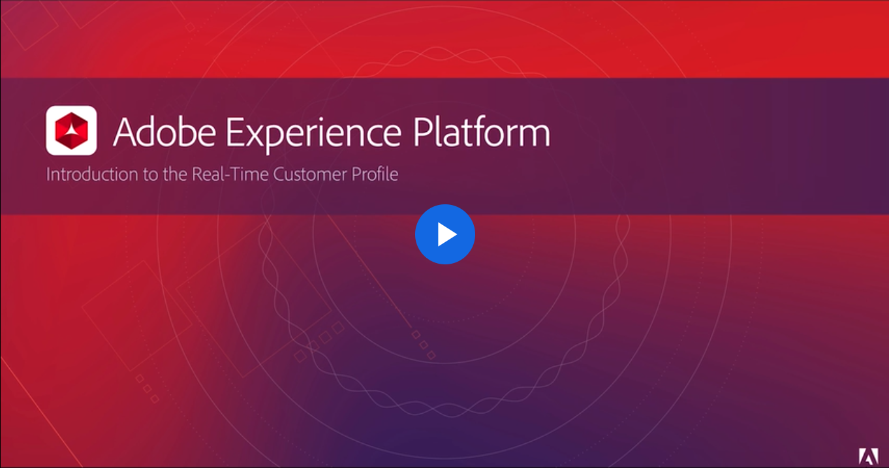
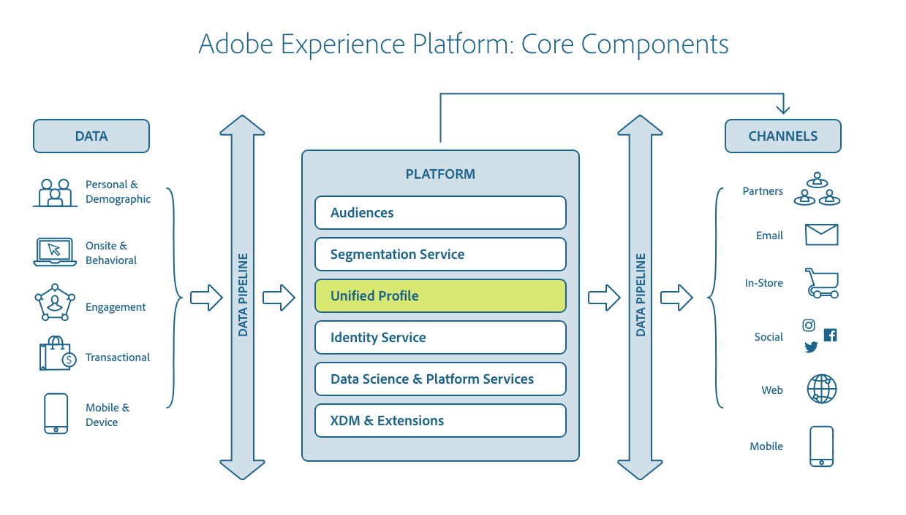
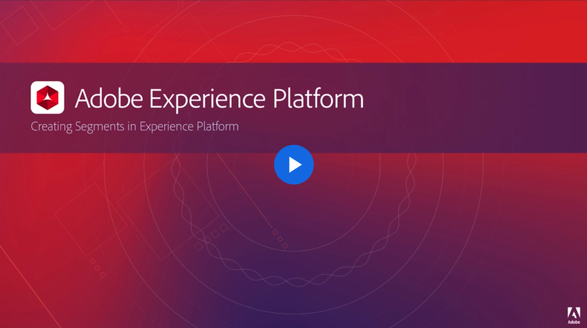
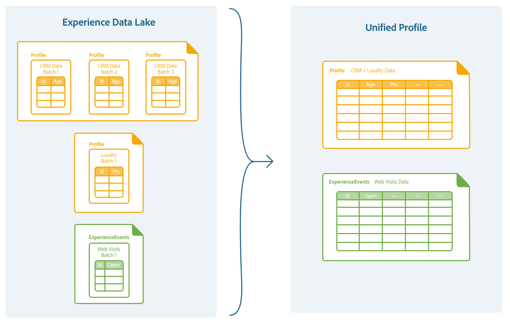
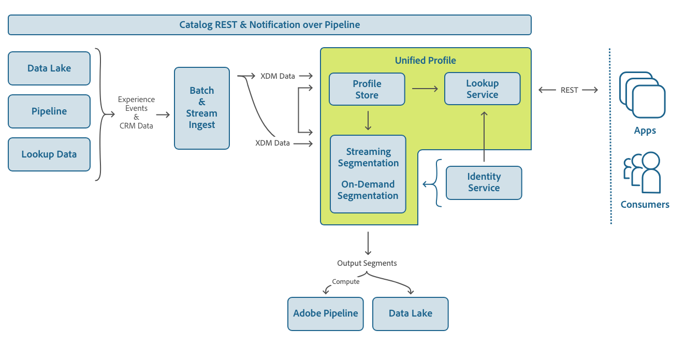
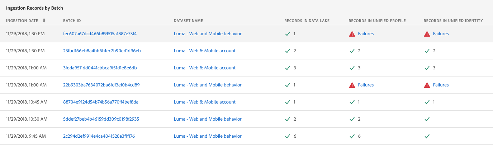

# Real-time Customer Profile overview

Adobe Experience Platform enables you to drive coordinated, consistent, and relevant experiences for your customers no matter where or when they interact with your brand. With Real-time Customer Profile, you can see a holistic view of each individual customer that combines data from multiple channels, including online, offline, CRM, and third party data. Profile allows you to consolidate your disparate customer data into a unified view offering an actionable, timestamped account of every customer interaction.

This overview will help you understand the role and use of Real-time Customer Profile in Experience Platform. The following topics are covered:

* [Understanding Real-time Customer Profile](#understanding-real-time-customer-profile): See the big picture of Profile and its role within Experience Platform.  
* [The union view](#the-union-view): Understand the components involved in unifying profile data to build the union view, including [merge policies](#merge-policies) and [union schema](#union-schema).
* [Real-time components](#real-time-components): Learn how real-time input is captured and used.
* [Data governance](#data-governance): Learn how to use data labels and certain Profile access parameters. 
* [Handling opt-out requests](#handling-opt-out-requests): Learn how Experience Platform captures opt-out requests from your customers, whose data is stored and used in Profile.
* [Sending data to Real-time Customer Profile](#sending-data-to-real-time-customer-profile): Learn the tools used to send your record and time series data to Profile.
* [Creating audience segments](#creating-audience-segments): Learn how to isolate sections of your customer base as audience segments, based on specified criteria.
* [Configuring computed attributes](#configuring-computed-attributes)

## Understanding Real-time Customer Profile
Real-time Customer Profile is a generic lookup entity store that merges data across various enterprise data assets and provides access to that data in the form of unified customer profiles and related time series events.

This feature enables marketers to drive coordinated, consistent and relevant experiences with their audiences across channels as summarized in the video below:

<a href="https://video.tv.adobe.com/v/27251" target="_blank"></a>

Although Real-time Customer Profile processes ingested data and uses Identity Service to merge related data through identity mapping, it maintains its own data in the profile store. In other words, the profile store is separate from Catalog data (Data Lake), and separate from Identity Service data (identity graph).

Real-time Customer Profile creates a single, 360 degree view of your customer by aggregating record and time-series data while empowering you to act accordingly across digital channels. Furthermore, Profile is used to power machine learning for Adobe Sensei. Profile APIs can also be used to enrich the functionality of third-party solutions, CRMs, and proprietary solutions.

The relationship between Real-time Customer Profile and other services within Experience Platform is highlighted in the following diagram:

 

### The profile

A profile is a representation of a subject, an organization or an individual, also referred to as record data. For example, the profile of a product may include a SKU and description, whereas the profile of a person contains information like first name, last name, and email address. 

Using Experience Platform, you can customize profiles to use types of data relevant to your business. The standard Experience Data Model (XDM) Profile schema is the preferred schema to implement when describing customer record data, and supplies the data integral to many interactions between Platform services. These elements are described in detail in the sections below.

### Time series events

Time series data provides a snapshot of the system at the time an action was taken either directly or indirectly by a subject, as well as data detailing the event itself. Represented by the standard schema XDM ExperienceEvent, time series data can describe events such as items being added to a cart, link clicks and video views.

Time series data can be used to base segmentation rules on, and events can be accessed individually in the context of a profile.

### Identities

Every business wants to communicate with their customers in a way that feels personal. However, one of the challenges of delivering relevant digital experiences to customers is understanding how to tie their disconnected data together, which is often spread across different digital channels such as tablets, mobile phones and laptops.

Identity Service allows you to piece together the complete picture of your customer by recognizing them in each channel through the use of unique identifiers called identity namespaces. Then, Identity Service links these namespaces, creating an identity map for each customer, allowing you to better understand them. 

For example, if a user logs into their loyalty account on a tablet, Identity Service links the anonymous webID to an email address and that customer's profile. If they log in later with their mobile phone, additional links are created in that customer's identity map.

Within a particular identity map, identities are linked when multiple identities are sent together in a single record. These identities are considered shared for a profile and can be accessed when retrieving the profile. 

Visit the [Identity Service overview](../identity_services_architectural_overview/identity_services_architectural_overview.md) for more information about how identities are managed in Experience Platform.

### Segment memberships

Segment rules are built and applied to Real-time Customer Profile using the Segment Builder. As explained in the following video, the Segment Builder produces the audiences needed to power the customer experience: 

<a href="https://video.tv.adobe.com/v/27254" target="_blank"></a>

When an audience segment is created, qualifying profiles add the ID of that segment to their list of segment memberships.
Segment memberships are stored in a `segments` field. This field is included in a [mixin](../schema_registry/schema_composition/schema_composition.md#mixin) that is added to the schema once it has been [enabled for use in Real-time Customer Profile](#union-schema).

To learn more about using ExperienceEvent data for segmentation using the Platform UI, visit the documentation on [Segment Builder](../../../../../end-user/markdown/segmentation_overview/segmentation.md). If you are using the API, see the guide on [creating segments using APIs](../../tutorials/creating_a_segment_tutorial/creating_a_segment_tutorial.md).

### Profile fragments

A **profile fragment** is a fragment of data associated with an individual profile.
When Real-time Customer Profile is used to access an entity, it can supply you with a merged view of all profile fragments for that entity across datasets, referred to as the union view.

## The union view

One of the key features of Real-time Customer Profile is the ability to unify multi-channel data. Profile provides a merged view of the individuals in your customer base, across datasets and for linked identities. This view is called a **union view**. 

Real-time Customer Profile data is merged across sources when a profile is accessed by its ID or exported as a segment. To learn more about accessing profiles and union views, visit [Accessing Profile data using APIs](../../tutorials/consuming_unified_profile_data/consuming_unified_profile_data.md).

When profile data is merged, several decisions must be made by the system to determine what data to include: 

* Which datasets to include in the union view
* Which data wins in the event of a data conflict, where merged datasets report different values for the same property
* Regulations, contractual obligations, and corporate policies that apply to your customer data
* Whether to include data under linked identities, and which identity map to use

These decisions are configured and controlled by the use of merge policies.

### Merge policies

When bringing data together from multiple sources and combining it in order to see a complete view of each of your individual customers, merge policies are the rules that Platform uses to determine how data will be prioritized and what data will be combined to create that unified view. 

Using RESTful APIs or the user interface, you can create new merge policies, manage existing policies, and set a default merge policy for your organization. Platform also provides a default merge policy for Profile-enabled XDM schemas that your organization can use. While a single schema may have several merge policies, it can have only one "default" merge policy assigned to it. Merge policies are private and cannot be accessed outside of the organization they belong to.

Each merge policy is a set of configurations controlling variables of:

* Identity stitching: Real-time Customer Profile uses [Identity Service](../identity_services_architectural_overview/identity_services_architectural_overview.md) to construct linked identities for each individual. Merge policies include configurations for choosing which identity graph, if any, to fetch linked identities from which to merge data.
* Attribute merging: When multiple profile fragments containing the same data elements are merged, data conflicts can arise. Merge policies can be used to tune prioritization of your data by allowing you to specify the order of data precedence by dataset or timestamp. 



For more information on working with merge policies, please see the [working with merge policies using APIs](../../tutorials/configuring_up_tutorial/configuring_merge_policies_tutorial.md) tutorial or to perform similar actions using the Platform user interface, see the tutorial on [working with merge policies in the UI](../../tutorials/merge_policies/create-merge-policies.md).

### Union schema

A union schema is one that has been enabled for Real-time Customer Profile. The union schema is an aggregate of schemas merged to form the union view. You can view union schemas in the UI or using the API.

Visit the [Schema Editor tutorial](../../tutorials/schema_editor_tutorial/schema_editor_tutorial.md#schema-editor-tutorial) for steps on how to enable a union schema using the UI. If you are using the API, see the [Schema Registry API developer guide](../../technical_overview/schema_registry/schema_registry_developer_guide.md). 

## Real-time components
This section explains the components that allow Real-time Customer Profile to update and monitor record and time series data in real-time.

Real-time input is made possible through a process called [Streaming Ingestion](../streaming_ingest/streaming_ingest_overview.md). Once ingested, Real-time Customer Profile then filters relevant data, based on pre-defined requirements, through a process called [Streaming segmentation](#streaming-segmentation) before merging it with existing data and updating the union view. 

Real-time output is made possible by [Edge Service](#edge-service) and [Projection Service](#projection-service) , which relay updated data to your customers. 
  
### Streaming segmentation

As profile and time series data is ingested, Real-time Customer Profile automatically decides to include or exclude that data from segments through an ongoing process called **streaming segmentation**, before merging it with existing data and updating the union view. As a result, you can instantaneously perform computations and make decisions to deliver enhanced, individualized experience to customers as they interact with your brand.  

For example, if a customer fills their online cart but doesn't purchase its contents during the same session, their profile qualifies for the "Abandoned cart" segment and would display content appropriate for that segment. However, should they return later to complete their purchase, Real-time Customer Profile would receive this updated data and immediately disqualify the profile from the "Abandoned cart" segment, discontinuing the display of content related to "Abandoned cart" the instant the "Confirm checkout" button is clicked. 

### Edge Service

Edge Service makes it easy to quickly deploy new capabilities to your customers through geographically placed servers called edges. It is a component of Real-time Customer Profile that serves as a framework for low-latency data collection, pluggable computing, and rapid data activation across all addressable channels. Solutions like Adobe Target and Adobe Campaign use Edge Service for real-time personalization.

Edge projections provide a single consolidated SDK, for every channel (JavaScript, mobile, server-side), which will send data to a common Adobe domain (adobedc.net) and receive a single payload in response for data and experience delivery. 

On the server-side, a unified edge gateway and a common platform services framework make it easy to plug-in and deploy new capabilities into this real-time computing environment. This decreases customer time to value, stops the need for "point" integrations, decreases costs, increases the speed of innovation, and creates sustained competitive advantages for Adobe customers. 

A single consolidated edge system allows you to manage your advertising, marketing or personalization campaigns across all channels as an integrated experience. Making the real-time edge pluggable allows you to add new capabilities and customer-defined logic to the real-time system in a rapid, and cost-effective manner.

### Projection Service

Projection Service relays updated Real-time Customer Profile data to the Edges in real-time.   

As profile data is updated (creations, updates, deletions), Profile sends out information about these changes using components called projections. Because a projection is a lightweight view of an entity, pared down to the fields necessary for a specific use case, it is useful in updating the edges in a timely manner. When entity change notifications are received, the service processes the notifications, creates projections and sends them to the edges. 

Records are initially pushed to the edges where you have a presence. The edges are then continuously updated using the following guidelines:

* Updates that happen on the hub flow from the hub to the edges – this includes entity creations, updates and deletions.
* Profiles that are active on an edge are pushed/refreshed on that edge.
* Profiles that are idle on an edge are removed from that edge.

Edges are controlled in two ways:

*   **Projection configurations** : Projection configurations are information about what data should be available on each edge.
*   **Projection destinations** : Projection Service allows you to route projections to one or more edges, or to a local pipeline topic from which they can be consumed by solutions or partners.

To learn about configuring edge destinations and projections for Real-time Customer Profile, visit [Configuring edge destinations and projections using APIs](../../tutorials/configuring_up_tutorial/configuring_edge_tutorial.md).

## Data governance

Data governance is a series of strategies and technologies used to manage customer data and ensure compliance with regulations, restrictions, and policies applicable to data use. 

As it relates to accessing data, data governance plays a key role within Experience Platform at various levels: 
*   Data usage labeling 
*   Data access policies 
*   Access control on data for marketing actions

Data governance is managed at several points. These include deciding what data is ingested into Platform and what data is accessible after ingestion for a given marketing action. 

### Data Usage Labeling and Enforcement (DULE)

Data Usage Labeling and Enforcement (DULE) allows you to control how fields are used from the schema level using usage labels. Usage labels separate data into the following categories:

* __Contractual data__: Data that is controlled by contractual obligations, including that the data cannot be exported to a third party or that is not permissible for use in data science workflows.
* __Identity data__: Data that could be used to identify or contact a person. These labels indicate whether data can directly or indirectly identify a person.
* __Sensitive data__: Sensitive geographic data.

For more information on usage labeling, see the [Data Usage Labeling and Enforcement (DULE) user guide](../data_governance/dule_overview.md).

### Dataset selection

Using merge policies, you can indicate what datasets to include when accessing data, creating segments, or exporting segments.

Excluded datasets are not be merged into the union view. By using this strategy, you can prevent restricted data from being accessed from undesirable channels or circumstances.

### Field selection
Real-time Customer Profile supports filtering responses by specific fields, meaning that rather than retrieving entire profiles, you are able to indicate which subset of fields to return. In this way, you are able to reduce your response to only the fields required for your purpose.

## Handling opt-out requests

Experience Platform allows your customers to send opt-out requests for the storage and use of their data in Real-time Customer Profile. In order to accept opt-out requests, one of the schemas featured in the union schema must contain opt-out XDM fields. There are two mixins that can provide these fields and they are described in more detail in the sections that follow.

* [Profile Privacy](#profile-privacy): Used to capture different opt-out types (general or sales/sharing).
* [Profile Preferences Details](#profile-preferences-details): Used to capture opt-out requests for specific XDM channels.

Detailed steps on how to add a mixin to a schema are provided in the XDM documentation. If you are using the API, see the "Add a mixin" section in the [Schema Registry API tutorial](../../tutorials/schema_registry_api_tutorial/schema_registry_api_tutorial.md#add-a-mixin). If you are using the user interface, see the "Add a mixin" section in the [Schema Editor tutorial](../../tutorials/schema_editor_tutorial/schema_editor_tutorial.md#add-a-mixin).

### Profile Privacy

The Profile Privacy mixin allows you to capture two kinds of opt-out requests from customers:

1. General opt-out
1. Sales/Sharing opt-out

The example JSON below highlights the fields provided by the mixin:

```json
{
  "xdm:optOutConsentLevel": {
    "xdm:privacyOptOuts": [
      {
        "xdm:optOutType": "general_opt_out",
        "xdm:optOutValue": "out",
        "xdm:timestamp": "2019-01-01T15:52:25+00:00"
      }
    ]
  }
}
```
* `xdm:privacyOptOuts`: An array containing a list of opt-out objects.
* `xdm:optOutType`: The type of opt-out. Has two possible values:
    * `general_opt_out`
    * `sales_sharing_opt_out`
* `xdm:optOutValue`: The active state of the opt-out. Has four possible values:
    * `not_provided`: Opt-out request not provided
    * `pending`: Pending verification
    * `out`: The customer has opted out for the opt-out type indicated by `xdm:optOutType`.
    * `in`: The customer has opted in for the opt-out type indicated by `xdm:optOutType`.
* `xdm:timestamp`: Timestamp at the received opt-out signal.

See the [public GitHub repository](https://github.com/adobe/xdm/blob/master/schemas/context/profile-privacy.schema.json) for the full XDM schema for this mixin. 

### Profile Preferences Details

The Profile Preferences Details mixin provides several fields that represent preferences for customer profiles. One of these fields, `xdm:optInOut`, allows you to set opt-out values for individual XDM channels. The example JSON below highlights how `xdm:optInOut` can capture multiple opt-out signals:

```json
{
  "xdm:optInOut": {
    "https://ns.adobe.com/xdm/channels/email": "pending",
    "https://ns.adobe.com/xdm/channels/phone": "out",
    "https://ns.adobe.com/xdm/channels/sms": "in",
    "https://ns.adobe.com/xdm/channels/fax": "not_provided",
    "https://ns.adobe.com/xdm/channels/direct-mail": "not_provided",
    "https://ns.adobe.com/xdm/channels/apns": "not_provided",
    "xdm:globalOptout": false
  }
}
```
* `xdm:optInOut`: Each key must represent a valid and known URI for an XDM channel, and has four possible values:
    * `not_provided`: Opt-out request not provided
    * `pending`: Pending verification
    * `out`: The customer has opted out for the XDM channel indicated by the key name.
    * `in`: The customer has opted in for the XDM channel indicated by the key name.
* `xdm:optInOut > xdm:globalOptout`: When set to true, this property sets a global opt-out override for the profile.

See the [public GitHub repository](https://github.com/adobe/xdm/blob/master/schemas/context/profile-preferences-details.schema.json) for the full XDM schema for this mixin. 

## Sending data to Real-time Customer Profile

Platform can be configured to send your record and time-series data to Profile, supporting real-time streaming ingestion and batch ingestion. 

> **Note:** All data collected through Adobe solutions, including Analytics Cloud, Marketing Cloud, and Advertising Cloud, flows into Experience Platform and is ingested into Profile. 



See the tutorial on [how to add data to Real-time Customer Profile](../../tutorials/adding_data_to_unified_profile/adding_data_to_unified_profile.md) for more details.

### Understanding the Data Lake, profile store, and identity graph

Catalog, Real-time Customer Profile, and Identity Service each maintain their own data store. These stores contain the relevant data needed to support the individual objectives of each service. All data ingested into Platform is stored in the Data Lake, and can be retrieved by individual services for use in its own data store.

In order to see if a batch has successfully been ingested into the data store for Real-time Customer Profile, please refer to the screenshot below. Since each of the services (Catalog, Profile and Identity) can have their own respective failures, the status of the batch is shown across each of those stores.

Please note that for a batch to be ingested into Real-time Customer Profile or Identity Service, the dataset has to be enabled for Profile.




## Creating audience segments

The cornerstone of your marketing campaign is your audience. Real-time Customer Profile provides the tools for segmenting your customer base into audiences consisting of members meeting the precise criteria you require. With segmentation, you can isolate audience members using criteria such as:

* Customers for whom one week has passed since last making a purchase.
* Customers for whom the sum of the purchases is greater than $10,000.
* Customers who have seen a set number of unique marketing campaigns from a pre-defined list, specified by their Campaign ID, and explored them within 30 minutes.

Visit the [Segment Builder overview](../../../../../end-user/markdown/segmentation_overview/segmentation.md) to learn how to build and manage segments using the Adobe Experience Platform UI. If you are using the API, see the [Create a segment tutorial](../../tutorials/creating_a_segment_tutorial/creating_a_segment_tutorial.md). 

## Configuring computed attributes

> **Note:** The computed attribute functionality outlined in this document is in alpha. The documentation and the functionality are subject to change.

Computed attributes enable you to automatically compute the value of fields based on other values, calculations, and expressions. Computed attributes operate on the profile level, meaning you can aggregate values across all records and events. 

Each computed attribute contains an expression, or 'rule', that evaluates incoming data and stores the resulting value in a profile attribute or into an event. These computations help you to easily answer questions related to things like lifetime purchase value, time between purchases, or number of application opens, without requiring you to manually perform complex calculations each time the information is needed.

For more information on computed attributes, and step-by-step instructions for working with them, please see the tutorial on [configuring and accessing computed attributes](../../tutorials/computed_attributes/computed-attributes-tutorial.md). This tutorial will help you better understand the role computed attributes play within Adobe Experience Platform and it includes sample API calls for performing basic CRUD operations using the Real-time Customer Profile API.
