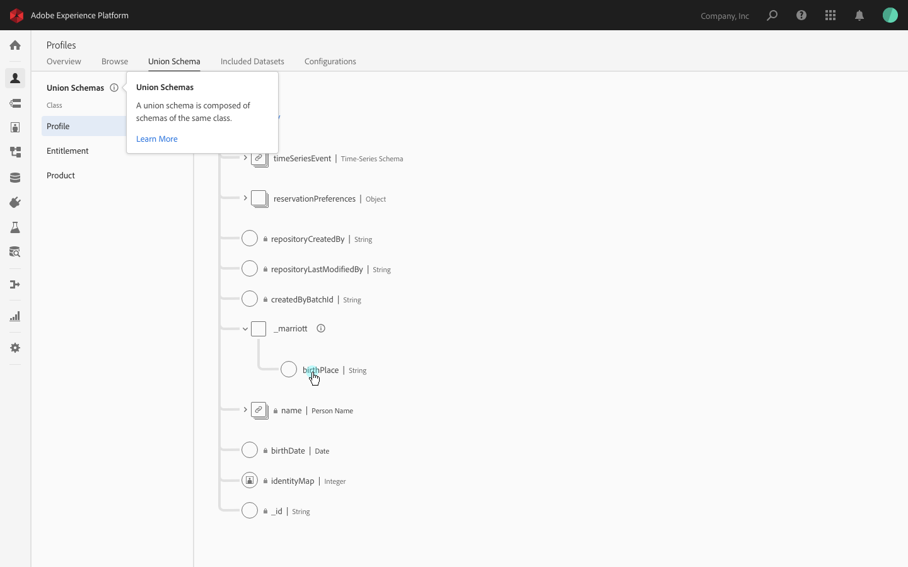

# Unified Profile in Adobe Experience Platform

Unified Profile in Adobe Experience Platform provides a unified, real-time consumer profile that enables marketers to drive coordinated, consistent and relevant experiences with their audiences across channels. With Unified Profile, you have one place to go to get a holistic view of your consumer base aggregated across all systems, as well as actionable timestamped account of every event they've had in any of your systems, when you need it.

This overview describes the role and use of Unified Profile. In specific:

[Understanding Unified Profile](#understanding-unified-profile) - See the big picture about Unified Profile and its role on Experience Platform.  
[The union view](#the-union-view) - Understand the components involved in unifying profile data to build the union view, how to control the parameters involved, and the composition of the union view schema.   
[The real-time customer profile](#the-real-time-customer-profile) - Streaming Ingestion and Edge Service allows you to access customer data to instantaneously perform computations and make decisions to deliver enhanced individualized experiences to customers, in real-time, as they interact with your brand.  
[Data governance](#data-governance) - Learn how you can use DULE and certain Unified Profile access parameters to ensure reliable compliance with any data usage restrictions and policies that govern your consumers' data.  
[Getting data to Unified Profile](#getting-data-to-unified-profile) - The power of Unified Profile and Identity Service to build the union view depends on the data you supply.  
[Creating audience segments](#creating-audience-segments) - Learn how to build audience segments which are used across Platform solutions, and can be used by your integrations as well.

---

## Understanding Unified Profile

Unified Profile is a generic lookup entity store that merges data across various enterprise data assets and provides access to that data in the form of unified consumer profiles, and related time series events. Though Unified Profile ingests data from Catalog Batch Ingestion and uses Identity Service for alternate mapped identities to merge related data, it maintains its own data in the profile store. In other words, the profile store is separate from Catalog data (Data Lake), and separate from Identity Service data (identity graph).

Unified Profile helps to inform and empower actions across channels, Platform, and Adobe solution integrations. Furthermore, Unified Profile is used to power machine learning & Sensei. Unified Profile APIs can also be used directly to enrich the functionality of third-party solutions, CRMs, and proprietary solutions.

The relationship between Unified Profile and other solutions is highlighted in this overview. 

---

## The profile

A profile is a representation of a subject, an organization or an individual, also referred to as record data. The profile of a product may include an SKU and description, whereas the profile of a person contains information like first name, last name, and email address. On Experience Platform, these types of data are built per your agenda. The XDM Profile standard schema, the preferred schema to implement when describing consumer record data, supplies the data integral to supporting the interaction of many Platform solutions. In specific, it contains:

* Time series events
* Identities
* Segment memberships

### Time series events

Time series data provides a snapshot of the system at the time an action was taken either directly or indirectly by a subject, as well as data detailing the event itself. Represented by the standard XDM schema ExperienceEvent, time series data can describe items being added to a cart, link clicks, video views, etc.

Time series data can be used to base segmentation rules, and events can be accessed individually in the context of a profile.

To learn more about using ExperienceEvent data for segmentation using the Platform UI, visit the documentation on [Segment Builder](../../../../../end-user/markdown/segmentation_overview/segmentation.md). For segmentation using the API, visit [Creating segments in Experience Platform via API](../../tutorials/creating_a_segment_tutorial/creating_a_segment_tutorial.md).

### Identities

Within a particular identity map, identities are linked when multiple identities are sent together in a single record. These identities are considered shared for a profile and can be accessed when retrieving the profile. 

Identity Service manages identity maps. You can learn more by visiting the [Identity Service overview](../identity_services_architectural_overview/identity_services_architectural_overview.md).

### Segment memberships

When a segmentation job is run, qualifying profiles are amended, adding the segment to their list of segment memberships. Segment memberships (field `segments`) is not a standard field of XDM Profiles, but are a mixin added to your schema when that schema has been enabled for Unified Profile, including it in the union.

To learn more about using segmentation using the Platform UI, visit the documentation on [Segment Builder](../../../../../end-user/markdown/segmentation_overview/segmentation.md). For segmentation using the API, visit [Creating segments in Experience Platform via API](../../tutorials/creating_a_segment_tutorial/creating_a_segment_tutorial.md).

A discussion on enabling schemas for the union view can be found [below](#union-schema).

### Profile fragments

An individual as it exists in a single dataset is considered a "profile fragment". This is fitting, as it is only a fragment of the total potential data you could have for that individual. When Unified Profile is used to access an entity, it can supply you with a merged view of all profile fragments for that entity across datasets, referred to as the union view.

---

## The union view

One of the key features of Unified Profile is the ability to unify multi-channel data. Unified Profile can supply you with a merged view of the individuals in your consumer base, across datasets and for linked identities, referred to as the union view. 

Profile merging occurs on data access in Unified Profile, more specifically when accessing a profile by identity or segment export. To learn more about accessing profiles and union views, visit [Accessing Unified Profile data via API](../../tutorials/consuming_unified_profile_data/consuming_unified_profile_data.md).

There are several considerations to factor when merging profile data: 

* Which datasets to include in the union view
* Which data wins in the event of a data conflict - where merged datasets report different values for the same property
* Regulations, contractual obligations, and corporate policies that apply to your consumer data
* Whether to include data under linked identities, and which identity map to use

Many aspects of the options around these considerations are controlled by merge policies.

### Merge policies

A merge policy is a set of configurations controlling aspects of identity stitching and data fragment merging. Merge policies are specific to a single schema, and can only be used to access entities adhering to that schema. Merge policies are private to an organization and, though there may be several for a single schema, there can only be one default for each schema.

Using Unified Profile to access data, you are presented with the option of specifying the merge policy by which to govern the data to retrieve. Platform provides a default merge policy for any XDM schema, or you can create a merge policy and mark it as your organization's default for a schema. 

> **Note:** If no merge policy is defined, and the schema or related schema to retrieve is "_xdm.context.profile", Unified Profile fetches and merges all data fragments for all related identities.

Merge policies are used to control variables of:

* Identity stitching - Merge policies include configurations for choosing which identity graph, if any, to fetch linked identities for which to merge data.
* Attribute merging - Data conflicts require an access-time rule to follow for resolution. This is provided as an attribute merge type in merge policies.

For information on working with merge policies, see the tutorial [Working with merge policies via API](../../tutorials/configuring_up_tutorial/configuring_merge_policies_tutorial.md).

### Identity stitching

Unified Profile uses [Identity Service](../identity_services_architectural_overview/identity_services_architectural_overview.md) to get linked identities for each individual. In merge policies, you specify which (if any) identity graph to use, where profile fragments for associated identities are merged with the individual's union view.

### Attribute merging

When multiple profile fragments are being merged that contain the same data elements, data conflicts will arise. Merge policies can be used to tune prioritization of your data by allowing you to specify the order of data precedence by dataset or timestamp. 

### Union schema

A union schema is one that has been enabled for Unified Profile. The union view schema is an aggregate of the union schemas merged to form the union view. A union schema can be viewed on Adobe Experience Platform by selecting it from those listed on the "Union Schemas" page.

For more information on working with the schema editor, which enables you to enable a schema for union using the UI, visit the [Basics of schema composition](../../technical_overview/schema_registry/schema_composition/schema_composition.md#union). 
For direction on how to enable a schema via API, see [Schema Registry API developer guide](../../technical_overview/schema_registry/schema_registry_developer_guide.md#unified-profile). 

---

## The real-time customer profile

Unified Profile ingests data delivered in real time via data inlets, merges it with existing data in the profile store, and creates or modifies the unified view at near real time. This data, evolving in time with your customers' experience, can be used to make personalized recommendations.

Additionally, Unified Profile checks modified profiles and time series data as having an impact on the profile's qualifying segments. A profile qualifying for the "Abandoned cart" segment would be immediately disqualified from the segment, discontinuing display of targeted content, the instant he clicks the "Confirm checkout" button.

For more, start with the [Streaming Ingestion overview](..\streaming_ingest\streaming_ingest_overview.md).

### Streaming segmentation

Unified Profile checks post-ingest profiles and time series data as having included or excluded them from segments. A profile qualifying for the "Abandoned cart" segment would be immediately disqualified from the segment, discontinuing display of targeted content, the instant he clicks the "Confirm checkout" button.

### Edge Service

Edge Service is a component of Unified Profile that serves as a framework for low-latency data collection, pluggable computing and rapid data activation across all addressable channels. Platform components like Adobe Target and Adobe Campaign use Edge Service for real-time personalization.

Edge Service provides a single consolidated SDK, for every channel (JavaScript, mobile, server-side), which will send data to a common Adobe domain (adobedc.net) and receive a single payload in response for data and experience delivery. On the server-side, a unified edge gateway and a common platform services framework make it easy to plug-in and deploy new capabilities into this real-time computing environment. This revolutionary architecture decreases customer time to value, stops the need for "point" integrations, decreases costs, increases the speed of innovation, and creates sustained competitive advantages for Adobe customers. 

A single consolidated edge system allows you to manage your advertising, marketing or personalization campaigns across all channels as an integrated experience. It also helps increase the speed of product innovation by making the real-time edge pluggable and allowing Adobe and its customers to more rapidly, _and_ more cost-effectively, add new capabilities and customer-defined logic to that real-time system.

#### Projection Service

A projection is a lightweight view of an entity, pared down to the fields necessary for a specific use case. 

Unified Profile sends out information about changes to profile data (creations, updates, deletes) as they happen, and Projection Service reflects these changes in entities on the edges in real-time. When entity change notifications are received, the service processes the notifications, creates projections and sends them to the edges.

Records are initially pushed to the edges where you have a presence. The edges are then continuously updated. Some notes:

* Updates that happen on the hub flow from the hub to the edges – this includes entity creates, updates, deletes.
* Profiles that are active on an edge are pushed/refreshed on that edge
* Profiles that are idle on an edge are removed from that edge

The projections are informed by:

* Attributes needed on the edge
  * Attributes that are directly used by calling components
  * Attributes used by server-side decisioning rules
  * Attributes used by client-side apps
* Entity activity on the edge
* Customer-specific settings
* Global settings

As an organization, you control the edges in two ways:

__Projection configurations__ - Projection configurations are information about what data should be available on each edge.  
__Projection destinations__ - Projection Service supports routing to one or more edge, or projections can routed to a local pipeline topic from which they can be consumed by solutions or partners.

To learn about configuring edge destinations and projections for your real-time customer profiles, visit [Configuring Edge destinations and projections via API](../../tutorials/configuring_up_tutorial/configuring_edge_tutorial.md).

---

## Data governance 

Data governance is a series of strategies and technologies used to manage customer data and ensure compliance with regulations, restrictions, and policies applicable to data use. As it relates to accessing data, it plays a key role within Experience Platform at various levels, including data usage labeling, data access policies, and access control on data for marketing actions.

Data governance is managed at several points, from deciding what data to add to Platform to what specific data fields to retrieve on accessing that data as well as from what datasets. 

### Data Usage Labeling and Enforcement (DULE)

Data Usage Labeling and Enforcement (DULE) is a means to control how fields are used from the schema level using usage labels. Usage labels categorize data that falls into the following:

* __Contractual data__ - Used to indicate data that is controlled by contractual obligations, including that the data cannot be exported to a 3rd party or that it isn't permissible for use in data science workflows.
* __Identity data__ - Indicates data that could be used to identify or contact a person. These labels indicate whether data can directly or indirectly identify a person.
* __Sensitive data__ - These labels categorize sensitive geographic data.

For more information on usage labeling, start with the [Data Usage Labeling and Enforcement (DULE) User Guide](https://www.adobe.io/apis/experienceplatform/home/dule/duleservices.html).

### Dataset selection

Using merge policies, you are able to indicate what datasets to include where a merge would occur; during segmentation, access, and segment export. Any datasets not included would not be merged into the union view. This method can be used to exclude data from datasets that are restricted from being used for the reason for which the data is being accessed.

### Field selection

Unified Profile supports redacted data responses <!-- or do we call this something else? Subset? -->, meaning that rather than retrieve entire profiles, you are able to indicate which fields to return. In this way, you are able to reduce your result sets to only the fields required for your purpose.

---

## Getting data to Unified Profile

Platform provides tools that you can use to send your record and time series data to Unified Profile, supporting real time streaming ingestion and batch ingestion. 

> **Note:** All data collected through Adobe solutions, including Analytics Cloud, Marketing Cloud, and Advertising Cloud, flows into Experience Platform and is ingested into Unified Profile. <!-- ? --> 

Platform provides tools that you can use to send your record and time series data to Unified Profile, supporting real-time streaming ingestion and batch ingestion. 

See the tutorial [Adding data to Unified Profile](../ingest_architectural_overview/ingest_architectural_overview.md) for more details.

### Understanding Data Lake, profile store, and identity graph

Each Catalog Service, Unified Profile Service, and Identity Service, maintains its own store and the relevant data supporting the objectives of the service. All data ingested (batch or streaming) into platform lands into Data lake and from there, individual services like Unified Profile can get that data and store it in their store as per their usage patterns.

In order to see if a batch has successfully been ingested into Profile store, please refer to the below screenshot. Since each of the services (Catalog, Unified Profile and Identity) can have their own respective failures, we show the status of the batch across each of those stores.

Please note that for a batch to be ingested into Profile or Identity, the dataset has to be enabled for Profile.

---

## Creating audience segments

The cornerstone of your marketing campaign is your audience. Unified Profile provides the tools for segmenting your customer base into audiences consisting of members meeting criteria with exactly the precision you require. With segmentation, you can isolate members of your user base by criteria such as:

* Users for whom one week has passed since last making a purchase
* Users for whom the sum of the purchases is greater than $10,000
* Users who have seen a campaign and then clicked on it within 30 minutes, for any 3 of a list of campaigns specified by their Campaign ID

For step by step instructions to create and work with segmentation using the API, see the tutorial [Creating Segments in Experience Platform](../../tutorials/creating_a_segment_tutorial/creating_a_segment_tutorial.md).

For information on working with segmentation using the Adobe Experience Platform UI, visit [Segment Builder](../../../../../end-user/markdown/segmentation_overview/segmentation.md).

