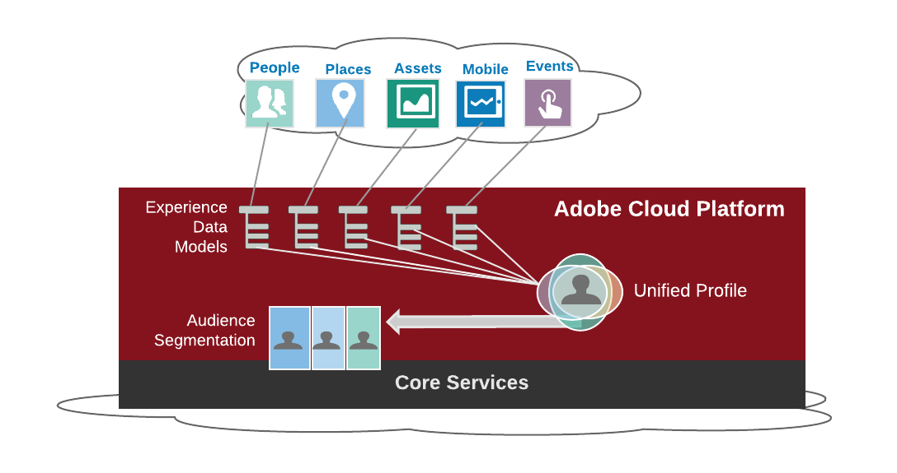
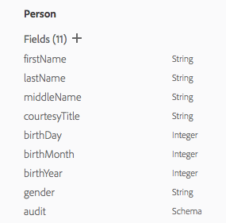
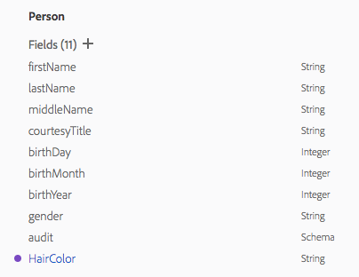

# XDM Registry Overview

## 1. Overview
This document provides a technical overview for using the XDM Registry in Adobe Cloud Platform outlining why and what Experience Data Model (XDM) is and how it is used in common workflows through the API.

---

## 2. Understanding XDM

The Experience Data Model (XDM) is the ecosystem where customer experience data is represented using a standard schemas. These standard schemas will enable easier integration of data from all our Adobe solutions and external sources. After the data is ingested and transformed to standard schemas, XDM allows the sharing of this data in an agile and normalized setting within the Adobe Cloud Platform and its services. XDM offers single-source data management focused on the creation, storage, retrieval and manipulation of data. The customer data model consists of standard schemas from the XDM, which can be extended by the customer and schemas created by the customer. These schema are called Customer Extended Schemas.


### 2.1. What is XDM used for



The main purpose of gathering this data is understanding what that data means and then utilizing this data to understand customers and users. Some marketing actions may involving having to match products to consumers, manage promotional channels, manage distribution channels, conduct market research and understand consumer intend. Many existing marketing products are built to focus on solving a particular solution. Over time, these products all shared common concepts which were used and named similarly but data was not easily exported and shared between them since the definitions were all different in some way.

---

## 3. How to Use XDM
The full resource for API calls can be found in the [swagger documentation](https://www.adobe.io/apis/cloudplatform/dataservices/api-reference.html)

XDM uses a hierarchical structure to store data. Customers start with an Adobe released *core* schema definition or a customer extended schema as the parent. The core XDM schemas and sub-schemas (core.Address, Profile, ExperienceEvent etc.) are shared with all the tentants of the platform. All the root artifacts are inherited by all theOrganization containers (IMS Org). An IMS Organization represents the customer. For this example the IMS Org Acme Corp. As Adobe releases new XDM artifacts, all the IMS Orgs underneath the root container get the updates automatically.

IMS Organization **Acme Corp** inherits all the core XDM entities and models. (`_customer` is a variable that represents the IMS Org). Acme Corp has many branches in different countries so they would create an extension namespace under their IMS Org: `Acme Corp US` and `Acme Corp EU`. Both of these namespaces will have all extensions created in the IMS Org parent.

A **schema** is an abstract definition of real-world objects such as *Profile*, *ExperienceEvent*, or *Asset*. Schemas are the highest level element and can have sub-schemas are named collections of facts such as *Age*, *hairColor*, or *Address*. The data within the **sub-schemas** are called **fields** and they can be scalar or an array of items as defined by the general JSON-schema [documentation](https://www.w3schools.com/js/js_json_datatypes.asp).

### 3.1. XDM Profile


Let's look at one of the main Schemas in XDM. The XDM Profile schema is a collection of attributes describing a person (Address, Person, Phone Number). Profiles can be identified or partially-identified. Profiles that are highly identified may contain personal information such as name, gender, date of birth, location, and contact information. In contrast, a profile that is partially-identified will have anonymous behavior signals such as browser cookies. Over time, these profiles can become more identifiable as content regarding preferences and interests towards brands are gathered and stored in the profile.

Through the API we can get the `Profile` JSON object.

##### Request
```
GET /xdms/{namespace}/{objectName}
```
```SHELL
curl -X GET \
  https://platform.adobe.io/data/foundation/catalog/xdms/model/Profile/ \
  -H 'Authorization: Bearer {ACCESS_TOKEN}' \
  -H 'x-api-key: {API_KEY}' \
  -H 'x-gw-ims-org-id: {IMS_ORG}'
```

`{namespace}`: The base namespace. This will be `core` or `model`.
`{objectName}`: Name of the entity we want to extend.
`{extensionNS}`: Name of the extension namespace we want to put the extension in. An example of this is a company branch.
`{API_KEY}`: Your specific API key value found in your unique Adobe Cloud Platform integration, provided in https://console.adobe.io.
`{IMS_ORG}`: Your IMS org credentials found in your unique Adobe Cloud Platform integration
`{ACCESS_TOKEN}`: Token provided after authentication

##### Response

The `Profile` schema object is in the response below. The entities are listed under the `properties` key. In the next section, we will be extending the `Person` entity with new fields and also creating a new entity that can be added to the `Profile` schema.

```JSON
{
    "created": 1520455236419,
    "updated": 1520455236419,
    "title": "Profile",
    "type": "object",
    "description": "XDM Profiles are a singular representation of the attributes of identified and\npartially identified persons. Profiles that are highly identified maybe used for\npersonal communications or highly targeted engagements and can contain detailed\npersonal information such as names, gender, date of birth, locations, and contact\ninformation like phone numbers and email addresses. Profiles may range to the\nother end of the identification spectrum where only anonymous behavioral signals\nare being observed and the amount of identification is simple browser cookies.\nIn this latter case, the sparse Profile data is useful to build more knowledge\non the interests and preferences of the anonymous profile, and over time can\nbecome richer as the person interacting with brand becomes more engaged and\nultimately signs-on to notifications, subscriptions, purchases and other\nconnections with the brand that enrich and fill out the profile.\n\nXDM Profile can contain personal information, identification information, contact\ndetails and communication preferences. Over time XDM Profile will expand to cater\nfor other Profile data such as preference, propensities and other attributes.\n\n",
    "properties": {
        "identities": {
            "title": "All User Identities",
            "type": "array",
            "items": {
                "$ref": "../core/Identity"
            },
            "minItems": 1,
            "description": "Array of Identities. Condensed, normalized encapsulation of all end user identifiers."
        },
        "person": {
            "title": "Person",
            "$ref": "../core/Person",
            "description": "An individual actor, contact, or owner.\n"
        },
        "homeAddress": {
            "title": "Home Address",
            "$ref": "../core/Address",
            "description": "A home postal address.\n"
        },
        "workAddress": {
            "title": "Work Address",
            "$ref": "../core/Address",
            "description": "A work postal address.\n"
        },
        "personalEmail": {
            "title": "Personal Email",
            "$ref": "../core/EmailAddress",
            "description": "A personal email address.\n"
        },
        "workEmail": {
            "title": "Work Email",
            "$ref": "../core/EmailAddress",
            "description": "A work email address.\n"
        },
        "homePhone": {
            "title": "Home Phone",
            "$ref": "../core/PhoneNumber",
            "description": "Home phone number.\n"
        },
        "workPhone": {
            "title": "Work Phone",
            "$ref": "../core/PhoneNumber",
            "description": "Work phone number.\n"
        },
        "mobilePhone": {
            "title": "Mobile Phone",
            "$ref": "../core/PhoneNumber",
            "description": "Mobile phone number.\n"
        },
        "optInOut": {
            "title": "OptInOut",
            "$ref": "../core/OptInOut",
            "description": "Describes a users opting in and out preferences for communication by medium\nand communication type.\n"
        },
        "pushNotificationTokens": {
            "title": "Push Notification Tokens",
            "type": "array",
            "description": "Push notification tokens are used to communicate with applications that\nare installed on devices or SaaS application accounts.\n",
            "items": {
                "$ref": "../core/PushNotificationToken"
            }
        },
        "orgUnitId": {
            "title": "Organizational Unit Identifier",
            "type": "string",
            "description": "The unit ID within the organization owning the profile. This ID can be used to reference the organization details maintained in another dataset."
        },
        "geoUnitId": {
            "title": "Geographical Unit Identifier",
            "type": "string",
            "description": "The geographical unit ID within the organization owning the profile. This ID can be used to reference the geographical information maintained in another dataset."
        },
        "audit": {
            "title": "Audit",
            "$ref": "../core/AuditTrail"
        },
        "organizations": {
            "title": "Organizations",
            "type": "array",
            "items": {
                "type": "string"
            }
        },
        "subscriptions": {
            "title": "Subscriptions",
            "type": "array",
            "description": "Subscriptions that this profile is entitled to including terminated, expired or exhausted subscriptions.",
            "items": {
                "$ref": "../core/Subscription"
            }
        },
        "_customer": {
            "type": "object",
            "properties": {
                "default": {
                    "version": "1",
                    "created": 1516770457179,
                    "updated": 1516770457179,
                    "createdClient": "acp_ui_platform",
                    "updatedUser": "5818D82F54ECF25C0A4C86E9@AdobeID",
                    "imsOrg": "EDCE5A655A5E73FF0A494113@AdobeOrg",
                    "title": "Default extension",
                    "type": "object",
                    "description": "The default extension",
                    "properties": {
                        "username": {
                            "type": "string",
                            "id": "username",
                            "title": "Username",
                            "description": ""
                        },
                        "created": {
                            "type": "string",
                            "id": "created",
                            "title": "Created"
                        }
                    },
                    "extNamespace": "default"
                }
            }
        }
    },
    "id": "model/Profile",
    "xdmVersion": "0.9.7",
    "xdmType": "model"
}
```

### 3.2. Extensions

One issue with normalization of data using a standard data model is incompatibility with data which can not be translated. This untranslated data may be unsuitable for the design schema of a specific data platform and will prevent sharing of the data.

Extensions solve this issue by allowing customizable data. Personalized data can be [ingested](allservices.html.html#!api-specification/markdown/narrative/technical_overview/ingest_architectural_overview/ingest_architectural_overview.md) into the XDM so that the data can then be shared.

There are ways the schemas can be extended:
* Extending an existing XDM schema with new custom fields
* Extending XDM through new sub-schemas.

There are three different levels to extend XDM

Level | Method
------ | ------
XDM Standard | The overall XDM standard schemas are available as Open Source on https://github.com/adobe/xdm. Every individual and organization is welcome to contribute. The Schemas and fields in the standard apply to all customers within Adobe Cloud Platform. Periodically the XDM Registry is refreshed with updated Schemas from this Open Source repository
Vendor extension | Independent Software Vendors can add their own extensions to the XDM Registry. These are extensions that do not apply to all customers, but only to a subset of customers that are using the specific vendor solution. Adobe Experience Cloud specific extensions are also expressed as as Vendor extension
Customer extension | Customer specific extension that only apply to the specific tenant. A customer extension is automatically created when a customer extends schemas in the XDM Registry

#### 3.2.1 Extending XDM Schemas With Custom Properties

The first type of extension is extending an existing base type with additional fields to represent the schema of data that will be ingested and the common use cases of the schema.

**Example**

The core `Person` has the following fields:



A customer manages cosmetics products and would like to add a hair color field to the `Person` entity. The `Person` entity is under the `core.Profile`

##### Request

The following API call will add the *Hair Color* field.
```
POST /xdms/{namespace}/{objectName}/_customer/{extensionNS}
```

```SHELL
curl -X POST "https://platform.adobe.io/data/foundation/catalog/xdms/core/Person/_customer/CustomerCompany"
-H "accept: application/json" \
-H "x-api-key: {API_KEY}" \
-H "x-gw-ims-org-id: {IMG_ORG}" -H "Authorization: Bearer {ACCESS_TOKEN}" \
-H "content-type: application/json" \
-d "{
       \"title\": \"Hair Color\",
       \"type\": \"object\",
       \"description\": \"Hair Color of Person\",
       \"extNamespace\": \"CustomerCompany\",
       \"properties\": {
         \"hairColor\":{
           \"type\":\"string\",
           \"description\":\"Hair Color\"
          }
         }
     }"
```

`{namespace}`: The base namespace. This will be `core` or `model`.
`{objectName}`: Name of the entity we want to extend.
`{extensionNS}`: Name of the extension namespace we want to put the extension in. An example of this is a company branch.  (in this case `CustomerCompany`).
`{API_KEY}`: Your specific API key value found in your unique Adobe Cloud Platform integration.
`{IMS_ORG}`: Your IMS org credentials found in your unique Adobe Cloud Platform integration
`{ACCESS_TOKEN}`: Token provided after authentication


##### Response

```
Array[ @/xdms/core/Person/_customer/CustomerCompany ]
```

This is what the `Person` entity will look like now.



You can use the following call to retrieve the specific HairColor extension under the `Person` entity under the `_customer` namespace and `CustomerCompany` extension namespace


##### Request
```
GET /xdms/{namespace}/{objectName}/_customer/{extensionNS}/
```
```SHELL
curl -X GET  https://platform.adobe.io/data/foundation/catalog/xdms/core/Person/_customer/CustomerCompany/ \
  -H 'Authorization: Bearer {ACCESS_TOKEN}' \
  -H 'x-api-key: {API_KEY}' \
  -H 'x-gw-ims-org-id: {IMS_ORG}'
```

`{namespace}`: The base namespace. This will be `core` or `model`.
`{objectName}`: Name of the entity we want to extend.
`{extensionNS}`: Name of the extension namespace we want to put the extension in. An example of this is a company branch.
`{API_KEY}`: Your specific API key value found in your unique Adobe Cloud Platform integration.
`{IMS_ORG}`: Your IMS org credentials found in your unique Adobe Cloud Platform integration
`{ACCESS_TOKEN}`: Token provided after authentication


##### Response

This is how your extension payload is stored in `properties` of the `Person` entity

```JSON
{
    "version": "1",
    "created": "number",
    "updated": "number",
    "createdClient": "{API_KEY}",
    "updatedUser": "string",
    "imsOrg": "{IMS_ORG}",
    "title": "string",
    "type": "object",
    "description": "Hair Color of Person",
    "properties": {
        "hairColor": {
            "type": "string",
            "description": "Hair Color"
        }
    },
    "extNamespace": "{extensionNS}"
}
```

Now lets look at the bigger picture at the `Person` entity.

##### Request
```
GET /xdms/{namespace}/{objectName}
```
```SHELL
curl -X GET \
  https://platform.adobe.io/data/foundation/catalog/xdms/core/Person/ \
  -H 'Authorization: Bearer {ACCESS_TOKEN}' \
  -H 'x-api-key: {API_KEY}' \
  -H 'x-gw-ims-org-id: {IMS_ORG}'
```

`{namespace}`: The base namespace. This will be `core` or `model`.
`{objectName}`: Name of the entity we want to extend.
`{API_KEY}`: Your specific API key value found in your unique Adobe Cloud Platform integration.
`{IMS_ORG}`: Your IMS org credentials found in your unique Adobe Cloud Platform integration
`{ACCESS_TOKEN}`: Token provided after authentication

##### Response

The `Person` entity will now look like this.


```JSON
{
    "created": "number",
    "updated": "number",
    "title": "Person",
    "type": "object",
    "description": "An individual actor, contact, or owner.",
    "properties": {
        "firstName": {},
        "lastName": {},
        "middleName": {},
        "courtesyTitle": {},
        "birthDay": {},
        "birthMonth": {},
        "birthYear": {},
        "gender": {},
        "audit": {},
        "_customer": {
            "type": "object",
            "properties": {
                "default": {},
                "CustomerCompany": {
                    "version": "1",
                    "created": "number",
                    "updated": "number",
                    "createdClient": "{API_KEY}",
                    "updatedUser": "string",
                    "imsOrg": "{IMS_ORG}",
                    "title": "Hair Color",
                    "type": "object",
                    "description": "Hair Color of Person",
                    "properties": {
                        "hairColor": {
                            "type": "string",
                            "description": "Hair Color"
                        }
                    },
                    "extNamespace": "{extensionNS}"
                }
            }
        }
    },
    "id": "core/Person",
    "xdmVersion": "0.9.7",
    "xdmType": "entity"
}
```

Note that the third-party XDM extension is added into the `_customer` namespace.  `_customer` is just a variable that refers to your `IMS_ORG` that your integration is created under. Customer extensions are private and are visible only to the customer tenant that created it either through the XDM API and UI. The IMS Organization has the option to create any number of different extensions names (we used `CustomerCompany`) to group and manage extensions based on different business units or data sources.

*Vendors* can can also extend schemas with custom properties. Their extensions are located under the `_vendor` namespace are are considered public. This is so the configured definitions and extensions created by independent software vendors are shared with all XDM customers that install the applications.

#### 3.2.2 Extending XDM Through New Schemas

The second type of extension is creating a new schema object. This is useful for when a user wants a new child object or entity under the parent schema.

**Example**
An airline company wants a schema to store data for their flights. There is no existing `Flights` schema so they will create a custom one. Within the schema they want to store information about flight ID, flight number and carrier name. These will be the fields for the schema `Flights`.

You can use the following API call in your terminal to create the `Flights` object. The response body will be where the schema is stored.

##### Request
```
POST /xdms/_customer/{extensionNS}/{objectName}
```
```SHELL
curl -X POST "https://platform.adobe.io/data/foundation/catalog/xdms/_customer/default/Flights" /
  -H 'Authorization: Bearer {ACCESS_TOKEN}' \
  -H 'x-api-key: {API_KEY}' \
  -H 'x-gw-ims-org-id: {IMS_ORG}'
  -H "content-type: application/json" -d "{ \
      "imsOrg\": \"{IMS_ORG}\", \
      "title\": \"Flights\", \
      "type\": \"object\", \
      "description\": \"Flights data\", \
      "properties\": { \
        "flightId\": { \
          "type\": \"string\", \
          "id\": \"flightId\", \
          "title\": \"FlightId\"
        }, \
        "flightNumber\": { \
          "type\": \"string\", \
          "id\": \"flightNumber\", \
          "title\": \"Flight Number\"
        }, \
        "carrier\": { \
          "type\": \"string\", \
          "id\": \"carrier\", \
          "title\": \"Carrier\"
        }
      }, \
      "xdmType\": \"model\", \
      "extNamespace\": \"default\", \
      "id\": \"_customer/default/flights\"
    }"
```

`{objectName}`: Name of the entity we want to extend.
`{extensionNS}`: Name of the extension namespace we want to put the extension in.
`{API_KEY}`: Your specific API key value found in your unique Adobe Cloud Platform integration.
`{IMS_ORG}`: Your IMS org credentials found in your unique Adobe Cloud Platform integration
`{ACCESS_TOKEN}`: Token provided after authentication

##### Response

```
@/xdms/_customer/default/Flights
```

We can use the response body `"@/xdms/_customer/default/Flights"` to find the custom object we created.

##### Request

```SHELL
curl -X GET
  https://platform.adobe.io/data/foundation/catalog/xdms/_customer/default/Flights
  -H 'Authorization: Bearer {ACCESS_TOKEN}'
  -H 'x-api-key: {API_KEY}'
  -H 'x-gw-ims-org-id: {IMS_ORG}'
```

```JSON
{
    "version": "1",
    "created": "number",
    "updated": "number",
    "createdClient": "{API_KEY}",
    "updatedUser": "string",
    "imsOrg": "IMS_ORG",
    "title": "Flights",
    "type": "object",
    "description": "Flights data",
    "properties": {
        "flightId": {
            "type": "string",
            "id": "flightId",
            "title": "FlightId"
        },
        "flightNumber": {
            "type": "string",
            "id": "flightNumber",
            "title": "Flight Number"
        },
        "carrier": {
            "type": "string",
            "id": "carrier",
            "title": "Carrier"
        }
    },
    "xdmType": "model",
    "extNamespace": "{extensionNS}",
    "id": "_customer/default/Flights"
}
```

### 3.3. ExperienceEvent

Another important schema in XDM is the ExperienceEvent schema.

The ExperienceEvent schema schema is used to capture events that are altering one or more fields or sub-schemas. Some examples of entities include physical address, email address, and geo. The main information being captured and stored is the information about the observation and when it occurs. Events are either implicit or explicit. Implicit events involve changes that occur without human interaction like scheduled email sending of newsletters, battery voltage reaching a certain threshold, or a person entering a proximity sensor. Explicit events involve direct observation of human action during the session.


```SHELL
curl -X GET \
  https://platform.adobe.io/data/foundation/catalog/xdms/model/ExperienceEvent/ \
  -H 'Authorization: Bearer <YOUR_ACCESS_TOKEN>' \
  -H 'x-api-key: <YOUR_CLIENT_ID>' \
  -H 'x-gw-ims-org-id: <YOUR_ORGANIZATION_ID>'
```


```JSON
{
    "created": 1520455236419,
    "updated": 1520455236419,
    "title": "ExperienceEvent",
    "type": "object",
    "description": "The core ExperienceEvent XDM is used to capture observations that are altering one or more related XDMs/entities. The ExperienceEvent captures information about the observation taking place and when it is occurring. It is critical for time domain analytics as it allows observation and analysis of changes that occur in windows of time and comparison with other windows of time to track trends. ExperienceEvent are either explicit or implicit. Explicit events are direct observations of a human action taking place during a session. Implicit events are events that are being raised without a direct human action. Examples of implicit events are scheduled email sending of newsletters, battery voltage reaching a certain threshold, a person entering into range of a proximity sensor. While not all events are easily categorized across all data sources, it is extremely valuable to harmonize similar events into similar types for processing where possible, and the XDM specifications does this by defining a set of enumerated **type** attribute values with specific semantic meanings. Where possible events must be constrained to these enumerated values to facilitate interoperability.",
    "properties": {
        "id": {
            "title": "Identifier",
            "type": "string",
            "description": "The unique identifier for the ExperienceEvent."
        },
        "dataSource": {
            "title": "Data Source",
            "$ref": "../core/DataSource",
            "description": "Globally unique identification of a data source."
        },
        "timestamp": {
            "title": "Timestamp",
            "type": "number",
            "format": "int64",
            "description": "The timestamp when the first event of the touchpoint occurred. Milliseconds since midnight of January 1, 1970.",
            "minimum": 1,
            "maximum": 9223372036854770000
        },
        "endUserIds": {
            "title": "End User IDs",
            "$ref": "../core/EndUserIds",
            "description": "Condensed, normalized encapsulation of all end user identifiers.\n"
        },
        "metrics": {
            "title": "Metrics",
            "$ref": "../core/Metrics",
            "description": "The metrics for actions performed during this observation."
        },
        "environment": {
            "title": "Environment",
            "$ref": "../core/Environment",
            "description": "Information about the surrounding situation the event observation occurred in, specifically detailing transitory information such as the network or software versions."
        },
        "productListItems": {
            "title": "Product List Items",
            "type": "array",
            "description": "A list of items representing a product selected by a customer with specific options and pricing that are for that usage context at a specific point of time and may differ from the product record.",
            "items": {
                "$ref": "../core/ProductListItem"
            }
        },
        "device": {
            "title": "Device",
            "$ref": "../core/Device",
            "description": "An identified Device/Application or Device/Browser instance that is trackable across sessions, normally by cookies."
        },
        "commerce": {
            "title": "Commerce",
            "$ref": "../core/Commerce",
            "description": "The commerce specific data related to this interaction."
        },
        "application": {
            "title": "Application",
            "$ref": "../core/Application",
            "description": "The application related to the event observation. It could be either the application targeted by the event like the send of a push notification or the application originating the event such as a click, or a login."
        },
        "search": {
            "title": "Search",
            "$ref": "../core/Search",
            "description": "The information related to web or mobile search."
        },
        "web": {
            "title": "Web",
            "$ref": "../core/Web",
            "description": "The information related to web page and link of the ExperienceEvent."
        },
        "marketing": {
            "title": "Marketing",
            "$ref": "../core/Marketing",
            "description": "The information related to marketing activities that are active with the touchpoint."
        },
        "locationContext": {
            "title": "Location Context",
            "$ref": "../core/LocationContext",
            "description": "The transient circumstances related to the observation. Examples include locale specific information such as weather, local time, traffic, day of the week, workday vs. holiday, working hours."
        },
        "_vendor": {
            "title": "Vendor Extensions",
            "$ref": "../_vendor/ExperienceEvent",
            "description": "Vendor extensions to ExperienceEvent"
        }
    },
    "id": "model/ExperienceEvent",
    "xdmVersion": "0.9.7",
    "xdmType": "model"
}
```
