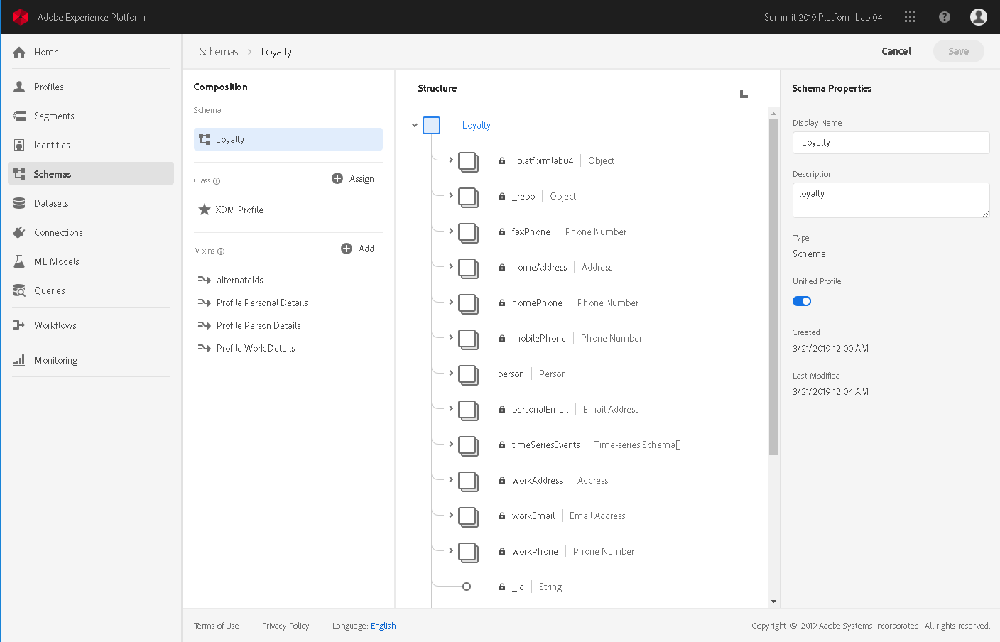

# Adding Data to Unified Profile

## Overview

This tutorial covers all methods of adding to and updating your Unified Profile data on Experience Platform. In specific, it covers how to get data to Unified Profile using:

[Configure schemas for Unified Profile](#configure-xdm-schemas-for-unified-profile) - Prior to sending data to Unified Profile, the schema for the data has to have been enabled.   
[Batch Ingestion](#bringing-data-into-unified-profile-as-a-parquet-file) - Deliver batched data in the form of [Parquet](http://parquet.apache.org/documentation/latest/) files to a dataset.  
[Streaming Ingestion](#streaming-ingestion) - Deliver real-time data as JSON to a streaming endpoint.  

### Prerequisite topics

[Unified Profile](../../technical_overview/unified_profile_architectural_overview/unified_profile_architectural_overview.md) is a generic lookup entity store, and is used to manage XDM Platform data as actionable entities. Unified Profile facilitates building customer personalization use cases by merging data across various enterprise data assets and providing access to that unified data.  
[XDM System in Adobe Experience Platform](../../technical_overview/schema_registry/xdm_system/xdm_system_in_experience_platform.md) provides the framework to refer to and manage the schemas that your data must conform to for use as entities on Platform.

---

## Configure XDM schemas for Unified Profile

For an XDM schema to contribute to the unified view, it must be enabled for Unified Profile and Identity Service. This is a step separate from enabling a dataset because more than one dataset may support a union schema, but perhaps not all are to be used for Unified Profile or Identity Service.  

In the Platform UI, you can enable a schema for Unified Profile and Identity Services from the right rail of a schema's detail page, accessible by selecting a schema from those listed on the "Schemas" page.

> **Note:** Only schemas of class XDM Profile or XDM Experience Event can be enabled for Unified Profile and Identity Service

To learn how to enable schemas for union via API, visit [Enable XDM schemas for Unified Profile and Identity Service](../schema_registry_api_tutorial/schema_registry_api_tutorial.md#enable-schema-for-use-in-unified-profile-service).

---

## Bringing data into Unified Profile as a Parquet file

Unified Profile can sync your profile store with data uploaded to datasets, adding new profiles or overwriting data of profiles already in the store. It is recommended that you send data from a particular system to a dataset specific to that system. For instance, you should send your eCommerce data to one dataset, and your affiliate management system data to another. You can use tools described in this tutorial to merge datasets as you require, and can maintain the modularity for future variations, tracking, etc.

Before data uploaded to a dataset will be automatically sent to Unified Profile, the dataset has to be specifically configured. For complete instructions on configuring a dataset for Unified Profile, visit [Configuring a dataset for Unified Profile and Identity Service via API](../unified_profile_dataset_tutorial/unified_profile_dataset_api_tutorial.md).

---

## Streaming Ingestion

Any XDM compliant data delivered to any streaming endpoint will automatically add or overwrite that record in Unified Profile. If more than one identity is supplied in the record or time series data consumed, those identities will be mapped in the identity graph without additional configuration.

Visit [Getting Started with Adobe Experience Platform Streaming Ingestion APIs](../../technical_overview/streaming_ingest/getting_started_with_platform_streaming_ingestion.md) for more details.

---

## Optional: Confirming your data upload

While this step is optional, it's always a good idea to spot check your upload when it's the first of a new dataset or if any part of your process changes, such as using a new ETL or new data source. To do this, using some known identities from your source data, use Unified Profile APIs to ensure you can retrieve the entities you uploaded as expected.

Unified Profile receives batch data as it gets loaded into a dataset. If you are unable to retrieve any of the entities you expect, your dataset may not be enabled for Unified Profile. If you check and your dataset has been enabled, try ensuring your source data format and identifiers support your expectations.

You can find details on this by visiting the [Accessing data in Unified Profile via API](../consuming_unified_profile_data/consuming_unified_profile_data.md) tutorial.

---

## Now You Know

After following this tutorial, which focuses on importing your data into Unified Profile, the following should be demystified:

* How can I get my profile data into Adobe Experience Platform?
* What format do I use to send my data?
* How does Unified Profile handle updates to profiles?

For more in-depth information on Unified Profile, see the [Unified Profile Overview](../../technical_overview/unified_profile_architectural_overview/unified_profile_architectural_overview.md).

---

## Next steps

[Accessing Unified Profile data via API](../consuming_unified_profile_data/consuming_unified_profile_data.md)  
[Creating segments in Experience Platform via API](../creating_a_segment_tutorial/creating_a_segment_tutorial.md)
