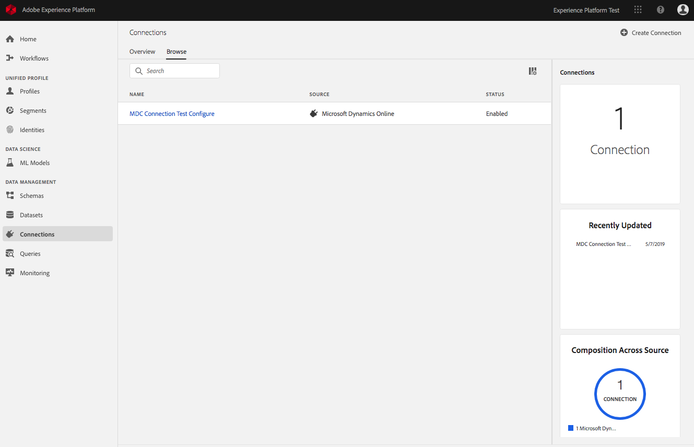
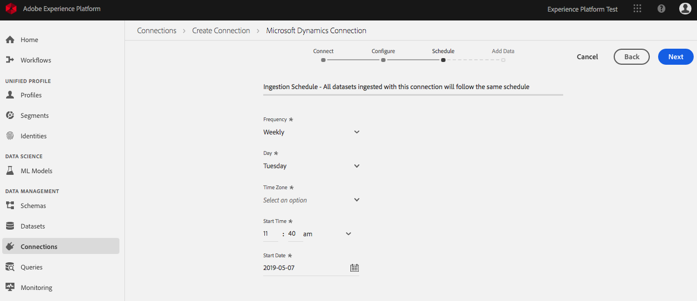
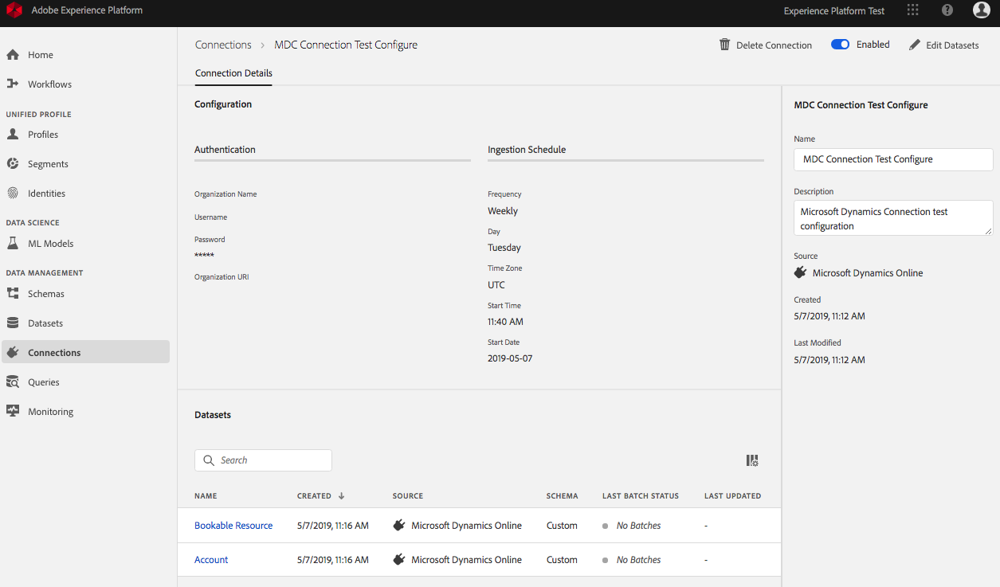
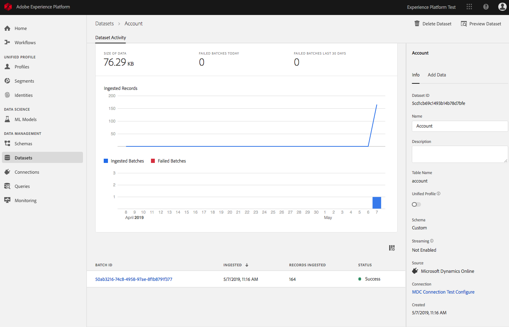

# Create a data connector using the UI
This document provides a step-by-step tutorial on how to set up, configure, and monitor a Salesforce and/or Microsoft Dyamics connector using the user interface within [Adobe Experience Platform](https://platform.adobe.com). 

This tutorial requires you to have an Adobe ID and access to Adobe Experience Platform. 

## Create a new connector
1. Log in to [Adobe Experience Platform](https://platform.adobe.com/connection/create). 
2. Select **Connections** from the left-navbar to navigate to the Connections workspace. If connections have been made, they will be listed here with Name, Source, and Status. The Connections workspace also includes information regarding the number of connections in your organization, recently updated connections, and composition of connections across sources. 

    

3. To create a new connection, click **Create Connection** in the top-right of the screen.
4. From here, you can create a connection to Salesforce or Microsoft Dynamics. Each connector has its own steps to authenticate and connect to the service. After that, they both follow the same steps of configuration, scheduling, and adding data. This tutorial covers making a connection to Microsoft Dynamics. Click **Microsoft Dynamics Connection** to proceed. 

    

5. Use your Microsoft Dynamics credentials to complete the authentication fields, then click **Connect**. Once the connection is confirmed, click **Next**.

    >**Note:** Please contact your system administrator if you need help accessing your organization credentials. 

    

6. After authenticating, you can begin configuring your connection. On the **Configure: Microsoft Dynamics Online** screen, give your connection a name (required) and a description (optional). You can now click **Add Labels** to add Data Governance Labels. For more information about Data Usage Labeling and Enforcement (DULE) and implementing labels at the connection-level, read the [working with data usage labels](../dule/dule_working_with_labels.md) documentation.

    

7. When you are finished configuring your connection, click **Next**.

    > **Note:** You cannot modify the connector's configuration options once you have finished creating it.

8. On the **Ingestion Schedule** screen you can set how frequently you want to run data ingestion for this connector and when to start. Once completed, click **Next**.

    

9. You can now select datasets for ingestion. You can first preview a dataset by hovering over it and clicking the **eye** to the right. This can help ensure you are adding the correct data. You can always come back at a later time to add or remove any dataset. Here is an example of a dataset preview:

    
    
10. After selecting the datasets you want for ingestion, they will be moved to a list on the right. From here, you can edit the save strategy and backfill for each dataset. By default it will overwrite the previous ingested data and store a backfill of the last 60 days. Once you have selected at least one dataset, click **Save & Ingest** to finish creating your connector.

    

## Monitoring data ingestion 
After setting up your connection, you can monitor the data that is being ingested. 

1. In Experience Platform, click **Connections** in the left-navbar to open the Connections workspace, then select one of the datasets you previously added.

    

2. From here, you can see the rate of messages being consumed in the form of a graph as well as a list of successful and failed batches. Click a batch ID for a detailed view.

    

For more information about monitoring data ingestion, please read the documentation on [monitoring streaming data flows](../../technical_overview/streaming_ingest/monitor-data-flows.md).