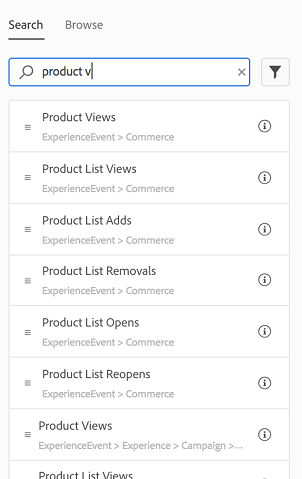
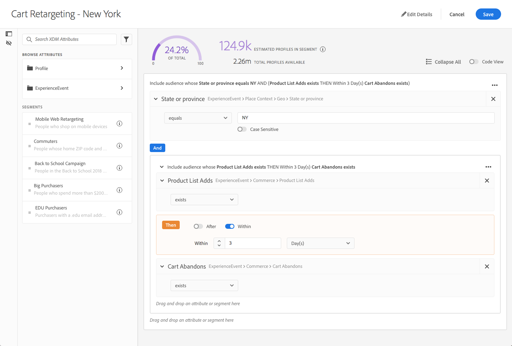
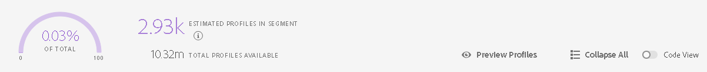

# Creating Segments in Experience Platform

## Objective

This document serves as a tutorial on creating a segment in Adobe Experience Platform. 

## Creating Segments

Customizing a user experience implies the need to define the "person". Experience Platform centralizes segmentation whether for a customized campaign for all "Women" or all "Men", or to target content for individuals who have expressed interest in a particular product. 

In this tutorial, we will walk through working with Platform Segmentation Service as follows:

* __First, you'll develop your segment definition__ - Start with determining your marketable segment, first conceptually, then on Platform as criteria that your profile data must meet to qualify for your segment. Those that qualify constitute the members of that segment, or audience.
* __Test as you develop your definition__ - As the testing step of the iterations of developing, testing, and refining your definition, you can apply your definition against a sample of your profile store, giving you summary information such as the estimated size of the resulting audience, or a sample set of qualifying profiles to spot-check against the results you expect.
* __Then, segment your user base__ - Once your definition has been built, tested, and saved, export your audience to a dataset where it can be accessed directly or used by any Platform solution.
  
There are basically two ways of working with Segmentation; using the Experience Platform UI and using Unified Profile APIs. This tutorial provides or links to instruction on how to work with either, on a step-by-step basis. This tutorial assumes you already have an understanding of Segmentation and know how to gain access to your method of choice. To catch up, see:

* [Authenticating and accessing Adobe Experience Platform APIs](../authenticate_to_acp_tutorial/authenticate_to_acp_tutorial.md) if you intend to work with Segmentation Service programmatically
* [Using Adobe Unified Profile Segment Builder](../../../../../end-user/markdown/segmentation_overview/segmentation.md) if you intend to use the Experience Platform UI

---

## Step 1: Develop a Segment Definition

The first task in segmentation is to define the segment, represented in a construct aptly referred to as a segment definition. Segment definition rules can be defined using either the segment builder in the Experience Platform UI, or by using Profile Query Language (PQL) with APIs. Rules can be based on conditions related to any Profile or ExperienceEvent data you supply to Unified Profile.

### Using the API

Using Segmentation via API, a segment definition is represented as construct which includes the PQL statement defining the segment itself using the [Unified Profile Segment Definitions API](../../../../../swagger-specs/profile-segment-definitions-api.yaml). For more information on PQL, a prerequisite, visit the [Profile Query Language Overview](../../technical_overview/unified_profile_architectural_overview/unified_profile_pql.md), or a reference [list of supported queries](../../technical_overview/unified_profile_architectural_overview/unified_profile_supported_queries.md).

Name your definition in a way intuitive to viewing a list of your organization's segments in the UI.

__Example request__

`POST https://platform.adobe.io/data/core/ups/segment/definitions`

__Example body__

```
{
    "name": "My Sample Cart Abandons Segment Definition",
    "schema": {
        "name": "MyProfile",
    },
    "type": "PQL",
    "format": "pql/text",
    "mergePolicyId": "mpid1",
    "description": "This Segment represents those users who have abandoned a cart",
    "expression": "xEvent.metrics.commerce.abandons.value > 0"
}
```

__Example response__

```
{
    "id": "1234",
    "name": "My Sample Cart Abandons Segment Definition",
    "description": "This Segment represents those users who have abandoned a cart",
    "type": "PQL",
    "format": "pql/text",
    "expression": "xEvent.metrics.commerce.abandons.value > 0",
    "_links": {
        "self": {
            "href": "https://platform.adobe.io/data/core/ups/segment/definitions/1234"
        }
    }
}
```

From the response, collect the `id`, which will be used in future steps.

See [Develop a Segment Definition](../../technical_overview/unified_profile_architectural_overview/unified_profile_architectural_overview.md#develop-a-segment-definition) in the [Unified Profile Overview](../../technical_overview/unified_profile_architectural_overview/unified_profile_architectural_overview.md), or go straight to the [API reference for Unified Profile Segment Definitions API](../../../../../swagger-specs/profile-segment-definitions-api.yaml).

### Using the Experience Platform UI

The segment builder presents Profile and ExperienceEvent schema properties as draggable tiles that can be located by typing in the name or browsing through the schema hierarchy. 



For each rule, drag the relevant field onto the rule builder canvas where you're presented with options relevant to defining a rule based on that field.



For more details, see [Building a Segment](../../../../../end-user/markdown/segmentation_overview/segmentation.md#building-a-segment) in the [Segment Builder Overview](../../../../../end-user/markdown/segmentation_overview/segmentation.md).

---

## Optional Step 2: Estimate and Preview Audience

As you develop your segment definition, you can use Unified Profile's estimate and preview tools to gain summary-level information quickly along the way to help ensure you are isolating the expected audience. Estimate information includes what the resulting audience size is projected to be and the confidence interval. A preview would produce a paginated list of qualifying profiles for a segment definition, allowing you to spot-check the results against what you expect.

### Using APIs

Using the APIs to get an estimate of the number of profiles that would qualify for the segment definition varies only slightly from previewing a sample of the resulting audience. Working with the [Unified Profile Preview API](../../../../../swagger-specs/profile-preview-api.yaml), you'll supply PQL to create a preview job rather than a segment definition. In this way, you are able to test your PQL predicates until they produce the desirable results and then use that PQL to create a segment definition.

To preview or get an estimate of your segment there are a couple of steps involved, as you must:

* Create a preview job
* Get estimate or preview using the ID of the preview, the artifact of running the preview job
* Delete the preview job
  
See [Estimate and Preview Your Audience](../../technical_overview/unified_profile_architectural_overview/unified_profile_architectural_overview.md#estimate-and-preview-your-audience) for a step by step in the [Unified Profile Overview](../../technical_overview/unified_profile_architectural_overview/unified_profile_architectural_overview.md), or go straight to the API reference for [Unified Profile Preview API](../../../../../swagger-specs/profile-preview-api.yaml).

### Using the Experience Platform UI

Using the UI, estimate information is updated any time the segment definition changes, and a click of a button produces a preview of the qualifying audience members. 



For more details, see the section covering the [UI](../../../../../end-user/markdown/segmentation_overview/segmentation.md#the-ui) in the [Segment Builder Overview](../../../../../end-user/markdown/segmentation_overview/segmentation.md), which includes how to see both audience segment estimates and a preview of the profiles qualifying for your definition.

---

## Step 3: Segment Your User Base

Once you have perfected your segment definition and saved the definition, you are able to build the audience. Currently, segmenting your user base is only supported by use the [Unified Profile Segment Jobs API](../../../../../swagger-specs/profile-segment-jobs-api.yaml).

### Using APIs

Using the APIs, a segmentation job is created referencing the segment definition, as well as merge policies controlling the manner by which Unified Profile merges overlapping attributes across your profile fragments.

To build your segment, you will use the [Unified Profile Segment Jobs API](../../../../../swagger-specs/profile-segment-jobs-api.yaml) to:

* Create a segment job
* Periodically poll the status of the segment job until complete (its `status` is "SUCCEEDED")
  
When a segment job finalizes successfully, you can gather various information about your segment, such as any errors that may have occurred and the ultimate size of your audience.

For more details, visit the section on covering how to [create a segment job](../../technical_overview/unified_profile_architectural_overview/unified_profile_architectural_overview.md#create-a-segment-job) in the [Unified Profile Overview](../../technical_overview/unified_profile_architectural_overview/unified_profile_architectural_overview.md).

---

## Step 4: Export Results

After a segmentation job has successfully filtered through your user base, export your audience to a dataset where it can be acted upon by Platform solutions. Currently you can only export using the [Unified Profile Export API](../../../../../swagger-specs/profile-export-api.yaml).

### Using APIs

You'll use the [Unified Profile Export API](../../../../../swagger-specs/profile-export-api.yaml) to load a dataset with the qualifying audience members. Exporting your audience to a dataset entails:

* Creating, or selecting, the audience dataset
* Generating XDM Profiles for audience members
* Periodically polling the status of the export job until complete (its `status` is "SUCCEEDED")

For directions, see [Export Your Audience](../../technical_overview/unified_profile_architectural_overview/unified_profile_architectural_overview.md#export-your-audience) in the [Unified Profile Overview](../../technical_overview/unified_profile_architectural_overview/unified_profile_architectural_overview.md). 

Your audience can then be accessed using the [Data Access API](../../technical_overview/data_access_architectural_overview/data_access_architectural_overview.md).

---

## Now You Know

After following this tutorial, which focuses on creating audience segments, the following should be demystified:

* The data and condition types you can use to build the rules for your segments
* Getting from your entire profile store to marketable subsets of your user-base
* Exporting your segment to a dataset to be accessed by Platform solutions


