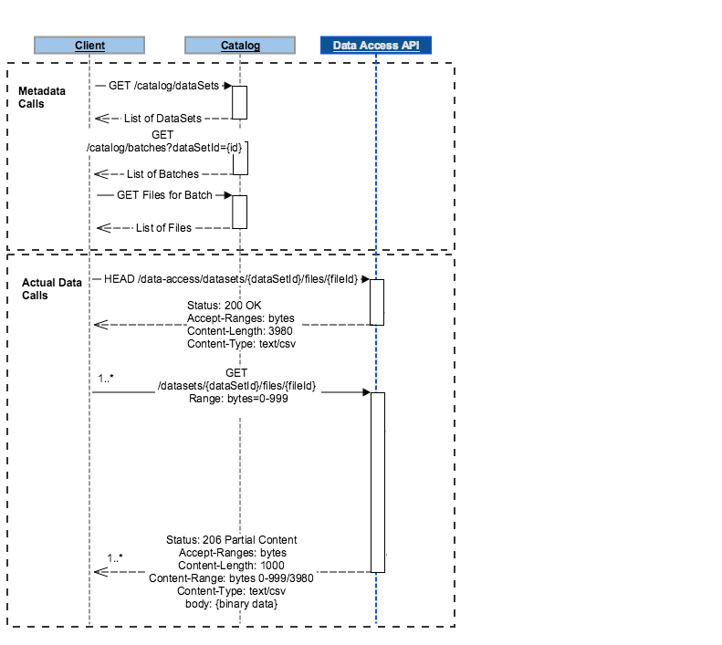

# Tutorial: How to Query Data via Data Access API

## 1 Objective
In this step by step tutorial, we will focus on how to locate, access, and download data stored within a dataset using Adobe Cloud Platform Data Access API. This article will also go into some of the unique features of the Data Access API, such as Paging and Partial Downloads. The steps that will be explained in this tutorial are:

* Locating the data
* Retrieving the files belonging to a batch
* Accessing the file and downloading the data


### 1.1 Audience
This document is aimed at technical personas and should be a useful tool for all users that need to consume Adobe Cloud Platform APIs, understand Adobe Cloud Platform architecture, or architect integrations between customer-owned and 3rd party systems with Adobe Cloud Platform.

Personas Include: Data Engineers, Data Architects, Data Scientists, App Developers

### 1.2 Version Information
*Version* : Beta

### 1.3 License Information
*Terms of service* : https://www.adobe.com/legal/terms.html

### 1.4 URI Scheme
*Host* : __platform.adobe.io__   
*BasePath* : __/data/foundation/export/__  
*Schemes* : __HTTPS__  

### 1.5 About the Docs
The HTML rendition of this documentation is kept up-to-date on a per commit basis and can therefore change without announcement. If you require a persistent version of the documentation, it is recommended that you seek out the PDF rendition.

---

## Prerequisites

* A valid [Access Token](../alltutorials.html#!api-specification/markdown/narrative/tutorials/authenticate_to_acp_tutorial/authenticate_to_acp_tutorial.md) (ACCESS_TOKEN)
* API key (API_KEY)
* IMS Organization Id (IMS_ORG)
* Knowledge of creating and populating a dataset. See [Create and populate a dataset](../alltutorials.html#!api-specification/markdown/narrative/tutorials/creating_a_dataset_tutorial/creating_a_dataset_tutorial.md)

---

## Sequence Diagram
This tutorial will follow the steps indicated in the sequence diagram below to go over the main functionalities of the Data Access API.


We will begin by retrieving information regarding batches and files using the Catalog API. The Data Access API will then allow us to access and download these files over HTTP, either in full, or via partial downloads.

---

## 1 Locating The Data
Before we can begin to use the Data Access API, you'll need to identify the location of the data that you want to work on. Using the Catalog API, we can browse an organization's metadata and retrieve the id of a batch or file that we wish want to access. To that end, two endpoints within the Catalog API are of interest:

1. GET /batches : Returns a list of batches under your organization (batchID)
2. GET /dataSetFiles : Returns a list of files under your organization(fileID)

For more information regarding the Catalog API, please refer to the [API Reference](apireference.html#!acpdr/catalog.yaml)


### 1.1 Retrieving a list of batches under your IMS Organization

Using the Catalog API, you can return a list of batches under your organization.

##### Request
GET /batches

```shell
curl -X GET https://platform.adobe.io/data/foundation/catalog/batches/ \
  -H 'Authorization: Bearer {ACCESS_TOKEN}' \
  -H 'x-api-key: {API_KEY}' \
  -H 'x-gw-ims-org-id: {IMS_ORG}'
```

* `ACCESS_TOKEN`: Token provided after authentication.  
* `API_KEY`: Your specific API key value found in your unique Adobe Cloud Platform integration.  
* `IMS_ORG`: Your IMS org credentials found in your unique Adobe Cloud Platform integration.  


##### Response
```json
{
    "{BATCH_ID_1}": {
        "imsOrg": "EDCE5A655A5E73FF0A494113@AdobeOrg",
        "created": 1516640135526,
        "createdClient": "acp_foundation_push",
        "createdUser": "acp_foundation_push@AdobeID",
        "updatedUser": "acp_foundation_push@AdobeID",
        "updated": 1516640135526,
        "status": "processing",
        "version": "1.0.0",
        "availableDates": {}
    },
    "{BATCH_ID_2}": {
    ...
  }
}
```

The response will include a list of all the batches under the organization ID. The batch identifer is represented by the unique key of each result within the response. In the response above, this refers to `{BATCH_ID_1}` and `{BATCH_ID_2}`.

### 1.2. Filtering the list of batches

Oftentimes, filters are required to zero in on a particular batch in order to retrieve relevant data for a particular use case. Parameters can be added to the `GET /batches` request in order to filter the returned response. The request below will return all batches created after a specified time, within a particular data set, sorted by when they were created.

##### Request
GET /batches?createdAfter={START_TIMESTAMP}&dataSet={DATASET_ID}&sort=desc:created"

```shell
curl -X GET https://platform.adobe.io/data/foundation/catalog/batches?createdAfter={START_TIMESTAMP}&dataSet={DATASET_ID}&orderBy=desc:created \  
  -H 'Authorization: Bearer {ACCESS_TOKEN}' \
  -H 'x-api-key: {API_KEY}' \
  -H 'x-gw-ims-org-id: {IMS_ORG}'
```

* `START_TIMESTAMP` is the start timestamp in milliseconds (E.g. 1514836799000)
* `DATASET_ID` is the data set identifier
* `desc:created` will sort the response by the order they were created in descending order

##### Response
```json
{
    "{BATCH_ID_3}": {
        "imsOrg": "EDCE5XXXXXXXXXX494113@AdobeOrg",
        "created": 1521053542579,
        "createdClient": "acp_foundation_push",
        "createdUser": "acp_foundation_push@AdobeID",
        "updatedUser": "acp_foundation_dataTracker@AdobeID",
        "updated": 1521053793736,
        "status": "success",
        "errors": [],
        "version": "1.0.2",
        "availableDates": {
            "startDate": 0,
            "endDate": 0
        },
        "relatedObjects": [
            {
                "type": "dataSet",
                "id": "5a9f264c2aa0cf01da4d82f9"
            }
        ],
        "metrics": {},
        "tags": {
            "acp_producer": [
                "acp_ui_platform"
            ],
            "acp_stagePath": [
                "acp_foundation_push/stage/{BATCH_ID_3}"
            ]
        }
    },
    "{BATCH_ID_4}": {
        "imsOrg": "EDCE5A655A5E73FF0A494113@AdobeOrg",
        "created": 1521052595345,
        "createdClient": "acp_foundation_push",
        "createdUser": "acp_foundation_push@AdobeID",
        "updatedUser": "acp_foundation_push@AdobeID",
        "updated": 1521052595345,
        "status": "loading",
        "version": "1.0.0",
        "relatedObjects": [
            {
                "type": "dataSet",
                "id": "5a9f264c2aa0cf01da4d82f9"
            }
        ],
        "tags": {
            "acp_producer": [
                "3190067ecd9e4ad3be08a58330f0da45"
            ],
            "acp_stagePath": [
                "acp_foundation_push/stage/{BATCH_ID_4}"
            ]
        }
    }
}
```

A full list of parameters and filters can be found in the [Catalog API Reference Documentation](apireference.html#!acpdr/catalog.yaml)

---

## 2. Retrieve a list of all files belonging to a particular batch

Now that we have the ID of the batch that we're looking for, we can use the Data Access API to get a list of files belonging to a particular batch.

##### Request
GET /batches/{BATCH_ID}/files

```shell
curl -X GET https://platform.adobe.io/data/foundation/export/batches/{BATCH_ID}/files \
  -H 'Authorization: Bearer {ACCESS_TOKEN}' \
  -H 'x-api-key: {API_KEY}' \
  -H 'x-gw-ims-org-id: {IMS_ORG}'
```
* `BATCH_ID`: Batch identifier of the batch that we are trying to access.  
* `ACCESS_TOKEN`: Token provided after authentication.  
* `API_KEY`: Your specific API key value found in your unique Adobe Cloud Platform integration.  
* `IMS_ORG`: Your IMS org credentials found in your unique Adobe Cloud Platform integration.  


##### Response
```json
{
    "data": [
        {
            "dataSetFileId": "{FILE_ID_1}",
            "dataSetViewId": "5a9f264c2aa0cf01da4d82fa",
            "version": "1.0.0",
            "created": "1521053793635",
            "updated": "1521053793635",
            "isValid": false,
            "_links": {
                "self": {
                    "href": "https://platform.adobe.io/data/foundation/export/files/{FILE_ID_1}"
                }
            }
        }
    ],
    "_page": {
        "limit": 100,
        "count": 1
    }
}
```

The response contains a data array containing a list of all the files within the specified batch. Files are referenced by their identifier (fileID), which is contained within the value of "dataSetFileId".

In the response above:
* `{FILE_ID_1}`: The file ID of the file in the specified batch. We will use this in the next section.
* `_link > self > href`: The url to access this file

---

### 3. Access a file using File ID

Using the unique file ID, the data access API can then be used to access the specific details of the file, including its name, size in bytes, and a link to download it.

##### Request
GET /files/{dataSetFileId}

```shell
curl -X GET https://platform.adobe.io/data/foundation/export/files/{FILE_ID} \
  -H 'Authorization: Bearer {ACCESS_TOKEN}' \
  -H 'x-api-key: {API_KEY}' \
  -H 'x-gw-ims-org-id: {IMS_ORG}'
```

Depending on whether the file pointed to by the ID is an individual file or a directory the data array returned may contain a single entry or a list of files belonging to that directory. Each file element will have the details of the file like name of the file, size of the file in bytes, link to download the file.

##### Case 1 : Response points to a single file

##### Response
```json
{
  "data": [
    {
      "name": "{FILE_NAME_1}.parquet",
      "length": "249058",
      "_links": {
        "self": {
          "href": "https://platform.adobe.io/data/foundation/export/files/{FILE_ID_1}?path={FILE_NAME_1}.parquet"
        }
      }
    }
  ],
  "_page": {
    "limit": 100,
    "count": 1
  }
}
```

* `{FILE_NAME_1}.parquet` is the name of the file
* `_links > self > href` is the url to download the file

##### Case 2 : Response points to a directory

##### Response
```json
{
  "data": [
    {
      "dataSetFileId": "{FILE_ID_2}",
      "dataSetViewId": "460590b01ba38afd1",
      "version": "1.0.0",
      "created": "150151267347",
      "updated": "150151267347",
      "isValid": true,
      "_links": {
        "self": {
          "href": "https://platform.adobe.io/data/foundation/export/files/{FILE_ID_2}"
        }
      }
    },
    {
      "dataSetFileId": "{FILE_ID_3}",
      "dataSetViewId": "460590b01ba38afd1",
      "version": "1.0.0",
      "created": "150151267685",
      "updated": "150151267685",
      "isValid": true,
      "_links": {
        "self": {
          "href": "https://platform.adobe.io/data/foundation/export/files/{FILE_ID_2}"
        }
      }
    }
  ],
  "_page": {
    "limit": 100,
    "count": 2
  }
}
```

We can see that a directory containing two files have been returned. In this scenario, we will need to follow the url of each file in order to access the file. For the response above, `{FILE_ID_2}` and `{FILE_ID_3}` are the fileIDs of two separate files.

* `_links > self > href`: the url to download the associated file

---

### 4. Retrieving metadata using File ID <a name="HEAD_METADATA"></a>
The metadata of a file can be retrieved by making a HEAD request. This will return the file's metadata headers, including its size in bytes and file format.

##### Request
HEAD /files/{dataSetFileId}?path={fileName}

```shell
curl -X HEAD https://platform.adobe.io/data/foundation/export/files/{FILE_ID}?path={FILE_NAME} \
  -H 'Authorization: Bearer {ACCESS_TOKEN}' \
  -H 'x-api-key: {API_KEY}' \
  -H 'x-gw-ims-org-id: {IMS_ORG}'
```

* `FILE_ID` is the file's identifier
* `FILE_NAME` is the file name (E.g. profiles.parquet)

##### Response
The response header contains the metadata of the queried file:  
* Content-Length which indicates the size of the payload (Bytes)
* Content-type, which indicates the type of file.

---

### 5. Access the contents of a file
The Data Access API can also be used to access the contents of a file.

##### Request
GET /files/{dataSetFileId}?path={file_name}

```shell
curl -X GET https://platform.adobe.io/data/foundation/export/files/{FILE_ID}?path={FILE_NAME} \
  -H 'Authorization: Bearer {ACCESS_TOKEN}' \
  -H 'x-api-key: {API_KEY}' \
  -H 'x-gw-ims-org-id: {IMS_ORG}'
```

* `FILE_ID` is the file's identifier
* `FILE_NAME` is the file name (E.g. profiles.parquet)

##### Response
```json
[file contents]
```

---

### 6. Pagination

Responses within the Data Access API are paginated. By default, the number of entries per page is 100. Paging parameters can be used to modify the default behavior.

* `limit`: You can specify the number of entries per page according to your requirements using the "limit" parameter.

* `start`: The offset can be set by the "start" query parameter. You can also control the range of results displayed using the start and limit parameter.

##### Request
GET /batches/{BATCH_ID}/files

```shell
curl -X GET https://platform.adobe.io/data/foundation/export/batches/{BATCH_ID}/files?start={OFFSET}&limit={LIMIT} \
  -H 'Authorization: Bearer {ACCESS_TOKEN}' \
  -H 'x-api-key: {API_KEY}' \
  -H 'x-gw-ims-org-id: {IMS_ORG}'
```

* `BATCH_ID`: Batch identifier of the batch that we are trying to access.  
* `OFFSET` is the specified index to start the result array (E.g. start=1)
* `LIMIT` controls how many results gets returned in the result array (E.g. limit=0)

##### Response:
```json
{
    "data": [
        {
            "dataSetFileId": "{FILE_ID_1}",
            "dataSetViewId": "5a9f264c2aa0cf01da4d82fa",
            "version": "1.0.0",
            "created": "1521053793635",
            "updated": "1521053793635",
            "isValid": false,
            "_links": {
                "self": {
                    "href": "https://platform.adobe.io/data/foundation/export/files/{FILE_ID_1}"
                }
            }
        }
    ],
    "_page": {
        "limit": 1,
        "count": 1
    },
    "_links": {
        "next": {
            "href": "https://platform.adobe.io/data/foundation/export/batches/{BBATCH_ID_3}/files?start=1&limit=1"
        },
        "page": {
            "href": "https://platform.adobe.io/data/foundation/export/batches/{BBATCH_ID_3}/files?limit={limit}&start={start}",
            "templated": true
        }
    }
}
```

The response will contain a single file element in the data array (limit = 1). Since the offset is set to 0, the very first file in the result array will get returned. The next link within the response will have the url to the next page of responses with the offset set to 1.

* `{FILE_ID_1}`: the file id of the first file that gets returned  
* `data > _links > self > href`: url to access the first file
* `_links > next > href` url to access the next page


---

### 7. Partial File Downloads
The Data Access API allows for downloading files in chunks. A range header can be specified during a GET /files/{FILE_ID} request to download a specific range of bytes from a file. If the range is not specified, the API will download the entire file by default.

The HEAD example in [Section 4](#HEAD_METADATA) gives the size of a specific file in bytes.

##### Request
GET /files/{dataSetFileId}?path={file_name}

```shell
curl -X GET https://platform.adobe.io/data/foundation/export/files/{FILE_ID}?path={FILE_NAME} \
  -H 'Authorization: Bearer {ACCESS_TOKEN}' \
  -H 'x-api-key: {API_KEY}' \
  -H 'x-gw-ims-org-id: {IMS_ORG}' \
  -H "Range: bytes=0-99"
```

* `FILE_ID` is the file's identifier
* `FILE_NAME` is the file name (E.g. profiles.parquet)
* `bytes=0-99` specifies the range of bytes to download. If this is not specified, the API will download the entire file. In this example, the first 100 bytes will be downloaded.

##### Response
* Status Code: 206 PARTIAL CONTENTS
* Response Headers:
  * Content-Length: 100
  * Content-type: application/parquet
  * Content-Range: bytes 0-99/249058
* Body:
```json
[First 100 bytes of file]
```

---
