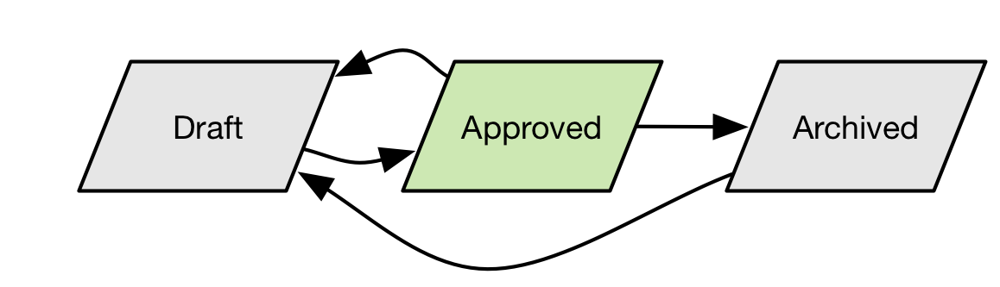

# Creating and managing decisioning entities using APIs

This document provides a tutorial for working with the business entities of Decisioning Service using Adobe Experience Platform APIs. 

The tutorial covers the following steps:

[List containers accessible to users and integrations](#list-containers-accessible-to-users-and-integrations)  
[Create instances](#create-instances)  
[Get an instance by ID](#get-an-instance-by-id)  
[Test for newer revisions of an instance](#test-for-newer-revisions-of-an-instance)  
[List instances for a schema - Sorting and paging](#list-instances-for-a-schema---sorting-and-paging)  
[Filter a list](#filter-a-list)  
[Full text search and structured queries](#full-text-search-and-structured-queries)  
[Update and patch](#update-and-patch)  
[Control property value edits](#control-property-value-edits)  
[Test for concurrent update](#test-for-concurrent-update)  
[Delete](#delete)  
[Create offers and their sub components](#create-offers-and-their-sub-components)  
[Manage calendar constraints](#manage-calendar-constraints)  
[Manage capping constraints](#manage-capping-constraints)  
[Eligibility constraints](#eligibility-constraints)  
[Set the priority of an offer](#set-the-priority-of-an-offer)  
[Manage rules](#manage-rules)  
[Offer collections - Create a tag](#offer-collections---create-a-tag)  
[Manage activities](#manage-activities)  
[Manage fallback offers](#manage-fallback-offers)  

## Getting started

This tutorial requires a working understanding of the Experience Platform services involved in experience decisioning and determining the next best offer to present during customer experiences. Before beginning this tutorial, please review the documentation for the following:

- [Decisioning Service](../../technical_overview/decisioning-overview/decisioning-service-overview.md): Provides the framework for adding and removing offers and creating algorithms for choosing the best to present during a customer's experience.
- [Experience Data Model (XDM)](../../technical_overview/schema_registry/xdm_system/xdm_system_in_experience_platform.md): The standardized framework by which Platform organizes customer experience data.
- [Profile Query Language (PQL)](../../technical_overview/unified_profile_architectural_overview/unified_profile_pql.md): PQL is used to define rules and filters.

## Tutorial

This tutorial requires you to have completed the [Authentication to Adobe Experience Platform tutorial](../authenticate_to_acp_tutorial/authenticate_to_acp_tutorial.md) in order to successfully make calls to Platform APIs. Completing the authentication tutorial provides the values for each of the required headers in all Experience Platform API calls, as shown below:

* Authorization: Bearer `{ACCESS_TOKEN}`
* x-api-key: `{API_KEY}`
* x-gw-ims-org-id: `{IMS_ORG}`

All POST, PUT, and PATCH requests require an additional header:

* Content-Type: application/json

Decisioning Service is controlled by a number of business objects that are related to each other. All business objects are stored in the Platform’s Business Object Repository. A key feature of this repository is that the APIs are orthogonal to the type of business object. Instead of using a POST, GET, PUT, PATCH or DELETE API that indicates the type of resource in its API endpoint, there are only 6 generic endpoints but they accept or return a parameter that indicates the type of the object when that disambiguation is needed. The schema must be registered with the repository, but beyond that the repository is usable for an open-ended set of object types.  

In addition to the headers listed above, the APIs to create, read, update, delete and query repository objects have the following conventions: 

* The endpoint paths for all repository APIs start with "https<span></span>://platform.adobe.io/data/core/xcore/".

API Payload formats are negotiated with an `Accept` or `Content-Type` header. Message formats in the `Accept` or `Content-Type` header are indicated by a value `application/vnd.adobe.platform.xcore.{FORMAT}+json` where {FORMAT} is dependent on the specific repository API request or response message, per the following table.

FORMAT variant | Description of request or response entity
 --- | ---
hal<br>followed by a parameter `schema={schemaId}` | The message contains an instance described by a JSON Schema that is indicated by the format parameter schema. The instance is wrapped in a JSON property `_instance`. The other top level properties in the response payload specify repository information that is available for all resources.  Messages that comply with the hal format have a _links property that contains references in HAL format. 
patch.hal | The message contains a JSON Patch payload with the assumption the instance to be patched is HAL compliant. That means that not only the instance’s own instance properties but also the HAL links of the instance can be patched. Note that there are restrictions on which properties can be updated by the client. 
home.hal | The message contains a JSON formatted representation of a home document resource for the repository. 
xdm.receipt | The message contains a JSON formatted response for a create, update (full and patch) or delete operation. Receipts contain control data indicating the revision of the instance in form of an etag 

The usage of each format variant depends on the specific API:  

API | Content-Type header | Accept header 
---|---|---|
Create Instance <br/>Create Container | hal<br/>with schema parameter | xdm.receipt 
Update Instance<br/>Update Container | hal<br/>with schema parameter | xdm.receipt 
Patch Instance | patch.hal | xdm.receipt 
Delete instance<br/>Delete container | N/A | xdm.receipt 
Read Instance<br/>Read Container | N/A | hal with schema parameter 
List instances<br/>List containers | N/A | hal with special schema parameter "https<span></span>://ns.adobe.com/experience/xcore/hal/results" 
Search instances | N/A | hal with special schema parameter "https<span></span>://ns.adobe.com/experience/xcore/hal/results" 
Read repo root | N/A | home.hal 

For the container create, update and read APIs, the format parameter schema has the value "https<span></span>://ns.adobe.com/experience/xcore/container".

`ContainerId` is the first path parameter for the instance APIs. All business entities reside in what is called a container. A container is an isolation mechanism to keep different concerns apart. The first path element for the repository instance APIs following general endpoint is the `containerId`. The identifier is obtained from the list of containers accessible to the caller. E.g. the API to create an instance in a container is `POST https://platform.adobe.io/data/core/xcore/{containerId}/instances`. 

The list of accessible containers is obtained by calling the repository root endpoint "/" with an HTTP GET request using the standard headers. 

## List containers accessible to users and integrations

When the administrator has granted access to containers for regular users or integrations those containers will show up in the so-called “Home” list of the repository. The list may be different for different users or integrations as it is a subset of all containers accessible to the caller. The list of containers can be filtered by their association to product contexts. The context for Platform product is `dma_offers`. 

> **Note:** The context for Platform is soon to change to `acp`. Filtering is optional, but filters by `dma_offers` will require edits upon a future release.

### Request

```
curl -X GET ${endpoint_path}/?product=dma_offers \ 
  -H 'Accept: application/vnd.adobe.platform.xcore.home.hal+json' \ 
  -H 'Authorization: Bearer ${ACCESS_TOKEN}' \ 
  -H 'x-api-key: ${API_KEY}' \ 
  -H 'x-gw-ims-org-id: ${IMS_ORG} \ 
  -H 'x-request-id: ${NEW_UUID}' 
```

### Response

```
{ 
    "_embedded": { 
        "https://ns.adobe.com/experience/xcore/container": [ 
            { 
              "instanceId": "82d1f250-85b6-11e9-ac80-99ba4655b277", 
              "schemas": [ 
                "https://ns.adobe.com/experience/xcore/container;version=0.1" 
              ], 
              "productContexts": [ 
                "dma_offers" 
              ], 
              "repo:etag": 1, 
              "repo:createdDate": "2019-06-03T04:17:33.684Z", 
              "repo:lastModifiedDate": "2019-06-03T04:17:33.684Z", 
              "repo:createdBy": "CREATOR_ACCOUNT_ID", 
              "repo:lastModifiedBy": "LAST_UPDATE_ACCOUNT_ID", 
              "repo:createdByClientId": "CLIENT_ID_OR_API_KEY", 
              "repo:lastModifiedByClientId": "CLIENT_ID_OR_API_KEY", 
              "_instance": { 
                "repo:name": "My Organization's container", 
                "dataCenter": "VA7" 
              }, 
              "_links": { 
                "self": { 
                  "href": "/containers/82d1f250-85b6-11e9-ac80-99ba4655b277" 
                } 
              } 
            } 
        ] 
    }, 
    "_links": { 
        "self": { 
            "href": "/"  
        } 
    } 
}  
```

Note the `instanceId` listed in the results item(s). It is used as the `containerId` parameter in the APIs to read and manipulate regular business objects. 

The list is already filtered for the users per their access privileges but can be further filtered by a property query.

## Create instances

The API to create a new instance in repository takes a `containerId` path parameter and identifies the type of the instance in the `Content-Type` header with the schema parameter.

The instance properties are given in the payload wrapped in the `_instance` property. The instance properties must be valid against the JSON schema with the given schema identifier. 

The HAL `_links` property must be present but can be empty. It means that no custom links are defined for this instance. 

### Request

```
curl -X POST ${endpoint_path}/${containerId}/instances \ 
  -H 'Content-Type: application/vnd.adobe.platform.xcore.hal+json; schema="${schemaId}"' \  
  -H 'Accept: application/vnd.adobe.platform.xcore.xdm.receipt+json \ 
  -H 'x-api-key: ${API_KEY}' \ 
  -H 'x-gw-ims-org-id: ${IMS_ORG} \ 
  -H 'x-request-id: ${NEW_UUID}' \ 
  -d '{ 
    "_instance": { 
        ${JSON_PAYLOAD} 
    }, 
    "_links": { 
    } 
}' 
```

### Response

```
{ 
  "instanceId": "3684ceb0-8744-11e9-a989-89f60b24f6cc", 
  "@id": "GENERATED_URI", 
  "repo:etag": 1, 
  "repo:createdDate": "2019-06-05T03:44:25.343Z", 
  "repo:lastModifiedDate": "2019-06-05T03:44:25.343Z", 
  "repo:createdBy": "YOUR_TECHNICAL_ACCOUNT_ID", 
  "repo:lastModifiedBy": "YOUR_TECHNICAL_ACCOUNT_ID", 
  "repo:createdByClientId": "YOUR_API_KEY", 
  "repo:lastModifiedByClientId": "YOUR_API_KEY" 
} 
```

The response contains the instanceId of the object that was just created. This instanceId is immutable, always assigned by the repository and globally unique. The value serves as a physical identifier. 

In addition, a universal resource identifier (URI) is returned in the `@id` property of the response payload if the schema has such property. Each instance should have a property that serves as the URI and the primary key of the instance. This identifier is used by other instance to form relationships with the new instance, including across different types. In the current release, the URIs are generated by the repository and are contained in the `@id` property. Future versions may relax this rule and allow clients to manage their own URI values and name the property that contains it. 

Note that those URIs are not URLs and don’t provide a way to directly retrieve the resource. To indicate that aspect, the URI is prefixed with a URI scheme that does not specify a retrieval protocol. However, the URIs can be used to lookup the instance with a query. 

The REST response will have a Location header that contains a URL component which can be used to retrieve the instance that was just created. This component is a relative URI Reference and needs to be applied to the Base URI of the repository. The Base URI is returned in the `Content-Base` header. 

The `repo:etag` property specifies the revision of the instance. This value can be used in update operations to enforce consistency. The HTTP header `If-Match` can be used to add a condition to a PUT or PATCH API call that ensures that there was no other change to the instance that could accidentally be overwritten. The `repo:etag` value is returned with every create, read, update, delete and query call. The value is used as the value in the ` If-Match` header, per [RFC7232 Section 3.1](https://tools.ietf.org/html/rfc7232#section-3.1).

The remaining properties indicate which account and API key was used to create and last modify the instance. Since the instance was created by this call the respective values are those of the request. 

## Get an instance by ID

Using the URL in the Location header returned with the Create call, an application can look up an instance. 

### Request 

```
curl -X GET ${endpoint_path}/${containerId}/instances/${instanceId} \ 
  -H 'Accept: *, application/vnd.adobe.platform.xcore.hal+json; schema="${schemaId}" \ 
  -H 'x-api-key: ${API_KEY}' \ 
  -H 'x-gw-ims-org-id: ${IMS_ORG} \ 
  -H 'x-request-id: ${NEW_UUID}'  
```

> **Note:** Although `instanceId` is given as a path parameter, applications should, whenever possible, not construct the path themselves and instead follow links to instances contained in list and search operations. See sections ‎6.4.4 and ‎6.4.6 for details. 

### Response 

```
{ 
  "instanceId": "ID_OF_THIS_INSTANCE", 
  "schemas": [ 
    "SCHEMA_ID_OF_INSTANCE" 
  ], 
  "repo:etag": 1, 
  "repo:createdDate": "2019-03-24T15:52:12.725Z", 
  "repo:lastModifiedDate": "2019-03-24T15:52:12.725Z", 
  "repo:createdBy": "CREATOR_ACCOUNT_ID", 
  "repo:lastModifiedBy": "LAST_UPDATE_ACCOUNT_ID", 
  "_instance": { 
    JSON_PROPERTIES_OF_THIS_INSTANCE 
  }, 
  "_links": { 
    "self": { 
      "name": "GENERATED_UNIQUE_LINK_NAME", 
      "href": "RELATIVE_URL_TO_INSTANCE" 
    } 
  } 
} 
```

The instance’s JSON properties are wrapped in the `_instance` property and the other root level properties hold metadata about the instance. 

The resource also contains an array of JSON schema IDs. This array indicates the JSON schemas that this instance is validated against. 

Each instance contains a HAL link of relation type self that corresponds with the IANA registered self relation (as defined by [RFC5988]).  

## Test for newer revisions of an instance

The current `eTag` value of the instance is returned with the response, it allows clients to issue conditional operations against the instance, either to avoid retrieving the same resource state again or to avoid overwriting a later revision’s values without the client’s knowledge. 

The lookup API allows a client to specify an `If-None-Match` header parameter. See the definition of this standard HTTP parameter [RFC2616]. The entity tag value a client specifies is the value it received with the latest response, either from an update, read, list or search API call. Note that the `etag` value should be opaque to the client and must be given as a string, surrounded by quotes.  

### Request

```
curl -X GET ${endpoint_path}/${containerId}/instances/${instanceId} \ 
  -H 'Accept: *, application/vnd.adobe.platform.xcore.hal+json; schema="${schemaId}" \ 
  -H 'If-None-Match: "${LAST_RECEIVED_ETAG}" \ 
  -H 'x-api-key: ${API_KEY}' \ 
  -H 'x-gw-ims-org-id: ${IMS_ORG} \ 
  -H 'x-request-id: ${NEW_UUID}'  
```

The repository API will respond with a status 304 Not Modified when the instance’s last revision is that with the etag given. 

## List instances for a schema - Sorting and paging

Clients will not be able to keep track of the instances they are creating and therefore accessing them by their physical instanceId. Using the Read instance API will be the exception. Clients are also unaware what instances other clients have created. 

A more typical access pattern will be to page through the set of all instances. 

### Request

```
curl -X GET ${endpoint_path}/${containerId}/instances?schema="${schemaId}" \ 
  -H 'Accept: *, application/vnd.adobe.platform.xcore.hal+json; schema="https://ns.adobe.com/experience/xcore/hal/results" \ 
  -H 'x-api-key: ${API_KEY}' \ 
  -H 'x-gw-ims-org-id: ${IMS_ORG} \ 
  -H 'x-request-id: ${NEW_UUID}'  
```

### Response

The response depends on the `{schemaId}` specified. For instance for "https<span></span>://ns.adobe.com/experience/offer-management/offer-activity&id=xcore:offer-activity:fa24f9e8fc15c73" the response resembles the following.

```
{
	"requestTime": "2019-06-28T06:54:05.606Z",
	"_embedded": {
		"results": [],
		"total": 0,
		"count": 0
	},
	"_links": {
		"self": {
			"href": "/653da250-71b8-11e9-a3fe-9b1d0913f3ed/instances?schema=https://ns.adobe.com/experience/offer-management/offer-activity&id=xcore:offer-activity:fa24f9e8fc15c73",
			"@type": "https://ns.adobe.com/experience/xcore/hal/results"
		}
	},
	"containerId": "653da250-71b8-11e9-a3fe-9b1d0913f3ed",
	"schemaNs": "https://ns.adobe.com/experience/offer-management/offer-activity;version=0.1"
}
```

> **Note:** The result contains the instances for the given schema or the first page of this list. Note, that instances can comply to more than one schema and therefore can appear in more than one list.

Page resources are transient and are read-only; they cannot be updated or deleted. The paging model provides random access to subsets of a large lists over an extended period of time without maintaining any per-client state.

To access an instance list by page in this manner, it must be possible to define a stable sort over the entries enumerated by that instance list. Note, that “stable” does not mean instances will appear in a predetermined page. In fact, when a page order is formed by sorting instances according to a property P and a client updates this property P, then another client may reach this instance again on a different page while paging through the list. In other words, the model favors returning more current results.  

However, when the sort order is based on a non-modifiable property, a “stable” sort order guarantees that all instances that existed at the beginning of the paging operation will be reached (unless they were deleted by the time their page is reached). When this sort order is on a property that increases monotonously, then instances that are created after the paging operation started will also be reached. 

A client can give hints about the page size it desires but it is entirely up to the repository to provide more or fewer instances with the page it returns. To guarantee the stable order, the service must add or remove items from the page so that the value of the sort property is different across page boundaries. This way the next page will not contain some items from the last page again or in a worst-case scenario get stuck with the same items on each page. 

Paging is controlled by the following parameters:

* **`orderBy`**: Contains a comma-separated, ordered list of properties by which the instance list is sorted. The first property is used for primary sorting, the second property to resolve ties in primary sorting, and so on. When a property is specified that has a unique value per instance then ties are not possible and a page break can occur after each item. The name of a property may be prefixed with a `+` to indicate ascending ordering or `-` to indicate descending ordering by that property. If the property name is not prefixed the result is sorted in ascending order. If `orderBy` is not specified in the request the repository will use the physical instanceId property instead. 
* **`start`**: Clients use the start parameter to define the page they want to retrieve. The start parameter determines the beginning of the desired page. The response will contain instances beginning with those that have an `orderBy` property value strictly greater than (for ascending) or strictly less than (for descending) the specified value. When the query parameter is not specified, it defaults to an instanceId value that sorts before the first possible instance identifier, and therefore this value is omitted from the first page.
* **`limit`**: specifies a positive integer as a hint as to the maximum number of items that should be returned for a given request. The actual response size may be smaller or larger, as constrained by the need to provide reliable operation of the start parameter 

## Filter a list

Filtering list results is possible and happens independent of the paging mechanism. Filters simply skip instances in the lists’ order or explicitly ask only to include the instances that satisfy a given condition. A client can request property expression to be used as a filter or it can specify a list of URIs to be used as the values of the primary key of the instances. 

* **`property`**: Contains a property name followed by a relational operator followed by a value. The list of instances to be returned contains those who have a property value for which the expression evaluates to true. For instance, assuming that the instance has a payload property status and the possible values are draft, approved, archived and deleted then the query parameter `property=_instance.status==approved` returns only instances for which the status is approved. Not only instance payload properties can be used in filter expressions, the parameter can be used to filter instances by their repository properties as well, e.g. `property=repo:lastModifiedDate>=2019-02-23T16:30:00.000Z`. The property can be repeated so that multiple filter conditions can be applied, for instance, to return all instances that were last modified after a certain date and before a certain date. Values in those expressions must be URL encoded. If no expression is given and the property’s name is simply listed the items that qualify are those that have a property with the given name.
* **`id`**: Sometimes a list needs to be filtered by the URI of the instances. A list of URIs can be given as a filter condition. The id parameter is repeated and each occurrence specifies one URI value, `id=${uri1}&id=${uri2},…` The URI values must be URL encoded.

Paged results will be returned as a special mime-type `application/vnd.adobe.platform.xcore.hal+json; schema="https://ns.adobe.com/experience/xcore/hal/results"`. 

### Request

```
curl -X GET ${endpoint_path}/${containerId}/instances?schema="${schemaId}"&orderby=${orderbyPropPath}&property=${timestampPropPath}>=2019-02-19T03:19:03.627Z&property=${timestampPropPath}<=2019-06-19T03:19:03.627Z \ 
  -H 'Accept: *, application/vnd.adobe.platform.xcore.hal+json; schema="https://ns.adobe.com/experience/xcore/hal/results" \ 
  -H 'x-api-key: ${API_KEY}' \ 
  -H 'x-gw-ims-org-id: ${IMS_ORG} \ 
  -H 'x-request-id: ${NEW_UUID}'  
```

### Response

```
{ 
  "requestTime": "2019-06-10T22:12:13.642Z", 
  "_embedded": { 
    "results": [ 
      { 
        "instanceId": "ID_OF_THIS_INSTANCE", 
        "schemas": [ 
          "SCHEMA_ID_OF_INSTANCE" 
        ], 
        "repo:etag": 1, 
        "repo:createdDate": "2019-04-19T03:19:03.627Z", 
        "repo:lastModifiedDate": "2019-04-19T03:19:03.627Z", 
        "repo:createdBy": "CREATOR_ACCOUNT_ID", 
        "repo:lastModifiedBy": "LAST_UPDATE_ACCOUNT_ID", 
        "_instance": { 
          JSON_PROPERTIES_OF_THIS_INSTANCE 
        }, 
        "_links": { 
          "self": { 
            "name": "GENERATED_UNIQUE_LINK_NAME", 
            "href": "RELATIVE_URL_TO_INSTANCE" 
          } 
        } 
      }, 
      { 
        "instanceId": "ID_OF_THIS_INSTANCE", 
        "schemas": [ 
          "SCHEMA_ID_OF_INSTANCE" 
        ], 
        "repo:etag": 1, 
        "repo:createdDate": "2019-04-19T20:30:31.361Z", 
        "repo:lastModifiedDate": "2019-04-19T20:30:31.361Z", 
        "repo:createdBy": "CREATOR_ACCOUNT_ID", 
        "repo:lastModifiedBy": "LAST_UPDATE_ACCOUNT_ID", 
        "_instance": { 
          JSON_PROPERTIES_OF_THIS_INSTANCE 
        }, 

        "_links": { 
          "self": { 
            "name": "GENERATED_UNIQUE_LINK_NAME", 
            "href": "RELATIVE_URL_TO_INSTANCE" 
          } 
        } 
      } 
    ], 
    "total": 2, 
    "count": 2 
  }, 
  "_links": { 
    "self": { 
      "href": "RELATIVE_URL_TO_THIS_RESULT" 
    } 
  }, 
  "containerId": "CONTAINER_ID_OF_THIS_LIST", 
  "schemaNs": "SCHEMA_ID_OF_INSTANCE_LIST" 
} 
```

The response contains the list of result items inside the JSON property results next to two properties that indicate the number of results on this page and the total number of items in the filtered list starting with the page that was just returned. 

## Full text search and structured queries

In cases where clients want to provide more complex filter conditions and search instances by terms contained in string properties the repository offers a more powerful search API.  

### Request

```
curl -X GET ${endpoint_path}/${containerId}/queries/core/search?schema="${schemaId}"&… \ 
  -H 'Accept: *, application/vnd.adobe.platform.xcore.hal+json; schema="https://ns.adobe.com/experience/xcore/hal/results" \ 
  -H 'x-api-key: ${API_KEY}' \ 
  -H 'x-gw-ims-org-id: ${IMS_ORG} \ 
  -H 'x-request-id: ${NEW_UUID}'  
```

<!-- TODO: needs example response -->

In addition to the paging and the filtering parameters from the list APIs this API allows clients to add full text and Boolean query parameters. 

Full text search is controlled by the following parameters: 

* **`q`**: Contains a space-separated unordered list of terms that are normalized before they are matched against any string properties of the instances. String properties are analyzed for terms and those terms are normalized as well. The search query tries to match one or more of the terms specified in the `q` parameter. The characters +, -, =, &&, ||, >, <,!, (,), {, }, [,], ^, ", ~, *, ?, :,  / have special meaning for determining the word boundaries within the query string and should be escaped with a backslash when appearing in a token that should match with the character. The query string can be surrounded by double quotes for exact string match and to escape special characters. 
* **`field`**: If the search terms should only be matched against a subset of the properties then the field parameter can indicate the path to that property. The parameter can be repeated to indicate more than one property that should be matched against. 
* **`qop`**: Contains a control parameter that is used to modify the matching behavior of the search. When the parameter is set to and then all search terms must match and when the parameter is absent or its value is set to or then any of terms can count for a match. 

## Update and patch

To update an instance, a client can either overwrite the complete list of properties at once or use a JSON patch request to manipulate individual property values including lists. 

In both cases the URL of the request specifies the path to the physical instance and in both cases the response will be a JSON receipt payload like the one returned from the [create operation](#create-instances). A client should preferably use the `Location` header or a HAL link it received from a prior API call for this object as the complete URL path for this API. If this is not possible the client can construct the URL from the `containerId` and the `instanceId`.

### Request

```
curl -X PUT ${endpoint_path}/${containerId}/instances/${instanceId} \ 
  -H 'Content-Type: application/vnd.adobe.platform.xcore.hal+json; schema="${schemaId}"' \  
  -H 'Accept: application/vnd.adobe.platform.xcore.xdm.receipt+json \ 
  -H 'x-api-key: ${API_KEY}' \ 
  -H 'x-gw-ims-org-id: ${IMS_ORG} \ 
  -H 'x-request-id: ${NEW_UUID}'\ 
  -d '{ 
  "_instance": { 
    JSON_PROPERTIES_OF_THIS_INSTANCE 
  }, 
  "_links": { 
    HAL_LINKS_OF_THIS_INSTANCE 
  } 
}'  
```

### Response

```
curl -X PATCH ${endpoint_path}/${containerId}/instances/${instanceId} \ 
  -H 'Content-Type: application/vnd.adobe.platform.xcore.patch.hal+json; schema="${schemaId}"' \  
  -H 'Accept: application/vnd.adobe.platform.xcore.xdm.receipt+json \ 
  -H 'x-api-key: ${API_KEY}' \ 
  -H 'x-gw-ims-org-id: ${IMS_ORG} \ 
  -H 'x-request-id: ${NEW_UUID}' \ 
  -d '[ 
  { 
    JSON_PATCH_INSTRUCTIONS_FOR_THIS_INSTANCE 
  } 
]'
```

The PATCH request applies the instructions and then validates the resulting entity against the schema and the same entity and referential integrity rules as the PUT request. 

## Control property value edits

You are able to prevent properties from being set on create and/or on update, using the following annotations:

* **`"meta:usereditable"`**: Boolean - When a request originates from a user agent that identifies the caller with a user or technical account access token then properties that are annotated with `"meta:usereditable": false` should not be present in the payload. If they are, they must not have a different value than the one that is currently set. If the values differ the update or patch request is rejected with a status 422 Unprocessable Entity. 
* **`"meta:immutable"`**: Boolean - Properties that are annotated with `"meta:immutable": true` cannot not be changed once they are set. This applies to requests coming from an end user, technical account integration or a special service. 

## Test for concurrent update

There are conditions where multiple clients attempt to update an instance concurrently. The repository is operated on a cluster of compute nodes without central transaction management. To avoid that one client writes an instance that is simultaneously written by another one, the clients can use a conditional update or patch request. By specifying the `etag` string in the header `If-Match` the repository make sure that only the first request succeeds and the follow-on requests by other clients using the same `etag` value will fail. The `etag` value changes with each modification of the instance. Clients must retrieve the instance to obtain the latest `etag` value and then only one client out of many attempting the update can succeed with that value. Other clients will get rejected with a message 409 Conflict.

## Delete 

Instances can be deleted with a DELETE call. A client should preferably use the `Location` header or a HAL link it received from a prior API call for this this as the complete URL path. If this is not possible the client can construct the URL from the `containerId` and the physical `instanceId`. 

### Request

```
curl -X DELETE ${endpoint_path}/${containerId}/instances/${instanceId} \ 
  -H 'Accept: application/vnd.adobe.platform.xcore.xdm.receipt+json \ 
  -H 'x-api-key: ${API_KEY}' \ 
  -H 'x-gw-ims-org-id: ${IMS_ORG} \ 
  -H 'x-request-id: ${NEW_UUID}'  
```

### Response

```
{ 
  "instanceId": "3684ceb0-8744-11e9-a989-89f60b24f6cc", 
  "@id": "INSTANCE_URI", 
  "repo:etag": 1, 
  "repo:createdDate": "2019-06-05T03:44:25.343Z", 
  "repo:lastModifiedDate": "2019-06-05T03:44:25.343Z", 
  "repo:createdBy": "CREATOR_ACCOUNT_ID", 
  "repo:lastModifiedBy": "YOUR_TECHNICAL_ACCOUNT_ID", 
  "repo:createdByClientId": "CREATOR_API_KEY", 
  "repo:lastModifiedByClientId": "YOUR_API_KEY" 
} 
```

Upon receiving a delete request, the repository checks for any other instances, of any schema, still reference the instance to be deleted. In a distributed, highly available system, referential integrity cannot be checked immediately. When there are foreign key relationships defined, checks will be performed asynchronously. This results in a slightly delayed response to the outcome of the delete request. When those checks are performed, the immediate response includes the status 202 Accepted and a link to check the outcome of the delete operation in the `Location` header. A client should then check that link for the outcome.

If an instance is found that references the instance being deleted, the outcome will be a rejection of the delete operation. If no other foreign key references are discovered, then the delete is completed. If the outcome is not yet decided the response will indicate that by another 202 Accepted response with the same `Location` header and will ask the client to keep checking. When the outcome is determined, the response will indicate that with a 200 Ok status and the payload of the response will contain the outcome of the original delete request. Note that the 200 Ok response only means the outcome is known and the response body will contain the confirmation or rejection of the delete request. 

## Create offers and their sub components 

The APIs described in the previous section uniformly apply to all types of business objects. The only difference between, say creating an offer and an activity would be the `content-type` header noting the JSON schema the JSON payload of the request that complies with the schema. Therefore, the following sections will only need to focus on those schemas and the relationships between them. 

When using the APIs with the content type `application/vnd.adobe.platform.xcore.hal+json; schema="${schemaId}"`, the instance’s own properties are embedded in the `_instance` property next to which there is a `_links` property. This will be the general format in which all instances are represented: 

```
{ 
  … ENVELOPE PROPERTIES 
  "_instance": { 
    INSTANCE PROPERTIES 
  }, 
  "_links": { 
  } 
}
```

> For brevity reasons, in the all the JSON snippets only the instance properties are illustrated and only when it is required the envelope properties and _links section is shown. 

### General offer properties 

Offers are a type of decisioning option and the JSON schema of offers inherits the standard option properties that each option instance will have.  

* **`@id`** - A unique identifier for each option that is the primary key and used to reference the option from other objects. This property is assigned when the instance is created, is immutable and not editable.
* **`xdm:name`** - Every option has a name that is used for search and display purposes. The name is not immutable and cannot be used to uniquely identify the instance. The name can be selected freely but should be unique across offer instances. 

```
{ 
  "@id": "INSTANCE_URI",                         // meta:immutable=true, meta:usereditable=false 
  "xdm:name": "A name for the Decision Option",  // meta:immutable=false 
  "xdm:characteristics": { 
    properties specific to this instance         // property names can vary per instance 
  } 
} 
```

Each offer instance can have an optional set of properties that are characteristic for only that instance. Different offers can have different keys for those properties, the values must, however be strings. These properties can be used in decision and segmentation rules. They are also accessible to assemble the decided experience to further customize the messages.

### Offer lifecycle 

There is a simple state-transition flow that all Options will follow. They start out in a draft state and when they are ready their state will be set to approved. When their end date has passed, they can be moved into the archived state. In that state, they can be deleted or reused by moving them into the drafting state again. 



* **`xdm:status`** - This property is used for lifecycle management of the instance. The value represents a workflow state that is used to indicate if the offer is still under construction (value = draft), can be generally considered by the runtime (value = approved) or if it should not be used any longer (value = archived).

A simple patch operation on the instance is usually used to just manipulate an `xdm:status` property:

```
curl -X PATCH ${endpoint_path}/${containerId}/instances/${instanceId} \
  -H 'Content-Type: application/vnd.adobe.platform.xcore.patch.hal+json; schema="${schemaId}"' \ 
  -H 'Accept: application/vnd.adobe.platform.xcore.xdm.receipt+json \
  -H 'x-api-key: ${API_KEY}' \
  -H 'x-gw-ims-org-id: ${IMS_ORG} \
  -H 'x-request-id: ${NEW_UUID}' \
  -d '[
  {
    "op":    "replace",
    "path":  "/_instance/xdm:status",
    "value": "approved" 
  }
]' 
```

### Representations and placements

Offers are decision options that have content representations. When a decision is made, the option is picked and its identifier is used to obtain the content or content references for the placement that needs to be supplied. An offer can have more than one representation but each of those needs to have a different placement reference. This ensures that with a given placement the representation can be determined unambiguously.
During the decision operation, the placement is determined in conjunction with the activity object. Offers that do not have a representation with that placement as a reference are automatically eliminated from the list of choices. 

Before representations can be added to an offer the placement instances must exist. Those instances are created the schema identifier 
`https://ns.adobe.com/experience/offer-management/offer-placement`. 

```
{
  "xdm:name": "Kiosk Placement 1",
  "xdm:channel": "https://ns.adobe.com/xdm/channels/web",
  "xdm:componentType": 
     "https://ns.adobe.com/experience/offer-management/content-component-imagelink",
  "xdm:contentTypes": [
    "image/png", "image/png"
  ],
  "xdm:description": "Generic placeholder for offers in the Kiosk application. \nTechnical constraints: max width 530dpi, min width 480 dpi, aspect ratio 12:5. \nStylistic constraints: single background color with text block in complementary colors, \nNo magenta, please!"
} 
```

A placement instance can have the following properties:

* **`xdm:name`** - Contains assigned name for the placement to refer to it in human interactions and user interfaces.
* **`xdm:description`** - Used to convey human readable intentions for how content in this placement is used in the overall message delivery. When delivery channels define new placements, they can add further information in this property so that a content creator can create or select the content accordingly. Those instructions are not formally interpreted or enforced. This property merely serves as a place to communicate the intentions.
* **`xdm:channel`** - The URI of a channel. The channel indicates where the dynamic content is intended to be delivered. The channel constraint is used to convey not only where the offer will be used but also to determine the content editor or validator that is used for the experience.
* **`xdm:componentType`** -  A model identifier, i.e. URI, for the content that can be shown in the location described by this placement. Component types are: image link, html or plain text. Each component type may imply a specific set of properties (a model) that the content item may have. The list of component types can be extended. There are three predefined component type values:
  * https<span></span>://ns.adobe.com/experience/offer-management/content-component-imagelink
  * https<span></span>://ns.adobe.com/experience/offer-management/content-component-text
  * https<span></span>://ns.adobe.com/experience/offer-management/content-component-html
* **`xdm:contentTypes`**, A constraint for the media types of the components that are expected in this placement. There could be more than one media type for one component type such as different image formats.

Representation items in an offer have an object structure in the array property `xdm:representations`. Each item can have the following properties:

* **`xdm:placement`** - This property contains the reference to the placement instance. The value is checked when the representation is added to the offer. A placement instance with that URI must exist and must not been marked as deleted. In addition, a check is performed to ensure an offer instance does not have two representations with the same value for their placement reference.
* **`xdm:components`** - Content components are the fragments associated with the a particular offer representation. Those fragments are later used to compose the end-user experience. Note that the Decisioning Service by itself does not compose the full end user experience. The following properties are part of every component’s model.
  * **`@type`** - this property identifies the component type. Another name for this concept is content fragment model. The `@type` of a component is simply a URI for a model that is defined by the application or service which is assembling the end user experience. 
  * **`repo:id`** - this property contains a globally unique, immutable identifier for the component’s main resource in the repository where the asset is stored.
  * **`repo:name`** - This property contains a human readable name for the asset in the repository. This name is user-defined and not guaranteed to be unique.
  * **`repo:resolveURL`** - this property contains a unique resource locator to read the asset in a content repository. This will make it easier to obtain the asset without the client understanding what APIs to call. The URL returns the bytes of the primary resource of the asset.
  * **`dc:format`** - this property comes from the Dublin Core Metadata Initiative. Format may be used to determine the software, hardware or other equipment needed to display or operate the resource. Recommended best practice is to select a value from a controlled vocabulary (for example, the list of Internet Media Types defining computer media formats).
  * **`dc:language`** - This property contains the language or languages of the resource. Languages are specified in language code as defined in IETF RFC 3066.

There are three predefined component types expressed in the `@type` property:

* https<span></span>://ns.adobe.com/experience/offer-management/content-component-imagelink
* https<span></span>://ns.adobe.com/experience/offer-management/content-component-text
* https<span></span>://ns.adobe.com/experience/offer-management/content-component-html

Depending on the value of the `@type` property, `xdm:components` will contain additional properties:

* **`xdm:linkURL`** - Present when the component is an image link. This property will contain the link that is associated with the image and that the `user-agent` will navigate to when the end user interacts with the content of the offer.
* **`xdm:copyline`** - Used when the component is a text. In addition to referencing a text asset, e.g. for long form text Offers that can have formatting in it, a short text string can be directly stored in the xdm:copyline property.

Additional properties can be used by clients to set and evaluate context handling instructions. For instance, the Offer UI Library client adds the following optional properties to handle display more easily:

* Inside each item in the `xdm:components` array, the Offer Library UI client adds the following properties. Those properties should not be deleted or manipulated without understanding the impact on the UI:
  * **`offerui:previewThumbnail`** - This is an optional property that the Offer Library UI uses to display a rendering of the asset. This rendition is not the same as the asset itself. For instance, the content could be HTML and the rendition is a bitmap image only showing an approximation of it. This (lower-quality) rendition is shown within the offer’s representation block.

An example of patch operation on an offer instance shows how to manipulate the representations:

```
curl -X PATCH ${endpoint_path}/${containerId}/instances/${instanceId} \
  -H 'Content-Type: application/vnd.adobe.platform.xcore.patch.hal+json; schema="${schemaId}"' \ 
  -H 'Accept: application/vnd.adobe.platform.xcore.xdm.receipt+json \
  -H 'x-api-key: ${API_KEY}' \
  -H 'x-gw-ims-org-id: ${IMS_ORG} \
  -H 'x-request-id: ${NEW_UUID}' \
  -d '[
  {
    "op":    "add",
    "path":  "/_instance/xdm:representations/-",
    "value": {
      "xdm:placement": "xcore:offer-placement:e51944a87919861",
      "xdm:channel": "https://ns.adobe.com/xdm/channels/email",
      "xdm:components": [
        {
          "xdm:copyline": "Get what you want!",
          "@type": "https://ns.adobe.com/experience/offer-management/content-component-text",
          "dc:format": "text/plain"
        }
      ]
    } 
  }
]' 
```

The patch operation may fail when there is no property `xdm:representations` yet. In that case the add operation above could be preceded by an another add operation that creates the `xdm:representations` array or the single add operation sets the array directly.
The schemas and properties described are used for all offer types, personalization offers as well as fallback offers. The following two sections on constraints and decision rules of explain aspects of personalization offers.

## Manage calendar constraints

Decision options in general can be give a start and end date and time that serves as a calendar constraint. The properties are embedded in the property `xdm:selectionConstraint`:

* **`xdm:startDate`** - This property indicates the start date and time. The value is a string formatted per RFC 3339 rules, ie. like this timestamp: "2019-06-13T11:21:23.356Z".
Decision options that have not reached their start date and time are not yet considered eligible in the decisioning.
* **`xdm:endDate`** - This property indicates the end date and time. The value is a string formatted per RFC 3339 rules, ie. like this timestamp: "2019-07-13T11:00:00.000Z"
Decision Options that have passed their end date and time are no longer considered eligible in the decisioning process.

Changing a calendar constraint can be accomplished with the following patch call:

```
curl -X PATCH ${endpoint_path}/${containerId}/instances/${instanceId} \
  -H 'Content-Type: application/vnd.adobe.platform.xcore.patch.hal+json; schema="${schemaId}"' \ 
  -H 'Accept: application/vnd.adobe.platform.xcore.xdm.receipt+json \
  -H 'x-api-key: ${API_KEY}' \
  -H 'x-gw-ims-org-id: ${IMS_ORG} \
  -H 'x-request-id: ${NEW_UUID}' \
  -d '[
  {
    "op":   "replace",
    "path": "/_instance/xdm:selectionConstraint",
    "value": {
      "xdm:startDate": "2019-06-13T00:00:00.000Z",
      "xdm:endDate":   "2019-07-13T00:00:00.000Z"
    } 
  }
]' 
```

## Manage capping constraints

A capping constraint is a component in a decision option that defines the parameters for capping. Capping is the process of limiting how many times an option can be proposed, for an individual profile as well as across all profiles. The properties hold an integer value that must be greater or equal to 1. The properties are nested inside a property `xdm:cappingConstraint`:

* **`xdm:globalCap`** - A global cap is a constraint on how many times an offer can be proposed in totality.
* **`xdm:profileCap`** - A profile cap is a constraint on how many times an offer can be proposed to a certain profile.

Setting or changing the capping constraint on a personalization offer can be accomplished with the following patch call:

```
curl -X PATCH ${endpoint_path}/${containerId}/instances/${instanceId} \
  -H 'Content-Type: application/vnd.adobe.platform.xcore.patch.hal+json; schema="${schemaId}"' \ 
  -H 'Accept: application/vnd.adobe.platform.xcore.xdm.receipt+json \
  -H 'x-api-key: ${API_KEY}' \
  -H 'x-gw-ims-org-id: ${IMS_ORG} \
  -H 'x-request-id: ${NEW_UUID}' \
  -d '[
  {
    "op":   "add",
    "path": "/_instance/xdm:cappingConstraint",
    "value": {
      "xdm:globalCap":  1000000,
      "xdm:profileCap": 5
    } 
  }
]' 
```

To remove the capping values the operation "add" is replaced with the operation "remove". Note that the capping values exists individually and can be set or removed individually as well.

## Eligibility constraints 

Offers can be conditionally selected in the decision process. When a personalization offer has a reference to an eligibility rule, the condition of the rule must evaluate to true for the offer object to be considered for a given profile. The eligibility rules are created and managed independent of the decision options and the same rule can be referenced from multiple personalization offers.

The reference to the rule is embedded in the property `xdm:selectionConstraint`:

* **`xdm:eligibilityRule`** - This property holds a reference to an eligibility rule. The value is the `@id` of an instance of schema 
https://ns.adobe.com/experience/offer-management/eligibility-rule.

Adding and deleting a rule can be accomplished with a patch operation as well:

```
curl -X PATCH ${endpoint_path}/${containerId}/instances/${instanceId} \
  -H 'Content-Type: application/vnd.adobe.platform.xcore.patch.hal+json; schema="${schemaId}"' \ 
  -H 'Accept: application/vnd.adobe.platform.xcore.xdm.receipt+json \
  -H 'x-api-key: ${API_KEY}' \
  -H 'x-gw-ims-org-id: ${IMS_ORG} \
  -H 'x-request-id: ${NEW_UUID}' \
  -d '[
  {
    "op":   "replace",
    "path": "/_instance/xdm:selectionConstraint/xdm:eligibilityRule",
    "value": "xcore:eligibility-rule:f84c6b33cc63c65" 
  }
]' 
```

Note that the eligibility rule is embedded in the `xdm:selectionConstraint` property together with the calendar constraints. Patch operations should not attempt remove the entire `SelectionConstraint` property.

## Set the priority of an offer

Qualifying decision options will be ranked to determine the best option for the given profile. To support the ranking and to provide a default in case the ranking cannot be determined by another mechanism a base priority can be set for each personalization offer.
The base priority is embedded in the property `xdm:rank`:

* **`xdm:priority`** - This property represents the default order in which one offer is selected over another in case there is no profile specific ranking order known. If after comparing the priority value two or more personalization offers are still tied one is chosen at random and used in the offer proposition. The value for this property must be an integer greater or equal to 0.

Adjusting the base priority can be done with the following patch call:

```
curl -X PATCH ${endpoint_path}/${containerId}/instances/${instanceId} \
  -H 'Content-Type: application/vnd.adobe.platform.xcore.patch.hal+json; schema="${schemaId}"' \ 
  -H 'Accept: application/vnd.adobe.platform.xcore.xdm.receipt+json \
  -H 'x-api-key: ${API_KEY}' \
  -H 'x-gw-ims-org-id: ${IMS_ORG} \
  -H 'x-request-id: ${NEW_UUID}' \
  -d '[
  {
    "op":   "replace",
    "path": "/_instance/xdm:rank/xdm:priority",
    "value": 0 
  }
]'
```

## Manage rules

Eligibility rules hold the conditions that are evaluated to determine if a given decision option is eligible for a given profile. Attaching a rule to one or more decision options implicitly defines that for this option the rule must evaluate to true for the option to be considered for this user. The rule can contain tests on profile attributes, can evaluate expressions involving experience events for this profile, and can include context data that was passed to the decision request. For instance, a condition may be described like:

> “Include individuals who have elite status and have flown on a flight three times in the last 6 month that has the flight number of the current flight“. 

The instances are created with schema identifier 
https://ns.adobe.com/experience/offer-management/eligibility-rule. The `_instance` property for the create or update call looks like:

```
{
  "xdm:name": "Eligible for a free flight upgrade",
  "xdm:condition": {
    "xdm:value": 
      "membership.status = \"elite\" 
       and (select e from xEvent 
            where e.type = \"flight\" 
              and e.flightnumber = @{${schemaId}}.flightnumber
              and (e.timestamp occurs <= 6 months before now).count() > 3
           )",
    "xdm:format": "pql/text",
    "xdm:type": "PQL"
  }
}
```

The value in the rule’s condition property contains a PQL expression. The context data is referenced via the special path expression @{schemaID}.

Rules naturally align with segments in the Experience Platform and often a rule will simply reuse a segment’s intent by testing a profile’s `segmentMembership` property. The `segmentMembership` property contains the results of segments conditions that were already evaluated. This allows an organization to define their domain specific audiences once, name them and evaluate the conditions once.

## Offer collections - Create a tag

Offers can be organized in collections where each collection defines the filter condition that shall be applied. Currently filter expression in a collection can have one of two forms:

1. The `@id` parameter of the offer must match one in a list of identifiers for the offer to be in the collection. This filter is simply an enumeration of the URIs of the offers in the collection.
2. An offer can have a list of tag references and the collection’s filter consists of a list of tags. The offer is in the collection when:  
   a. any of filter’s tags match one of the offer’s tags  
   b. all the filter’s tags match one of the offer’s tags

Tags are simple instances that offer instances can be linked to. They are instances on their own with a name to display them. The name must be unique across instances to make it easier in user interface to display them.

Tag objects serve to establish a categorization among decision options (offers). A tag can be linked to by many offers and an offer can have many tag references. A category of offers is established by referring to all offers that are related to a given set of tag instances.

The tag instances are created with the schema identifier 
https://ns.adobe.com/experience/offer-management/tag. The `_instance` property for the create or update call looks like:

```
{
  "xdm:name": "credit card"
} 
```

An offer instance can be created with the list of tag references like:

```
{
  "xdm:name": "ABC Bank Credit Card",
  "xdm:tags": [
    "xcore:tag:f66f67dbe6d6ee1",
    "xcore:tag:f2df943c428b6f7"
  ]
}
```

Alternatively, an offer could be patched to change its list of tags:

```
curl -X PATCH ${endpoint_path}/${containerId}/instances/${instanceId} \
  -H 'Content-Type: application/vnd.adobe.platform.xcore.patch.hal+json; schema="${schemaId}"' \ 
  -H 'Accept: application/vnd.adobe.platform.xcore.xdm.receipt+json \
  -H 'x-api-key: ${API_KEY}' \
  -H 'x-gw-ims-org-id: ${IMS_ORG} \
  -H 'x-request-id: ${NEW_UUID}' \
  -d '[
  {
    "op":    "add",
    "path":  "/_instance/xdm:tags/-",
    "value": "xcore:tag:f66f677ad3c0ba7" 
  }
]' 
```

<!-- TODO: response needed -->

Note that the `xdm:tags` property must already exist for the add operation to succeed. It no tags exist in an instance the patch operation can first add the array property and then add a tag reference to that array.

## Define filters for offer collections

The filter instances are created with schema identifier 
https://ns.adobe.com/experience/offer-management/offer-filter. The `_instance` property for the create or update call looks like:

```
{
  "xdm:name": "All Upgrade offers",
  "xdm:filterType": "allTags",
  "tagIds": [
    "xcore:tag:f66f67dbe6d6ee1",
    "xcore:tag:f66f677ad3c0ba7"
  ]
}
```

* **`xdm:filterType`** - This property indicates whether the filter is set up using tags or directly references offers by their ids. When the filter is set up to use tags the filter type can further indicate if all tags must match the tags on a particular offer or if any of the given tags is sufficient for the offer to qualify for the filter. The valid values of this enum property are: 
  * offers
  * anyTags
  * allTags
* **`tagIds`** - An optional property contains an array of URIs that are references to tag instances. This property is only used when the `xdm:filterType` property has the value "anyTags" or "allTags"
* **`offerIds`** - An optional property contains an array of URIs that are references to personalization offer instances. This property is only used when the `xdm:filterType` property has the value offers.

The following call illustrates how the `_instance` property for the create or update call looks like in case offers are directly referenced:

```
{
  "xdm:name": "All Upgrade offers",
  "xdm:filterType": "offers",
  "offerIds": [
    "xcore:personalized-offer:f85e8298e53398d",
    "xcore:personalized-offer:f83a85c2bca3f1f",
    "xcore:personalized-offer:f9195bd412180b1",
    "xcore:personalized-offer:f67be37b6ad6ee6",
    "xcore:personalized-offer:f87bcc710ba6e93",
    "xcore:personalized-offer:f8855c30c0b20f8",
    "xcore:personalized-offer:f67bca7032d6ee5",
    "xcore:personalized-offer:f67bab756ed6ee4",
    "xcore:personalized-offer:f65281d506d6edf"
  ] 
} 
```

## Manage activities

An offer activity is used to control the decisioning process. It specifies the offer filter applied to the total inventory to narrow down offers by topic/category, the placement to narrow down the inventory to those offers that fit into the reserved space and specifies a fallback option should the combined constraints disqualify all available personalization options (offers).

The activity instances are created with schema identifier 
`https://ns.adobe.com/experience/offer-management/offer-activity`. The `_instance` property for the create or update call looks like:

```
{
  "xdm:name": "Call center IVR Personalization"}}",
  "xdm:startDate": "2019-03-01T05:59:999Z",
  "xdm:endDate":   "2019-12-27T00:00:000",
  "xdm:status":    "live",
  "xdm:placement": "REFERENCE TO AN EXISTING, NOT DELETED INSTANCE",
  "xdm:filter":    "REFERENCE TO AN EXISTING, NOT DELETED INSTANCE",
  "xdm:fallback":  "REFERENCE TO AN EXISTING, NOT DELETED INSTANCE"
}
```

* **`xdm:name`** - This mandatory property contains activity name. The name is displayed in various user interfaces.
* **`xdm:status`** - This property is used for lifecycle management of the instance. The value represents a workflow state that is used to indicate if the activity is still under construction (value = draft), can be generally considered by the runtime (value = live) or if it should not be used any longer (value = archived).
* **`xdm:placement`** - A mandatory property containing a reference to an offer placement that is applied to the inventory when a decisioning is made the context of this activity. The value is the URI (`@id`) of the offer placement that is used.
* **`xdm:filter`** - A mandatory property containing a reference to an offer filter that is applied to the inventory when a decision is made in the context of this activity. The value is the URI (`@id`) of the offer filter that is used. 
* **`xdm:fallback`** - A mandatory property containing a reference to a fallback offer. A fallback offer is used when decisioning for this activity does not qualify any of the personalization offers. The value is the URI (`@id`) of a fallback offer instance. 

## Manage fallback offers

Before activity instances can be created a fallback offer must exist that qualifies for the placement of the activity. The fallback offer instances are created with schema identifier 
`https://ns.adobe.com/experience/offer-management/fallback-offer`. The `_instance` property for the create or update call contains the same general properties that a personalization offer has, but it cannot have any other constraints.

```
{
  "xdm:name": "Default for Kiosk Placements",
  "xdm:status": "approved",
  "xdm:representations": [
    {
      "xdm:placement": "xcore:offer-placement:e91afcf81bad130"
      "xdm:components": [
        {
          "dc:language": ["en" ],
          "@type": "https://ns.adobe.com/experience/offer-management/content-component-html",
          "dc:format": "text/html"
        }
      ]
    }
  ]
}  
```

