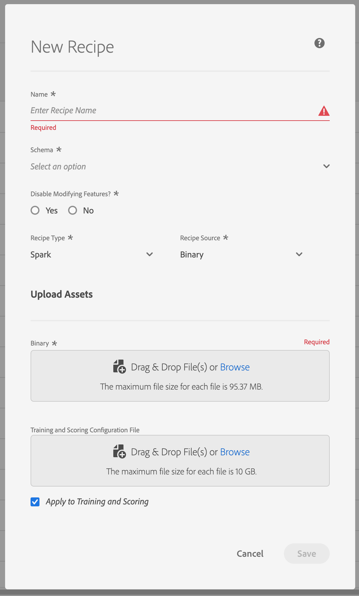

# Import a packaged Recipe in the UI <!-- omit in toc -->

- [Objective](#objective)
- [Prerequisites](#prerequisites)
- [UI workflow](#ui-workflow)
    - [Create a Recipe](#create-a-recipe)
        - [Build Docker image](#build-docker-image)
        - [Push Docker image](#push-docker-image)
- [Next steps](#next-steps)

---

## Objective
In this step by step tutorial, we will go over how to import a Recipe into the Adobe Experience Platform Data Science Workspace.

## Prerequisites

* A registered Adobe ID account
    * The Adobe ID account must have been added to an Organization with access to "Adobe Experience Platform"

## UI workflow

In this section, you will go over creating a Recipe where you can import your Docker image. We went through the steps to create a Docker image in the [Package Recipe to Data Science Workspace tutorial](../package_recipe_to_import_into_dsw/package_recipe_to_import_into_dsw.md).

First, navigate to [Adobe Experience Platform](https://platform.adobe.com/) and go to the ML Models tab in the left navigation bar. You will be taken to the **Browse** tab where you will see three tabs:
* Browse
* Recipes
* Notebooks

The **Browse** tab shows a list of Models you or others in your IMS Organization have created or updated recently. A Model is a snapshot of a Recipe that will be tailored towards solving a specific business problem. One Recipe can create many Models.

Similar to the **Browse** tab, the **Recipe** tab shows a list of recently updated Recipes. A Recipe refers to a proprietary algorithm, or an ensemble of algorithms, to help solve specific business problems.

In the UI, a Training Run is run within the context of a Model. Multiple Training Runs can be created for each Model.

### Create a Recipe

You first want to create a new Recipe. From the **Recipes** tab, click on the **Create Recipe** button on the top right.


From here, a "New Recipe" dialog will popup on the screen. The `*` indicate which fields require to be filled. 


* **Name** - This is the name of your Recipe
* **Schema** - What XDM Schema you want to model your data with
* **Recipe Type** - What language or tool you're going to use
* **Recipe Source** - Where your image is uploaded to. Currently only supports Docker images or Binary artifacts, based on the selected Recipe type

> **Note:** If Spark is selected for Recipe Type and Binary is set for Recipe Source, the asset that is expected will be a `.jar` file.



* **Docker Host** - Link to the Docker host to upload your Docker image to
* **Username/Password** - Credentials to the Docker host
* **Configuration File** - This file expects a JSON object containing parameters for the training and scoring of the Instance. You can leave this blank when creating the Recipe as the workflow will prompt you to enter the configuration when creating a Model or a Training Run. Here is an example of a [configuration file for the Retail Sales sample](https://github.com/adobe/experience-platform-dsw-reference/blob/master/recipes/python/retail/retail.config.json) application:

```JSON
[
  {
    "name": "train",
    "parameters": [
      {
        "key": "learning_rate",
        "value": "0.1"
      },
      {
        "key": "n_estimators",
        "value": "100"
      },
      {
        "key": "max_depth",
        "value": "3"
      },
      {
        "key": "ACP_DSW_INPUT_FEATURES",
        "value": "date,store,storeType,storeSize,temperature,regionalFuelPrice,markdown,cpi,unemployment,isHoliday"
      },
      {
        "key": "ACP_DSW_TARGET_FEATURES",
        "value": "weeklySales"
      },
      {
        "key": "ACP_DSW_FEATURE_UPDATE_SUPPORT",
        "value": false
      },
      {
        "key": "tenantId",
        "value": "_{TENANT_ID}"
     },
     {
       "key": "ACP_DSW_TRAINING_XDM_SCHEMA",
       "value": "<leave as is if going through UI workflow. Replace with Schema ID if creating recipe via API>"
     },
     {
       "key": "evaluation.labelColumn",
       "value": "weeklySalesAhead"
     },
     {
       "key": "evaluation.metrics",
       "value": "MAPE,MAE,RMSE,MASE"
     }
    ]
  },
  {
        "name": "score",
        "parameters": [
            {
                "key": "tenantId",
                "value": "_{TENANT_ID}"
            },
            {
              "key":"ACP_DSW_SCORING_RESULTS_XDM_SCHEMA",
              "value":"<leave as is if going through UI workflow. Replace with Schema ID if creating recipe via API>"
            }
        ]
  }
]
```

You will need to modify the configuration file yourself. Specifically, the value of the `{TENANT_ID}`: This ID ensures resources you create are namespaced properly and contained within your IMS Organization. To find your ID, you can [follow the steps here](../../../technical_overview/schema_registry/schema_registry_developer_guide.md#know-your-tenant_id)

For this tutorial, you will be creating a Python Recipe using the Docker image that you created in the [Package Recipe tutorial](../package_recipe_to_import_into_dsw/package_recipe_to_import_into_dsw.md). We are provided with the Docker host, username, and password values which you will be able to use to build our Docker image in the next section.

#### Build Docker image
With the Dockerfile, you can build the Docker image. In the directory with your Dockerfile type the following commands:

```BASH
#  These values are found in the New Recipe window
docker login -u <username> -p <password> <Docker host>
 
#  Build the Docker image: e.g., docker build -t <docker-path>/sample-python:1.0 .
docker build -t <Docker host>/<intelligent-service>:<version_tag> .
```

> **Note:**  Don't forget the `.` after the `docker build` command!

#### Push Docker image

```BASH
#  The argument for the push command is the same as the build command without the period at the end
docker push <Docker host>/<intelligent-service>:<version_tag>
```

---

Now insert the URL you have just built and pushed to the Docker host into the Source File field. After pressing "Save", you are taken to the new Recipe's overview page. From here you are able to view information about the Recipe you just created and are able to create Models.

## Next steps

This tutorial went over how to consume the APIs to create a Recipe, an Experiment, and trained Models. In the [next exercise](../how_to_score_with_recipe/how_to_score_with_recipe.md), you will be making predictions by scoring a new dataset using the top performing trained model.