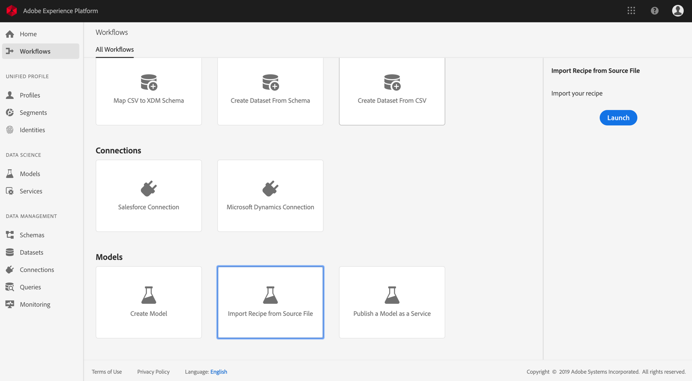

# Package source files into a Recipe <!-- omit in toc -->

- [Objective](#objective)
- [Concepts introduced](#concepts-introduced)
- [Prerequisites](#prerequisites)
- [Recipe creation](#recipe-creation)
    - [Docker based model authoring](#docker-based-model-authoring)
    - [Binary based model authoring](#binary-based-model-authoring)
    - [Package the source files](#package-the-source-files)
        - [Build Python Docker image](#build-python-docker-image)
        - [Build R Docker image](#build-r-docker-image)
        - [Build PySpark binaries](#build-pyspark-binaries)
        - [Build Scala binaries](#build-scala-binaries)
- [Next steps](#next-steps)

## Objective

This tutorial provides instructions on how you can package the provided Retail Sales sample source files into an archive file, which can be used to create a recipe in Adobe Experience Platform Data Science Workspace by following the recipe import workflow either in the UI or using the API.

## Concepts introduced

* **Recipes**: A recipe is Adobe's term for a Model specification and is a top-level container representing a specific machine learning, artificial intelligence algorithm or ensemble of algorithms, processing logic, and configuration required to build and execute a trained model and hence help solve specific business problems.
* **Source files**: Individual files in your project that contain the logic for a recipe.

## Prerequisites

* [Docker](https://docs.docker.com/install/#supported-platforms)
* [Python 3 and pip](https://docs.conda.io/en/latest/miniconda.html)
* [Scala](https://www.scala-sbt.org/download.html?_ga=2.42231906.690987621.1558478883-2004067584.1558478883)
* [Maven](https://maven.apache.org/install.html)

## Recipe creation

Recipe creation starts with packaging source files to build an archive file. Source files define the machine learning logic and algorithms used to solve a specific problem at hand, and are written in either Python, R, PySpark, or Scala Spark. Depending on which language the source files are written in, built archive files will either be a Docker image or a binary file. Once built, the packaged archive file is imported into Data Science Workspace to create a recipe [in the UI](../import_a_packaged_recipe/import_a_packaged_recipe_in_ui.md) or [using the API](../import_a_packaged_recipe/import_a_packaged_recipe_using_api.md).

### Docker based model authoring ####

A Docker image allows a developer to package up an application with all the parts it needs, such as libraries and other dependencies, and ship it out as one package.

The built Docker image will be pushed to Azure Container Registry using credentials supplied to you during the recipe creation workflow.
> Note: Only source files written in **Python**, **R**, and **Tensorflow** require Azure Container Registry credentials.

To obtain your Azure Container Registry credentials, log into [Adobe Experience Platform](https://platform.adobe.com). On the left navigation column, navigate to **Workflows**. Select **Import Recipe from Source File**, and **Launch** a new import procedure. See the screen shot below for reference.



Provide an appropriate **Recipe Name**, for example, "Retail Sales recipe", and optionally provide a description or documentation URL. Once complete, click **Next**.


Select the appropriate **Runtime**, then choose **Classification** for **Type**. Your Azure Container Registry credentials will be generated.


Note the values for **Docker Host**, **Username**, and **Password**. These will be used later to build and push your Docker image.

Once pushed, you and other users can access the image via URL. The **Source File** field will expect this URL as an input.

### Binary based model authoring ####

For source files written in Scala or PySpark, a binary file will be generated. Building the binary file is as simple as running the provided build script.
> Note: Only source files written in ScalaSpark or PySpark will generate a binary file upon running the build script.

### Package the source files

Start by obtaining the sample codebase found in the [Experience Platform Data Science Workspace Reference](https://github.com/adobe/experience-platform-dsw-reference) repository. Depending on which programming language the sample source files are written in, building their respective archive file differs in procedure.

- [Build Python Docker image](#build-python-docker-image)
- [Build R Docker image](#build-r-docker-image)
- [Build PySpark binaries](#build-pyspark-binaries)
- [Build Scala binaries](#build-scala-binaries)

#### Build Python Docker image

If you have not done so, clone the github repository onto your local system with the following command:

```BASH
git clone https://github.com/adobe/experience-platform-dsw-reference.git
```

Navigate to the directory `experience-platform-dsw-reference/recipes/python/retail`. Here, you will find the scripts `login.sh` and `build.sh` which you will use to log in to docker and to build the python docker image. If you have your [docker credentials](#docker-based-model-authoring) ready, enter the following commands in order:

```BASH
# for logging in to docker
./login.sh
 
# for building docker image
./build.sh
```
Note that when executing the login script, you will need to provide the docker host, username, and password. When building, you are required to provide the docker host and a version tag for the build.

Once the build script is complete, you are given a docker source file URL in your console output. For this specific example, it will look something like:

```BASH
# URL format: 
{DOCKER_HOST}/ml-retailsales-python:{VERSION_TAG}
```
Copy this URL, you will need it for [the next step](#next-steps).

#### Build R Docker image

If you have not done so, clone the github repository onto your local system with the following command:

```BASH
git clone https://github.com/adobe/experience-platform-dsw-reference.git
```

Navigate to the directory `experience-platform-dsw-reference/recipes/R/Retail - GradientBoosting` inside your cloned repository. Here, you'll find the files `login.sh` and `build.sh` which you will use to log in to docker and to build the R docker image. If you have your [docker credentials](#docker-based-model-authoring) ready, enter the following commands in order:

```BASH
# for logging in to docker
./login.sh
 
# for build docker image
./build.sh
```
Note that when executing the login script, you will need to provide the docker host, username, and password. When building, you are required to provide the docker host and a version tag for the build.

Once the build script is complete, you are given a docker source file URL in your console output. For this specific example, it will look something like:

```BASH
# URL format: 
{DOCKER_HOST}/ml-retail-r:{VERSION_TAG}
```
Copy this URL, you will need it for [the next step](#next-steps).

#### Build PySpark binaries

If you have not done so, clone the github repository onto your local system with the following command:

```BASH
git clone https://github.com/adobe/experience-platform-dsw-reference.git
```

Navigate in to the cloned repository on your local system and run the following commands in order to build the required `.egg` file for importing a PySpark recipe:

```BASH
cd recipes/pyspark
./build.sh
```

The `.egg` file is generated in the `dist` folder.

You can now move on to the [next steps](#next-steps).

#### Build Scala binaries

If you have not already done so, run the following command to clone the Github repository to your local system:

```BASH
git clone https://github.com/adobe/experience-platform-dsw-reference.git
```

To build the `.jar` artifact used to import a Scala recipe, navigate to your cloned repository and follow the steps below:

```BASH
cd recipes/scala/
./build.sh
```

The generated `.jar` artifact with dependencies is found in the `/target` directory.

You can now move on to the [next steps](#next-steps).

## Next steps

This tutorial went over packaging source files into a Recipe, the prerequisite step for importing a Recipe into Data Science Workspace. You should now have a Docker image in Azure Container Registry along with the corresponding image URL or a binary file stored locally in your file system. You are now ready to begin the tutorial on **Importing a packaged Recipe into Data Science Workspace**. Select one of the tutorial links below to get started.

* [Import a packaged Recipe in the UI](../import_a_packaged_recipe/import_a_packaged_recipe_in_ui.md)
* [Import a packaged Recipe using the API](../import_a_packaged_recipe/import_a_packaged_recipe_using_api.md)