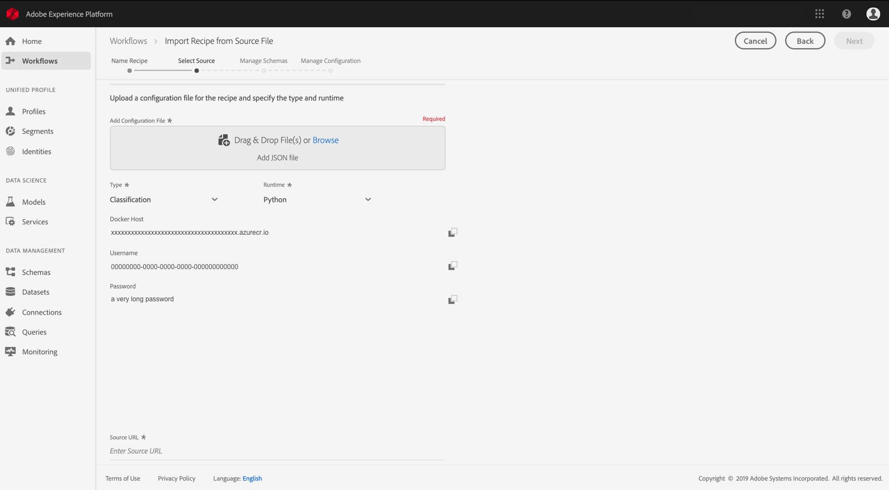

# Package source files into a Recipe <!-- omit in toc -->

- [Objective](#objective)
- [Concepts introduced:](#concepts-introduced)
- [Prerequisites](#prerequisites)
- [Recipe creation](#recipe-creation)
    - [Package the source files](#package-the-source-files)
        - [Build Python Docker image](#build-python-docker-image)
        - [Build R Docker image](#build-r-docker-image)
        - [Build PySpark binaries](#build-pyspark-binaries)
        - [Build Scala binaries](#build-scala-binaries)
- [Next steps](#next-steps)

---

## Objective

The objective of this tutorial is to show you how to package provided sample source files into an archive file, which can be used to create a recipe in Adobe Experience Platform's Data Science Workspace by following the **Import from Source File workflow**.

---

## Concepts introduced:
* Recipes: A recipe is Adobe's term for a model specification and is a top-level container representing a specific machine learning, AI algorithm or ensemble of algorithms, processing logic, and configuration required to build and execute a trained model and hence help solve specific business problems.
* Source files: Individual files in your project that contain the logic for your recipe.

---

## Prerequisites

* [Docker](https://docs.docker.com/install/#supported-platforms)
* [Python 3 and pip](https://docs.conda.io/en/latest/miniconda.html)
* [Scala](https://www.scala-sbt.org/download.html?_ga=2.42231906.690987621.1558478883-2004067584.1558478883)
* [Maven](https://maven.apache.org/install.html)

---

## Recipe creation

Recipe creation starts with packaging source files to build an archive file. Source files define the machine learning logic and algorithms used to solve a specific problem at hand, and are written in either Python, R, PySpark, or Scala Spark. Depending on which language the source files are written, the built archive file will either be a Docker image or a binary. Once built, the Docker image or binary is imported into Adobe Experience Platform to create a recipe, either by the [UI workflow](../how_to_import_train_evaluate_recipe_tutorial/how_to_import_train_evaluate_recipe_tutorial.md) or [API workflow](../how_to_import_train_evaluate_recipe_tutorial/how_to_import_train_evaluate_recipe_api_tutorial.md).

### Package the source files

Start by obtaining the sample codebase found in the [Experience Platform DSW Reference](https://github.com/adobe/experience-platform-dsw-reference) repository. Depending on which programming language the sample source files are written in, building their respective archive files differ in procedure.

**Docker-based model authoring**

A Docker image allows a developer to package up an application with all the parts it needs, such as libraries and other dependencies and ship it out as one package.

The Docker image you will create will be pushed to the Azure Container Registry via credentials supplied to you from the recipe creation workflow. Please note that only **Python** and **R** source files require Azure Container Registry credentials.

To obtain your Azure Container Registry credentials, log into [Adobe Experience Platform](https://platform.adobe.com). On the left navigation column, navigate to **Workflows**. Select **Import Recipe from Source File**, and **Launch** a new import procedure. See the screen shot below for reference.


Provide an appropriate **Recipe Name**, for example, "Retail Sales recipe", and optionally provide a description or documentation URL. Once complete, hit **Next**.


Select the appropriate **Execution Type**, then choose "Classification" for **Recipe Type**. Your Azure Container Registry credentials will be generated.



Note the values for **Docker Host**, **Username**, and **Password**. These will be used later to build and push your Docker image.

Once pushed, the image can be accessed via a URL by yourself and other users. The **Source File** field will expect this URL as an input.

**Binary-based model authoring**

For Scala and PySpark, recipe creation via source files require binaries.

This sample Retail Sales example leverages the wealth of historical data a retailer has access to, to predict future trends, and to optimize pricing decisions. The algorithm uses past sales data to train the model and to predict future sales trends. With this, the retailer will be able to have insights to help them when making pricing changes.

---

The next few sections will go over how to build each source file:
  - [Build Python Docker image](#build-python-docker-image)
  - [Build R Docker image](#build-r-docker-image)
  - [Build PySpark binaries](#build-pyspark-binaries)
  - [Build Scala binaries](#build-scala-binaries)

---

#### Build Python Docker image

If you have not done so, clone the github repository onto your local system with the following command.

```BASH
git clone https://github.com/adobe/experience-platform-dsw-reference.git
```

Navigate to the directory `experience-platform-dsw-reference/recipes/python/retail`. Here, you will find the scripts `login.sh` and `build.sh` which you will use to login to docker and to build the python docker image. If you have your [docker credentials](#package-the-source-files) ready, enter the following commands in order:

```BASH
# for logging in to docker
./login.sh
 
# for building docker image
./build.sh
```
Note that when executing the login script, you will need to provide the docker host, username, and password. When building, you are required to provide the docker host and a version tag for the build.

Once the build script is complete, you are given a docker source file URL in your console output. For this specific example, it will look something like:

```BASH
# URL format: 
{DOCKER_HOST}/ml-retailsales-python:{VERSION_TAG}
```

Keep this URL handy, you will need it for [the next step](#next-steps).

---

#### Build R Docker image

If you have not done so, clone the github repository onto your local system with the following command.

```BASH
git clone https://github.com/adobe/experience-platform-dsw-reference.git
```

Navigate to the directory `experience-platform-dsw-reference/recipes/R/Retail - GradientBoosting` inside your cloned repository. Here, you'll find the files `login.sh` and `build.sh` which you will use to login to docker and to build the R docker image. If you have your [docker credentials](#package-the-source-files) ready, enter the following commands in order:

```BASH
# for logging in to docker
./login.sh
 
# for build docker image
./build.sh
```
Note that when executing the login script, you will need to provide the docker host, username, and password. When building, you are required to provide the docker host and a version tag for the build.

Once the build script is complete, you are given a docker source file URL in your console output. For this specific example, it will look something like:

```BASH
# URL format: 
{DOCKER_HOST}/ml-retail-r:{VERSION_TAG}
```

Keep this URL handy, you will need it for [the next step](#next-steps).

---

#### Build PySpark binaries

If you have not done so, clone the github repository onto your local system with the following command.

```BASH
git clone https://github.com/adobe/experience-platform-dsw-reference.git
```

Navigate in to the cloned repository on your local system and run the following commands in order to build the required `.egg` file for importing a PySpark recipe:

```BASH
cd recipes/pyspark
./build.sh
```

The `.egg` file is generated in the `dist` folder.

You can now move on to the [next steps](#next-steps)

---

#### Build Scala binaries

If you have not already done so, run the following command to clone the Github repository to your local system.

```BASH
git clone https://github.com/adobe/experience-platform-dsw-reference.git
```

To build the `.jar` artifact used to import a Scala recipe, navigate to your cloned repository and follow the steps below.

```BASH
cd recipes/scala/
./build.sh
```

The generated `.jar` artifact with dependencies is found in the `/target` directory.

You can now move on to the [next steps](#next-steps)

---


## Next steps

This tutorial went over how to build a recipe to be used in the Data Science Workspace. You should have a source file – either in the Azure Container Registry, or a binary file locally. Next you will use the source files to exercise the **Import Recipe from Source File** workflow.
* [Import, train, and evaluate a Recipe on the UI](../how_to_import_train_evaluate_recipe_tutorial/how_to_import_train_evaluate_recipe_tutorial.md)
* [Import, train, and evaluate a Recipe with the API](../how_to_import_train_evaluate_recipe_tutorial/how_to_import_train_evaluate_recipe_api_tutorial.md)