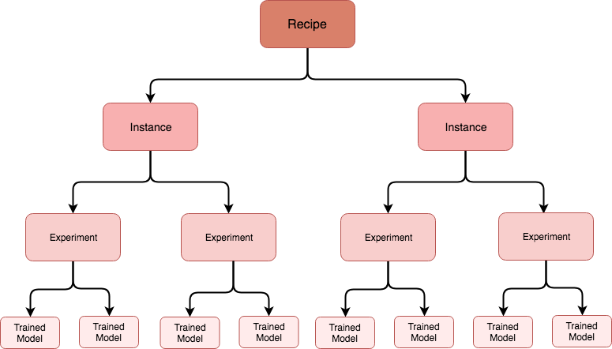

# Tutorial - Import, Train and Evaluate Recipe Tutorial via API

  - [Objective](#objective)
  - [Prerequisites](#prerequisites)
  - [API Workflow](#api-workflow)
    - [Creating a Recipe](#creating-a-recipe)
    - [Creating an Instance](#creating-an-instance)
    - [Creating an Experiment](#creating-an-experiment)
      - [Creating a Scheduled Experiment for Training](#creating-a-scheduled-experiment-for-training)
      - [Creating a Scheduled Experiment for Scoring](#creating-a-scheduled-experiment-for-scoring)
      - [Creating an Experiment Run for Training](#creating-an-experiment-run-for-training)
        - [Retrieving an Experiment Run Status](#retrieving-an-experiment-run-status)
        - [Retrieving the Trained Model](#retrieving-the-trained-model)
    - [Creating an Experiment Run for Scoring](#creating-an-experiment-run-for-scoring)
      - [Retrieve an Experiment Run Status for Scheduled Experiment Run](#retrieve-an-experiment-run-status-for-scheduled-experiment-run)
    - [Stop and Delete a Scheduled Experiment](#stop-and-delete-a-scheduled-experiment)
  - [Next Steps](#next-steps)

---

## Objective
In this step by step tutorial, we will consume the APIs which allow us to create a Recipe, an Experiment, Scheduled Experiment Runs, and Trained Models. For a detailed list of API documentation please refer to [this document](https://www.adobe.io/apis/cloudplatform/dataservices/api-reference.html).

---

## Prerequisites

Follow this [Tutorial](../../authenticate_to_acp_tutorial/authenticate_to_acp_tutorial.md) for authorization to start making API calls.

From the tutorial you should now have the following values:

* `{ACCESS_TOKEN}`: Your specific bearer token value provided after authentication.
* `{IMS_ORG}`: Your IMS org credentials found in your unique Adobe Experience Platform integration.
* `{API_KEY}`: Your specific API key value found in your unique Adobe Experience Platform integration.

* Link to a Docker image of an intelligent service

---

## API Workflow

We will be consuming the APIs to create an Experiment Run for Training and Scoring. For this tutorial, we will be focused on Recipes, Instances, and Experiments. The following chart outlines the relationship between the three and also introduces the idea of a trained model. 



Here is a list of what we will cover this tutorial:

* [Creating a Recipe](#creating-a-recipe)
* [Creating an Instance](#creating-an-instance)
* [Creating an Experiment](#creating-an-experiment)
    * [Creating a Scheduled Experiment for Training](#creating-a-scheduled-experiment-for-training)
    * [Creating a Scheduled Experiment for Scoring](#creating-a-scheduled-experiment-for-scoring)
    * [Creating an Experiment Run for Training](#creating-an-experiment-run-for-training)
        * [Retrieving an Experiment Run Status](#retrieving-an-experiment-run-status)
        * [Retrieving the Trained Model](#retrieving-the-trained-model)
    * [Creating an Experiment Run for Scoring](#creating-an-experiment-run-for-scoring)
        * [Retrieve an Experiment Run Status for Scheduled Experiment Run](#retrieve-an-experiment-run-status-for-scheduled-experiment-run)
* [Stop and Delete a Scheduled Experiment](#stop-and-delete-a-scheduled-experiment)


### Creating a Recipe

With the Docker image for the Recipe created in the [Package Recipe to Data Science Workspace tutorial](../package_recipe_to_import_into_dsw/package_recipe_to_import_into_dsw.md), we can create a Recipe. The Recipe is an umbrella entity holding all Instances. A Recipe is usually tied to one or more Docker images which is specified in the body of the request.

***Note that the term "Recipe" and "Engine" (as seen in the API documentation) are interchangeably used and refer to the same thing.***

#### Request

```SHELL
curl -X POST \
  https://platform.adobe.io/data/sensei/engines \
  -H 'Authorization: Bearer {ACCESS_TOKEN}' \
  -H 'X-API-KEY: {API_KEY}' \
  -H 'content-type: multipart/form-data' \
  -H 'x-gw-ims-org-id: {IMS_ORG}' \
  -F 'engine={
        "name": "Sensei - Sentiment Analysis",
        "description": "Description of Sensei - Retail",
        "type": "Spark",
        "artifacts": {
            "default": {
                "image": {
                    "location": "{DOCKER_IMAGE}",
                    "name": "retail",
                    "executionType": "Spark",
                    "metadata": {
                        "__artifacts": "{ARTIFACT_BINARIES}"
                    }
                }
            }
        }
    }'
```

`{ACCESS_TOKEN}`: Your specific bearer token value provided after authentication.  
`{IMS_ORG}`: Your IMS org credentials found in your unique Adobe Experience Platform integration.  
`{API_KEY}`: Your specific API key value found in your unique Adobe Experience Platform integration.  
`{DOCKER_IMAGE}`: Link to the Docker image.  
`{ARTIFACT_BINARIES}`: The binary Recipe artifact (eg. JAR, EGG) used for all operations by default.  

Note that if an image that is not `Spark` is used, the `type` and `executionType` fields should be set to the correct type (eg. `Python`, `Pyspark`).

#### Response

The response from the Recipe creation call is captured below.

```JSON
{
    "id": "{RECIPE_ID}",
    "name": "Sensei - Retail",
    "type": "Spark",
    "created": "2018-11-11T11:11:11.111Z",
    "updated": "2018-11-11T11:11:11.111Z",
    "deleted": false,
    "artifacts": {
        "default": {
            "image": {
                "location": "{DOCKER_IMAGE}",
                "name": "retail",
                "executionType": "Spark",
                "packagingType": "docker"
            },
            "defaultMLInstanceConfigs": [
                {
                    "name": "train",
                    "parameters": [
                        {
                            "key": "numFeatures",
                            "value": "1000"
                        },
                        {
                            "key": "maxIter",
                            "value": "100"
                        },
                        {
                            "key": "regParam",
                            "value": "0.15"
                        }
                    ]
                }
            ]
        }
    }
}
```

`{RECIPE_ID}`: This ID returned can be used to create a number of Instances.


### Creating an Instance

Creating an Instance can be done using the following request. We will be using the `{RECIPE_ID}` that was returned when creating an Recipe.

#### Request

```SHELL
curl -X POST \
  https://platform.adobe.io/data/sensei/mlInstances \
  -H 'Authorization: Bearer {ACCESS_TOKEN}' \
  -H 'Content-Type: application/vnd.adobe.platform.sensei+json;profile=mlInstance.v1.json' \
  -H 'x-api-key: {API_KEY}' \
  -H 'x-gw-ims-org-id: {IMS_ORG}' \
  -d `{JSON_PAYLOAD}`
```

`{ACCESS_TOKEN}`: Your specific bearer token value provided after authentication.  
`{IMS_ORG}`: Your IMS org credentials found in your unique Adobe Experience Platform integration.  
`{API_KEY}`: Your specific API key value found in your unique Adobe Experience Platform integration.  
`{JSON_PAYLOAD}`: The configuration of our Instance. The example we use in our tutorial is shown here:

```JSON
{
    "name": "Retail - Instance",
    "description": "Instance for ML Instance",
    "engineId": "{RECIPE_ID}",
    "createdBy": {
        "displayName": "John Doe",
        "userId": "johnd"
    },
    "tags": {
        "purpose": "tutorial"
    },
    "tasks": [
        {
            "name": "train",
            "parameters": [
                {
                    "key": "numFeatures",
                    "value": "10"
                },
                {
                    "key": "maxIter",
                    "value": "2"
                },
                {
                    "key": "regParam",
                    "value": "0.15"
                },
                {
                    "key": "trainingDataLocation",
                    "value": "sample_training_data.csv"
                }
            ]
        },
        {
            "name": "score",
            "parameters": [
                {
                    "key": "scoringDataLocation",
                    "value": "sample_scoring_data.csv"
                },
                {
                    "key": "scoringResultsLocation",
                    "value": "scoring_results.net"
                }
            ]
        }
    ]
}

```

Note that in the `{JSON_PAYLOAD}`, we define parameters used for training and scoring in the `tasks` array. The `{RECIPE_ID}` is the ID of the Recipe you want to use and the `tag` field is an optional parameter used to identify the Instance.

The response will contain the `{INSTANCE_ID}` which represents the Instance that is created. Multiple model Instances with different configurations can be created.

#### Response

```JSON
{
    "id": "{INSTANCE_ID}",
    "name": "Retail - Instance",
    "description": "Instance for ML Instance",
    "engineId": "{RECIPE_ID}",
    "created": "2018-21-21T11:11:11.111Z",
    "createdBy": {
        "displayName": "John Doe",
        "userId": "johnd"
    },
    "updated": "2018-21-01T11:11:11.111Z",
    "deleted": false,
    "tags": {
        "purpose": "tutorial"
    },
    "tasks": [
        {
            "name": "train",
            "parameters": [...]
        },
        {
            "name": "score",
            "parameters": [...]
        }
    ]
}

```

`{RECIPE_ID}`: This ID representing the Recipe the Instance is created under.  
`{INSTANCE_ID}`: The ID that represents the Instance.

### Creating an Experiment

An Experiment is used by a data scientist to arrive at a high performing model while training. Multiple Experiments include changing datasets, features, learning parameters, and hardware. The following is an example of creating an Experiment.

#### Request

```SHELL
curl -X POST \
  https://platform.adobe.io/data/sensei/experiments \
  -H 'Authorization: Bearer {ACCESS_TOKEN}' \
  -H 'Content-Type: application/vnd.adobe.platform.sensei+json;profile=experiment.v1.json' \
  -H 'x-gw-ims-org-id: {IMS_ORG}' \
  -H 'x-api-key: {API_KEY' \
  -d `{JSON PAYLOAD}`
```

`{IMS_ORG}`: Your IMS org credentials found in your unique Adobe Experience Platform integration.  
`{ACCESS_TOKEN}`: Your specific bearer token value provided after authentication.  
`{API_KEY}`: Your specific API key value found in your unique Adobe Experience Platform integration.  
`{JSON_PAYLOAD}`: Experiment object that is created. The example we use in our tutorial is shown here:

```JSON
{
    "name": "Experiment for Retail ",
    "mlInstanceId": "{INSTANCE_ID}",
    "tags": {
        "test": "guide"
    }
}
```

`{INSTANCE_ID}`: The ID that represents the Instance.

The response from the Experiment creation looks like this.

#### Response

```JSON
{
    "id": "{EXPERIMENT_ID}",
    "name": "Experiment for Retail",
    "mlInstanceId": "{INSTANCE_ID}",
    "created": "2018-01-01T11:11:11.111Z",
    "updated": "2018-01-01T11:11:11.111Z",
    "deleted": false,
    "tags": {
        "test": "guide"
    }
}
```

`{EXPERIMENT_ID}`: The ID that represents the Experiment you have just created.
`{INSTANCE_ID}`: The ID that represents the Instance.

#### Creating a Scheduled Experiment for Training

Scheduled Experiments are used so that we do not need to create each single Experiment Runs via an API call. Instead, we provide all necessary parameters during Experiment creation and each run will be created periodically.  

To indicate the creation of a Scheduled Experiment, we must add a `template` section in the body of the request. In `template`, all necessary parameters for scheduling runs are included such as `tasks`, which indicate what action, and `schedule`, which indicates the timing of the scheduled runs.

##### Request

```Shell
curl -X POST \
  https://platform.adobe.io/data/sensei/experiments \
  -H 'Authorization: Bearer {ACCESS_TOKEN}' \
  -H 'Content-Type: application/vnd.adobe.platform.sensei+json;profile=experiment.v1.json' \
  -H 'x-gw-ims-org-id: {IMS_ORG}' \
  -H 'x-api-key: {API_KEY}' \
  -d '{JSON_PAYLOAD}`

```

`{IMS_ORG}`: Your IMS org credentials found in your unique Adobe Experience Platform integration.  
`{ACCESS_TOKEN}`: Your specific bearer token value provided after authentication.  
`{API_KEY}`: Your specific API key value found in your unique Adobe Experience Platform integration.  
`{JSON_PAYLOAD}`: Data set to be posted. The example we use in our tutorial is shown here:

```JSON
{
    "name": "Experiment for Retail",
    "mlInstanceId": "{INSTANCE_ID}",
    "template": {
        "tasks": [{
            "name": "train",
            "parameters": [
                   {
                        "value": "1000",
                        "key": "numFeatures"
                    }
            ],
            "specification": {
                "type": "SparkTaskSpec",
                "executorCores": 5,
                "numExecutors": 5
            }
        }],
        "schedule": {
            "cron": "*/20 * * * *",
            "startTime": "2018-11-11",
            "endTime": "2019-11-11"
        }
    }
}
```

When we create an Experiment, the body, `{JSON_PAYLOAD}`, should contain either the `mlInstanceId` or the `mlInstanceQuery` parameter. In this example, a Scheduled Experiment will invoke a run every 20 minutes, set in the `cron` parameter, starting from the `startTime` until the `endTime`.

##### Response

```JSON
{
    "id": "{EXPERIMENT_ID}",
    "name": "Experiment for Retail",
    "mlInstanceId": "{INSTANCE_ID}",
    "created": "2018-11-11T11:11:11.111Z",
    "updated": "2018-11-11T11:11:11.111Z",
    "deleted": false,
    "workflowId": "endid123_0379bc0b_8f7e_4706_bcd9_1a2s3d4f5g_abcdf",
    "template": {
        "tasks": [
            {
                "name": "train",
                "parameters": [...],
                "specification": {
                    "type": "SparkTaskSpec",
                    "executorCores": 5,
                    "numExecutors": 5
                }
            }
        ],
        "schedule": {
            "cron": "*/20 * * * *",
            "startTime": "2018-07-04",
            "endTime": "2018-07-06"
        }
    }
}
```

`{EXPERIMENT_ID}`: The ID that represents the Experiment.  
`{INSTANCE_ID}`: The ID that represents the Instance.  


#### Creating a Scheduled Experiment for Scoring

Similar to Scheduled Experiments for Training, creating a Scheduled Experiment for Scoring is also done by including a `template` section to the body parameter. Additionally, the `name` field under `tasks` in the body is set as `score`.

The following is an example of creating an Experiment that will run every 20 minutes starting from `startTime` and will run until `endTime`.

##### Request

```Shell
curl -X POST \
  https://platform.adobe.io/data/sensei/experiments \
  -H 'Authorization: Bearer {ACCESS_TOKEN}' \
  -H 'Content-Type: application/vnd.adobe.platform.sensei+json;profile=experiment.v1.json' \
  -H 'x-gw-ims-org-id: {IMS_ORG}' \
  -H 'x-api-key: {API_KEY}' \
  -d '{JSON_PAYLOAD}'
```

`{IMS_ORG}`: Your IMS org credentials found in your unique Adobe Experience Platform integration.  
`{ACCESS_TOKEN}`: Your specific bearer token value provided after authentication.  
`{API_KEY}`: Your specific API key value found in your unique Adobe Experience Platform integration.  
`{JSON_PAYLOAD}`: Experiment Run object to be sent. The example we use in our tutorial is shown here:

```JSON
{
    "name": "Experiment for Retail",
    "mlInstanceId": "{INSTANCE_ID}",
    "template": {
        "tasks": [{
            "name": "score",
            "parameters": [
                {
                    "key": "modelId",
                    "value": "{MODEL_ID}"
                }
            ],
            "specification": {
                "type": "SparkTaskSpec",
                "executorCores": 5,
                "numExecutors": 5
            }
        }],
        "schedule": {
            "cron": "*/20 * * * *",
            "startTime": "2018-07-04",
            "endTime": "2018-07-06"
        }
    }
}
```

`{INSTANCE_ID}`: The ID that represents the Instance.  
`{MODEL_ID}`: The ID that represents the Trained Model.  

The following is the response after creating the Scheduled Experiment.

##### Response

```JSON
{
  "id": "{EXPERIMENT_ID}",
  "name": "Experiment for Retail",
  "mlInstanceId": "{INSTANCE_ID}",
  "created": "2018-11-11T11:11:11.111Z",
  "updated": "2018-11-11T11:11:11.111Z",
  "template": {
    "tasks": [
      {
        "name": "score",
        "parameters": [...],
        "specification": {
          "type": "SparkTaskSpec",
          "executorCores": 5,
          "numExecutors": 5
        }
      }
    ],
    "schedule": {
      "cron": "*\/20 * * * *",
      "startTime": "2018-07-04",
      "endTime": "2018-07-06"
    }
  }
}
```

`{EXPERIMENT_ID}`: The ID that represents the Experiment.  
`{INSTANCE_ID}`: The ID that represents the Instance.  

#### Creating an Experiment Run for Training

With an Experiment entity created, a training run can be created and run using the call below. You will need the `{EXPERIMENT_ID}` and state what `mode` you want to trigger in the request body.

#### Request

```Shell
curl -X POST \
  https://platform.adobe.io/data/sensei/experiments/{EXPERIMENT_ID}/runs \
  -H 'Authorization: Bearer {ACCESS_TOKEN}' \
  -H 'Content-Type: application/vnd.adobe.platform.sensei+json;profile=experimentRun.v1.json' \
  -H 'x-gw-ims-org-id: {IMS_ORG}' \
  -H 'x-api-key: {API_KEY}' \
  -d '{JSON_PAYLOAD}'
```

`{EXPERIMENT_ID}`: The ID corresponding to the Experiment you want to target. This can be found in the response when creating your Experiment.  
`{IMS_ORG}`: Your IMS org credentials found in your unique Adobe Experience Platform integration.  
`{ACCESS_TOKEN}`: Your specific bearer token value provided after authentication.  
`{API_KEY}`: Your specific API key value found in your unique Adobe Experience Platform integration.  
`{JSON_PAYLOAD}`: To create a training run, you will have to include the following in the body:

```JSON
{
    "mode":"Train"
}
```

You can also override the configuration parameters by including a `tasks` array:

```JSON
{
   "mode":"Train",
   "tasks": [
        {
           "name": "train",
           "parameters": [
                {
                   "key": "numFeatures",
                   "value": "2"
                }
            ]
        }
    ]
}
```

You will get the following response which will let you know the `{EXPERIMENT_RUN_ID}` and the configuration under `tasks`.

#### Response

```JSON
{
    "id": "{EXPERIMENT_RUN_ID}",
    "mode": "train",
    "experimentId": "{EXPERIMENT_ID}",
    "created": "2018-01-01T11:11:11.903Z",
    "updated": "2018-01-01T11:11:11.903Z",
    "deleted": false,
    "tasks": [
        {
            "name": "Train",
            "parameters": [...]
        }
    ]
}
```

`{EXPERIMENT_RUN_ID}`:  The ID that represents the Experiment Run.  
`{EXPERIMENT_ID}`: The ID that represents the Experiment which the Experiment Run is under.  

##### Retrieving an Experiment Run Status

The status of the Experiment run can be queried with the `{EXPERIMENT_RUN_ID}`.

##### Request
```JSON
curl -X GET \
  https://platform.adobe.io/data/sensei/experiments/{EXPERIMENT_ID}/runs/{EXPERIMENT_RUN_ID}/status \
  -H 'Authorization: Bearer {ACCESS_TOKEN}' \
  -H 'x-gw-ims-org-id: {IMS_ORG}' \
  -H 'x-api-key: {API_KEY}'
```

`{EXPERIMENT_ID}`: The ID that represents the Experiment.  
`{EXPERIMENT_RUN_ID}`: The ID that represents the Experiment Run.  
`{ACCESS_TOKEN}`: Your specific bearer token value provided after authentication.  
`{IMS_ORG}`: Your IMS org credentials found in your unique Adobe Experience Platform integration.  
`{API_KEY}`: Your specific API key value found in your unique Adobe Experience Platform integration.  

##### Response

The GET call will provide the status in the `state` parameter as shown below:

```JSON
{
    "id": "{EXPERIMENT_ID}",
    "name": "RunStatus for experimentRunId {EXPERIMENT_RUN_ID}",
    "experimentRunId": "{EXPERIMENT_RUN_ID}",
    "deleted": false,
    "status": {
        "tasks": [
            {
                "id": "{MODEL_ID}",
                "state": "DONE",
                "tasklogs": [
                    {
                        "name": "execution",
                        "url": "https://mlbaprod1sapwd7jzid.file.core.windows.net/..."
                    },
                    {
                        "name": "stderr",
                        "url": "https://mlbaprod1sapwd7jzid.file.core.windows.net/..."
                    },
                    {
                        "name": "stdout",
                        "url": "https://mlbaprod1sapwd7jzid.file.core.windows.net/..."
                    }
                ]
            }
        ]
    }
}
```

`{EXPERIMENT_RUN_ID}`:  The ID that represents the Experiment Run.  
`{EXPERIMENT_ID}`: The ID that represents the Experiment which the Experiment Run is under.  

In addition to the `DONE` state, other states include:
* `PENDING`
* `RUNNING`
* `FAILED`

To get more information, the detailed logs can be found under the `tasklogs` parameter.

##### Retrieving the Trained Model

In order to get the Trained Model created above during training, we make the following request:

##### Request

```Shell
curl -X GET \
  'https://platform.adobe.io/data/sensei/models/?property=experimentRunId=={EXPERIMENT_RUN_ID}' \
  -H 'Authorization: Bearer {ACCESS_TOKEN}' \
  -H 'x-gw-ims-org-id: {IMS_ORG}'
```
`{EXPERIMENT_RUN_ID}`: The ID corresponding to the Experiment Run you want to target. This can be found in the response when creating your Experiment Run.  
`{ACCESS_TOKEN}`: Your specific bearer token value provided after authentication.  
`{IMS_ORG}`: Your IMS org credentials found in your unique Adobe Experience Platform integration.  

The response represents the Trained Model that was created.

##### Response

```JSON
{
    "children": [
        {
            "id": "{MODEL_ID}",
            "name": "Tutorial Trained Model",
            "experimentId": "{EXPERIMENT_ID}",
            "experimentRunId": "{EXPERIMENT_RUN_ID}",
            "description": "Trained model for ID",
            "modelArtifactUri": "wasb://test-models@mlpreprodstorage.blob.core.windows.net/{MODEL_ID}",
            "created": "2018-01-01T11:11:11.011Z",
            "updated": "2018-01-01T11:11:11.011Z",
            "deleted": false
        }
    ],
    "_page": {
        "property": "ExperimentRunId=={EXPERIMENT_RUN_ID},deleted!=true",
        "count": 1
    }
}
```

`{MODEL_ID}`: The ID corresponding to the Model.  
`{EXPERIMENT_ID}`:  The ID corresponding to the Experiment the Experiment Run is under.  
`{EXPERIMENT_RUN_ID}`: The ID corresponding to the Experiment Run.  


### Creating an Experiment Run for Scoring

Now with the trained model, we can create an Experiment Run for scoring. The value of the `modelId` parameter is the `id` parameter returned in the GET Model request above.

#### Request

```Shell
curl -X POST \
  https://platform.adobe.io/data/sensei/experiments/{EXPERIMENT_ID}/runs \
  -H 'Authorization: Bearer {ACCESS_TOKEN}' \
  -H 'Content-Type: application/vnd.adobe.platform.sensei+json;profile=experimentRun.v1.json' \
  -H 'x-gw-ims-org-id: {IMS_ORG}' \
  -H 'x-api-key: {API_KEY}' \
  -d '{JSON_PAYLOAD}'
```

`{IMS_ORG}`: Your IMS org credentials found in your unique Adobe Experience Platform integration.  
`{ACCESS_TOKEN}`: Your specific bearer token value provided after authentication.  
`{API_KEY}`: Your specific API key value found in your unique Adobe Experience Platform integration.  
`{EXPERIMENT_ID}`: The ID corresponding to the Experiment you want to target. This can be found in the response when creating your Experiment.  
`{JSON_PAYLOAD}`: Data to be posted. The example we use in our tutorial is here:

```JSON
{
   "mode":"score",
    "tasks": [
        {
            "name": "score",
            "parameters": [
                {
                    "key": "modelId",
                    "value": "{MODEL_ID}"
                }
            ]
        }
    ]
}
```

`{MODEL_ID}`: The ID corresponding to the Model.  

The response from the Experiment Run creation is shown below:

#### Response

```JSON
{
    "id": "{EXPERIMENT_RUN_ID}",
    "mode": "score",
    "experimentId": "{EXPERIMENT_ID}",
    "created": "2018-01-01T11:11:11.011Z",
    "updated": "2018-01-01T11:11:11.011Z",
    "deleted": false,
    "tasks": [
        {
            "name": "score",
            "parameters": [...]
        }
    ]
}
```

`{EXPERIMENT_ID}`:  The ID corresponding to the Experiment the Run is under.  
`{EXPERIMENT_RUN_ID}`: The ID corresponding to the Experiment Run you just created.  


#### Retrieve an Experiment Run Status for Scheduled Experiment Run

To get Experiment Runs for scheduled Experiments, the query is shown below:

##### Request

```Shell
curl -X GET \
  'https://platform.adobe.io/data/sensei/experiments/{EXPERIMENT_ID}/runs' \
  -H 'Authorization: Bearer {ACCESS_TOKEN}' \
  -H 'x-gw-ims-org-id: {IMS_ORG}'
```

`{EXPERIMENT_ID}`:  The ID corresponding to the Experiment the Run is under.  
`{ACCESS_TOKEN}`: Your specific bearer token value provided after authentication.  
`{IMS_ORG}`: Your IMS org credentials found in your unique Adobe Experience Platform integration.  

Since there are multiple Experiment Runs for a specific Experiment, the response returned will have an array of Run IDs.

##### Response

```JSON
{
    "children": [
        {
            "id": "{EXPERIMENT_RUN_ID}",
            "experimentId": "{EXPERIMENT_ID}",
            "created": "2018-01-01T11:11:11.011Z",
            "updated": "2018-01-01T11:11:11.011Z"
        },
        {
            "id": "{EXPERIMENT_RUN_ID}",
            "experimentId": "{EXPERIMENT_ID}",
            "created": "2018-01-01T11:11:11.011Z",
            "updated": "2018-01-01T11:11:11.011Z"
        }
    ]
}
```

`{EXPERIMENT_RUN_ID}`: The ID corresponding to the Experiment Run.  
`{EXPERIMENT_ID}`:  The ID corresponding to the Experiment the Run is under.  

### Stop and Delete a Scheduled Experiment

If you want to stop execution of a scheduled Experiment before its `endTime`, this can be done by querying a DELETE request to the `{EXPERIMENT_ID}`

#### Request

```Shell
curl -X DELETE \
  'https://platform.adobe.io/data/sensei/experiments/{EXPERIMENT_ID}' \
  -H 'Authorization: Bearer {ACCESS_TOKEN}' \
  -H 'x-gw-ims-org-id: {IMS_ORG}'
```

`{EXPERIMENT_ID}`:  The ID corresponding to the Experiment.  
`{ACCESS_TOKEN}`: Your specific bearer token value provided after authentication.  
`{IMS_ORG}`: Your IMS org credentials found in your unique Adobe Experience Platform integration.  

Note that the API call will disable creation of new Experiment runs. However, it will not stop execution of already running Experiment Runs.

The following is the Response notifying that the Experiment is successfully deleted.

#### Response

```JSON
{
    "title": "Success",
    "status": 200,
    "detail": "Experiment successfully deleted"
}
```

---

## Next Steps

This tutorial went over how to consume the APIs to create a Recipe, an Experiment, Scheduled Experiment Runs, and Trained Models. In the [next exercise](../how_to_score_with_recipe/how_to_score_with_recipe.md), you will be making predictions by Scoring a new dataset using the top performing trained model.