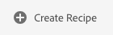
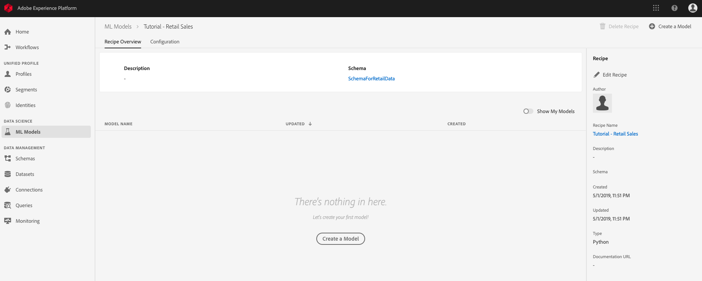
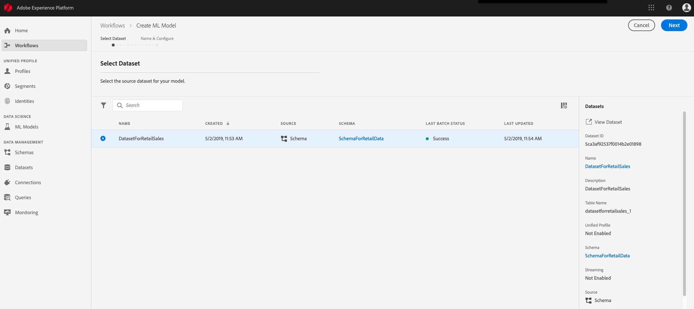
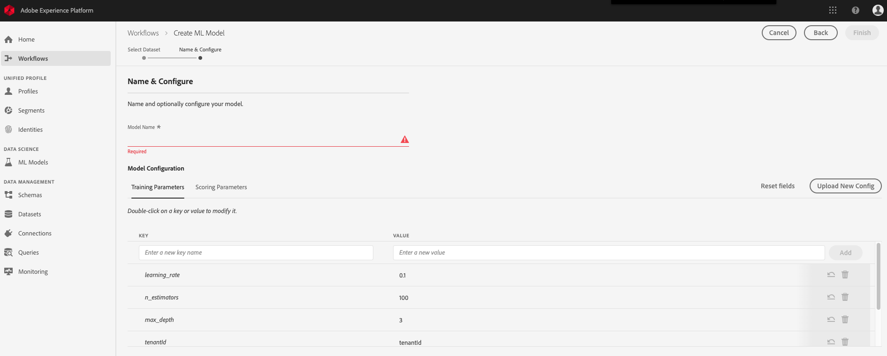
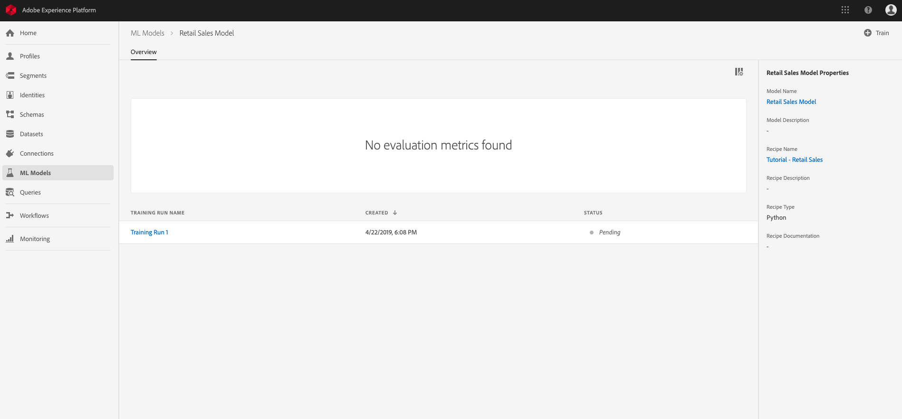
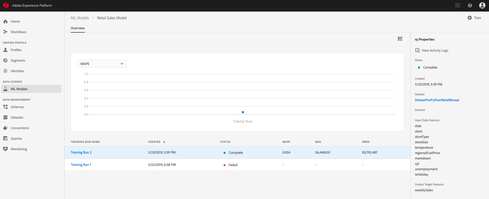
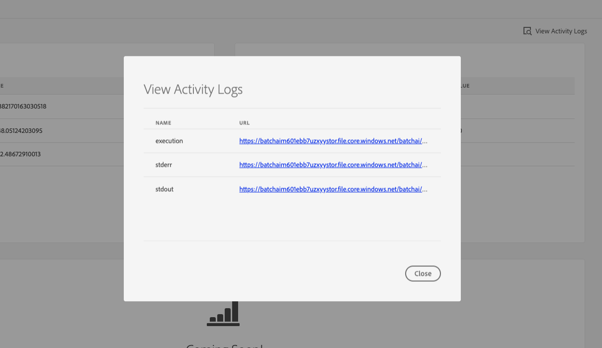

# Import, train, and evaluate a Recipe via the UI <!-- omit in toc -->

- [Objective](#objective)
- [Prerequisites](#prerequisites)
- [UI workflow](#ui-workflow)
    - [Create a Recipe](#create-a-recipe)
        - [Build Docker image](#build-docker-image)
        - [Push Docker image](#push-docker-image)
    - [Create a Model](#create-a-model)
    - [Create a Training Run](#create-a-training-run)
    - [Evaluating Experiment results](#evaluating-experiment-results)
- [Next steps](#next-steps)

---

## Objective
In this step by step tutorial, we will go over how to import a Recipe into the Data Science Workspace. From there, we will go over an example where we train and evaluate the Recipe.

For this tutorial, we will be focused on Recipes, Models, Training Runs, and Scoring Runs. The following chart outlines the relationship between the four.


> **Note:** The terms "Recipe", "Model", "Service", "Training Run", and "Scoring Run" are referred to as different terms in the API. If you're coming from the API, the following table will map the differences.
> 
> UI Term | API Term
> --- | ---
> Recipe | Engine
> Model | MLInstance/ Experiment
> Service | MLService

---

## Prerequisites

* A registered Adobe ID account
    * The Adobe ID account must have been added to an Organization with access to "Adobe Experience Platform"

## UI workflow

In this section, you will go over creating a Recipe where you can import your Docker image. We went through the steps to create a Docker image in the [Package Recipe to Data Science Workspace tutorial](../package_recipe_to_import_into_dsw/package_recipe_to_import_into_dsw.md).

First, navigate to [Adobe Experience Platform](https://platform.adobe.com/) and go to the ML Models tab in the left navigation bar. You will be taken to the **Browse** tab where you will see three tabs:
* Browse
* Recipes
* Notebooks

The **Browse** tab shows a list of Models you or others in your IMS Organization have created or updated recently. A Model is a snapshot of a Recipe that will be tailored towards solving a specific business problem. One Recipe can create many Models.

Similar to the **Browse** tab, the **Recipe** tab shows a list of recently updated Recipes. A Recipe refers to a proprietary algorithm, or an ensemble of algorithms, to help solve specific business problems.

In the UI, a Training Run is run within the context of a Model. Multiple Training Runs can be created for each Model.

### Create a Recipe

You first want to create a new Recipe. From the **Recipes** tab, click on the **Create Recipe** button on the top right.



From here, a "New Recipe" dialog will popup on the screen. The `*` indicate which fields require to be filled. 


* **Name** - This is the name of your Recipe
* **Schema** - What XDM Schema you want to model your data with
* **Recipe Type** - What language or tool you're going to use
* **Recipe Source** - Where your image is uploaded to. Currently only supports Docker images or Binary artifacts, based on the selected Recipe type

> **Note:** If Spark is selected for Recipe Type and Binary is set for Recipe Source, the asset that is expected will be a `.jar` file.


* **Docker Host** - Link to the Docker host to upload your Docker image to
* **Username/Password** - Credentials to the Docker host
* **Configuration File** - This file expects a JSON object containing parameters for the training and scoring of the Instance. You can leave this blank when creating the Recipe as the workflow will prompt you to enter the configuration when creating a Model or a Training Run. Here is an example of a [configuration file for the Retail Sales sample](https://github.com/adobe/experience-platform-dsw-reference/blob/master/recipes/python/retail/retail.config.json) application:

```JSON
[
  {
    "name": "train",
    "parameters": [
      {
        "key": "learning_rate",
        "value": "0.1"
      },
      {
        "key": "n_estimators",
        "value": "100"
      },
      {
        "key": "max_depth",
        "value": "3"
      },
      {
        "key": "ACP_DSW_INPUT_FEATURES",
        "value": "date,store,storeType,storeSize,temperature,regionalFuelPrice,markdown,cpi,unemployment,isHoliday"
      },
      {
        "key": "ACP_DSW_TARGET_FEATURES",
        "value": "weeklySales"
      },
      {
        "key": "ACP_DSW_FEATURE_UPDATE_SUPPORT",
        "value": false
      },
      {
        "key": "tenantId",
        "value": "_{TENANT_ID}"
     },
     {
       "key": "ACP_DSW_TRAINING_XDM_SCHEMA",
       "value": "<leave as is if going through UI workflow. Replace with Schema ID if creating recipe via API>"
     },
     {
       "key": "evaluation.labelColumn",
       "value": "weeklySalesAhead"
     },
     {
       "key": "evaluation.metrics",
       "value": "MAPE,MAE,RMSE,MASE"
     }
    ]
  },
  {
        "name": "score",
        "parameters": [
            {
                "key": "tenantId",
                "value": "_{TENANT_ID}"
            },
            {
              "key":"ACP_DSW_SCORING_RESULTS_XDM_SCHEMA",
              "value":"<leave as is if going through UI workflow. Replace with Schema ID if creating recipe via API>"
            }
        ]
  }
]
```

You will need to modify the configuration file yourself. Specifically, the value of the `{TENANT_ID}`: This ID ensures resources you create are namespaced properly and contained within your IMS Organization. To find your ID, you can [follow the steps here](../../../technical_overview/schema_registry/schema_registry_developer_guide.md#know-your-tenant_id)

For this tutorial, you will be creating a Python Recipe using the Docker image that you created in the [Package Recipe tutorial](../package_recipe_to_import_into_dsw/package_recipe_to_import_into_dsw.md). We are provided with the Docker host, username, and password values which you will be able to use to build our Docker image in the next section.

#### Build Docker image
With the Dockerfile, you can build the Docker image. In the directory with your Dockerfile type the following commands:

```BASH
#  These values are found in the New Recipe window
docker login -u <username> -p <password> <Docker host>
 
#  Build the Docker image: e.g., docker build -t <docker-path>/sample-python:1.0 .
docker build -t <Docker host>/<intelligent-service>:<version_tag> .
```

> **Note:**  Don't forget the `.` after the `docker build` command!

#### Push Docker image

```BASH
#  The argument for the push command is the same as the build command without the period at the end
docker push <Docker host>/<intelligent-service>:<version_tag>
```

---

Now insert the URL you have just built and pushed to the Docker host into the Source File field. After pressing "Save", you are taken to the new Recipe's overview page. From here you are able to view information about the Recipe you just created and are able to create Models.


### Create a Model

Now that you created a new Python Recipe and are taken to the Recipe Overview, you can create a Model. Remember that a Model is a snapshot of the Recipe configured that will be tailored to help solve specific business problems. One Recipe can create many Models. Since the Recipe you created is new, it has no existing Models so the user interface will show that you have an empty list of Models and ask if you want to create your first Model.



Click on either of the two **Create a Model** buttons (one at the top-right and one in the middle of the page) and a new Workflow should begin. As you can see at the top of the Workflow page, there are two steps: **Select Dataset** and **Name & Configure**.

In the **Select Dataset** step, you will have to choose the dataset you previously created and ingested data into. Once selected you will see the details about the dataset in the sidebar.



Next, the Workflow will prompt you to enter a model name as well as configuration for the Model. For the configuration, you can use the sample Retail Sales configuration file from the public repository [here](https://github.com/adobe/experience-platform-dsw-reference/blob/a74f65d2c6fcc3ae85414f74f003620a657e2d1c/recipes/python/retail/retail.config.json). Click on **Upload New Config** and drag the JSON file into the browser window. The training and scoring parameters should update with the configuration file you uploaded.



### Create a Training Run

After creating the new model, you should see an overview page as seen below.



By default, model creation leads to a training run to be created and ran. This training run uses the default configuration parameters you set when the Model is created. 

To create a new training run, use the **Train** button on the top-right of the page. This will take you to a **Run Training** workflow. This workflow has two steps: **Training input**, and **Configuration**.

In the **Training input** step, you will need to select the source dataset for your training run. 


After selecting your dataset, click **Next** and you will be asked to configure your training run.


These configuration values are called hyperparameters. Hyperparameters cannot be learned - they must be assigned before training of the model. Adjusting the parameters may change the accuracy of the trained model.

The Retail Sales Forecasting Recipe uses the gradient boosting algorithm. Here are the associated hyperparameters:

Hyperparameter | Description | Recommended Range
--- | --- | ---
learning_rate | Learning rate shrinks the contribution of each tree by learning_rate. There is a trade-off between learning_rate and n_estimators. | 0.1 | [2 - 10] / number of estimators
n_estimators | The number of boosting stages to perform. Gradient boosting is fairly robust to over-fitting so a large number usually results in better performance. | 100 | 100 - 1000
max_depth | Maximum depth of the individual regression estimators. The maximum depth limits the number of nodes in the tree. Tune this parameter for best performance; the best value depends on the interaction of the input variables. | 3 | 4 - 10

Double-click on a key or value to modify the training run configuration. If you have another configuration file, you can also use the **Upload New Config** button as well. If you change your mind and made a mistake, you can click on **Reset fields** to revert all the changes you just made.

Click on **Finish** when you are happy with your configuration. You will be taken to the model's overview page.

When you are happy with the configuration, click **Finish**. Your training run will be created and will start running.

### Evaluating Experiment results

On the model overview page, you can see the status of each of the training runs. If at least one run is complete, you will be able to see metrics and visualizations for the completed runs.



> **NOTE:** The Mean Absolute Percent Error (MAPE) metric expresses accuracy as a percentage of the error. This is used to identify the top performing Experiment. The lower the MAPE, the better.

With completed multiple training runs, you can compare metrics across different training runs in the model evaluation chart.


> **NOTE:** The "Precision" metric describes the percentage of relevant Instances compared with the total *retrieved* Instances. Precision can be seen as the probability that a randomly selected outcome is correct.

You can click on a specific training run to view the details about the run. This can be done even before the run has been completed. Once in the run's detail page, you are able to see other evaluation metrics, configuration parameters, and visualizations specific to the training run.

A user can also download activity logs to see the details of the run. Logs are particularly useful for failed runs to see what went wrong.



## Next steps

This tutorial went over how to consume the APIs to create a Recipe, an Experiment, and trained Models. In the [next exercise](../how_to_score_with_recipe/how_to_score_with_recipe.md), you will be making predictions by scoring a new dataset using the top performing trained model.