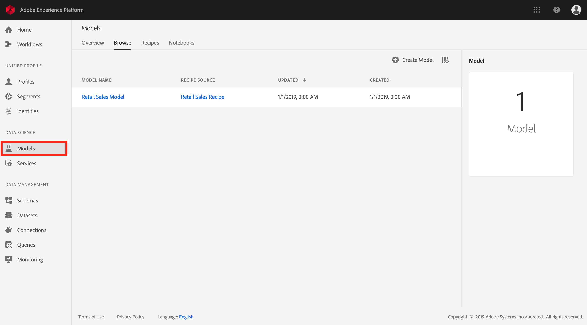
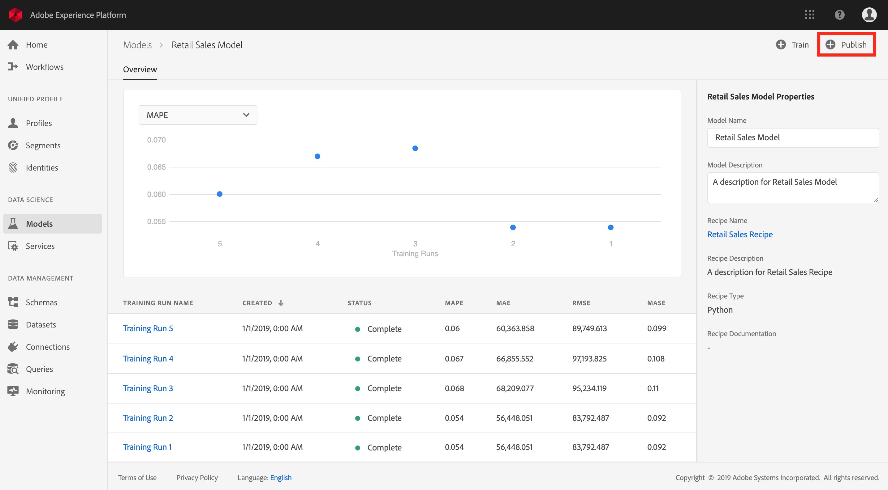
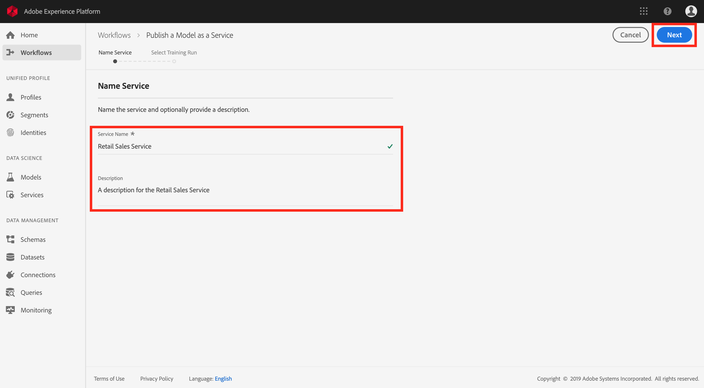
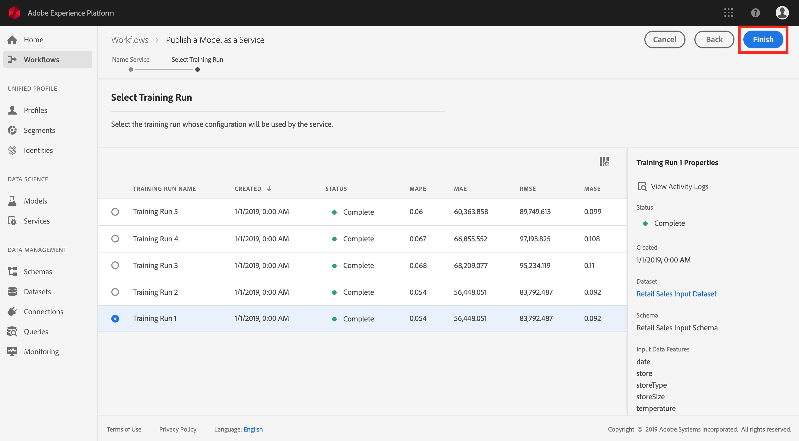
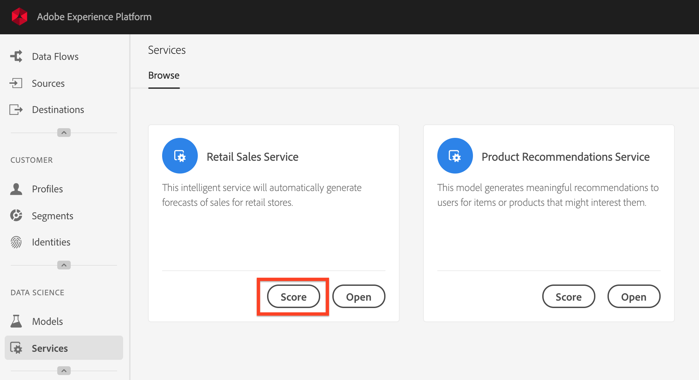
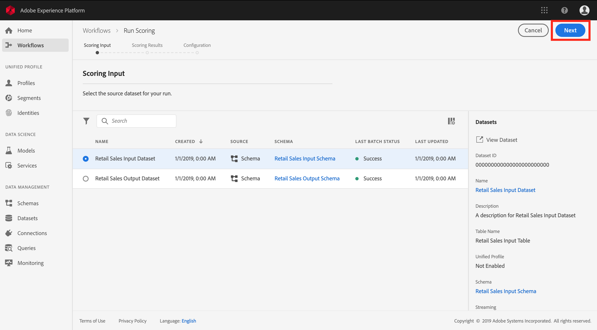
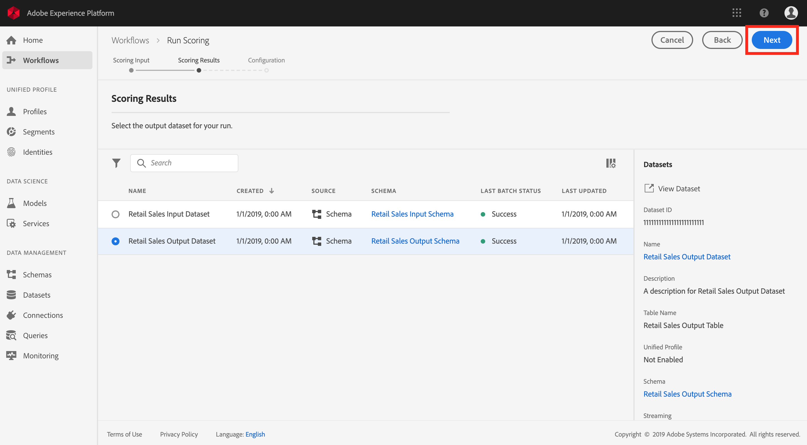
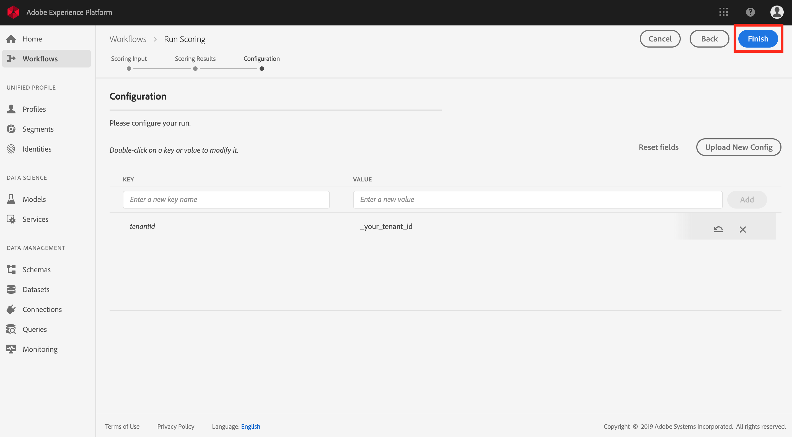
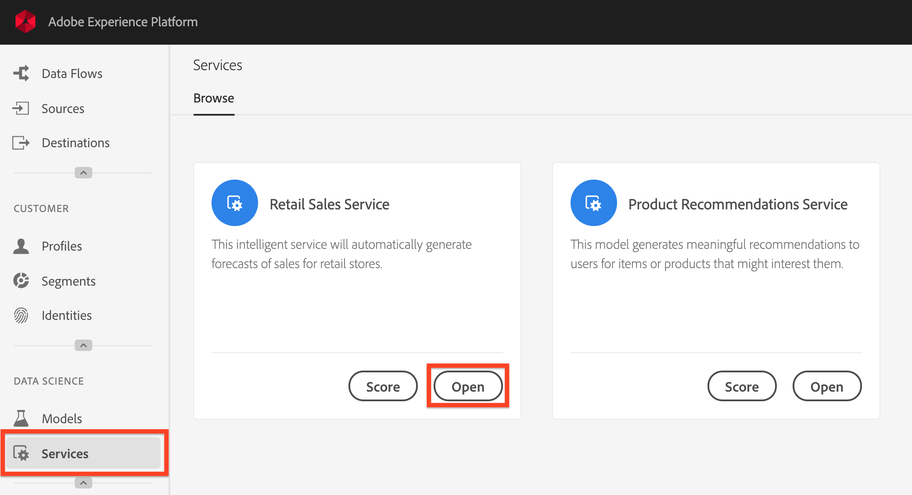
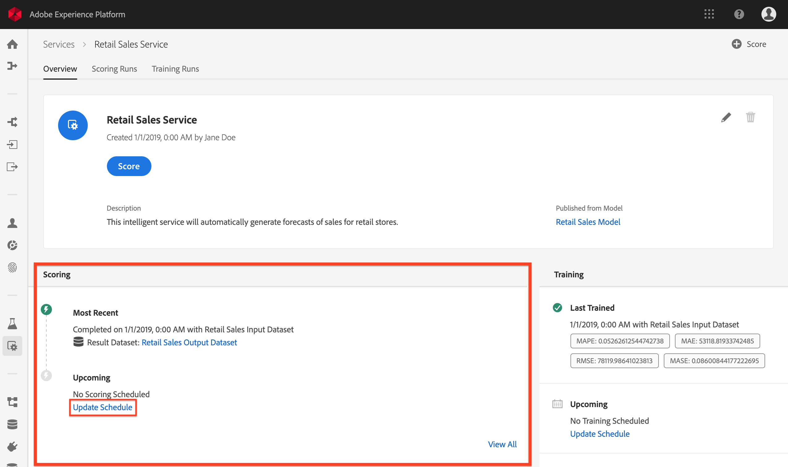

# Publish a Model as a Service in the UI

Adobe Experience Platform Data Science Workspace allows you to publish your trained and evaluated Model as a Service, enabling users within your IMS Organization to score data without the need for creating their own Models.

This tutorial walks through the steps to publish a Model as a Service, schedule automated scoring and training runs, and score data using a published Service. It is broken into the following main sections:

-   [Publish a Model](#publish-a-model)
-   [Score using a Service](#access-a-service)
-   *(Optional)* [Configure scheduled scoring](#configure-scheduled-scoring)
-   *(Optional)* [Configure scheduled training](#configure-scheduled-training)

## Getting started

In order to complete this tutorial, you must have access to Experience Platform. If you do not have access to an IMS Organization in Experience Platform, please speak to your system administrator before proceeding.

This tutorial requires an existing Model with a successful training run. If you do not have a publishable Model, follow the [Train and evaluate a Model in the UI](../../train_evaluate_score_a_model/train_and_evaluate_a_model_tutorial/train_and_evaluate_a_model_ui.md) tutorial before continuing.

If you prefer to publish a Model by using Sensei Machine Learning APIs, refer to the [API tutorial](./publish_model_as_service_using_the_api.md).

## Publish a Model

1.  In Adobe Experience Platform, click the **Models** link located in the left navigation column to list all existing Models. Find and click the name of the Model to be published as a Service.

2.  Click **Publish** near the top right of the Model overview page to start a Service creation process.

3.  Input a desired name for the Service and optionally provide a Service description, click **Next** when finished.

4.  All successful training runs for to the Model are listed. The new Service will inherit training and scoring configurations from the selected training run. 

5.  Click **Finish** to create the Service and redirect to the **Services** page showing all available Services, including the newly created Service.

## Score using a Service

1. In Adobe Experience Platform, click the **Services** tab located in the left navigation column to access the *Service Gallery*. Find the Service that you wish to use and click **Score**.

2. Select an appropriate input dataset for the scoring run, then click **Next**.

3. Select an appropriate output dataset for the scoring results, then click **Next**.

4. When a Service is created, it inherits default scoring configurations. You can review these configurations and adjust them as needed by double-clicking on the values. Once you are satisfied with the configurations, click **Finish** to begin the scoring run.

The following sections are optional and provide steps to scheduling automated scoring and training runs on an existing Service. If you do not wish to continue with this tutorial, you can move on to the [next steps](#next-steps).

## Configure scheduled scoring

>   **Note:** This step is optional. If you do not wish to configure scheduled scoring runs on a Service, you can skip to the steps to [configure scheduled training](#configure-scheduled-training) or move on to the [next steps](#next-steps).

Model scoring can be configured to be an automated process on a scheduled basis. Once a Service is created, you can follow the steps below to configure and apply a scoring schedule:

1.  In Adobe Experience Platform, click the **Services** tab located in the left navigation column to access the *Service Gallery*. Find the Service you wish to schedule scoring runs on and click **Open** to view its *Overview* page.

2.  The Overview page displays the Service's scoring information. Click the **Update Schedule** link to configure a scoring schedule.

3.  Configure the frequency, start date, end date, input dataset, and output dataset for the scoring schedule. Once you are satisfied with the configurations, click **Create** to update the Service's scoring schedule.

## Configure scheduled training

>   **Note:** This step is optional. If you do not wish to configure scheduled training runs on a Service, you can move on to the [next steps](#next-steps).

Configuring scheduled training runs on a Service ensures that the machine learning Model is updated to the most recent data patterns. Once a Service is created, you can follow the steps below to configure and apply a training schedule:

1.  In Adobe Experience Platform, click the **Services** tav located in the left navigation column to access the *Service Gallery*. Find the Service you wish to schedule training runs on and click **Open** to view its *Overview* page.

2.  The Overview page displays the Service's training information. Click the **Update Schedule** link to configure a training schedule.

3.  Configure the frequency, start date, end date, and input dataset used for the training schedule. Once you are satisfied with the configurations, click **Create** to update the Service's training schedule.

## Next steps

By following this tutorial, you have successfully created and accessed a Service, and completed the Data Science Workspace tutorial UI workflow. If you have not done so already, consider [restarting the tutorial](../../prepare_your_data/access_and_explore_your_data_tutorial/access_and_explore_your_data_tutorial.md) and follow the API workflow to create, train, score, and publish a Model.
