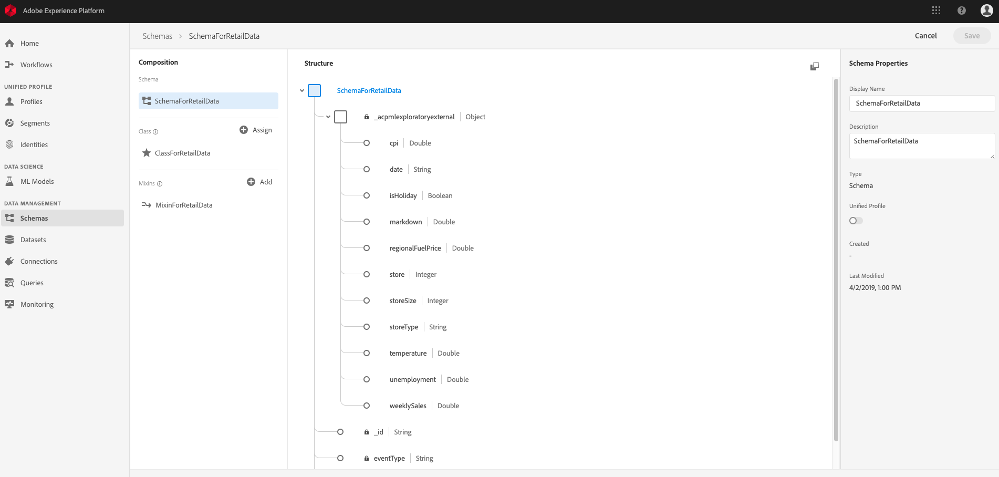
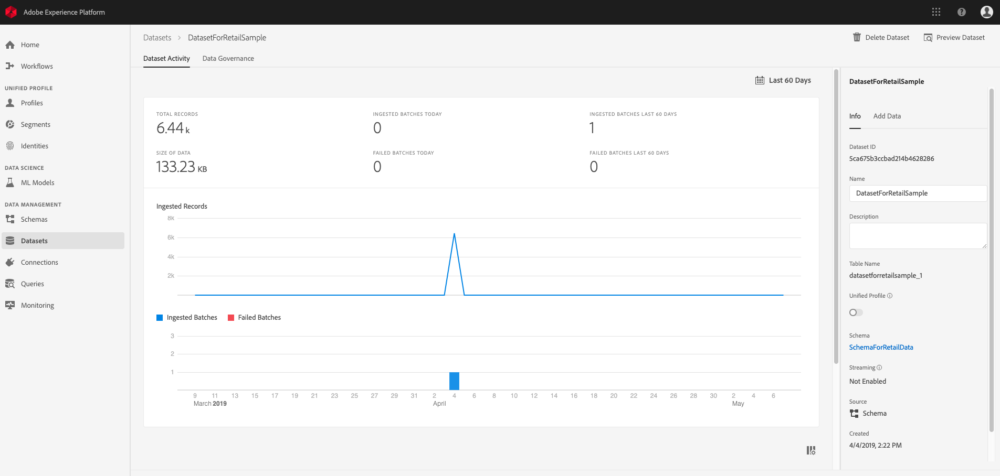
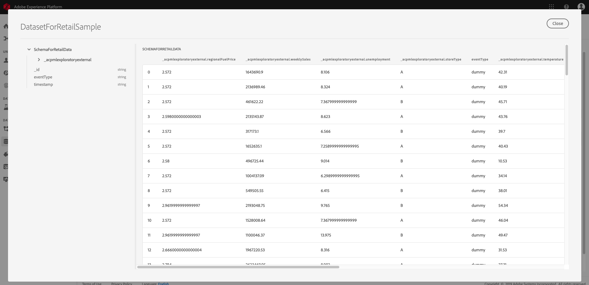

# Access and explore your data <!-- omit in toc -->

- [Objective](#objective)
- [Concepts introduced](#concepts-introduced)
- [Prerequisites](#prerequisites)
- [Create Retail Sales schema and dataset](#create-retail-sales-schema-and-dataset)
- [Preview your schema and data](#preview-your-schema-and-data)
- [Next steps](#next-steps)

## Objective

This tutorial will demonstrate how to create an Experience Data Model (XDM) schema and ingest data into Adobe Experience Platform with the provided retail sales example.

## Concepts introduced

* Experience Data Model: [XDM](https://www.adobe.io/open/standards/xdm.html) is used in Experience Platform to standardize customer experience data and define schemas for customer experience management.
* Dataset: A dataset is a collection of data that includes schema and fields. Datasets available in the platform can be read and exported.

## Prerequisites

* Before being able to make calls using Platform APIs, you must first complete the tutorial on [authenticating and accessing Adobe Experience Platform APIs](../../../authenticate_to_acp_tutorial/authenticate_to_acp_tutorial.md).
    * Completing the authentication tutorial will provide the following values that you will need in this tutorial:
        * `{ACCESS_TOKEN}` : Your specific bearer token value provided after authentication.
        * `{IMS_ORG}` : Your IMS organization credentials found in your unique Adobe Experience Platform integration.
        * `{API_KEY}` : Your specific API key value found in your unique Adobe Experience Platform integration. 
        * `{CLIENT_SECRET}` : Your secret string used to authenticate to the authorization server.
        * `{PRIVATE_KEY}` : Your private certificate file created during Adobe I/O integration. Typically, this file is named `private.key`. Ensure you provide the relative directory path to your private certificate file.
* [Python 2.7](https://www.python.org/download/releases/2.7/)

## Create Retail Sales schema and dataset

In order to ingest external data into Experience Platform, you must first create an XDM schema. Once the schema is defined, data is ingested and structured according to the schema. For the purpose of this tutorial, this process will be automated using the bootstrap script included as part of the tutorial resources.

Begin by downloading the resources used for this, and many other Data Science Workspace tutorials, from the [Adobe public Git repository](https://github.com/adobe/experience-platform-dsw-reference).

### Configure files

* Inside the Experience Platform tutorial resource package, navigate into the directory `bootstrap`, and open `config.yaml` using an appropriate text editor. Under the `Enterprise` section, input the following values:
```yaml
Enterprise:
    api_key: {API_KEY}
    org_id: {IMS_ORG}
    tech_acct: {technical_account_id}
    client_secret: {CLIENT_SECRET}
    priv_key_filename: {PRIVATE_KEY}
```
> Refer to the [authorization tutorial](https://www.adobe.io/apis/experienceplatform/home/tutorials/alltutorials.html#!api-specification/markdown/narrative/tutorials/authenticate_to_acp_tutorial/authenticate_to_acp_tutorial.md) for information on obtaining the required values.

* Under the `Platform` section, input your `{ACCESS_TOKEN}`:

```yaml
Platform:
    platform_gateway: https://platform.adobe.io
    ims_token: {ACCESS_TOKEN}
```

> `ims_token`: The IMS token is the access token provided during authentication. It is written in the format "Bearer `{ACCESS_TOKEN}`"

* Under the `Titles` section, provide the following information appropriately for the Retail Sales sample data. Example shown below:

```yaml
Titles:
    input_class_title: retail_sales_input_class
    input_mixin_title: retail_sales_input_mixin
    input_mixin_definition_title: retail_sales_input_mixin_definition
    input_schema_title: retail_sales_input_schema
    input_dataset_title: retail_sales_input_dataset
    file_replace_tenant_id: DSWRetailSalesForXDM0.9.9.9.json
    file_with_tenant_id: DSWRetailSales_with_tenant_id.json
    is_output_schema_different: True
    output_mixin_title: retail_sales_output_mixin
    output_mixin_definition_title: retail_sales_output_mixin_definition
    output_schema_title: retail_sales_output_title
    output_dataset_title: retail_sales_output_dataset
```

> Refer to the [Basics of schema composition](https://www.adobe.io/apis/experienceplatform/home/xdm/xdmservices.html#!api-specification/markdown/narrative/technical_overview/schema_registry/schema_composition/schema_composition.md) for more information on Classes and Mixins.

### Run the bootstrap script

* Once you've finished editing `config.yaml`, save your changes and open your terminal application and set the working directory to the Experience Platform tutorial resource directory.
* Navigate into `bootstrap` directory, and run the `bootstrap.py` python script by entering the following command:

```bash
python bootstrap.py
```
> **Note:** Python 2.7 has to be installed before you can run the script. You can download Python from the [official site](https://www.python.org/download/releases/2.7/).

> **Note:** The script may take several minutes to complete.

## Preview your schema and data

Once the script has completed, your newly created schema and dataset will be viewable on Experience Platform. In the left navigation listing, navigate into **Schemas** to find the schema created by the bootstrap script, the schema name will correspond to what you've configured it to be in the previous step. View the Schema details and it's composition by clicking into it.



In the left navigation panel, navigate into **Datasets** and find the dataset that was created, it's name will correspond to the input dataset name you've provided in the previous step.




Click on **Preview Dataset** located at the top right see a subset of the dataset.



## Next steps

You have now successfully ingested Retail Sales sample data into Experience Platform using the provided bootstrap script."

To continue working with the ingested data:
* [Analyze your data using Jupyter notebooks](../analyze_your_data_using_jupyter_notebooks/analyze_your_data_using_jupyter_notebooks.md)
    * Use Jupyter notebooks in Data Science Workspace to access, explore, visualize, and understand your data.
* [Package source files into a Recipe](../../author_a_model/package_source_files_into_recipe/package_source_files_into_recipe.md)
    * Follow this tutorial to learn how to bring your own Model into Data Science Workspace by packaging source files in an importable Recipe file.