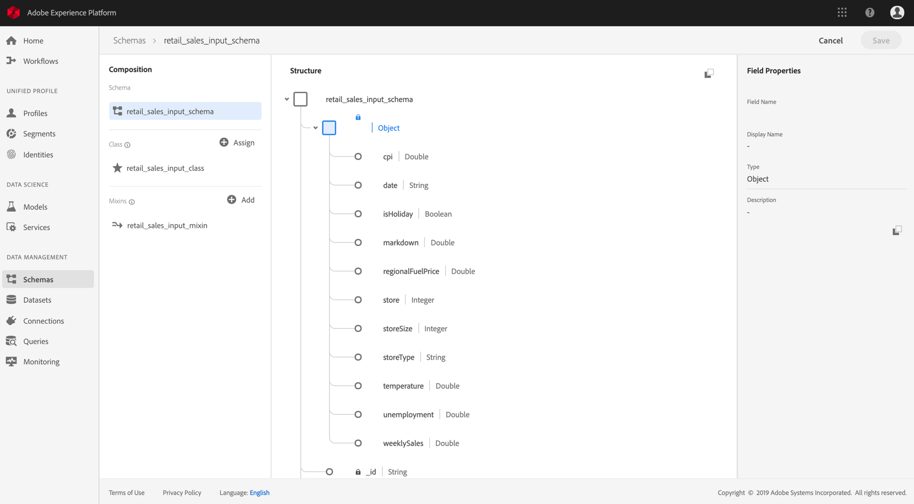
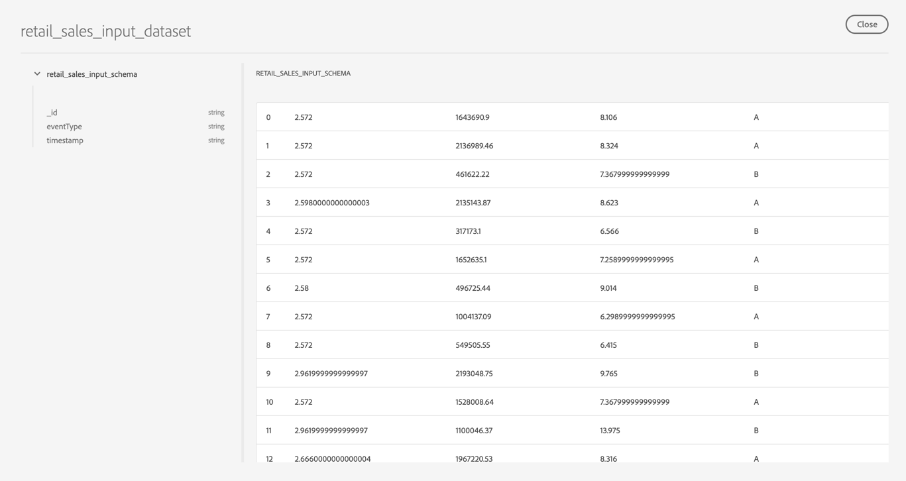

# Access and explore your data <!-- omit in toc -->

- [Objective](#objective)
- [Concepts introduced](#concepts-introduced)
- [Create Retail Sales schema and dataset](#create-retail-sales-schema-and-dataset)
- [Preview your schema and data](#preview-your-schema-and-data)
- [Next steps](#next-steps)

---

## Objective
This tutorial will go over how to create an XDM schema and ingest your data to Adobe Experience Platform. The example data we will use in the tutorial is the [Retail Sales Python recipe](https://github.com/adobe/experience-platform-dsw-reference/tree/master/recipes/python/retail). By the end of this tutorial, you should be provisioned with the Retail Sales schema and dataset which will be used in following tutorials.

> **Note:** Data Science Workspace also supports the following languages:
> * Scala
> * PySpark
> * Tensorflow
> * R

---

## Concepts introduced
* XDM: [Experience Data Model](https://www.adobe.io/open/standards/xdm.html) is the common language for the experience business.
* Datasets: [Adobe Experience Platform](https://www.adobe.io/apis/experienceplatform/home/overview.html) is an open system. A Dataset is a collection of data that includes schema and fields. Datasets available in the platform can be read and exported.

---

## Create Retail Sales schema and dataset

In this section, you will be creating an XDM schema and ingesting external data into a dataset. This data will be used later to create our machine learning model.

In this tutorial, we have provided a script that will output the Retail Sales Schema, and Retail Sales dataset. Specifically, the script will do the following steps for you:
1. Get the tenantID of the org
2. Create Retail Sales class
3. Create Retail Sales mixin with the class
4. Create Retail Sales Schema with the class and the mixin
5. Create dataset with the schema
6. Create batch with the dataset
7. Ingest the datafile (with the right tenantID)
8. Close the batch

Since the script leverages the [APIs](https://www.adobe.io/apis/experienceplatform/home/api-reference.html#!acpdr/swagger-specs/schema-registry.yaml), you will need to provide your IMS Organization ID, API key, and bearer access token as they are prerequisites to making API calls to Platform. Visit the [How to access Adobe Experience Platform APIs](../../authenticate_to_acp_tutorial/authenticate_to_acp_tutorial.md) tutorial to get started.

To begin clone or download the [experience-platform-dsw-reference](https://github.com/adobe/experience-platform-dsw-reference) to your computer. The script will be in the `bootstrap` folder.

Next, open the `config.yaml` in a text editor and make changes to the following variables:
* `api_key`: Can be found in the [Copy down access values](../../authenticate_to_acp_tutorial/authenticate_to_acp_tutorial.md#copy-down-access-values) section.
* `org_id`: Can be found in the [Copy down access values](../../authenticate_to_acp_tutorial/authenticate_to_acp_tutorial.md#copy-down-access-values) section.
* `client_secret`: Can be found in the [Copy down access values](../../authenticate_to_acp_tutorial/authenticate_to_acp_tutorial.md#copy-down-access-values) section.
* `priv_key_filename`: This is the path to your local `private.key` file created in the [Create integration](../../authenticate_to_acp_tutorial/authenticate_to_acp_tutorial.md#add-integration-details-public-key-and-product-profile) section.

 Once completed, you can run the script by opening your terminal application and navigating to the location where you downloaded the script. From there, run the following command.

```Python
python bootstrap.py
```

> **Note:** Python has to be installed before you can run the script. You can download Python from the [official site](https://www.python.org/downloads/).

---

## Preview your schema and data

Once you have completed running the scripts, your newly created schema and dataset will be on Experience Platform. 


Navigate to the **Browse** tab in under **Schemas** to find the schema you just created. Clicking into it, you will be able to see the schema's composition: its class and mixins.



Likewise, to view your dataset, navigate to the **Datasets** page to find the one you just created. Clicking on **Preview Dataset**, you will see a subset of the dataset.



---

## Next steps

This tutorial went over how to ingest your data on Adobe Experience Platform. Specifically, we went over the following steps:
- Create Retail Sales schema and dataset  
- Preview your schema and data  

Now you are ready to go on to the [next section](../analyze_your_data_using_jupyter_notebooks/analyze_your_data_using_jupyter_notebooks.md) to analyze your ingested dataset using Jupyter notebooks.