# Enrich Real-time Customer Profile using machine learning insights

Adobe Experience Platform Data Science Workspace provides the tools and resources to create, evaluate, and utilize machine learning models to generate data predictions and insights. When machine learning insights are ingested into a Profile-enabled dataset, that same data is also ingested as Profile records which can then be segmented into subsets of related elements by using Experience Platform Segmentation Service.

This document provides a step-by-step tutorial to enrich Real-time Customer Profile with machine learning insights, steps are broken into the following sections:

1.  [Configure an output schema and dataset](#configure-an-output-schema-and-dataset)
2.  [Create segments using the Segment Builder](#create-segments-using-the-segment-builder)

## Getting started

This tutorial requires a working understanding of the various aspects of Adobe Experience Platform involved in ingesting Profile data and creating segments. Before beginning this tutorial, please review the documentation for the following services:

*   [Real-time Customer Profile](../../../../technical_overview/unified_profile_architectural_overview/unified_profile_architectural_overview.md): Provides a unified, real-time consumer profile based on aggregated data from multiple sources.
*   [Identity Service](../../../../technical_overview/identity_services_architectural_overview/identity_services_architectural_overview.md): Enables Real-time Customer Profile by bridging identities from disparate data sources being ingested into Platform.
*   [Experience Data Model (XDM)](../../../../technical_overview/schema_registry/xdm_system/xdm_system_in_experience_platform.md): The standardized framework by which Platform organizes customer experience data.

## Configure an output schema and dataset

Before you can enable a dataset for Profile, you need to configure the dataset's schema to having a primary identity field and then enable the schema for Profile. If you wish to create and enable a new schema, you can refer to the tutorial on <a href="https://www.adobe.io/apis/experienceplatform/home/tutorials/alltutorials.html#!api-specification/markdown/narrative/tutorials/schema_editor_tutorial/schema_editor_tutorial.md" target="_blank">creating a schema using the Schema Editor</a>. Otherwise follow the instructions below to enable an existing schema and dataset.

1.  On Adobe Experience Platform, use the schema browser to find the output schema you wish to enable Profile on and click its name to view its composition.
    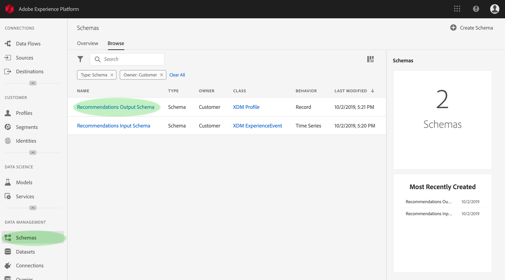

2.  Expand the schema structure and find an appropriate field to set as the primary identifier. Click the desired field to display its properties.
    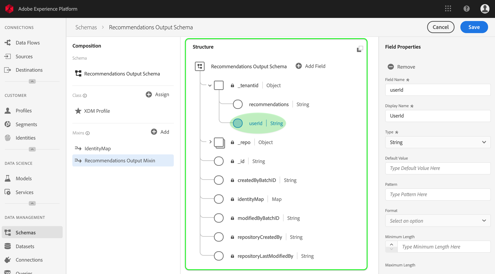

3.  Set the field as the primary identity by enabling the field's **Identity** property, **Primary Identity** property, and then selecting an appropriate **Identity Namespace**. Click **Apply** once you have made your changes.
    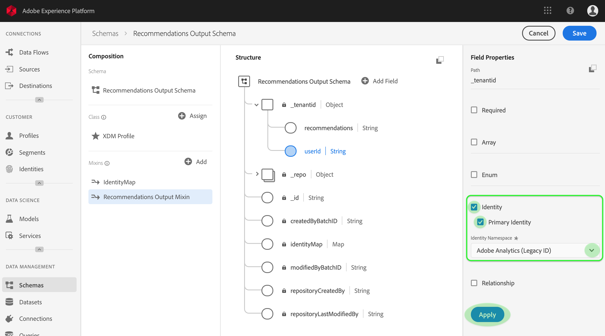

4.  Click the top-level object of your schema structure to display the schema properties and enable the schema for Profile by toggling the **Unified Profile** switch. Click **Save** to finalize your changes, dataset that were created using this schema can now be enabled for Profile.
    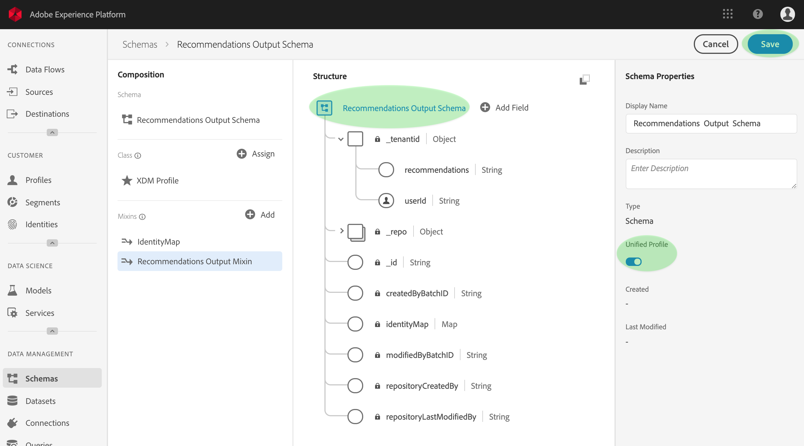

5.  Use the dataset browser to find the dataset you wish to enable Profile on and click its name to access its details.
    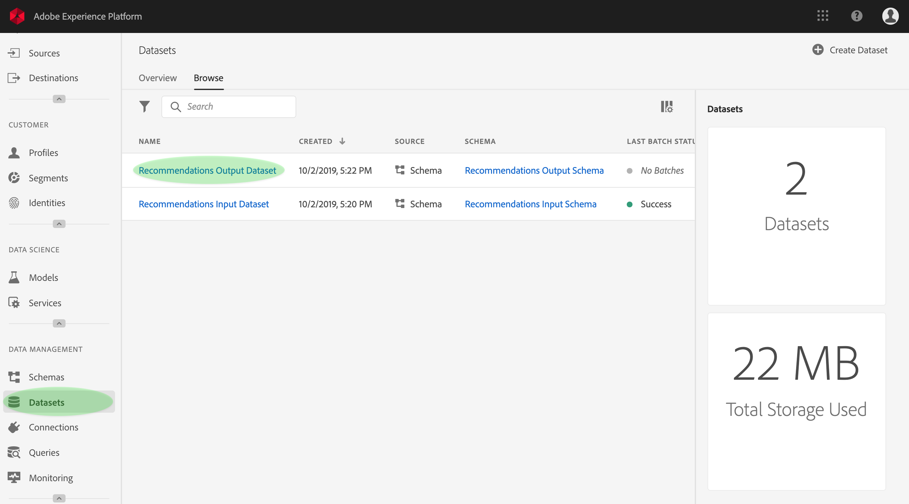

6.  Enable the dataset for Profile by toggling the **Unified Profile** switch found in the right information column. 
    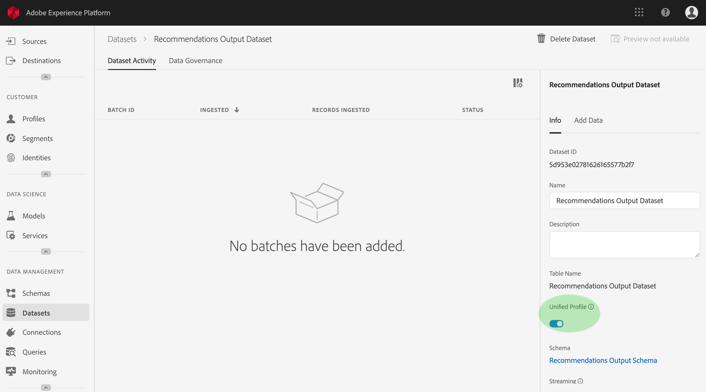

When data is ingested into a Profile-enabled dataset, that same data is also ingested as Profile records. Now that your schema and dataset is prepared, generate some data into the dataset by performing scoring runs using an appropriate model, and continue with this tutorial to create insight segments using the Segment Builder.

## Create segments using the Segment Builder

Now that you have generated and ingested insights into your Profile-enabled dataset, you can manage that data by identifying subsets of related elements using the Segment Builder. Follow the steps below to build your own segments.

1.  On Adobe Experience Platform, click the **Segments** tab followed by **Create Segment** to access the Segment Builder.
    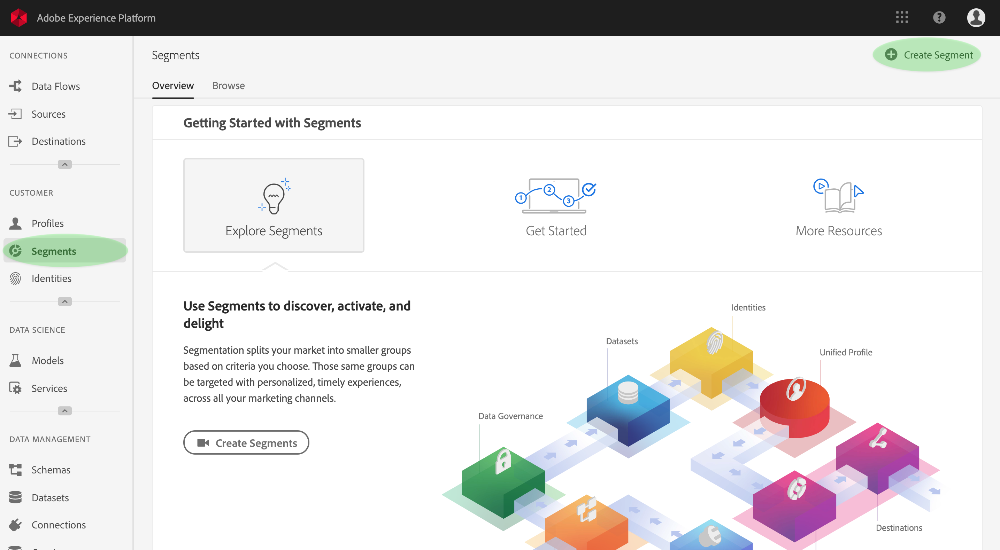

2.  Within the Segment Builder, the left rail provides access to the core building blocks of segments: attributes, events, and existing segments. Each building block appears in its own respective tab. Select the class to which your Profile-enabled schema extends then browse and find the building blocks for your segment.
    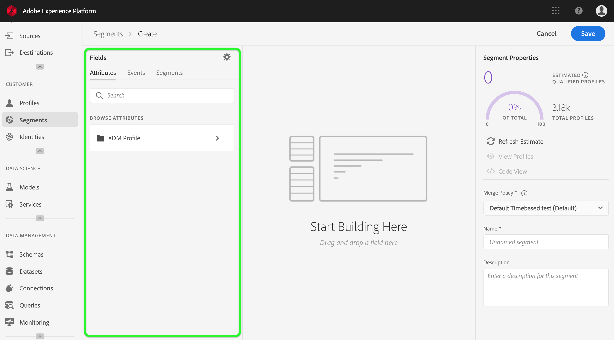

3.  Drag and drop building blocks onto the rule builder canvas, complete them by providing comparative statements.
    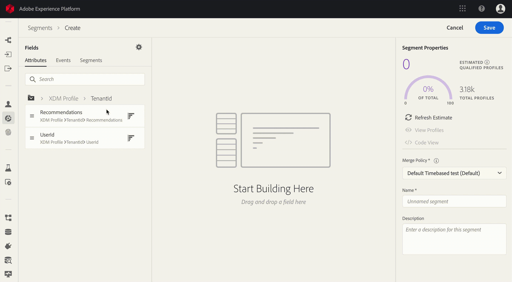

4.  While you build your segment you can preview estimated segment results by observing the *Segment Properties* panel.
    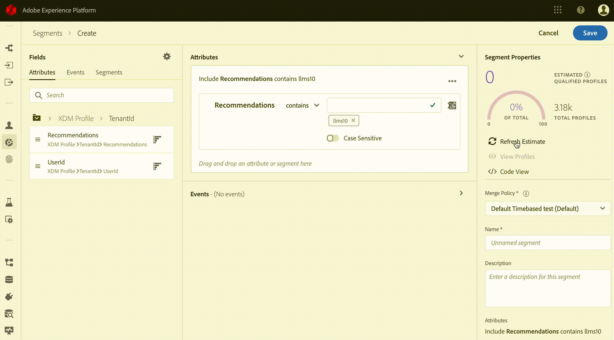

5.  Select an appropriate **Merge Policy**, provide a name and an optional description, then click **Save** to complete your new segment.
    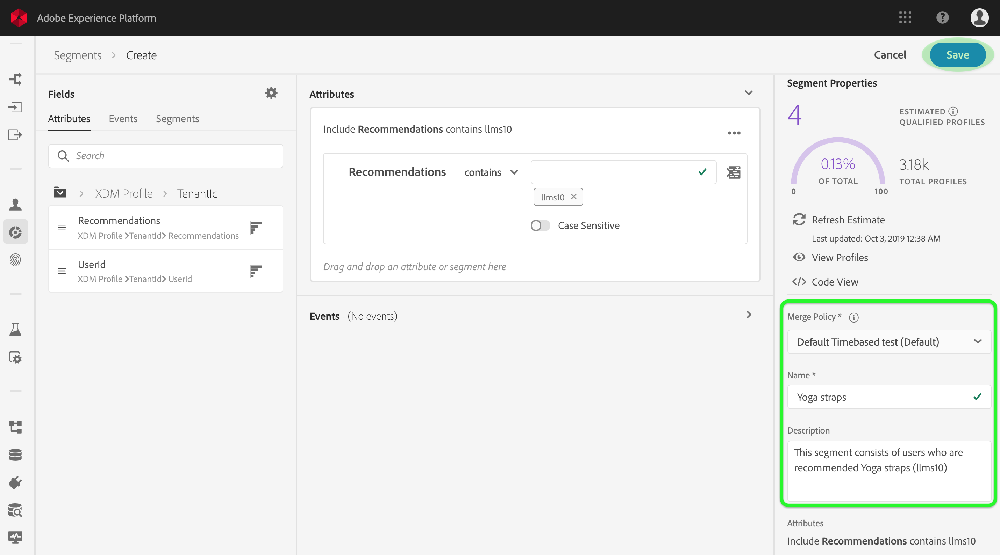

## Next steps

This document walked you through the steps required to enable a schema and dataset for Profile, and briefly demonstrated the workflow for creating insight segments using the Segment Builder. To learn more about segments and the Segment Builder, refer to the <a href="https://www.adobe.io/apis/experienceplatform/home/profile-identity-segmentation/profile-identity-segmentation-services.html#!end-user/markdown/segmentation_overview/segmentation.md" target="_blank">Segmentation Service overview</a>.
