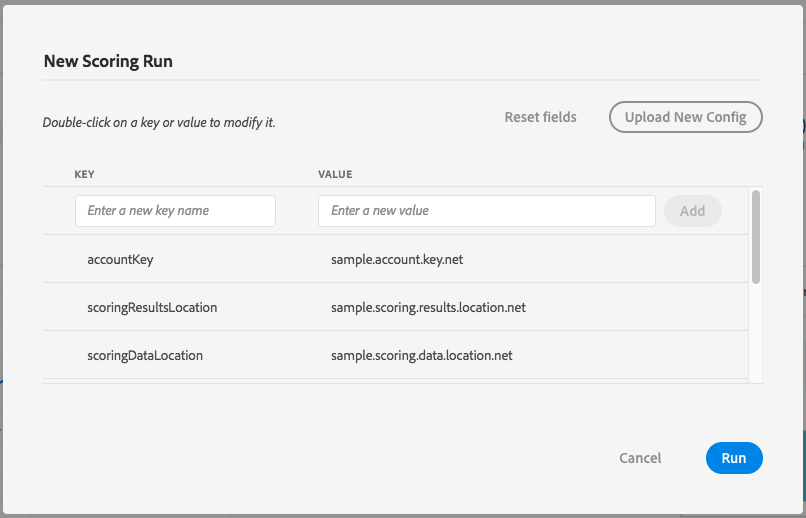
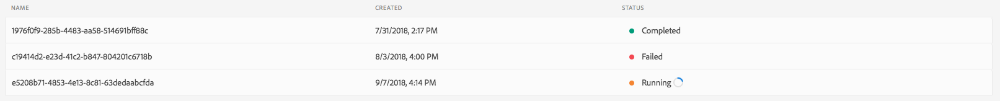
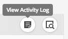
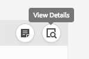

# Score a Model in the UI <!-- omit in toc -->

- [Objective](#objective)
- [Concepts introduced:](#concepts-introduced)
- [Prerequisites](#prerequisites)
- [UI workflow](#ui-workflow)
    - [Create a new Scoring Run](#create-a-new-scoring-run)
    - [View scoring results](#view-scoring-results)
- [Next steps](#next-steps)

---

## Objective
In this step by step tutorial, we will go over how to score your Recipe in Data Science Workspace. 

---

## Concepts introduced:
* Model: A model is an instance of a machine learning recipe that is trained using historical data and configurations to solve for a business use case.
* Training: Training is the process of learning patterns and insights from labeled data.
* Scoring: Scoring is the process of generating insights from data using a trained model.

---

## Prerequisites

* A registered Adobe ID account
    * The Adobe ID account must have been added to an Organization with access to "Adobe Experience Platform"
* An existing: 
    * Recipe
    * Instance
    * Experiment

---

## UI workflow

In this section, we will create a Scoring Run for an existing Experiment Run. We went over how to import, train, and evaluate a recipe in a previous tutorial found [here](../how_to_import_train_evaluate_recipe_tutorial/how_to_import_train_evaluate_recipe_tutorial.md).

First, we will open our existing trained model. Launch the [Adobe Experience Platform UI](https://platform.adobe.com) and go to the `Data Science` tab in the top navigation bar. In the Recipes carousel, find the existing Recipe that you created.

### Create a new Scoring Run

From the Recipe page, you should see your Instances. From here, navigate into your trained Instance. Once in your Instance, you will see a list of Experiment Runs. Click on a "Completed" run.

On the Experiment page, you will be able to see the "Scoring Runs" tab along with the "Score" button. The "Scoring Runs" tab lists all Scoring Runs that are under the current Experiment while the "Score" button will allow the user to create new Scoring Runs using the current configuration. The current training and scoring parameter configuration can be seen in the "Configuration Details" tab. 

When clicking on the "Score" button, a popup menu will appear which allows you to view and add to the Scoring parameters. You can edit the configuration in two ways: The first method involves uploading a new JSON file when clicking on the "Upload New Config" button. The second method allows users to add new parameters or edit existing parameters in the menu. By entering a new key name along with the value in the fields below, you can add custom parameters to the Scoring Run. Note that you will not be able to remove parameters that were added as a configuration when the Experiment was created. These are known as "inherited parameters". You can edit or revert non-inherited parameters by double clicking the value or clicking on the revert icon while hovering the entry. 



Once you are content with the parameters, clicking "Run" will creating a new Scoring Run. You will be directed to the "Scoring Runs" tab and the new run will have a "Running" status. 



A Scoring Run can have three status: Completed, Failed, and Running. The status of the run will update automatically when the status is changed. Once the status is "Completed" or "Failed", we can move on to the next section.

To access the Activity Log for a Scoring Run, you can click on the "Activity Log" icon. A popup will appear with links which you can click to download the logs for the run. A common case a user would check the activity log is to investigate what caused a failed Scoring Run.




### View scoring results

Once the Scoring Run is created, a user is able to check the details of the run by clicking on the view details button. This will open a popup menu that will give you the `{MODEL_ID}` which can be used to fetch the model.




We can fetch details about the model using the following API call.

#### Request <!-- omit in toc -->

GET /models

```SHELL
curl -X GET "https://platform.adobe.io/models/{MODEL_ID}" \
  -H 'Authorization: Bearer {ACCESS_TOKEN}' \
  -H 'x-gw-ims-org-id: {IMS_ORG}' \
  -H 'x-api-key: {API_KEY}`
```

`{MODEL_ID}`: The ID corresponding to the details of the Scoring Run from the previous section.  
`{ACCESS_TOKEN}`: Your specific bearer token value provided after authentication.  
`{IMS_ORG}`: Your IMS org credentials found in your unique Adobe Experience Platform integration.  
`{API_KEY}`: Your specific API key value found in your unique Adobe Experience Platform integration.  

#### Response <!-- omit in toc -->

```JSON
{
    "id": "{MODEL_ID}",
    "name": "{MODEL_NAME}",
    "experimentId": "{EXPERIMENT_ID}",
    "experimentRunId": "{EXPERIMENT_RUN_ID}",
    "description": "Trained model for {MODEL_NAME}",
    "modelArtifactUri": "artifact.link.net",
    "created": "2018-11-11T21:11:11.111Z",
    "updated": "2018-11-11T21:11:11.111Z"
}
```

`{MODEL_ID}`: The ID corresponding to the Model.  
`{MODEL_NAME}`: The name representing the Model.  
`{EXPERIMENT_ID}`:  The ID corresponding to the Experiment the Experiment Run is under.  
`{EXPERIMENT_RUN_ID}`: The ID corresponding to the Experiment Run. 

---

## Next steps

This tutorial went over how to score your Recipe by creating a Scoring Run for an existing Experiment Run. Congratulations! You completed the final tutorial in our series.